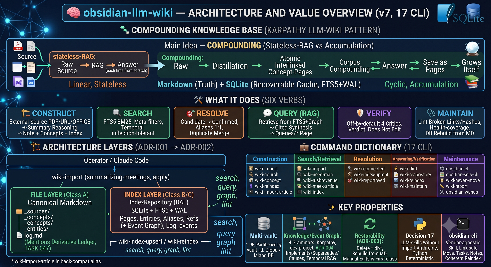
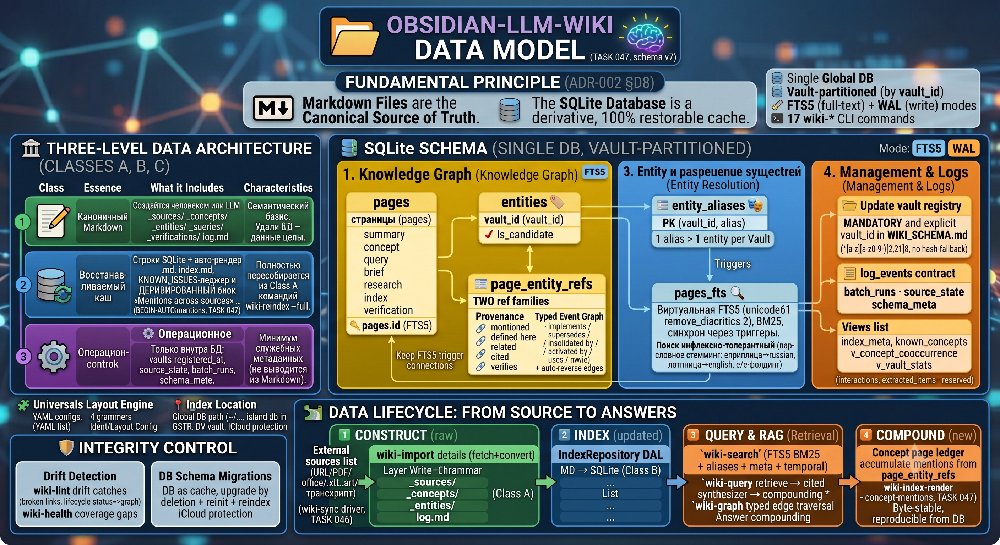

# obsidian-llm-wiki

A multi-vault, SQLite-indexed knowledge base for Obsidian, implementing
Karpathy's [llm-wiki](https://gist.github.com/karpathy/442a6bf555914893e9891c11519de94f)
pattern. **Markdown is the canonical source of truth; SQLite (FTS5 + WAL) is a
100%-rebuildable derivative cache.** You get fast full-text + metadata search, an
entity/concept graph, RAG-with-citations, and a verification layer — all driven
from the shell or from inside a Claude Code session as `/wiki-*` slash commands.

> **Status**: Phase 3a complete (2026-05-26); Phase 3b through **TASK 047**
> (typed knowledge classes + event graph [`wiki-graph`, graph-aware RAG], the
> list-membership `--where`/`--tag` filter + temporal `wiki-search --as-of`, derived
> knowledge-health [`wiki-health`], and the **config-driven write-grammar** [ADR-007]
> that unifies the Karpathy/PARA construct path; **TASK 046** *converged* it —
> `wiki-import` is the per-source **engine** [+ office/`.vtt` acquire, grammar by
> `--kind` (meeting/lesson → pyramid), `--diagrams`/`--no-concepts`] and `wiki-sync` a
> batch **driver** that delegates to it; **TASK 047** retired the legacy `wiki-enrich`
> + vendored `wiki_ingest` on-ramp — concept-page compounding is now a **derived
> Class-B "Mentions across sources" render** [`wiki-index-render --concept-mentions`]).
> The external acquire skills (html/pdf/office/transcript) resolve **vendor-agnostically**
> across any harness (Claude Code / pi / codex / …) — no hardcoded paths. The unified
> on-ramp **`wiki-import`** is hardened across **all four built-in layouts** and
> **language-agnostic** (output follows the vault's `language`; English fallback) —
> validated by adversarial `/vdd-multi`. Schema **v7** (`user_version = 7`).
> **pytest suite green / 5 skipped, `mypy --strict` clean on 60 source files.** The repo's own `docs/` is
> registered as a live `dev-project` vault and dogfoods the toolchain. See
> [docs/ARCHITECTURE.md](docs/ARCHITECTURE.md) for the living architecture and
> [CLAUDE.md](CLAUDE.md) for the full per-task ship log.

---

## Table of Contents

- [What it does](#what-it-does)
- [Anatomy: how the system is layered](#anatomy-how-the-system-is-layered)
- [Data model](#data-model)
- [The universal layout engine](#the-universal-layout-engine)
- [Installation](#installation)
  - [A. Install for any project (recommended)](#a-install-for-any-project-recommended)
  - [B. Install for development of this repo](#b-install-for-development-of-this-repo)
- [Quick start: put a vault under the index](#quick-start-put-a-vault-under-the-index)
- [The `prepare` / `apply` pattern (agent-driven skills)](#the-prepare--apply-pattern-agent-driven-skills)
- [CLI reference — all 17 commands](#cli-reference--all-17-commands)
- [Repo layout](#repo-layout)
- [Development](#development)
- [Pointers](#pointers)

---

## What it does

An llm-wiki is a knowledge base that **compounds**: every source you ingest is
distilled into atomic, cross-linked concept and entity pages, so the next query
is answered against an ever-richer corpus instead of re-reading raw material.
This repo is the **index + tooling layer** for that pattern:

- **Ingest** a raw source (transcript, article, meeting note) → LLM-synthesised
  concept/entity pages that **compound across sources** (a derived "Mentions across
  sources" ledger), contradiction flagging, a `log.md` entry.
- **Search** the whole corpus with FTS5 BM25 ranking + frontmatter-metadata
  filters, across one vault or many. Default search is **inflection-tolerant**
  (per-term script-aware stemming — Cyrillic→russian, Latin→english) and
  **ё/е-folded**; `--exact` opts out to literal terms.
- **Resolve entities**: candidate → confirmed promotion, aliases (one surface
  string → one entity per vault), and merging of duplicates.
- **Query (RAG)**: retrieve over FTS5 + the entity graph, synthesise a *cited*
  answer, and file it back as a first-class compounding page.
- **Verify**: an off-by-default multi-critic audit of a filed answer against the
  sources it cited — it records a verdict, it never edits the answer.
- **Stay healthy**: lint for orphan links, dangling refs, hash drift, type
  mismatches, and cross-vault concept duplicates.

The core invariant (ADR-002 §D8): **the vault's markdown is canonical; the DB is
a rebuildable cache.** `wiki-reindex --full` restores the entire index from disk
with no semantic loss. That means you can delete the `.db` at any time and rebuild
it, and that hand-edits to markdown are first-class — not something the tooling
will clobber.


---

## Anatomy: how the system is layered

The shape is a spine of ADRs: **ADR-001/002** fix the load-bearing structure, and
**ADR-003…008** elaborate it (typed knowledge classes · the typed event graph ·
FTS-narrowed membership · derived-knowledge health · the config-driven write-grammar ·
active-note resolution). The two foundational ones:

- **ADR-001** ([Option I — wrap + index](docs/adr/ADR-001-wiki-ingest-integration.md)):
  *originally* the **file layer** (LLM page synthesis) lived in an external `wiki-ingest`
  skill wrapped by `wiki-enrich`; this repo owned the index layer. **Superseded (TASK 047):**
  the construct path is now the in-repo **`wiki-import`** engine (fetch+convert → REASON →
  file + index + concepts), and concept-page compounding is a derived Class-B render — the
  vendored `wiki_ingest` + `wiki-enrich` were retired.
- **ADR-002** ([multi-vault + data layering](docs/adr/ADR-002-multi-vault-bottleneck-corrections.md)):
  one global SQLite DB partitioned by `vault_id`, with a three-class data contract.

```
                 Operator / any-harness LLM agent
                             │
  wiki-sync ─(batch driver: classify a zone → delegate each source)─┐
                             │                                       │
                             ▼                                       ▼
                    wiki-import  —  the per-source construct engine
       fetch+convert  →  REASON (summarizing-meetings)  →  apply
            │  fetch+convert COMPOSES external acquire skills,
            │  resolved vendor-agnostically for ANY harness:
            │      html · pdf · pptx/office · transcript-fetcher
            ▼
     ┌───────────────────────┴────────────────────────┐
     ▼ FILE LAYER (Class A)                            ▼ INDEX LAYER (Class B/C)
  canonical markdown, per layout                  IndexRepository DAL
  (karpathy _sources/_concepts/_entities;         SQLite + FTS5 + WAL
   PARA / dev-project trees otherwise);           pages · entities · aliases ·
  concept pages carry a derived                    refs (+ typed event-graph
  BEGIN-AUTO:mentions ledger                        edges) · log_events
     │                                                     │
     └────────── wiki-index-upsert / wiki-reindex ─────────┘
                             │
   wiki-search · wiki-query · wiki-graph · wiki-health · wiki-lint · …
```

The code is split into clean layers under `scripts/`:

| Layer | Path | Responsibility |
|---|---|---|
| **DAL** | `scripts/wiki_index/` | `IndexRepository` ABC + `SQLiteRepository`; FTS5, WAL, atomic upserts (M-4: `ON CONFLICT … DO UPDATE`, never `INSERT OR REPLACE`), drift detection, `log.md ↔ log_events` bi-directional sync, rendering, lint, reindex, security helpers. |
| **Layout engine** | `scripts/wiki_index/layout_config.py` + `layouts/*.yaml` | YAML-config-driven "what files exist / what page-type are they" — replaces ~15 previously-hardcoded surfaces (TASK 012). |
| **CLIs** | `scripts/wiki_skills/` | 18 thin entry points (15 `wiki_*.py` modules incl. `wiki_graph.py`/`wiki_health.py` + the `wiki_extract_concepts/`, `wiki_import_article/` and `wiki_config/` packages — `wiki_import_article/` is the `wiki-import` CLI, `wiki-import-article` a back-compat alias; `wiki_config/` is the TASK 058 per-folder config interface) over the DAL + shared helpers (`_common`, `_retrieval`, `_sync`, `_resummarize`, `_manifest_consumer`, `_active_note`). |
| **External acquire skills** | installed per-harness (not vendored) | Composed by `wiki-import` for deterministic fetch+convert — `html` (URL/HTML), `pdf`, `pptx`/office, `transcript-fetcher` (video/`.vtt`). Resolved **vendor-agnostically** (`$WIKI_<BIN>` → dynamic `~/.<harness>/skills` discovery → PATH), so Claude Code / pi / codex / … all work; the one LLM step is the `summarizing-meetings` REASON harness. |
| **Source adapters** | `scripts/wiki_source/` | Pluggable raw-source parsing (`manual` today; transcript/email/… reserved). |
| **Shell wrappers** | `bin/wiki-*` | Make every CLI runnable from any CWD (handle `cd` + venv activation + `exec`). |
| **Skills / commands / workflows** | `skills/`, `commands/`, `workflows/` | Canonical definitions, symlinked into `.claude/` and `.agent/` for vendor compatibility. |

**The repo *is* the implementation, not a vault.** Running
`wiki-init --scaffold-new --vault .` at the repo root is rejected by design.
(Since TASK 012 the repo's own `docs/` is registered as a `dev-project` vault —
`vault_root = <repo>/docs`, with a committed `docs/WIKI_SCHEMA.md` — so
`wiki-search "ADR-002" --vaults obsidian-llm-wiki` works while the repo root
itself stays vault-free.)

---

## Data model



One global DB (`sql/wiki-index-v2.sql`, `user_version = 7`), every table
partitioned by `vault_id`. The three-class contract (ADR-002 §D8):

- **Class A** — vault markdown. Semantic, canonical, human-/LLM-authored.
- **Class B** — DB rows + *rendered* markdown (`index.md`, the auto-rendered
  ledgers). A **rebuildable cache** — regenerable from Class A via reindex.
- **Class C** — DB-only operational state (minimal: e.g. `vaults.registered_at`).

Core tables:

| Table | Holds |
|---|---|
| `vaults` | Registry of all vaults sharing the DB; `vault_id` is **required, explicit** in `<vault>/WIKI_SCHEMA.md` (`^[a-z][a-z0-9-]{2,31}$`, no hash fallback). |
| `entities` | Canonical concepts/people/companies/products/… with definitions, contact fields, mention counts, and an `is_candidate` flag (1 = LLM-extracted/unconfirmed, 0 = confirmed). |
| `entity_aliases` | One alias → **exactly one** entity per vault (PK `(vault_id, alias)`, schema v3); `wiki-search` expands through them. |
| `pages` | Wiki pages: `summary` · `concept` · `query` · `brief` · `research` · `index` · `verification`; FTS5-mirrored. Upserts preserve `pages.id` so the FTS5 rowid stays stable. |
| `page_entity_refs` | M:N page ↔ entity edges with provenance: `mentioned` · `defined-here` · `related` · `cited` · `verifies`. |
| `log_events` | Structured mirror of `<vault>/log.md` (bi-directional, M-2 contract). |
| `pages_fts` | FTS5 virtual table (`unicode61 remove_diacritics 2`), kept in sync by triggers. |
| `batch_runs`, `source_state`, `schema_meta` | Reindex bookkeeping, per-source dedup, migration markers. |
| `interactions`, `extracted_items` | Reserved for future Epics (tables present, indexes deferred). |

Convenience views: `index_meta` (pages+entities catalog), `known_concepts`
(for ingest-time concept injection), `v_concept_cooccurrence`, `v_vault_stats`.

The DB is a Class B cache, so schema upgrades are **not** in-place `ALTER`s — a
`vN→vN+1` migration on a populated DB is "delete the `.db`/`-wal`/`-shm`, then
`wiki-init --register-existing` + `wiki-reindex --full`" (see ADR-002 §D8).

**Where the DB lives (TASK 022).** Default: one global DB (`~/Library/Application
Support/wiki-index/global.db`), partitioned by `vault_id`. A vault may instead declare
`index_db: .wiki/index.db` in `WIKI_SCHEMA.md` (or `wiki-init … --local`) to own a portable,
in-vault DB. Precedence: `--db-path` > `index_db` > global; relative paths are vault-root-relative
(contained — a symlink/`..` escape is rejected). For an iCloud/Dropbox vault, point `index_db` at an
**absolute** non-synced path: one *under the OS app-data dir* (`~/Library/Application Support`,
`~/.local/share`, `%APPDATA%` — where `wiki-init` writes, never iCloud) is **trusted automatically**;
any *other* absolute path is **gated behind `WIKI_ALLOW_ABSOLUTE_INDEX_DB=1`** (because `WIKI_SCHEMA.md`
travels with the vault, a cloned/synced config is attacker-shippable). The iCloud WAL-corruption guard
still applies. A local-DB vault is an **island** — `--vault all`
spans only the connected DB.

---

## The universal layout engine

Different vaults have different shapes. TASK 012 (R-X1) replaced ~15 hardcoded
"where do pages live / what type are they" surfaces with a **YAML-config-driven
engine** (`scripts/wiki_index/layout_config.py`, schema
`config/layout-config.schema.yaml`). Four layout grammars ship built-in
(`scripts/wiki_index/layouts/`):

| Layout | For |
|---|---|
| `karpathy` | The original llm-wiki shape. **Byte-identical** to the legacy hardcoded behaviour — a validated projection of `layout.py`, golden-anchor-guarded. (`flat`/`per-project` are aliases.) |
| `dev-project` | A software repo's `docs/` tree — TASKs, ADRs, issues. (This is what the repo's own docs use.) |
| `obsidian-personal` | Numbered folders + Unicode titles. |
| `cybos` | An **operational-memory / event-graph** vault — typed knowledge classes (Decision, Requirement, Risk, Incident, Hypothesis, Fact, Event) + the task/adr/plan spine. TASK 031; see [docs/layouts/cybos.md](docs/layouts/cybos.md). |

New vault shapes — and new *typed article classes* — become **config, not code**
(TASK 031 / R-031-3 made even the `--layout` registry config-driven: a new layout
is a drop-in `layouts/*.yaml`, zero Python edits). Pick one with
`wiki-init --layout <name>`. The `auto_indexes[]` feature renders a Class-B
"rebuildable markdown" ledger from per-item Class-A sources (e.g. this repo's
[docs/KNOWN_ISSUES.md](docs/KNOWN_ISSUES.md) is auto-rendered from
`docs/issues/*.md`).

Two deliberately separate config systems: per-vault **identity**
(`config_loader.py` — who this vault is) vs per-layout-class **grammar** (the
engine above — how this *kind* of vault is shaped).

**Security note (TASK 012 + 017):** operator-supplied layout regexes
(`ref_extraction[].regex`, `paths[].project_pattern`) are guarded against ReDoS
both at load time (a stdlib-`re` budget gate) and at runtime (a per-file
deadline via the PyPI [`regex`](https://pypi.org/project/regex/) engine with
`timeout=`, env-overridable via `WIKI_REDOS_BUDGET_S`, default 2.0s). Built-in
layouts use stdlib `re` and pay zero overhead.

**Skill-contract integrity (TASK 067 / H-5):** the `SKILL.md` + `references/*.md`
files loaded **verbatim** into the orchestrator's LLM context as reasoning/safety
contracts are SHA-256-pinned in `config/skill-integrity.sha256`. Each REASON rail's
`prepare` verifies the pin and surfaces drift (workflows STOP before loading;
`WIKI_STRICT_SKILL_INTEGRITY=1` refuses), and `tests/test_h5_skill_integrity.py`
goes red on any un-re-pinned edit — so tampering with a loaded prompt is a
reviewable manifest diff and a failing build, not a silent supply-chain change.
Re-pin an approved edit with `python3 scripts/pin_skill_integrity.py --write`.

---

## Installation

Two install paths. **Most users want (A).** Requires **Python 3.14+** (via
pyenv — the system 3.9 is incompatible with `python-frontmatter`).

### A. Install for any project (recommended)

After this one-time setup, `/wiki-*` slash commands work from **any** Claude Code
project, and `wiki-search "x"` etc. work from **any** shell — the wrappers handle
CWD + venv activation automatically.

```bash
# 1. Clone the repo to a stable location
git clone <repo> ~/dev-projects/obsidian-llm-wiki
cd ~/dev-projects/obsidian-llm-wiki

# 2. Create a venv and install deps
python3 -m venv .venv
source .venv/bin/activate
pip install -r requirements.txt

# 3. Symlink wrappers, skills, and commands into user-global Claude Code dirs
bash bin/install-globally.sh

# Done — all 18 wiki-* CLIs are on PATH + linked as /wiki-* slash commands.
```

`bin/install-globally.sh` is **safe + idempotent** — it creates what's missing, repairs its own
stale symlinks, **never clobbers a foreign link** (e.g. a `summarizing-meetings` from another repo), and
prints a per-item report. It links every:

| Source | Target |
|---|---|
| `bin/wiki-*` (executable wrappers) | `~/.local/bin/wiki-*` (or `$WIKI_INSTALL_BIN`) |
| `skills/wiki-*/` | `~/.claude/skills/wiki-*/` **and** `~/.pi/skills/wiki-*/` |
| `commands/wiki-*.md` | `~/.claude/commands/wiki-*.md` |

**Vendor-agnostic acquire skills.** `wiki-import` shells out to the external `html`/`pdf`/`pptx`/
`transcript-fetcher` skills but does **not** assume Claude Code or a fixed roster of harnesses: each
bin resolves `$WIKI_<BIN>` env → **dynamic discovery** of skill dirs (every `~/.<harness>/skills`,
XDG dirs, and `$WIKI_SKILLS_DIRS`) → `PATH`. Discovery is a glob, so **any** harness — claude/pi/
codex/hermes/openclaw and future ones — is found with no code change, and it handles per-harness
naming (the html skill dir is `html` on Claude, `html2md` on pi). The installer pins the resolved
set to `~/.config/obsidian-llm-wiki/skills.env`, which the CLIs **auto-load** at startup (a value in
your shell overrides it). The override vars are documented in
[`config/skills.env.example`](config/skills.env.example) — copying it is optional (discovery works without it).

**Re-run it after adding a new `bin/wiki-*`, `skills/wiki-*/`, or `commands/wiki-*.md`** — new
entries are not auto-propagated. Ensure `~/.local/bin` is on your `PATH` (the installer warns
if not). Then jump
to [Quick start](#quick-start-put-a-vault-under-the-index).

### B. Install for development of this repo

Only needed if you're contributing to obsidian-llm-wiki itself (tests, DAL,
framework work).

```bash
# 1. Clone + venv + deps (same as A.1–A.2)
git clone <repo> && cd obsidian-llm-wiki
python3 -m venv .venv && source .venv/bin/activate && pip install -r requirements.txt

# 2. Wire framework + project skills into this repo's .claude/ and .agent/
bash /path/to/agentic-development/install.sh install \
     --vendor claude --force-system-link    # one-time
bash bin/install-project-symlinks.sh         # repo-local wiki-* skills

# 3. Run tests + type-check
pytest tests/           # full suite green (~32s; see the status block for the current count)
mypy --strict scripts/  # clean on 60 source files (the contract for scripts/)
```

Optionally also run `bin/install-globally.sh` to dogfood the wrappers from other
projects while developing.

---

## Quick start: put a vault under the index

After install (A), from any directory:

```bash
# 1. Your vault needs `vault_id: <slug>` in its WIKI_SCHEMA.md (ADR-002 §D1.1).
#    Run wiki-init once to get a suggested slug if it's missing:
wiki-init --register-existing --vault /path/to/MyVault
#   → if missing: { "error": "MISSING_VAULT_ID", "suggested_vault_id": "my-vault" }

# 2. After adding vault_id, register the vault:
wiki-init --register-existing --vault /path/to/MyVault

# 3. First full index (this is also the Class-A → Class-B rebuildability gate):
wiki-reindex --full --vault my-vault

# 4. Day-to-day: search before you grep
wiki-search "concept name" --vaults my-vault

# 4b. Filter by frontmatter metadata (status / severity / any field).
#     Compiles to a `CAST(json_extract(...) AS TEXT)=? OR EXISTS(json_each ...=?)`
#     predicate (not full-text): hyphenated (SEV-2) / numeric (priority=1) SCALARS
#     match by string AND a LIST member matches too (TASK 033).
wiki-search --status open --severity SEV-2 --vaults my-vault
wiki-search "drift" --where 'status=open' --vaults my-vault   # combine with FTS
wiki-search --tag decision --vaults my-vault   # list every page tagged 'decision' (tags[] member)
wiki-search --tag decision --as-of 2026-04-15 --vaults my-vault   # TEMPORAL (TASK 034): decisions ACTIVE on that date — derived from date + the supersede/invalidate graph, no LLM
```

For a brand-new vault, use `wiki-init --scaffold-new --vault /path --layout karpathy`.
Both `--scaffold-new` and `--register-existing` write an **agent-instructions file**
into the vault root so an agent launched there has the wiki operating instructions —
**`CLAUDE.md` by default**; pass `--vendor gemini` for `GEMINI.md` (Gemini CLI),
`--vendor agents` for `AGENTS.md` (the cross-vendor file Codex/hermes read), or
`--vendor pi` for `AGENTS.md` **+ `.pi/extensions/permissions.json`** ([pi](https://pi.dev)).
`--vendor all` (or a comma-list) writes every selected vendor's file. Vendors are configured in
[`templates/agent-files.yaml`](templates/agent-files.yaml); existing files are never
clobbered. **pi parity (TASK 043):** the skills are pi-native `SKILL.md`s — run
`bin/install-globally.sh` once to populate `~/.pi/skills/` (and get `/skill:wiki-search`
with `enableSkillCommands`); the on-PATH `wiki-*`/`obsidian` binaries work from pi unchanged.

### Choosing where the index lives: global (default) vs vault-local

You don't have to decide anything up front — by default every vault shares **one
global DB** (`~/Library/Application Support/wiki-index/global.db` on macOS,
`~/.local/share/wiki-index/...` on Linux), partitioned by `vault_id`, and the steps
above just work. A vault can instead **own its index** so the DB travels with it
(portable, gitignored, rebuildable). You pick the variant at init time — the only
difference is what `wiki-init` writes into `WIKI_SCHEMA.md`:

```bash
# (a) GLOBAL — the default. Nothing to declare; all vaults share one DB.
wiki-init --register-existing --vault /path/to/MyVault

# (b) VAULT-LOCAL — DB lives at <vault>/.wiki/index.db (vault-relative, contained).
#     --local writes `index_db: .wiki/index.db` into WIKI_SCHEMA.md and registers
#     into that local DB instead of the global one.
wiki-init --register-existing --vault /path/to/MyVault --local

# (b') VAULT-LOCAL at a custom in-vault path:
wiki-init --register-existing --vault /path/to/MyVault --index-db db/index.db

# (c) CLOUD-SYNCED vault (iCloud/Dropbox) — SQLite must NOT sit in the byte-syncing
#     folder (WAL/shm corruption), so point at an ABSOLUTE path outside the sync root.
#     A path under the OS app-data dir (where wiki-init writes, never iCloud) is trusted
#     automatically — no env var. (An absolute path ELSEWHERE needs
#     WIKI_ALLOW_ABSOLUTE_INDEX_DB=1, since a synced/cloned config could redirect writes.)
wiki-init --register-existing --vault /path/to/MyVault \
          --index-db "~/Library/Application Support/obsidian-llm-wiki/myvault.db"
```

`--local`/`--index-db` are just a convenience — you can equally hand-edit
`WIKI_SCHEMA.md` and add `index_db: .wiki/index.db` to the frontmatter yourself.
**Resolution precedence is always `--db-path` (a per-command override, mainly for
testing) > `index_db` (declared in `WIKI_SCHEMA.md`) > global.** A vault with a
local DB is an **island**: `wiki-search --vaults all` spans only that DB, never the
global one. **iCloud paths are auto-rejected** wherever they appear, to prevent
SQLite corruption.

Inside a Claude Code session, every command below is also invokable as a slash
form (`/wiki-init`, `/wiki-search`, …); the agent auto-suggests them when trigger
phrases match (see each [SKILL.md](skills/) for triggers).

---

## The `prepare` / `apply` pattern (agent-driven skills)

Three skills do LLM work but keep **zero `anthropic` import** in the Python (the
"Decision-17" split). The Python halves are deterministic; the LLM step is owned
by the orchestrator agent, sandwiched between two CLI calls:

```
wiki-query prepare   →  [agent reads the retrieval envelope, synthesises a
                         cited answer per the wiki-query-synthesis contract]
                     →  wiki-query apply   (files _queries/<slug>.md)
```

The same shape powers `wiki-verify-multi` (`prepare` → 4 critics →
`apply` files `_verifications/verify-<slug>.md`) and `wiki-extract-concepts`
(`prepare` recon → agent synthesises candidate JSON per the `concept-extraction`
contract → `apply` writes pages + entities). The contract skills
(`wiki-query-synthesis`, `wiki-verify`, `concept-extraction`) have no CLI — they
are the prompts the orchestrator loads between the two halves. When you run these
inside Claude Code, the agent drives all three steps for you.

---

## CLI reference — all 17 commands

Each command has a `SKILL.md` under [`skills/`](skills/) with the full contract,
exit codes, and JSON-envelope schema, plus a slash-command wrapper under
[`commands/`](commands/). Slash forms (`/wiki-…`) are equivalent to the shell
binaries.

> 📖 **Want the *why*, not just the flags?** The commands below are grouped by the
> role they play in the compounding-knowledge loop. For the full methodology —
> what each command is *for*, how to work with the vault's markdown (standard and
> custom layouts), and how to drive the wiki from another agent — see the
> **[obsidian-llm-wiki Manual](docs/manuals/obsidian-llm-wiki_manual.md)**.

### Vault lifecycle

*Bring a vault under management and keep the cache reconciled with its canonical markdown.*

| Command | What it does |
|---|---|
| `wiki-init --register-existing --vault <path> [--vendor <list>]` | Register a pre-existing vault in the index (one-time, per vault). Also writes the agent file if absent (`CLAUDE.md` by default; `--vendor gemini`/`agents`/`pi`/`all`), so the vault is agent-workable. |
| `wiki-init --scaffold-new --vault <path> [--layout <name>] [--vendor <list>]` | Scaffold a brand-new vault layout + an agent file (`CLAUDE.md` by default; `--vendor` picks Gemini / AGENTS.md / pi / all). `--layout` ∈ `karpathy` · `dev-project` · `obsidian-personal` (+ custom). |
| `wiki-init --reconcile --vault <path>` | Rename / re-point a registered vault. |
| `wiki-reindex --full --vault <vid>` | Wipe + rebuild the DB from markdown (the Class A→B gate; rare, authoritative). |
| `wiki-reindex --delta --vault <vid>` | Incremental mtime/hash-based reindex after manual edits. |
| `wiki-index-upsert --vault <vid> --file <path>` | Index a single markdown file (idempotent — file-hash match → no-op). |
| `wiki-index-render --vault <vid> [--auto-indexes]` | Render `index.md` from the DB (preserves `<!-- BEGIN-CUSTOM -->` blocks); `--auto-indexes` also renders Class-B ledgers. |

### Search & retrieval

*The everyday read path — search before you grep; turn the corpus into cited answers and audit them.*

| Command | What it does |
|---|---|
| `wiki-search "<query>" --vaults <vid>[,<vid>…]` | FTS5 BM25 search across one/many vaults; ranked hits + snippets; expands aliases. |
| `wiki-search [--status <v>] [--severity <v>] [--tag <v>] [--where 'field=value'] --vaults <vid>` | Filter by frontmatter metadata — scalar OR list member (`--tag`/`--where 'tags=…'`, TASK 033); query optional → pure listing. |
| `wiki-search [--as-of YYYY-MM-DD] --vaults <vid>` | **Temporal** (TASK 034): pages **active on a date** — created by then & not yet superseded/invalidated (derived from `date` + the event graph; no LLM, no `valid_to` authoring). E.g. `--tag decision --as-of 2026-04-15`. |
| `wiki-query prepare/apply --vault-root <path>` | RAG: retrieve → orchestrator-cited synthesis → file a compounding `_queries/<slug>.md` page (`prepare`/`apply`). |
| `wiki-verify-multi prepare/apply` | Off-by-default 4-critic audit of a filed answer vs its cited sources → `_verifications/verify-<slug>.md` verdict page; FAIL records + exits non-zero, never mutates the answer. |
| `wiki-graph neighbors/chain/backlinks <slug> --vault <vid> [--kind K] [--direction D] [--depth N]` | Read-only **event-graph** traversal over the typed page-to-page edges (implements/supersedes/causes/relates-to + the TASK-034 invalidated-by/activated-by/uses/owns + auto-derived inverses). TASK 032/034 / ADR-004; pairs with `wiki-query --follow-edges`. |
| `wiki-health coverage --vault <vid> [--class C]` | Read-only **coverage** report (R-15 / TASK 036, ADR-006): pages MISSING an expected relation (requirement/capability with no `implemented-by`; fact with no `source:`). Layout-config-driven (`coverage_rules`; cybos ships them); **always exits 0** — a gap is data. Its sibling **lifecycle-drift** (authored `status` vs graph state) rides `wiki-lint` and gates `--strict`. |

### Knowledge construction

*Turn raw material into compounding pages, and keep the chronological log in sync.*

| Command | What it does |
|---|---|
| `wiki-sync scan <zone> --vault <vid>` | Format-aware, tag-routed dispatcher: walk a zone → deterministic **plan JSON** (convert / ingest / upsert / skip per file; `#wiki/raw\|skip\|keep` tags; generated-view sidecars auto-skipped). The orchestrator ([`workflows/wiki-sync.md`](workflows/wiki-sync.md)) executes it as a pure **batch DRIVER** (TASK 046): each distil entry carries a `delegate` and is handed to **`wiki-import`** (which owns convert + de-timestamp + REASON + file + index + concepts) — there is no inline summarise/enrich/extract/convert; ready notes → `wiki-index-upsert`. A per-folder `.wiki/sync.yaml` `summarize:` block (profile/diagrams/extract_concepts/target_subdir) drives the delegate knobs; per-file idempotency via a dual `wiki-sync record` commit-marker. A **re-summarization policy** (TASK 019, opt-in `resummarize:` in `.wiki/sync.yaml`, per-folder overridable) skips a raw source whose summary already exists (`source_state` ∪ provenance ∪ filesystem mirror) unless `--force` — or, under **`mode: if-changed`** (TASK 051 / R-18, the *freshness* mode for a connector zone), skips only while the recorded content hash still matches, re-summarising a *changed* source in place; a new raw sharing an already-summarised N:1 key is skipped + a **merge/split WARN** (TASK 021) names the levers (`--force` to merge / finer key to split). The MVP front of the *Mixed vault* pattern — see the [Manual](docs/manuals/obsidian-llm-wiki_manual.md). |
| `wiki-import prepare/apply … [--kind auto]` | The **unified external-source on-ramp** (any layout) and the per-source **engine**: deterministic fetch+convert of a URL/PDF/office (docx/pptx/xlsx)/`.vtt`-`.srt`/X-thread/transcript → hand the orchestrator the cleaned text + the vault's `known_concepts` for a REASON step (the `summarizing-meetings` harness) → file a note + its `_concepts/` per the resolved layout's **write-grammar** (config-driven, [ADR-007](docs/adr/ADR-007-config-driven-write-grammar.md)). **Grammar by `--kind`** (meeting/lesson → a pyramid digest; article/paper/thread → the article wrapper); modifiers `--diagrams` (selective mermaid) + `--no-concepts` (defer concept filing). Content-type (`--kind`) and layout (config) are orthogonal. `wiki-import-article` is a back-compat alias. |
| `wiki-extract-concepts prepare/apply …` | Two-pass LLM concept extraction from an indexed source page → candidate pages + entities + manifest (`--ingest` auto-dispatches in-process). |
| `wiki-append-log --vault <vid> …` | Append a structured event to `log.md` *and* mirror it to `log_events` (atomic, flock + fsync). |

### Native Obsidian app (`obsidian-cli` skill)

*Drive the **running** Obsidian desktop app (Obsidian 1.12+ official CLI) for the things
files+SQLite can't reach — and keep the index coherent after.*

| Skill | What it does |
|---|---|
| [`obsidian-cli`](skills/obsidian-cli/SKILL.md) | A **prompt-layer, vendor-agnostic** skill teaching any LLM agent to route between the `wiki-*` toolchain (knowledge/RAG/bulk — still first for lookups) and the native `obsidian` CLI (link-safe rename/move, typed properties, tasks, daily notes, Bases queries, history restore, open-in-app). **Active-note resolution (ADR-008):** when you say *"edit the note"* / *"the note about X"* with **no path**, it resolves your active/open tab to an explicit path (descriptor → unique open tab + vault-unique basename = no ask; bare "the note" = confirm once per session; not-found/ambiguous = ask), via the stdlib helper [`obsidian-active-note`](bin/obsidian-active-note). **Editor-selection bridge (TASK 068):** READ or safely EDIT the *live editor selection* (the highlighted text in the open note) from the shell — a bare [`obsidian-selection`](bin/obsidian-selection) `read`/`apply` via a least-privilege `agent-bridge` [plugin](skills/obsidian-cli/plugin/agent-bridge/) (T2 `command id=`, **not** the T3 `eval` RCE channel), with a live-`getCursor` optimistic-concurrency guard (refuses a moved/edited selection), base64 for the untrusted text, and CWD→vault auto-detection. Carries a **total 3-tier safety model** (T1 read / T2 mutate / T3 banned-by-default incl. `eval`), a **mutation→index coherence protocol** (`wiki-index-upsert` after a content edit; **`wiki-reindex --delta` after a rename/move** — rename-aware since TASK 030: the moved file's new path is ingested despite the preserved mtime, closing DF-029-1; `--full` = universal fallback + swap-class remedy), and graceful degradation when the CLI is absent/headless. Full 102-command reference + recipes + behaviour evals under [`skills/obsidian-cli/`](skills/obsidian-cli/). **One small stdlib helper (the resolver), no DDL, no `import anthropic`** — otherwise pure orchestration of existing CLIs. |

### Entity resolution (Epic 7)

*Curate the entity graph so it stays a graph, not a pile — vet candidates, unify spellings, dedupe.*

| Command | What it does |
|---|---|
| `wiki-confirm <slug> --vault <vid>` | Promote a candidate entity to confirmed (`--undo` to demote; `--auto --threshold N` to bulk-promote by mention count). |
| `wiki-alias (--add\|--remove) <surface> <slug> --vault <vid>` / `wiki-alias --list [<slug>]` | Manage alias surface-strings (Class A frontmatter + DB mirror; hard-unique per vault). `--list` without a slug lists every alias in the vault. |
| `wiki-merge <duplicate-slug> <canonical-slug> --vault <vid>` | Fold a duplicate entity into the canonical one — re-point refs, absorb + register redirect aliases, delete the dup page. |

### Health

*Keep the compounding honest — surface broken links, drift, and duplicates; prove the cache is rebuildable.*

| Command | What it does |
|---|---|
| `wiki-lint --vault <vid>` (or `--all`) | SQL-level health-check: orphan links, dangling refs, missing-on-disk pages, hash drift, type mismatches, cross-vault concept duplicates. `--mtime-skip` for a faster integrity-relaxed pass. |
| `wiki-config <subcommand> --vault-root <path>` | (TASK 058) The **per-folder `.wiki/sync.yaml` interface** — `show [<folder>]` (per-key inheritance provenance; folder defaults to the **active Obsidian note's folder** → CWD → vault root) / `tree` / `validate` (40-code taxonomy over all 3 config systems) / tiered `doctor`+`fix` (comment-preserving, backed up to `.wiki/backups/`, `restore` undoes) / `set`+`unset` / `init --template` (`templates/sync-profiles/`) / `report --open` (self-contained HTML inheritance report) / `serve` (local 127.0.0.1 token-auth web editor: schema-driven form + full vault tree with override/delete-config, pending edits + Save all, template quick-setup, restore-from-backup). 100% schema-driven (`x-wiki-*`) — a new config field needs zero UI-code changes. **No DB access** — works while the index is broken. |

---

## Decision-17: no `import anthropic`

The LLM-shaped skills (`wiki-query`, `wiki-verify-multi`, `wiki-extract-concepts`,
`wiki-import`, `wiki-sync`) carry **no `import anthropic`**: their Python halves are
deterministic `prepare`/`apply`, and the **calling orchestrator owns the reasoning step** —
there is no `ANTHROPIC_API_KEY` to set. Every other CLI (`wiki-search`, `wiki-lint`,
`wiki-reindex`, …) is self-contained. `wiki-extract-concepts`'s `--ingest` auto-dispatch uses
the neutral `_manifest_consumer` module in-process.

(TASK 047 retired the last external-file-layer dependency: `wiki-enrich` + the vendored
`wiki_ingest` are gone — `wiki-import` is the in-repo construct engine and concept-page
compounding is a derived Class-B render, `wiki-index-render --concept-mentions`.)

---

## Repo layout

```
docs/                       ARCHITECTURE.md, ROADMAP, ADRs, schemas, tasks/, plans/, issues/
  adr/                      ADR-001 (wrap+index), ADR-002 (multi-vault + Class A/B/C)
  KNOWN_ISSUES.md           auto-rendered Class-B ledger over docs/issues/*.md
config/                     layout-config / wiki-config / sync-config schema.yaml (the 3 config systems)
                            + skills.env.example (optional acquire-skill bin overrides)
sql/wiki-index-v2.sql       the SQLite DDL (user_version = 7)
templates/                  WIKI_SCHEMA.md.tmpl + per-vendor agent files (CLAUDE.md/GEMINI.md/AGENTS.md) + pi/claude settings
                            mapped in agent-files.yaml — for new/registered vaults

scripts/
  wiki_index/               DAL: repository, sqlite_repository, lint, reindex, rendering,
                            normalization, security, layout, layout_config, sync_config
  wiki_index/layouts/       karpathy.yaml, dev-project.yaml, obsidian-personal.yaml, cybos.yaml
  wiki_skills/              17 CLI entry points + _sync/_common/_retrieval/_manifest_consumer
  wiki_source/              source adapters (base, manual, parsing)
  benchmark.py              synthetic-vault SLO harness

skills/                     canonical SKILL.md dirs (wiki-* + concept-extraction + obsidian-cli)
commands/wiki-*.md          slash-command wrappers (Claude Code; one per CLI)
workflows/wiki-*.md         multi-step orchestration recipes (incl. wiki-sync executor)
bin/wiki-*                  shell wrappers (cd + venv + exec; one per CLI)
bin/install-globally.sh     global install (path A) — safe/idempotent; re-run after adding a skill
bin/install-project-symlinks.sh   in-repo .claude/.agent vendor symlinks (dev path B)
tests/                      pytest suite (full suite green; count in the status block) + fixtures
samples/                    gitignored scratch tree for dogfooding vaults
```

---

## Development

```bash
source .venv/bin/activate
pytest tests/           # 1630+ passed (see the status block / git log for the current count)
mypy --strict scripts/  # clean on 60 source files (the contract for scripts/)

# Performance SLO gate (TASK 030 / Q-030-1) — run before shipping indexer hot-path changes:
WIKI_BENCH_SLO=1 pytest tests/test_benchmark_slo_gate.py   # n=1000, enforced
python -m scripts.benchmark --n 10000 --enforce-slos       # manual 10k gate
# Protocol + evidence conventions: docs/runbooks/perf-slo-gate.md
```

Conventions:

- **Python** always via `.venv/`; **Node** always via local `node_modules/`.
  Never install globally.
- New skills/commands/workflows go at the repo root
  (`skills/<name>/SKILL.md`, `commands/<name>.md`, `workflows/<name>.md`) and are
  symlinked into `.claude/` and `.agent/` by the `bin/link-*.sh` helpers.
- Vault artifacts (`_sources/`, `_concepts/`, `_entities/`, `00-Vault-Index/`,
  `*.db*`, …) are gitignored. Dogfooding vaults live under `samples/` (also
  gitignored). Durable test fixtures live under their owning
  `skills/<name>/evals/`.
- The agentic-development framework (orchestrator, analysis→architecture→plan→
  develop→review skills/workflows) is installed as a symlink and lives *outside*
  git (`.agentic-development/`, `System/`, framework skills under `.agent/`,
  `.claude/`). Re-run `bin/install-project-symlinks.sh` after a fresh clone to
  reconnect the project's `wiki-*` skills.

---

## Pointers

- **[docs/manuals/obsidian-llm-wiki_manual.md](docs/manuals/obsidian-llm-wiki_manual.md)** — the methodology manual: why each command exists, working with Obsidian documents (standard + custom layouts), and driving the wiki from another agent.
- **[docs/ARCHITECTURE.md](docs/ARCHITECTURE.md)** — living architecture (multi-vault, ADRs, status header tracking shipped tasks).
- **[docs/ROADMAP.md](docs/ROADMAP.md)** — forward-looking work (e.g. the deferred R-X2c archive hook).
- **[docs/KNOWN_ISSUES.md](docs/KNOWN_ISSUES.md)** — auto-rendered Class-B ledger over `docs/issues/*.md` (deferred perf set + residuals). Edit the per-issue files, never the ledger.
- **[docs/tasks/](docs/tasks/)** + **[docs/plans/](docs/plans/)** — archived task/plan specs (lockstep).
- **[docs/adr/ADR-001-wiki-ingest-integration.md](docs/adr/ADR-001-wiki-ingest-integration.md)** — Option I (wrap + index).
- **[docs/adr/ADR-002-multi-vault-bottleneck-corrections.md](docs/adr/ADR-002-multi-vault-bottleneck-corrections.md)** — `vault_id` partitioning + Class A/B/C contract.
- **[sql/wiki-index-v2.sql](sql/wiki-index-v2.sql)** — the schema DDL.
- **[scripts/wiki_index/layout.py](scripts/wiki_index/layout.py)** — single source of truth for the `karpathy` layout constants.
- **[CLAUDE.md](CLAUDE.md)** — project agent instructions + the full per-task ship log.

---

## License

The code **in this repository** is **dual-licensed** — see
[LICENSING.md](LICENSING.md) for the full breakdown:

- **Community license — Elastic License 2.0 (ELv2)** (default, free; see
  [LICENSE](LICENSE)). Source-available: you may read, fork, modify, and use it
  (including internally for commercial purposes), but you may **not** provide it
  to third parties as a hosted/managed service, nor remove its license/copyright
  notices.
- **Commercial license** — for uses ELv2 doesn't permit (e.g. offering it as a
  hosted/managed service or SaaS). Granted case-by-case by the copyright holder;
  see [LICENSING.md](LICENSING.md) for how to request one.

> [!IMPORTANT]
> **This framework's full functionality depends on separately-installed external
> skills, some of which are under PROPRIETARY (closed-source) licenses.** Those
> skills are **not** vendored here and are **not** covered by this repo's ELv2
> grant — they are installed and invoked separately, and their own license terms
> apply. Without them, parts of the construct/REASON pipeline (e.g. `wiki-import`)
> are not fully operational. Notices for the proprietary/external skill set
> (`summarizing-meetings`, `transcript-fetcher`, `html`, `pdf`, `docx`, …) are in
> [THIRD_PARTY_NOTICES.md](THIRD_PARTY_NOTICES.md). Consult each skill's license
> before redistribution or commercial use.

### FAQ — can I use this commercially?

- **Can I use it inside my own company / for client work?** Yes. ELv2 permits
  internal use, modification, and building on top of it — including for
  commercial purposes — as long as you don't resell the framework itself as a
  service. You must also separately license any proprietary external skills you
  rely on (see above).
- **Can I host it and sell access to it as a product/SaaS?** No. ELv2's core
  limitation forbids providing the software to third parties as a hosted or
  managed service that exposes a substantial set of its features.
- **Can I fork it, modify it, and redistribute my fork?** Yes — provided you keep
  the license and copyright notices intact, pass these terms along to anyone you
  give it to, and add a prominent notice stating that you modified it. The same
  ELv2 limitations carry over to your fork.
- **Is this "open source"?** No — it's **source-available**. The source is open to
  read and build on, but ELv2 is not an OSI-approved open-source license because
  of the hosted-service restriction.
- **I want to do something ELv2 doesn't allow (e.g. offer it as a managed
  service).** A **commercial license** is available — see
  [LICENSING.md](LICENSING.md) for terms and how to request one.
