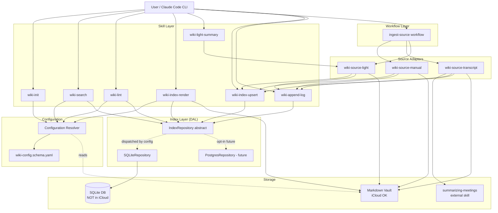
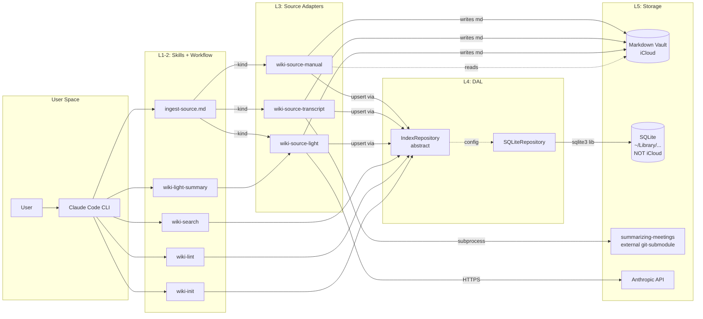
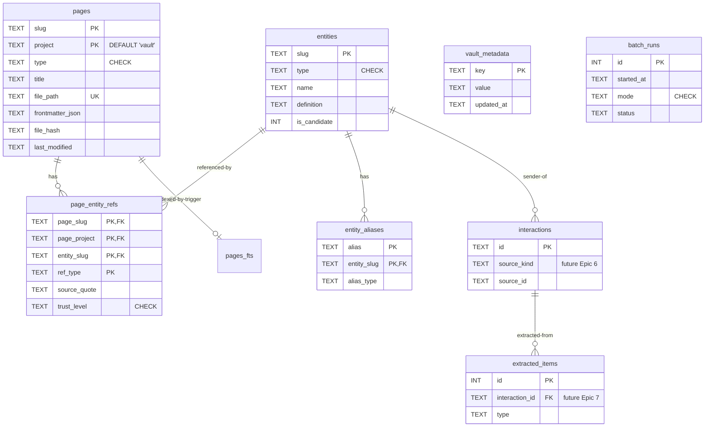

# ARCHITECTURE: LLM Wiki MVP

> **Status**: shipped, no active task. ADRs 001 + 002 in effect.
> Living document — describes the current architecture, not the change
> history. For shipped task specs (history, decisions, hardening
> rounds) see [tasks/](./tasks/) + [plans/](./plans/) archives;
> for deferred items see [KNOWN_ISSUES.md](./KNOWN_ISSUES.md).
>
> **Source spec**: [docs/TASK-ref-v2.md](./TASK-ref-v2.md) — full v2 reference specification.
> **Schema**: [docs/SCHEMA-v2.sql](./SCHEMA-v2.sql) — SQLite DDL (multi-vault, partitioned by `vault_id`).
> **Backend choice**: [docs/SQLITE-VS-POSTGRES.md](./SQLITE-VS-POSTGRES.md) — SQLite default, Postgres opt-in via DAL.
> **Layout constants** consolidated in [scripts/wiki_index/layout.py](../scripts/wiki_index/layout.py) — single source of truth for `PAGE_SUBDIRS`, `COURSE_TIER_DIR`, `VAULT_INDEX_DIR`, `LOG_SUBDIR`, `SCAFFOLD_DIRS`, `SYSTEM_FILES`, `GLOBAL_VAULT_SENTINEL`.

---

## 1. Task Description

Реализация MVP персональной LLM Wiki поверх Obsidian-vault'а пользователя:
- **Markdown — source of truth** (Karpathy canon).
- **SQLite — derivative cache** (FTS5 + WAL для < 50ms search; rebuildable).
- **Pluggable source adapters** (manual + transcript + light для MVP).
- **Идемпотентные операции**: re-ingest того же source = no-op.
- **iCloud-aware**: SQLite вне vault'а, markdown в iCloud.

Полное описание целей см. [TASK.md §1](./TASK.md). Покрытие: 18 MVP requirements (R-01 — R-15, R-24 — R-26), 6 Use Cases, 5 Epics с 22 Issues.

---

## 1.5. Project Anatomy

This section maps **where things live** in the repository, the symlink graph through which Claude Code resolves a slash command into a Python entry point, and how this repo's anatomy compares to the external `wiki-ingest` skill it integrates with. Lives here so subagents and operators don't have to reconstruct the layout from `ls` walks.

### 1.5.1. Anatomy of one in-repo skill (template, shown via `/wiki-search`)

Every skill in this repo follows a strict **4-file-of-same-name** convention plus a shared DAL. There are 9 such skills (`wiki-init`, `wiki-search`, `wiki-lint`, `wiki-reindex`, `wiki-index-upsert`, `wiki-index-render`, `wiki-append-log`, `wiki-enrich`, `wiki-extract-concepts`).

```text
operator: "/wiki-search 'query'"
    │
    ▼ Claude Code resolves slash command
~/.claude/commands/wiki-search.md ──symlink──► obsidian-llm-wiki/commands/wiki-search.md
    │                                          (slash-command registration; points to skill)
    ▼
~/.claude/skills/wiki-search/ ───symlink──► obsidian-llm-wiki/skills/wiki-search/SKILL.md
    │                                       (skill manifest: tier, triggers, when/how)
    ▼ SKILL.md delegates to bash CLI
~/.local/bin/wiki-search ───symlink──► obsidian-llm-wiki/bin/wiki-search
    │                                  (POSIX wrapper: cd repo + source .venv + exec python -m)
    ▼
obsidian-llm-wiki/scripts/wiki_skills/wiki_search.py
    │                          (Python entry: argparse + main(argv) + JSON envelope to stdout)
    ▼
obsidian-llm-wiki/scripts/wiki_index/   (shared DAL — see §1.5.4)
    │
    ▼
SQLite ~/Library/Application Support/wiki-index/global.db   (multi-vault, FTS5)
```

**Convention rules:**

| Surface | Path pattern | Naming convention |
|---|---|---|
| Slash command | `commands/wiki-<name>.md` | dash-separated, mirrors CLI name |
| Skill manifest | `skills/wiki-<name>/SKILL.md` | dash-separated dir |
| Bash launcher | `bin/wiki-<name>` (executable) | dash-separated, no extension |
| Python entry | `scripts/wiki_skills/wiki_<name>.py` | underscore-separated (Python module rules) |
| Global symlinks | `~/.claude/{commands,skills}/`, `~/.local/bin/` | created by `bin/install-globally.sh` |

**The 4 in-repo dirs** (`commands/`, `skills/`, `bin/`, `scripts/wiki_skills/`) must stay in lockstep — adding a new skill means 4 new files of matching name. The installer (`bin/install-globally.sh`) discovers each set via globs.

### 1.5.2. Anatomy of cross-process / in-process flow (`/wiki-enrich → wiki-ingest`)

`/wiki-enrich` is the **only** in-repo skill that integrates with `wiki-ingest`. There are **two paths**: a primary in-process path (vendored Python import, default) and a subprocess fallback path (external `wiki-ingest` binary). The manifest contract (v1.1, [WIKI-INGEST-V1.1-CONTRACT.md](./WIKI-INGEST-V1.1-CONTRACT.md)) is identical for both — only the transport changes.

#### Path decision branch

```text
wiki_enrich.py start:
    if _VENDORED_AVAILABLE and not _force_subprocess:  # WIKI_ENRICH_NO_VENDORED truthy set
        → PRIMARY PATH (in-process, below)
    elif shutil.which("wiki-ingest"):
        → FALLBACK PATH (subprocess, below)
    else:
        → emit {"error":"WIKI_INGEST_UNAVAILABLE"}, exit 6
```

#### PRIMARY PATH (in-process, default post-TASK-004)

```text
operator: /wiki-enrich --source raw.md
    │
    ▼ standard 4-file path resolves to scripts/wiki_skills/wiki_enrich.py
    │
    ├── 1. from scripts.wiki_ingest.commands.ingest import ingest as _vendored_ingest
    │       (lazy import at module level; _VENDORED_AVAILABLE = True on success)
    │       NO check_wiki_ingest_version() call on this path.
    │
    ├── 2. _vendored_ingest(source=source, vault=vault_root, vault_id=args.vault, ...)
    │       │   In-process call — no subprocess, no JSON round-trip.
    │       │   ── R-26 invariant preserved: vendored `ingest()` retains
    │       │      `_safety.validate_inside_vault(source, vault)` from upstream
    │       │      (see §1.5.7 file `_safety.py`); confirmed post-sync by
    │       │      content-hash check in `scripts/sync_wiki_ingest.sh` (R-49(b))
    │       │      and verified at runtime by the vendored-import smoke check.
    │       ▼
    │   scripts/wiki_ingest/commands/ingest.ingest()   [vendored copy — see §1.5.7]
    │       │   (runs full wiki-ingest pipeline in-process: register-summary →
    │       │    upsert-page × N → update-index → append-log → log-event)
    │       ├─ filesystem writes under operator's vault:
    │       │   _sources/<slug>.md, _concepts/*, _entities/*, index.md, log.md
    │       └─ returns: manifest dict (v1.1, NOT a JSON string)
    │
    ├── 3. _validate_manifest()  — path-traversal guard, vault_id match, status=ok
    │       (unchanged — same function regardless of path taken)
    │
    ├── 4. index_from_manifest()  — loop manifest["written"]
    │       │   (top-level system files skipped — R-0 fix in commit 156325d)
    │       ▼ in-process call for each non-system written entry
    │   scripts/wiki_skills/wiki_index_upsert.main(argv)
    │       │
    │       ▼
    │   scripts/wiki_index/sqlite_repository.SQLiteRepository.upsert_page()
    │       │
    │       ▼
    │   SQLite global.db
    │
    └── 5. append_log_event()  — mirror manifest["log_event"] → log_events table

stdout: {"action":"enriched", "ingest":<full manifest>, "index":{"upserted":[...], "log_event_id":N}}
```

**Primary path summary**: no subprocess spawned; `wiki-ingest` binary NOT required on PATH; `check_wiki_ingest_version()` NOT called. `IngestError` raised by vendored `ingest()` → emitted as `{"error":"WIKI_INGEST_FAILED", "code":"<code>", ...}`, exit 6 (content error, no fallback attempted).

#### FALLBACK PATH (subprocess — legacy / standalone wiki-ingest use case)

Activated when: `WIKI_ENRICH_NO_VENDORED` env-var is set to a truthy value (case-insensitive `{1, true, yes, on}`; whitespace-stripped) **or** vendored import raises `ImportError` (with `wiki-ingest` on PATH). Preserved for: (a) operator debugging, (b) environments where vendored copy is not yet available, (c) standalone `wiki-ingest` CLI users who invoke `wiki-enrich` without vendoring.

```text
operator: WIKI_ENRICH_NO_VENDORED=1 wiki-enrich --source raw.md
    │         (or: vendored import raised ImportError, wiki-ingest found on PATH)
    │
    ▼ scripts/wiki_skills/wiki_enrich.py (subprocess branch)
    │
    ├── 1. check_wiki_ingest_version()  — shutil.which("wiki-ingest"); semver guard ≥ 1.1
    │
    ├── 2. subprocess.run(["wiki-ingest", "ingest", "--source", X, "--output-format", "json", ...])
    │       │
    │       ▼ separate venv, separate codebase
    │   ~/.local/bin/wiki-ingest ─symlink─► Universal-skills/.../scripts/wiki-ingest
    │       │                              (POSIX shell wrap; exec python3 wiki_ops.py "$@")
    │       ▼
    │   Universal-skills/skills/wiki-ingest/scripts/wiki_ops.py
    │       │   (multi-subcommand argparse dispatcher)
    │       ▼
    │   wiki_ingest/_dispatch.py → wiki_ingest/commands/<X>.py
    │       │
    │       ├─ filesystem writes under operator's vault:
    │       │   _sources/<slug>.md, _concepts/*, _entities/*, index.md, log.md
    │       └─ stdout: JSON manifest v1.1 (CONTRACT §1)
    │
    ├── 3. _validate_manifest()  — path-traversal guard, vault_id match, status=ok
    │
    ├── 4. index_from_manifest()  — loop manifest["written"]
    │       │   (top-level system files skipped — R-0 fix in commit 156325d)
    │       ▼ in-process call for each non-system written entry
    │   scripts/wiki_skills/wiki_index_upsert.main(argv)
    │       │
    │       ▼
    │   scripts/wiki_index/sqlite_repository.SQLiteRepository.upsert_page()
    │       │
    │       ▼
    │   SQLite global.db
    │
    └── 5. append_log_event()  — mirror manifest.log_event → log_events table

stdout: {"action":"enriched", "ingest":<full manifest>, "index":{"upserted":[...], "log_event_id":N}}
```

**Fallback path summary**: requires `wiki-ingest` on PATH; `check_wiki_ingest_version()` active; JSON round-trip via subprocess stdout. Silent activation (no user-visible warning unless `--verbose` or DEBUG log). Steps 3-5 are identical between both paths.

**Manifest-dispatch contract:** `wiki-enrich`'s `--source` flag is the sole entry point. Manifest dispatch for downstream skills (`wiki_extract_concepts`) happens **in-process** via direct import of `validate_manifest` + `index_from_manifest` from the neutral module `scripts.wiki_skills._manifest_consumer`. No `--manifest-file` / `--manifest-stdin` CLI flags exist; the in-process call obviates them.

### 1.5.3. External dependency: `wiki-ingest` anatomy (different pattern)

`wiki-ingest` lives in a **separate repo** (`Universal-skills`) and has a **different internal anatomy** from this project. This is not a contradiction — it reflects different evolution paths and is bridged via the v1.1 contract.

```text
Universal-skills/skills/wiki-ingest/
├── SKILL.md                       (single skill manifest)
├── scripts/
│   ├── wiki-ingest                (POSIX shell launcher — single binary,
│   │                               not 1-of-N like this repo's bin/)
│   ├── wiki_ops.py                (multi-subcommand argparse dispatcher;
│   │                               scan | init | ingest | register-summary | lint |
│   │                               reindex | promote | demote | classify-folder | …)
│   ├── wiki_ingest/               (Python package, internal modules)
│   │   ├── _classify.py, _dispatch.py, _frontmatter.py, _markdown.py,
│   │   ├── _page_merge.py, _safety.py, _vault.py
│   │   └── commands/              (per-subcommand modules)
│   └── tests/
├── references/                    (manifest_schema.md, exit_codes.md, ingest_workflow.md, …)
├── assets/, examples/, evals/
```

**Pattern contrast — single mega-CLI vs N small CLIs:**

| | This repo (`obsidian-llm-wiki`) | External (`wiki-ingest`) |
|---|---|---|
| User-facing entry points | 8 separate CLIs (`wiki-search`, `wiki-lint`, …) | 1 CLI with N subcommands (`wiki-ingest <cmd>`) |
| Bash launchers | 8 files in `bin/` | 1 file in `scripts/` |
| Python entry style | 8 modules in `scripts/wiki_skills/` | 1 dispatcher `wiki_ops.py` + per-cmd modules under `wiki_ingest/commands/` |
| Slash-command surface | 8 `/wiki-X` commands | None natively — invoked via subprocess by `/wiki-enrich`, or by operator from shell |
| Skill manifest | Per-skill `SKILL.md` (8 files) | One `SKILL.md` for the whole tool |

**Neither pattern is wrong**; they reflect that this repo splits operations into composable units (DAL-thin CLIs), while `wiki-ingest` keeps related operations under one cohesive synthesis tool. The bridge (`/wiki-enrich`) is the seam.

> **Dual existence of `wiki-ingest`:** the skill exists in two forms simultaneously. The copy in `Universal-skills` remains the standalone CLI for "simple wiki" users who install `wiki-ingest` independently. The vendored copy at `scripts/wiki_ingest/` in this repo is for in-process use only — it is a snapshot of the upstream, not a live link, and is not intended as a user-facing CLI (though it remains usable as one via `python -m scripts.wiki_ingest.commands.ingest`). The two copies may diverge over time; the sync policy in §1.5.7 governs how drift is detected and resolved. The external `wiki-ingest` binary is no longer required for standard `wiki-enrich` operation — the vendored copy is the primary path; the binary stays optional (enables subprocess fallback for debugging or environments without the vendored copy). Cross-reference: §1.5.7 (vendored module anatomy).

### 1.5.4. Shared DAL layer (`scripts/wiki_index/`)

All 8 in-repo skills converge on the DAL. **No skill talks to SQLite directly; everything goes through `IndexRepository`.**

> **Vendored-module DAL invariant:** The vendored `scripts/wiki_ingest/` module does NOT use the DAL — it writes vault files only (Class A canonical per ADR-002 §D8). Index upsert of those files flows through `IndexRepository` via `index_from_manifest()` in `wiki_enrich.py` (steps 4-5 of the §1.5.2 diagram — same shape for both primary and fallback paths). Multi-vault invariant preserved: vendored `ingest()` accepts `vault_id` as an explicit parameter; all DB writes in the indexing step carry `vault_id=?` predicates via `repo.upsert_page()`.

```text
scripts/wiki_index/
├── repository.py          — IndexRepository ABC (abstract methods)
├── sqlite_repository.py   — concrete SQLite impl (WAL, FTS5, BEGIN IMMEDIATE)
├── factory.py             — make_repo(WikiConfig) → backend instance
├── models.py              — dataclasses: Page, Entity, Vault, LogEvent, PageRef, …
├── layout.py              — constants: SYSTEM_FILES, PAGE_SUBDIRS, SCAFFOLD_DIRS,
│                            COURSE_TIER_DIR, VAULT_INDEX_DIR, LOG_SUBDIR
├── security.py            — validate_inside_vault (R-26 guard), assert_no_symlink_escape
├── normalization.py       — body strip: Mermaid fences, SECTION anchors (R-07.5)
├── lint.py                — SQL queries for orphans/dangling/drift/duplicates
├── reindex.py             — full + delta reindex algorithms
├── rendering.py           — index.md projection from pages table
├── logfile.py             — monthly rotation, log_md_byte_offset for round-trip
└── config_loader.py       — WikiConfig parser (CLAUDE.md::wiki: + .wiki.yaml merge)
```

**Stub-First invariant:** `resolve_entity` is a deferred read-path stub (`NotImplementedError`); it will be activated by R-4 (entity promotion / candidate-vs-confirmed resolution). `upsert_entity` is fully implemented as the entity write-path method.

### 1.5.5. Symlink graph (installation footprint)

Generated by `bin/install-globally.sh` (idempotent, `ln -sfn`):

```text
~/.local/bin/wiki-<name>           ──► obsidian-llm-wiki/bin/wiki-<name>            (CLI access)
~/.local/bin/wiki-ingest           ──► Universal-skills/skills/wiki-ingest/scripts/wiki-ingest
                                       (manually symlinked — separate repo)
~/.claude/commands/wiki-<name>.md  ──► obsidian-llm-wiki/commands/wiki-<name>.md    (slash command)
~/.claude/skills/wiki-<name>/      ──► obsidian-llm-wiki/skills/wiki-<name>/        (skill manifest)
~/.claude/skills/wiki-ingest/      ──► Universal-skills/skills/wiki-ingest/         (external skill manifest)
```

**`.claude/` and `.agent/` in this repo are themselves symlink farms** pointing into `skills/`, `commands/`, `workflows/` — keeping a single source of truth while satisfying vendor-specific resolver paths (Claude Code, Gemini, ...).

### 1.5.6. Quick reference: "I want to add a new skill / modify an existing one"

| Goal | Touch these files |
|---|---|
| Add a new skill `wiki-foo` | `bin/wiki-foo` (executable) + `skills/wiki-foo/SKILL.md` + `commands/wiki-foo.md` + `scripts/wiki_skills/wiki_foo.py` + `tests/test_wiki_foo.py`; then `bin/install-globally.sh` to wire up symlinks |
| Modify CLI surface of `wiki-X` | Argparse in `scripts/wiki_skills/wiki_X.py`; update `skills/wiki-X/SKILL.md` examples; update `commands/wiki-X.md` if slash-trigger changes |
| Add a DAL method | `scripts/wiki_index/repository.py` (ABC) + `scripts/wiki_index/sqlite_repository.py` (concrete) + every test fixture that mocks `IndexRepository` (otherwise import-time `TypeError`) |
| Touch SQL schema | `docs/SCHEMA-v2.sql` (DDL) + `scripts/wiki_index/sqlite_repository.py` (queries) + migration story in `docs/MIGRATION-*.md` if breaking |
| Add a workflow file | `workflows/<name>.md` (e.g. `wiki-enrich.md`) + symlink into `.agent/workflows/` |
| Sync vendored wiki-ingest | `bash scripts/sync_wiki_ingest.sh` (rsync snapshot refresh with hash-divergence guard) + commit updated `scripts/wiki_ingest/` tree and `scripts/wiki_ingest/VENDORED_FROM.md` |

### 1.5.7. Vendored module anatomy (`scripts/wiki_ingest/`)

This subsection describes the provenance, sync policy, and public API surface of the vendored `wiki_ingest` Python package.

**Path:** `obsidian-llm-wiki/scripts/wiki_ingest/`

**Directory layout:**

```text
scripts/wiki_ingest/
├── __init__.py               — package init; re-exports __version__ = "1.1.0" (snapshot version)
├── VENDORED_FROM.md          — provenance metadata (not a Python module; gitignore-exempt)
│                               Fields: source_commit, synced_at, source_path,
│                                       file_hashes (SHA256 per *.py for divergence detection),
│                                       local_patches (list of documented local divergences)
├── _classify.py
├── _dispatch.py
├── _frontmatter.py
├── _markdown.py
├── _page_merge.py
├── _safety.py
├── _vault.py
└── commands/
    ├── __init__.py
    ├── append_log.py
    ├── classify_folder.py
    ├── demote.py
    ├── find.py
    ├── ingest.py             — PRIMARY REFACTOR (I-V.3): adds IngestError + ingest() fn
    ├── init.py
    ├── lint.py
    ├── log_event.py
    ├── promote.py
    ├── reindex.py
    ├── register_summary.py
    ├── scan.py
    ├── update_index.py
    └── upsert_page.py
```

**Provenance file (`VENDORED_FROM.md`):** Records `source_commit` (upstream `git rev-parse HEAD` SHA or `"non-git"` if source is not a git checkout), `synced_at` (ISO-8601 timestamp), `source_path` (resolved path used during sync), `file_hashes` (SHA256 content hash of each committed `*.py` file — used by the sync script to detect local divergence before overwriting), and `local_patches` (list of documented intentional divergences from upstream, e.g. type-annotation fixups for `mypy --strict` compliance). This file is committed alongside the vendored copy and is the authoritative record of snapshot state.

**Sync script (`scripts/sync_wiki_ingest.sh`):** rsync-based snapshot refresh. Workflow: (1) read `VENDORED_FROM.md::file_hashes`; (2) recompute hashes of current vendored files; (3) abort with per-file diff if any hash diverges from the recorded value and neither `local_patches` entry covers it nor `--accept-local-divergence` is passed (prevents silent overwrite of local fixups); (4) rsync from source path excluding `__pycache__/` and `*.pyc`; (5) update `VENDORED_FROM.md` with new SHA and timestamp. Flags: `--source <path>` (default: `../../Universal-skills/skills/wiki-ingest/scripts/wiki_ingest/`), `--dry-run` (print what would sync, no mutations), `--accept-local-divergence` (bypass hash abort, operator assumes responsibility).

> **`--accept-local-divergence` use policy** (operator discipline; not enforced by CI today): every invocation MUST be followed by adding a `local_patches[]` entry to `VENDORED_FROM.md` in the same commit, explaining what diverged and why. If the entry is missing, the next sync will catch it and abort again. Future hardening (TASK 005+): a pre-commit hook can enforce the rule.

**Public API surface (post-TASK-004 refactor):**

```python
from scripts.wiki_ingest.commands.ingest import ingest, IngestError

# ingest() — programmatic entry point (Decision-13)
manifest_dict: dict = ingest(
    source=Path("/path/to/raw-summary.md"),
    vault=Path("/path/to/vault-root"),
    vault_id="my-vault",          # optional; if given, must match WIKI_SCHEMA.md
    source_hash=None,              # optional pre-computed sha256-hex (idempotency)
    known_concepts=None,           # decorative in v1.1; reserved for synthesiser integration
    dry_run=False,
    timeout_seconds=600,           # reserved; not enforced in-process
    quiet=True,                    # suppress human-readable stdout lines
)
# Returns: v1.1 manifest dict (status="ok", written=[], log_event={...}, ...)
# Raises: IngestError on all failure modes (no sys.exit() in the call graph)

# IngestError attributes:
#   message: str          — human-readable description
#   code: str             — e.g. "SOURCE_NEEDS_SUMMARIZATION"
#   phase: str | None     — pipeline phase where failure occurred
#   written_so_far: list  — partial success state
#   child_exit_code: int  — 0 if not applicable
```

The CLI surface is preserved: `execute(args: argparse.Namespace)` continues to work by calling `ingest()` internally and converting `IngestError` to `_safety.die()`. This means `python -m scripts.wiki_ingest.commands.ingest --source X --vault Y --output-format json` still exits 0 and emits a valid v1.1 manifest (R-57 acceptance criterion).

**Vendoring policy:**

- The vendored copy is a **snapshot**, NOT a live link. It does not auto-update.
- **Upstream-first fix policy (Decision-12):** All bug fixes and improvements go to `Universal-skills/skills/wiki-ingest` first. After upstream merge, run `bash scripts/sync_wiki_ingest.sh` to pull the fix down. Do not divergently fork the vendored copy — local modifications must be documented in `VENDORED_FROM.md::local_patches` and upstreamed promptly.
- **Drift detection:** The sync script's hash-divergence guard (comparing `file_hashes` in `VENDORED_FROM.md` against current on-disk SHA256s) detects local edits before overwriting. Any `local_patches` entry exempts the corresponding file from the abort.
- **Type annotation fixups (R-50):** If upstream is loose on type annotations, the vendored copy may carry `# VENDORED-PATCH:` comment blocks with local fixes. Each such fixup is listed in `local_patches`. If cumulative fixup effort exceeds 2 hours (I-V.4 time-box), add minimal `# type: ignore[<error>]` comments with `# UPSTREAM-ISSUE:` references instead of deep-fixing.
- **Third-party notices:** `THIRD_PARTY_NOTICES.md` (repo root) is **always written** — credits upstream wiki-ingest: project name, upstream repo path (`Universal-skills/skills/wiki-ingest`), SPDX license identifier (or `"NOASSERTION — operator-owned, internal"` if upstream has no LICENSE), snapshot SHA, sync date. The `LICENSE-upstream` file copy (`scripts/wiki_ingest/LICENSE-upstream`) is **conditional**: created only if upstream carries a `LICENSE` file. Sync script detects upstream LICENSE presence and warns the operator if missing so the `NOASSERTION` fallback is a deliberate choice, not a silent omission (R-55).

**Multi-vault invariant:** The vendored `ingest()` accepts `vault_id` as an explicit keyword argument (Decision-13 signature). Callers (`wiki_enrich.py`) pass `vault_id=args.vault` explicitly. The vendored module does not derive `vault_id` by hash fallback — the explicit-required invariant from ADR-002 §D1.1 is preserved in the API contract.

---

## 2. Functional Architecture

### 2.1. Functional Components

#### Component: **Configuration Resolver**

**Purpose**: Резолвит per-vault и per-project конфигурацию из двухслойной schema (`CLAUDE.md::wiki:` + `<project>/.wiki.yaml`). Walk-up + deep-merge.

**Functions:**
- `load_config(cwd) → WikiConfig`
  - Input: текущий CWD.
  - Output: финальный merged `WikiConfig` объект (validated against JSON Schema).
  - Related Use Cases: ALL UCs (каждое skill-исполнение начинается с этого).

**Dependencies:** None (Tier 0). Все остальные компоненты depend на нём.

#### Component: **Index Layer (DAL)**

**Purpose**: Единый абстрактный repository над SQLite (default) или Postgres (opt-in). Все search/lint/upsert/resolve операции идут через него. Скрывает SQL детали от skill-кода.

**Functions:**
- `upsert_page(slug, project, type, ..., frontmatter_json)` — single-tx insert/update.
- `get_page(slug, project) → Page | None`.
- `delete_page(slug, project)`.
- `search_pages(query, *, project, types, limit) → list[PageHit]` — FTS5 BM25.
- `replace_refs(page_slug, page_project, refs[])` — atomic delete + insert.
- `get_backlinks(entity_slug) → list[Backlink]`.
- `find_orphan_links() → list[OrphanLink]`.
- `find_pages_missing_in_index(vault_root) → list[str]`.
- `check_drift() → DriftReport`.
- `begin_batch_run(mode) → run_id` / `finish_batch_run(run_id, status, **stats)`.
- `last_batch_run() → BatchRun | None`.
- `get_vault_metadata(key) → str | None` / `set_vault_metadata(key, value)`.
- `resolve_entity(vault_id, slug) → Entity | None` — **read-path stub** (raises `NotImplementedError` in strict mode). R-4 (deferred) will activate it for candidate/confirmed resolution.
- `upsert_entity(vault_id, slug, name, type, is_candidate, canonicalized_by, first_seen, last_updated) → None` — entity write-path. Atomic `INSERT … ON CONFLICT DO UPDATE`; `is_candidate` downgrade-guard enforced at SQL level (`MIN(excluded.is_candidate, entities.is_candidate)`) so a confirmed entity (`is_candidate=0`) cannot be demoted to candidate by a re-extraction.

**Inputs:** `WikiConfig` (для backend/path resolution).
**Outputs:** Repository instance с указанным backend.
**Related Use Cases:** UC-01 (init seeds vault_metadata), UC-02 (upsert), UC-03 (search), UC-04 (lint queries), UC-05 (bulk-migration), UC-08 (concept extraction write-path), UC-09 (idempotency).

**Dependencies:** Configuration Resolver. Used by ALL skills.

#### Component: **Source Adapters**

**Purpose**: Pluggable extractors для разных типов входов. Унифицированный контракт `SourceAdapter`.

**File-write ownership clarification:** wiki-ingest owns **raw-source** file synthesis (transcript → summary, source-page normalization, additive merge with footnote citations, contradiction flagging, etc.). Downstream skills like `wiki-extract-concepts` may write **derivative pages** (concept pages derived from already-indexed source pages) provided they emit a wiki-ingest v1.1-compatible manifest for `/wiki-enrich` consumption. This preserves the single-indexer invariant (Index Layer is the only writer to SQLite) without forcing wiki-ingest to become a god-process for every file mutation. ADR-001 ("wiki-ingest owns the file layer") governs raw-source file synthesis; `_concepts/<slug>.md` pages generated by `wiki-extract-concepts` are derivative artifacts, not raw-source synthesis.

**wiki-ingest integration transport:** `wiki-enrich` calls wiki-ingest via **in-process Python import** as the primary path (vendored module at `scripts/wiki_ingest/`). Subprocess invocation of the external `wiki-ingest` binary is retained as a fallback activated by `WIKI_ENRICH_NO_VENDORED=1` or by `ImportError` on the vendored import when the binary is on PATH. The integration contract (manifest dict in, index out via `index_from_manifest()`) is the same for both paths — only the transport mechanism differs. The `--source` flag surface of `wiki-enrich` is `required=True` with no mutual-exclusion group. See §1.5.2 for the full decision branch diagram and §1.5.7 for vendored-module details.

**MVP adapters:**
1. **`wiki-source-manual`** — для уже-существующих markdown-файлов. Не модифицирует body. Validates path внутри vault_root. Ставит `trust_level='high'` для refs.
2. **`wiki-source-transcript`** — wraps **`/generate-detailed-meeting-summary` workflow** (educational overlay поверх `summarizing-meetings` skill) через subprocess. Multi-pass LLM workflow генерирует pyramid summary с расширенным frontmatter (`type: lesson-summary`, `content_type`, `course`, `module`, `speaker`, `concepts[]`, `prerequisites[]`), Mermaid-диаграммами, `<!-- SECTION:* -->` anchors, `Content Fingerprint` блоком. Применяет §6.1 type-mapping (`lesson-summary` → DB `summary` + tag) при upsert. Ставит `trust_level='medium'`. См. TASK.md R-06.3 + R-07.4 + R-07.5 + I-3.3 + UC-07.
3. **`wiki-source-light`** (R-24) — single-call LLM для arbitrary md-куска. Не делает full pyramid. Ставит `trust_level='medium'`. Frontmatter `type: summary` (схема CHECK constraint), tag `summary-light` для filtering.

**Functions per adapter:**
- `authenticate(config) → None` — first-run setup (manual/light/transcript: no-op; future email: OAuth).
- `fetch(since=None) → Iterator[SourceItem]` — для pull-источников; для manual/light = single-shot.
- `normalize_to_md(item, vault_paths) → SourceOutput` — генерирует markdown файл.
- `dedup_state_file(config) → str | None` — для pull-источников.

**Related Use Cases:** UC-02 (manual), UC-06 (light), implicit транscript flow.

**Dependencies:** Index Layer (для post-write upsert), Configuration Resolver.

#### Component: **Skill Layer**

**Purpose**: User-facing entry points (slash-commands в Claude Code).

**MVP skills (Phase 3a):**
- `wiki-init` (UC-01) — bootstrap.
- `wiki-append-log` (UC-02 step 11) — chronological log + monthly rotation.
- `wiki-enrich` (UC-06/UC-07 bridge, ADR-001 Option I) — calls vendored `ingest()` in-process for file synthesis (subprocess fallback retained for the standalone-CLI path), then indexes the manifest into SQLite. `--source` is the sole input flag. Manifest-consumer functions (`validate_manifest`, `index_from_manifest`, `WikiIngestError`) live in the neutral module `scripts.wiki_skills._manifest_consumer`; `wiki_enrich.py` re-exports them for backward compat.
- `wiki-extract-concepts` (UC-08, UC-09) — see dedicated Component section below.
- `wiki-index-render` (UC-05 step 7) — projection из SQLite в `index.md`.
- `wiki-index-upsert` (UC-02 step 7) — упрощённый wrapper над `Index Layer.upsert_page`.
- `wiki-lint` (UC-04) — health-check через SQL.
- `wiki-search` (UC-03) — FTS5 query + nice formatting.
- `ingest-source` workflow (meta) — dispatcher на `wiki-source-{kind}`.

**Functions:** Каждый skill = thin Python wrapper, читает stdin/argv, вызывает Index Layer + Source Adapters, возвращает JSON.

**Related Use Cases:** Каждый skill соответствует одному или нескольким UCs.

**Dependencies:** Configuration Resolver, Index Layer, Source Adapters.

#### Component: **Concept Extractor** (`wiki-extract-concepts`)

**Purpose**: Deterministic Python skill that (a) reads source-page hash + known-concepts list from the DB (`prepare` subcommand), and (b) accepts operator-supplied candidates JSON from the calling agent and writes `_concepts/<slug>.md` pages atomically + upserts `entities` + `page_entity_refs` rows + emits a wiki-ingest v1.1-compatible manifest (`apply` subcommand). Activates the entity layer (Epic 7 R-3). All extracted entities are written with `is_candidate=1` and quarantined until R-4 promotion logic (deferred) is implemented.

**Design pattern**: Python skills are deterministic plumbing; LLM synthesis lives in the calling agent's context (Claude Code / Gemini CLI / Cursor), mediated by an operator-facing prompt skill (`concept-extraction`). This matches `wiki-ingest`, `wiki-enrich`, and all other skills in the repo. Consequence: no `ANTHROPIC_API_KEY`, no `anthropic` SDK dependency, no embedded API call. Trade-off: no cron/headless mode (acceptable — was never a stated requirement; a future Pattern-C escape hatch `--llm-standalone` is documented as out-of-scope until a real cron need surfaces).

**Stack position**: Between Index Layer (reads `entities`, `pages`, `source_state`; writes `entities`, `page_entity_refs`, `source_state`) and Skill Layer (user-facing entry point). Orthogonal to Source Adapters: operates exclusively on already-indexed pages, never on raw sources. Does **not** call `wiki-ingest` and makes **no** LLM API call.

##### CLI surface

`argparse` exposes two required subcommands via `add_subparsers(required=True)`. There is no monolithic "no subcommand" form — invoking `wiki-extract-concepts` without `prepare` or `apply` errors out at argparse with a usage line pointing at the two subcommands.

**`wiki-extract-concepts prepare --vault V --vault-root P --source-page S [--db-path PATH]`**

Deterministic reconnaissance. No LLM call. Returns JSON to stdout:

```json
{
  "vault_id": "trade-agents",
  "source_slug": "self-improving-trading-agent",
  "source_path": "_sources/<slug>.md",
  "source_hash": "<sha256>",
  "is_unchanged": false,
  "known_concepts": [{"slug": "...", "name": "...", "aliases": [...], "type": "..."}],
  "missing_concept_files": []
}
```

`source_path` is emitted **relative to `--vault-root`** so the envelope never discloses the operator's absolute filesystem layout. `is_unchanged=true` → calling agent emits an "unchanged" envelope and stops (no synthesis). `missing_concept_files: [...]` warns the operator about DB rows pointing to entity files that no longer exist on disk (disk/DB drift detection; see KNOWN_ISSUES P-9 for the deferred lazy variant).

**`wiki-extract-concepts apply --vault V --vault-root P --source-page S --source-hash HEX (--candidates-file PATH | --candidates-stdin) [--orchestrator-id STRING] [--ingest] [--db-path PATH]`**

Deterministic application. No LLM call. Reads candidates JSON from the operator, validates against the strict schema, writes pages + upserts entities + refs + manifest + optional indexer dispatch.

- `--source-hash HEX` is **required**, validated at argparse time as 64 lowercase hex chars (regex `^[0-9a-f]{64}$` with `.lower()` normalize so case-variant pipelines do not misroute), and compared against `apply`'s own disk-recomputed hash. Mismatch → exit 2 `SOURCE_CHANGED_DURING_EXTRACTION` (operator re-runs prepare). Closes the TOCTOU race between prepare and apply.
- `--candidates-file PATH` is validated via `validate_inside_vault(...)` AND rejected if it resolves to a symlink, FIFO, device, or socket. Read via `os.open(O_NOFOLLOW)` + `os.fstat` + bounded `os.read(cap+1)` so a swap-after-stat race cannot exceed the cap. Total candidates JSON capped at `_MAX_CANDIDATES_BYTES = 1_048_576` (1 MiB). External transport: `--candidates-stdin`, similarly bounded at cap+1 bytes.
- `--orchestrator-id STRING` (optional; regex `^[a-z0-9._:@-]{1,64}$`) populates `canonicalized_by = f"llm:{orchestrator_id}@{date}"`. Default `"orchestrator"` if absent (with `logger.warning` so audit trails surface the opaque default). Operators who care about provenance pass their model name (`"claude-opus-4-7"`, `"gemini-2-5-pro"`).

##### Candidates JSON contract

Top-level value is a **JSON array** (no metadata wrapper — hallucination-prone fields like `model`/`extracted_at` rejected). Per-item strict schema validated by `_validate_candidates_schema`:

```json
[
  {
    "slug": "kebab-case-string",       // ^[a-z0-9][a-z0-9-]{0,62}$
    "name": "Human Name",              // allowlist regex + ≤200 chars, no leading # or ---
    "definition": "1-3 sentences.",    // ≤2000 chars; markdown-escaped on body write
    "source_quote": "verbatim quote",  // ≤500 chars; substring-of-source-body check
    "source_span": "L12-L18",          // ^L\d+-L\d+$ — ASCII-only digits
    "entity_type": "concept"           // one of {concept, person, company, product, group, event, work, external}
  }
]
```

**Strict mode**: items with keys outside the required set → `UNKNOWN_FIELD` (exit 4). **Count bound**: `1 ≤ N ≤ 25` candidates; out-of-bounds → `CANDIDATE_COUNT_OUT_OF_BOUNDS` (exit 4). **No content echo**: every error envelope emits `{error, field?, reason}` only — NEVER the offending field content (CWE-117 / CWE-209). The substring-of-body check is bypassable per-invocation via the `WIKI_EXTRACT_NO_QUOTE_CHECK=1` env var.

##### Functions

- `prepare(args) → int` — argparse handler for `prepare`. Resolves `--source-page` via `_resolve_source_inside_sources()` which enforces the `_sources/` layout invariant (rejects any traversal that lands elsewhere in the vault); reads body via `_read_file_bounded(path, _MAX_SOURCE_BODY_BYTES)` (`os.open(O_NOFOLLOW)` + `os.fstat` cap + bounded `os.read`); computes sha256; calls `check_idempotency` + `load_known_entities`; sweeps `missing_concept_files` via single `os.scandir` over `_concepts/`; emits the recon JSON envelope. Exit codes 0 / 1 / 2.
- `apply(args) → int` — argparse handler for `apply`. Loads candidates via `_load_candidates()` (stdin or vault-inside file, both bounded); resolves + reads source identically to `prepare`; runs hash-check against `--source-hash` (with `INVALID_SOURCE_HASH` library-caller defense if a non-CLI caller constructed args directly); runs `_validate_candidates_schema()` then `_preflight_sanitize()` (dry-pass sanitizers BEFORE any write so a mid-loop failure cannot leave partial pages); classifies create/mention; writes pages + upserts entities + refs + manifest; optionally dispatches via `_manifest_consumer.index_from_manifest`; `_try_update_idempotency_state()` wraps the final UPSERT in `try/except sqlite3.OperationalError` so a DB-lock or disk-full failure surfaces as `IDEMPOTENCY_UPDATE_FAILED` exit 5 instead of an uncaught traceback. Exit codes 0 / 1 / 2 / 4 / 5 / 6.
- `load_known_entities(repo, vault_id) → list[dict]` — queries `entities LEFT JOIN entity_aliases WHERE vault_id=?`; serialises to `[{"slug":..., "name":..., "aliases":[...], "type":...}]`.
- `_validate_candidates_schema(items: list[dict], source_body: str | None) → None` — defensive top-level `isinstance(items, list)` guard, then per-item: strict equality on keys (no extras, no missing); kebab-slug regex; `^L\d+-L\d+$` source-span regex (compiled with `re.ASCII` to reject Unicode digits); entity_type whitelist; per-field length caps (name ≤ 200, definition ≤ 2000, source_quote ≤ 500); type-check on slug / source_span / entity_type (so `null` slug yields "not a string" not "fails regex"); optional `source_quote ∈ source_body` substring check. Raises `ExtractionParseError` with `.error` / `.field` / `.reason` structured attrs — the apply caller maps these into the wire envelope without echoing offending values.
- `classify_candidates(items, known_slugs) → (create_list, mention_list)` — items whose slug matches a known entity → `mention` (ref only, no new page); novel slugs → `create`.
- `write_concept_page(vault_root, candidate, source_slug, today, vault_id) → tuple[Path, "created"|"updated"|"unchanged"]` — atomic write (tempfile + `os.replace`). Symlink-refuse: if `target.is_symlink()` → raise `PathTraversalError`. Content-hash skip: reads any existing file via `os.open(O_NOFOLLOW)` (so a symlink swapped in after the `is_symlink()` check cannot leak external content); compares sha256 of existing vs. would-be-written payload; identical → `"unchanged"`; different → atomic rewrite + `"updated"` + warning log. Body construction sanitises every text field via `_sanitize_markdown_text()` (text-only allowlist: HTML-escape `&<>`, escape `` ` ``, `[`, `]`, and line-leading markdown actives — closes javascript-link / data-URI / HTML-entity smuggling / Obsidian wikilink injection / dataview / mermaid code-span vectors). `name` runs through an additional regex allowlist (`re.UNICODE` for non-ASCII vault contents). `source_quote` is wrapped in a `>` blockquote with a provenance footer. Frontmatter goes through `frontmatter.dumps` (PyYAML safe-dump).
- `upsert_extracted_entity(repo, vault_id, candidate, source_slug, today, orchestrator_id) → str` — calls `repo.upsert_entity(is_candidate=1, canonicalized_by=f"llm:{orchestrator_id}@{date}")`; the SQL-level downgrade guard (`MIN(excluded.is_candidate, entities.is_candidate)`) keeps confirmed rows from being silently regressed by a re-extraction. Returns `"created" | "updated" | "confirmed"`.
- `upsert_entity_refs(repo, vault_id, source_slug, source_project, all_candidates) → None` — collects `(entity_slug, ref_type='mentioned', source_quote, line_start, line_end, trust_level='medium')`; parses `"Lstart-Lend"` via `_parse_source_span`; calls `repo.replace_refs(...)` atomically.
- `check_idempotency(repo, vault_id, source_slug, current_hash) → bool` — queries `source_state` with `source_kind='extract-concepts'`; returns `True` iff the recorded hash equals `current_hash`. Defensive NULL guard for corrupted rows.
- `update_idempotency_state(repo, vault_id, source_slug, new_hash) → None` — UPSERT on `source_state`. Called by `apply` at the END of the pipeline, gated on `summary["failed"]` being empty when `--ingest` is set, and wrapped in `_try_update_idempotency_state()` so a DB-side failure does not split the success/failure signal.
- `build_manifest(vault_id, source_slug, source_hash, create_list, mention_list, log_event, vault_root) → dict` — produces wiki-ingest v1.1-compatible JSON manifest.
- `dispatch_to_indexer(manifest_dict, vault_id, vault_root, db_path) → dict` — when `--ingest` passed, calls `validate_manifest(...)` then `index_from_manifest(...)` from the neutral module `scripts.wiki_skills._manifest_consumer` in-process. No subprocess.

##### Outputs

- `_concepts/<slug>.md` files written atomically to `<vault_root>/_concepts/` (Class A canonical per ADR-002 §D8; `mkdir -p` on first write; content-hash skip suppresses no-op rewrites).
- `entities` table rows (`is_candidate=1`; Class B cache per ADR-002 §D8 — rebuildable from concept-page frontmatter on `wiki-reindex --full`).
- `page_entity_refs` rows (`trust_level='medium'`; Class B cache; line spans parsed from `Lstart-Lend`).
- `source_state` row (`source_kind='extract-concepts'`; Class C cache for idempotency).
- Manifest JSON to stdout (wiki-ingest v1.1-compatible).

##### Multi-vault invariant (ADR-002 §D1)

Every DB query and every file-path write includes a `vault_id=?` predicate or is scoped to `vault_root`. No cross-vault entity bleed. `validate_inside_vault` is applied to every path written + to `--candidates-file PATH`.

##### Bulk-transaction semantics

For one `apply` call, all DB writes — `upsert_entity` (N calls), `replace_refs` (1 call), `source_state` update (1 call) — execute under a **single `BEGIN IMMEDIATE` transaction**. Concept-file writes happen first (atomic per-file via tempfile + rename + content-hash skip + symlink refuse). The DB commit ties them together. On any DB exception, the transaction rolls back, on-disk files remain (Class A canonical), and the next run replays via `source_state` mismatch — content-hash skip ensures files are not pointlessly rewritten if their content is already correct.

##### Operator-supplied JSON → SQL safety

All operator-supplied candidate fields flow into `repo.upsert_entity(...)` / `repo.replace_refs(...)` exclusively as **bound parameters** — no f-string SQL composition. Slugs are pre-validated against the kebab regex; `--orchestrator-id` is regex-validated before being interpolated into `canonicalized_by` (defense-in-depth; the column is parameterised anyway). Composes with the project-wide A03 parameterised-statement invariant.

##### Related Use Cases

UC-08 (primary extraction flow, including adversarial alternates A6–A13), UC-09 (idempotency re-extraction with orchestrator-level short-circuit).

##### Dependencies

Index Layer (DAL — `repo.upsert_entity`, `repo.replace_refs`, raw `source_state` queries), Configuration Resolver, `frontmatter` for YAML frontmatter handling, `_manifest_consumer` (neutral module) for in-process `--ingest` dispatch. **No external LLM API dependency. No `anthropic` SDK. No `ANTHROPIC_API_KEY`.**

##### Exit-code envelope contract (R-42)

| Code | `error` field | Cause |
|---|---|---|
| 0 | — (manifest emitted, or `action="unchanged"`) | Success or idempotency short-circuit |
| 1 | — (argparse stderr) | Missing required flag, or invocation without subcommand |
| 2 | `SOURCE_NOT_FOUND` | Page slug does not resolve inside vault |
| 2 | `INVALID_SOURCE_PATH` | `--source-page` is absolute, or resolves outside `_sources/` |
| 2 | `INVALID_SOURCE_SLUG` | Source filename doesn't yield a kebab-case slug |
| 2 | `SOURCE_TOO_LARGE` | Source body exceeds `_MAX_SOURCE_BODY_BYTES = 10 MiB` |
| 2 | `SOURCE_CHANGED_DURING_EXTRACTION` | `apply --source-hash HEX` does not match disk-recomputed hash |
| 2 | `INVALID_SOURCE_HASH` | `--source-hash` is not 64 lowercase hex chars (library-caller defense; argparse `type=` gates the CLI path) |
| 2 | `INVALID_CANDIDATES_PATH` | `--candidates-file PATH` fails `validate_inside_vault`, is missing, or resolves to a non-regular file (symlink / FIFO / device / socket) |
| 4 | `EXTRACTION_PARSE_ERROR` | Candidates JSON malformed (invalid JSON, missing required key, invalid kebab slug, invalid Lstart-Lend, invalid entity_type) |
| 4 | `CANDIDATES_TOO_LARGE` | Candidates JSON exceeds `_MAX_CANDIDATES_BYTES = 1 MiB` |
| 4 | `CANDIDATE_COUNT_OUT_OF_BOUNDS` | `len(candidates) ∉ [1, 25]` |
| 4 | `FIELD_TOO_LONG` | Per-field cap exceeded: `name>200`, `definition>2000`, `source_quote>500` |
| 4 | `UNKNOWN_FIELD` | Candidate item has keys outside the required set (strict mode) |
| 4 | `FIELD_QUOTE_NOT_IN_BODY` | Optional substring check: `source_quote` not found in source body (bypassable via `WIKI_EXTRACT_NO_QUOTE_CHECK=1`) |
| 4 | `INVALID_SOURCE_SPAN` | `source_span` fails `^L\d+-L\d+$` at the sanitisation pre-flight |
| 5 | `PARTIAL_INDEX_FAILURE` | `--ingest` succeeded but indexer reported `failed[]` non-empty; `source_state` NOT updated → next run retries |
| 5 | `IDEMPOTENCY_UPDATE_FAILED` | Pages / entities / refs committed but `update_idempotency_state` raised `sqlite3.OperationalError` (DB locked, disk full); next run safely re-extracts |
| 6 | `MANIFEST_INVALID` | `_manifest_consumer.validate_manifest` raised `WikiIngestError` (path-traversal / vault_id mismatch / missing field) |

**Universal envelope invariant** (CWE-117 / CWE-209): every error envelope emits `{error, field?, reason}` only, with NO `content`, `value`, `raw`, or `received` keys. A parametrised regression test enforces this across every sub-envelope.

##### Operational invariants

- `update_idempotency_state` is called only AFTER `apply` succeeds and (when `--ingest` is set) `summary["failed"]` is empty. Partial-failure replay does not drift between disk and DB because `write_concept_page` content-hash skip suppresses no-op rewrites.
- `--source-hash` is REQUIRED on `apply`; mismatch with the disk-recomputed value = `SOURCE_CHANGED_DURING_EXTRACTION` exit 2. This is the TOCTOU race-detection contract between `prepare` and `apply`.
- Candidate-count bound `1 ≤ N ≤ 25` and per-field caps reject pathological payloads before any sanitisation or write happens.
- `--candidates-file PATH` must live inside `--vault-root` AND be a regular file. Symlinks, FIFOs, devices, and sockets are rejected before any read.
- Markdown / YAML sanitisation is text-only-allowlist (denylist patterns have been retired); covers HTML entity smuggling, javascript / data URIs, Obsidian wikilink injection, code-span (dataview / mermaid) injection. Adversarial regression tests include non-ASCII names.
- `_concepts/<slug>.md` writes refuse symlink targets at `target.is_symlink()` BEFORE any hash compute. The hash-compare read uses `os.open(O_NOFOLLOW)` so a swap after the check cannot leak external content.
- `--orchestrator-id` populates `canonicalized_by`. The default literal `"orchestrator"` triggers a `logger.warning` so audit-trail loss is visible.

##### RTM coverage

R-30, R-31, R-32, R-33′, R-34, R-35, R-36, R-37, R-38, R-39, R-40, R-41, R-42, R-43.

---

#### Component: **Workflow Orchestrator** (`ingest-source`)

**Purpose**: Meta-workflow в `.claude/commands/` (markdown с frontmatter). Вызывает chain: detect kind → dispatch adapter → upsert → log → optional lint quick-pass. Failure handling с partial-recovery.

**Functions:**
- Resolve config + open repo.
- Detect `--kind` (если не указан — по path/extension/protocol).
- Dispatch: `transcript` → `wiki-source-transcript`; `manual` → `wiki-source-manual`; `light` → `wiki-source-light`.
- Index upsert.
- Append log.
- (Опц.) Quick-pass lint на новые pages.
- Final report stdout.

**Related Use Cases:** UC-02 step 1, UC-05 step 5, UC-06 step 1.

**Dependencies:** Source Adapters, Index Layer.

#### Component: **Migration Tools**

**Purpose**: One-off скрипты для bulk operations.

**MVP scripts:**
- `wiki-migrate-flat-to-folders` (I-5.1) — flat `<file>.md` → `<slug>/body.md` subfolder. Idempotent + `--dry-run`.
- `wiki-bulk-ingest` (I-5.2) — sequential ingest всех файлов в директории.
- `benchmark.py` (I-5.3) — synthetic vault generator + per-operation latency measurement.

**Related Use Cases:** UC-05.

**Dependencies:** Index Layer, Source Adapters.

### 2.2. Functional Components Diagram



---

## 3. System Architecture

### 3.1. Architectural Style

**Layered Architecture** (5 layers):

| Layer | Responsibility | Components |
|---|---|---|
| **L1: Skill Layer** | User-facing entry points. Argument parsing, output formatting, JSON envelopes. | `wiki-init`, `wiki-search`, `wiki-lint`, etc. |
| **L2: Workflow Layer** | Multi-step orchestration, dispatch, error-handling chains. | `ingest-source` workflow |
| **L3: Source Adapter Layer** | Pluggable input normalizers. Common contract. | `wiki-source-manual / -transcript / -light` |
| **L4: Index Layer (DAL)** | Storage abstraction. Repository pattern. Single-place SQL. | `IndexRepository` + `SQLiteRepository` |
| **L5: Storage** | Persistence: filesystem + SQLite. | Markdown vault + SQLite DB |

**Justification**:
- **Simplicity** (skill-architecture-design TIER 0): Layers — простейшая модель для CLI-tool с DB.
- **No microservices**: single-user, single-machine — overkill.
- **No event-driven**: операции синхронные, сложность очередей не оправдана.
- **No frameworks**: stdlib `sqlite3` + `argparse` + `python-frontmatter` — достаточно. Никакого ORM (SQL queries напрямую через repository).
- **Pluggable adapters**: даёт extensibility под будущий email/telegram (Epic 6) без переделки L1/L2/L4.
- **Repository pattern**: позволяет swap SQLite → Postgres через config (R-04). **Test-isolation bonus**: skill unit-tests используют in-memory mock `IndexRepository` (no real SQLite файл, no FS pollution, fast tests).

### 3.2. System Components

#### Component: **wiki-init** (Skill)

- **Type**: Python CLI script + skill markdown wrapper.
- **Purpose**: Bootstrap нового vault'а. Implements UC-01.
- **Implemented Functions**: Configuration resolution, iCloud detection, SQLite creation, vault_metadata seeding, directory mkdir, CLAUDE.md template write.
- **Technologies**: Python 3.11+, `sqlite3` (stdlib), `pathlib`, `hashlib` (sha256), `pyyaml`, `jsonschema`.
- **Interfaces**:
  - **Inbound**: User via `/wiki-init [--root ...] [--language ...] [--non-interactive]`.
  - **Outbound**: filesystem (mkdir, write CLAUDE.md), SQLite (apply DDL, seed vault_metadata).
- **Dependencies**: `python-slugify`, `pyyaml`, `jsonschema`. Internal: Configuration Resolver, Index Layer (для DDL apply).

#### Component: **IndexRepository** (DAL abstract base)

- **Type**: Python abstract class (`abc.ABC`).
- **Purpose**: Generic interface для всех storage operations. Скрывает SQL/SQLite-specific код от skills.
- **Implemented Functions**: 15 methods listed в TASK §3 I-2.1.
- **Technologies**: Python 3.11+ ABC, dataclasses.
- **Interfaces**:
  - **Inbound**: Skills + Source Adapters call via `make_repo(config)` factory.
  - **Outbound**: Concrete implementations (`SQLiteRepository`, future `PostgresRepository`).
- **Dependencies**: None (это сам по себе абстрактный contract).

#### Component: **SQLiteRepository** (DAL concrete)

- **Type**: Python class implementing `IndexRepository`.
- **Purpose**: SQLite-specific implementation. WAL mode, FTS5 queries, JSON-extract для frontmatter, atomic transactions.
- **Implemented Functions**: ALL `IndexRepository` methods.
- **Technologies**: `sqlite3` (stdlib, version ≥ 3.38), `python-slugify`, `python-frontmatter`. Опц. `sqlite-vec` (.dylib/.so) для future vector layer.
- **Interfaces**:
  - **Inbound**: Through `IndexRepository` interface.
  - **Outbound**: SQLite filesystem (`<db_path>.db`).
- **Dependencies**: SQLite library (system или bundled). DDL из `sql/wiki-index.sql` (= `SCHEMA-DRAFT.sql`).

#### Component: **wiki-index-upsert** (Skill — standalone-only entry point)

- **Type**: Python CLI script + skill markdown wrapper.
- **Purpose**: Standalone skill для index upsert одной markdown-страницы которая **уже** на диске. **НЕ** вызывается изнутри Source Adapter chain — adapter сам вызывает `repo.upsert_page(...)` напрямую (см. §3.2 «Adapter <-> repository contract»: single transactional boundary, no subprocess overhead, нет race window). Это избегает дублирования и double-write semantics.
- **Когда вызывается**:
  1. Пользователь вручную: `/wiki-index-upsert --page <path>` для already-on-disk файла, который не нуждается в normalization (manual workflow альтернатива `wiki-source-manual` adapter).
  2. `wiki-lint --fix` для re-индексации orphan'ов (drift fix).
  3. Bulk migration script для tmp2/ (I-5.2 sequential calls).
- **Implemented Functions**: Read file, parse frontmatter, `repo.upsert_page(...)`, `repo.replace_refs(...)`, return JSON envelope.
- **Technologies**: Python 3.11+, `python-frontmatter`.
- **Interfaces**:
  - **Inbound**: `/wiki-index-upsert --page <path>`.
  - **Outbound**: SQLite via Index Layer.
- **Dependencies**: Configuration Resolver, Index Layer.
- **Implements**: R-07.
- **Distinct from `wiki-source-manual` adapter**: adapter does input validation + path-traversal check + (LLM if applicable) + write markdown → then upsert. This skill assumes markdown is already valid and on-disk — only does upsert. Different responsibilities; canonically called for different scenarios.

#### Component: **wiki-index-render** (Skill)

- **Type**: Python CLI script + skill markdown wrapper.
- **Purpose**: Generate `index.md` (read-only projection) from SQLite. Implements UC-05 step 7. Auto-shards если pages > 200 → создаёт `00-Vault-Index/by-{category}.md` shards + `index.md` router.
- **Implemented Functions**: SQL query через `repo.search_pages(...)` (или `repo.list_pages(...)` если добавлен в IndexRepository v2), grouping by `wiki.index_render.group_by`, markdown rendering, atomic write через tempfile.
- **Technologies**: Python 3.11+. Reuses Index Layer.
- **Interfaces**:
  - **Inbound**: `/wiki-index-render [--scope vault|project] [--out <path>]`.
  - **Outbound**: Atomically writes `<vault>/00-Vault-Index/index.md` (overwrite). 
- **Dependencies**: Configuration Resolver, Index Layer.
- **Implements**: R-08.

#### Component: **wiki-search** (Skill)

- **Type**: Python CLI script + skill wrapper.
- **Purpose**: FTS5-backed text search. Implements UC-03.
- **Implemented Functions**: `repo.search_pages(...)` + markdown rendering + co-occurrence collection (для concept-type queries).
- **Technologies**: Python 3.11+. Reuses Index Layer.
- **Interfaces**:
  - **Inbound**: User via `/wiki-search "query" [--type ...] [--project ...] [--limit N]`.
  - **Outbound**: stdout markdown formatted output.
- **Dependencies**: Configuration Resolver, Index Layer.

#### Component: **wiki-lint** (Skill)

- **Type**: Python CLI script + skill wrapper.
- **Purpose**: Health-check корпуса через SQL. Implements UC-04.
- **Implemented Functions**: 9 чеков (orphan, missing-backlinks, stale, frontmatter, taxonomy, drift, log-gaps, duplicate-concepts strict-only, external-only-orphans). Все через SQL.
- **Technologies**: Python 3.11+, `sqlite3`. Markdown rendering для report.
- **Interfaces**:
  - **Inbound**: User via `/wiki-lint [--root ...] [--fix] [--report ...] [--strict]`.
  - **Outbound**: Markdown report file + JSON sidecar. Опц. `--fix` apply mutations.
- **Dependencies**: Configuration Resolver, Index Layer, filesystem walk (для drift).

#### Subsection: **SourceAdapter Interface** (abstract contract — R-06.1)

Все Source Adapters имплементируют этот контракт. Спрятан в `scripts/wiki_source/base.py`.

```python
from abc import ABC, abstractmethod
from dataclasses import dataclass
from typing import Iterator, Optional

@dataclass
class SourceItem:
    """Один атомарный input — manual md-file, light text-chunk, transcript path."""
    source_kind: str            # 'manual' | 'transcript' | 'light' | future 'email'/'telegram'/'web'
    source_id: str              # для manual = file path, для light = sha256(text), для transcript = transcript path
    timestamp: str              # ISO-8601, when item was fetched/seen
    sender: Optional[dict]      # {name, email, telegram_handle} — для cross-source entity resolution (future Epic 6)
    recipients: list[dict]      # same — future use
    subject: Optional[str]      # для emails/light = title; для manual/transcript = file basename
    body: str                   # raw markdown / raw text content
    metadata: dict              # source-specific fields

@dataclass
class SourceOutput:
    """Что adapter возвращает после обработки SourceItem."""
    file_path: str              # relative to vault — куда положили markdown
    interaction_id: Optional[str]  # для future Epic 6 (interactions table); None в MVP
    summary_excerpt: str        # first 200 chars of generated/indexed summary

class SourceAdapter(ABC):
    """Каждый источник имплементирует этот interface. Контракт R-06.1."""

    @property
    @abstractmethod
    def kind(self) -> str:
        """'manual' | 'transcript' | 'light' | future 'email'/'telegram'/'web'."""

    @abstractmethod
    def authenticate(self, config: dict) -> None:
        """First-run setup. manual/light/transcript: no-op. Future email: OAuth flow.
        Idempotent — повторный вызов не делает re-auth если уже OK."""

    @abstractmethod
    def fetch(self, since: Optional[str] = None) -> Iterator[SourceItem]:
        """Pull новых items. Для manual/light — single-shot (yield один SourceItem из argv).
        Для future pull-источников — pagination + dedup через source_state.
        `since` = ISO-8601; если None — adapter решает default (e.g., last 3 days)."""

    @abstractmethod
    def normalize_to_md(self, item: SourceItem, vault_paths: dict, repo: 'IndexRepository') -> SourceOutput:
        """Сгенерировать markdown с frontmatter, записать в vault, вызвать repo.upsert_page().
        Returns SourceOutput. Errors — raise SourceAdapterError(code, message)."""

    @abstractmethod
    def dedup_state_file(self, config: dict) -> Optional[str]:
        """Путь к .state.json для этого adapter'а. None для manual/light/transcript (нет state).
        Для future email/telegram — путь к persistent dedup state."""


class SourceAdapterError(Exception):
    """Унифицированная ошибка из adapter'а. Передаётся в JSON envelope."""
    def __init__(self, code: str, message: str, details: Optional[dict] = None):
        self.code = code           # 'INVALID_FRONTMATTER' | 'PATH_OUTSIDE_VAULT' | 'LLM_RATE_LIMIT' | etc.
        self.message = message
        self.details = details or {}
```

**Error envelope contract** — все adapters при failure возвращают (через workflow JSON output):

```json
{"error": "<code>", "message": "<human-readable>", "details": {<context>}}
```

with non-zero exit code. Common codes (defined в `scripts/wiki_source/base.py`):
- `INVALID_FRONTMATTER` — YAML parse error.
- `MISSING_REQUIRED_FIELD` — config-driven required field missing.
- `PATH_OUTSIDE_VAULT` — path-traversal attempt detected (R-26.2).
- `INPUT_TOO_LARGE` — wiki-source-light > 10K chars (per UC-06 §A1).
- `EMPTY_INPUT` — wiki-source-light empty text.
- `LLM_RATE_LIMIT` — Anthropic API throttling после max retries.
- `LLM_AUTH_FAILED` — invalid API key.
- `WORKFLOW_NOT_FOUND` — `/generate-detailed-meeting-summary` workflow или `claude` CLI отсутствует (TASK I-3.3 step a). Error JSON: `{missing: [...], expected_paths: [...]}`.
- `WORKFLOW_TIMEOUT` — subprocess exceeded `wiki.transcript.timeout_seconds` (default 600s). Partial output moved to `_raw/failed/` (TASK I-3.3 step c.1).
- `WORKFLOW_FAILED` — subprocess non-zero exit (TASK I-3.3 step c.1). Includes `exit_code, stderr_tail`.
- `WORKFLOW_INCOMPLETE` — output validation failed (missing SECTION marker, unrendered `{{N}}` fingerprint placeholders) (TASK I-3.3 step d).
- `UNMAPPED_TYPE` — frontmatter `type` ∉ §6.1 mapping table (TASK UC-07 A3).
- `BodyNormalizationError` — unclosed Mermaid fence detected (TASK R-07.5 anti-tail-eat).
- `CONCURRENT_INGEST_TIMEOUT` — flock contention >60s on `.summary.lock` (TASK UC-07 A8).
- `EXTERNAL_SKILL_FAILED` — generic fallback subprocess exit code != 0 (legacy; prefer `WORKFLOW_FAILED`).
- `STATE_FILE_CORRUPT` — .state.json parse error (future Epic 6).

**Adapter <-> repository contract**: adapter calls `repo.upsert_page(...)` сам (внутри `normalize_to_md`). Workflow `ingest-source` НЕ делает upsert — только dispatch + post-actions (log, lint quick-pass). Это explicit чтобы adapter решал atomicity (например, light-summary должен сначала записать markdown, потом upsert; rollback complicated).

**Transactional boundary** (resolves M-3): `repo.upsert_page` обёрнут в `BEGIN IMMEDIATE` ... `COMMIT`. Если внутри — exception, transaction rolls back, FTS5 trigger автоматически undo'ит свои writes (потому что они в той же tx). Markdown файл остаётся on-disk (already-written) — это OK: rerun ingest = idempotent (file_hash check).

#### Component: **wiki-source-manual** (Source Adapter)

- **Type**: Python class implementing `SourceAdapter`.
- **Purpose**: Index already-existing markdown файлов. Не модифицирует body, не перемещает.
- **Implemented Functions**: Path-traversal validation, frontmatter parse, refs extraction, repo.upsert.
- **Technologies**: Python 3.11+, `python-frontmatter`, `python-slugify`.
- **Interfaces**:
  - **Inbound**: `ingest-source --kind manual --source <path>` (через workflow).
  - **Outbound**: Index Layer upsert + log append.
- **Dependencies**: Index Layer, Configuration Resolver.

#### Component: **wiki-source-transcript** (Source Adapter)

- **Type**: Python class implementing `SourceAdapter` + subprocess wrapper над external workflow.
- **Purpose**: Generate educational-overlay pyramid summary from transcript via `/generate-detailed-meeting-summary` **workflow** (НЕ базовый `summarizing-meetings` skill — workflow extends его educational fields, Mermaid, SECTION-anchors, Agent Metadata).
- **Implemented Functions**: (a) Discovery (workflow file + `claude` CLI presence, escape-hatch `WIKI_GENSUMMARY_CMD` env var); (b) Idempotency short-circuit (TASK UC-07 A4 — `source_state` hash query); (c) Subprocess spawn с `timeout=600s`, `TimeoutExpired` handler с partial-file cleanup в `_raw/failed/`; (d) Output validation — `<!-- SECTION:agent-metadata -->` marker + rendered `Content Fingerprint` (NOT `{{N}}` placeholders); (e) Apply TASK R-07.4 (type-mapping `lesson-summary` → `summary`+tag, concepts slugify через `python-slugify`) and R-07.5 (Mermaid+SECTION strip regex, anti-tail-eat on unclosed fence) перед upsert; (f) Persist `source_state.source_hash`; (g) Set `trust_level='medium'` для refs.
- **Technologies**: Python 3.11+, `subprocess`, `flock` (UC-07 A8 concurrent-ingest lock), `python-slugify`. **External dependencies**: `summarizing-meetings` skill + `/generate-detailed-meeting-summary` workflow (git-submodule в `~/.claude/skills/` + `~/.claude/commands/`).
- **Interfaces**:
  - **Inbound**: `/ingest-source --kind transcript --source <transcript-path> --output <output-dir>`.
  - **Outbound**: New markdown summary in `<output-dir>/summary.md` (file frontmatter retains `type: lesson-summary`); `pages` DB row с `type='summary'` + tags `[lesson-summary, ...slugified-concepts]`; `source_state` row для idempotency.
- **Dependencies**: External workflow, Index Layer, Configuration Resolver, `wiki-source-manual` (delegated final upsert).

#### Component: **wiki-source-light** (Source Adapter — R-24)

- **Type**: Python class implementing `SourceAdapter`.
- **Purpose**: Single-call LLM summary для arbitrary md-куска. Не делает full pyramid.
- **Implemented Functions**: Input validation (≤ 10K chars), LLM call (Claude Haiku/Sonnet via Anthropic API), structured response parsing (`{tldr, tags}`), markdown file generation с frontmatter `type: summary` + tag `summary-light`.
- **Technologies**: Python 3.11+, `anthropic` SDK (или httpx + raw API), `python-frontmatter`. Использует Anthropic API key из env (`ANTHROPIC_API_KEY`).
- **Interfaces**:
  - **Inbound**: `/wiki-light-summary --text "..." | --source <path>`.
  - **Outbound**: New markdown в `Summaries/light/<date>-<slug>.md`.
- **Dependencies**: Anthropic API, Index Layer, Configuration Resolver.

#### Component: **ingest-source** (Workflow markdown)

- **Type**: Markdown workflow file в `.claude/commands/ingest-source.md`.
- **Purpose**: Dispatcher и orchestration chain.
- **Implemented Functions**: Detect kind, dispatch adapter, chain to index-upsert + log + opt lint, failure handling.
- **Technologies**: Markdown с YAML frontmatter (Claude Code workflow format).
- **Interfaces**:
  - **Inbound**: User via `/ingest-source --kind X --source Y`.
  - **Outbound**: Calls Source Adapters, ultimately mutates filesystem + SQLite.
- **Dependencies**: Source Adapters, Index Layer.

### 3.3. Components Diagram



### 3.4. Sequence Diagram: UC-08 Concept Extraction Flow

> The Python skill is deterministic plumbing only. LLM-driven synthesis
> happens in the calling agent's context (Claude Code / Gemini CLI /
> Cursor) between the `prepare` and `apply` subprocess calls; the
> synthesis prompt + JSON candidates contract live in operator-facing
> skill `skills/concept-extraction/SKILL.md`. Auth lives entirely in
> the calling agent.

```
Operator
  │
  ├─ /wiki-extract-concepts --vault V --source-page S
  │
  ▼
Calling Agent (Claude Opus 4.7 / Gemini / etc. — runs in OPERATOR'S LLM context)
  │  reads workflows/wiki-extract-concepts.md
  │
  ├─ STEP 1 — DETERMINISTIC RECONNAISSANCE (no LLM call)
  │   Bash: wiki-extract-concepts prepare --vault V --vault-root P --source-page S
  │   │
  │   └─▶ wiki_extract_concepts.py::prepare(args)
  │          ├─ resolve source-page path; validate_inside_vault (R-26)
  │          ├─ stat().st_size check → _MAX_SOURCE_BODY_BYTES (10 MiB) → SOURCE_TOO_LARGE
  │          ├─ read_text() → sha256(body)
  │          ├─ check_idempotency(repo, V, S, sha256) → source_state table query
  │          ├─ load_known_entities(repo, V) → entities ⨝ entity_aliases
  │          └─ emit JSON: {source_path, source_hash, is_unchanged,
  │                          known_concepts, missing_concept_files}
  │
  ├─ STEP 2 — IDEMPOTENCY GATE
  │   if is_unchanged=true → emit {action:"unchanged", manifest:null} to operator, STOP.
  │
  ├─ STEP 3 — LOAD EXTRACTION CONTRACT (calling agent's context)
  │   Skill({skill: "concept-extraction"})
  │   → loads .agent/skills/concept-extraction/SKILL.md into agent context
  │   → contract: 1≤N≤25 candidates, per-field caps (name 200/def 2000/quote 500),
  │     kebab slug regex, Lstart-Lend span, entity_type whitelist, dedup against
  │     known_concepts list, NO extra keys, source_quote substring of body
  │
  ├─ STEP 4 — READ SOURCE BODY (calling agent's tool)
  │   Read(source_path) → source body in agent's context window
  │   (NOT a double-read: prepare already returned source_path, NOT source_body —
  │    avoids 100KB-payload-via-Bash-output design smell)
  │
  ├─ STEP 5 — SYNTHESIS (calling agent's LLM context, OPERATOR'S subscription/API)
  │   Agent produces candidates JSON array per the loaded contract.
  │   THIS IS THE ONLY LLM-INVOLVED STEP. No Python code touches an LLM API.
  │   No ANTHROPIC_API_KEY. No anthropic SDK. No subagent spawn.
  │
  ├─ STEP 6 — DETERMINISTIC APPLICATION (no LLM call)
  │   Bash: echo '[{...}, {...}]' | wiki-extract-concepts apply \
  │           --vault V --vault-root P --source-page S \
  │           --source-hash <hash-from-prepare> --candidates-stdin \
  │           [--orchestrator-id "claude-opus-4-7"] [--ingest]
  │   │
  │   └─▶ wiki_extract_concepts.py::apply(args)
  │          ├─ recompute source_hash from disk
  │          │     → mismatch with --source-hash → exit 2 SOURCE_CHANGED_DURING_EXTRACTION
  │          ├─ if --candidates-file: validate_inside_vault(path); stat ≤ 1 MiB
  │          ├─ json.loads(stdin or file)
  │          ├─ _validate_candidates_schema (strict mode):
  │          │     count bound, per-field caps, kebab slug, Lstart-Lend,
  │          │     entity_type whitelist, NO extra keys, source_quote ∈ body
  │          │     → on violation → exit 4 + specific sub-envelope (no content echo)
  │          ├─ classify_candidates → (create_list, mention_list)
  │          ├─ for cand in create_list:
  │          │     ├─ write_concept_page (atomic; content-hash skip; refuse symlinks)
  │          │     │       → _concepts/<slug>.md  [Class A]
  │          │     │       → returns (Path, "created"|"updated"|"unchanged")
  │          │     └─ upsert_extracted_entity (canonicalized_by=orchestrator_id)
  │          │           → repo.upsert_entity(is_candidate=1, SQL MIN() downgrade-guard)
  │          ├─ upsert_entity_refs(repo, V, S, project, all_candidates)
  │          │     → repo.replace_refs (atomic; trust_level='medium'; parsed line spans)
  │          ├─ build_manifest → wiki-ingest v1.1-compatible JSON
  │          ├─ (if --ingest) dispatch_to_indexer:
  │          │     ├─ validate_manifest from _manifest_consumer
  │          │     ├─ index_from_manifest from _manifest_consumer (in-process)
  │          │     │     → page upserts + log_event mirror
  │          │     ↳ on failed[] non-empty → exit 5 PARTIAL_INDEX_FAILURE; source_state NOT updated
  │          ├─ update_idempotency_state (gated: success + ingest-failed[] empty)
  │          └─ emit manifest JSON (or {extraction, index} combined if --ingest)
  │
  └─ STEP 7 — operator sees manifest in their chat / shell
```

**Auth boundary**: dotted line between STEP 1 and STEP 6 = subprocess boundary (Python skill); STEP 5 happens entirely in the calling agent's process with its own LLM auth. The Python skill has zero LLM dependency and zero env-var requirements beyond the standard CLI flags.

---

## 4. Data Model (Conceptual)

### 4.1. Conceptual Data Model

> **Полная DDL**: см. [SCHEMA-DRAFT.sql](./SCHEMA-DRAFT.sql) (8 tables + 3 FTS5 virtual + 3 views + опц. vec0).

**Entities (high-level):**

#### Entity: **Page**
- **Description**: Любая markdown-страница vault'а — summary, concept, query, brief, research, index, log.
- **Key Attributes**:
  - `slug` (TEXT) — kebab-case, vault-wide unique для (slug, project).
  - `project` (TEXT NOT NULL DEFAULT '_vault_') — sentinel `_vault_` для vault-wide; иначе project-slug.
  - `type` (TEXT, CHECK constraint).
  - `file_path` (TEXT UNIQUE) — relative to vault_root.
  - `frontmatter_json` (TEXT) — full YAML frontmatter as JSON.
  - `file_hash` (TEXT, sha256) — для change detection.
- **Relationships**: 1:N с `page_entity_refs` (page содержит N ref'ов на entities).
- **Business Rules**:
  - PK = (slug, project) — sentinel '_vault_' для NULL — предотвращает SQLite NULL-PK semantics (R-26.1).
  - `last_modified` отслеживает file mtime для delta-reindex.
  - Frontmatter required-fields определяются `wiki.lint.required_frontmatter` (для flat layout — без `project`).

#### Entity: **Entity** (concept / person / company / product / group)
- **Description**: Атомарная сущность — концепт (Karpathy), person/company (cybos cross-source). MVP использует только `concept` + `external` types.
- **Key Attributes**:
  - `slug` (TEXT PRIMARY KEY) — kebab-case, vault-wide unique.
  - `type` (TEXT CHECK).
  - `name` (TEXT) — canonical display.
  - `definition` (TEXT) — 1-3 sentences.
  - `is_candidate` (INTEGER 0/1) — two-tier (cybos pattern).
- **Relationships**: 1:N с `entity_aliases`; M:N с `pages` через `page_entity_refs`.
- **Business Rules**:
  - `is_candidate=true` для LLM-extracted без exact match (Epic 7).
  - В Phase 3a entity-resolver — stub. Entities создаются только вручную или migration tools.
  - **Entity write-path:** `entities`, `entity_aliases`, and `page_entity_refs` tables are read+write. The canonical write path is `repo.upsert_entity(...)`. Data layering per ADR-002 §D8: concept page files (`_concepts/<slug>.md`) are **Class A canonical** (semantic truth; Obsidian-rendered; git-versioned; survive DB drop + reindex). Entity rows in the `entities` table are **Class B cache** (rebuildable from concept-page frontmatter via `wiki-reindex --full`; vault wins on conflict). Entity rows written by extraction carry `is_candidate=1`; promotion to `is_candidate=0` (confirmed) is R-4 scope (deferred). The SQL-level downgrade guard (`MIN(excluded.is_candidate, entities.is_candidate)`) ensures re-extraction cannot demote a previously confirmed entity.

#### Entity: **PageEntityRef**
- **Description**: М:М связь page ↔ entity (concept упомянут на странице) с provenance v1.1.
- **Key Attributes**:
  - `(page_slug, page_project, entity_slug, ref_type)` — composite PK.
  - `source_quote` (TEXT) — verbatim 10-50 слов.
  - `source_span` (TEXT — line numbers `Lstart-Lend`).
  - `trust_level` (TEXT CHECK 'high'/'medium'/'low').
- **Relationships**: FK к `pages` и `entities` с `ON DELETE CASCADE`.
- **Business Rules**:
  - `wiki-source-manual` ставит `trust_level='high'` (user-curated).
  - `wiki-source-transcript` / `wiki-source-light` — `'medium'` (LLM-generated).
  - `replace_refs(...)` атомарно delete + insert (для re-ingest без drift'а).

#### Entity: **VaultMetadata** (NEW в v2 — R-25)
- **Description**: Key-value таблица для vault identity и schema versioning. Keys: `vault_hash`, `vault_root_path`, `schema_version`, `created_at`, `language`, `layout`.
- **Key Attributes**:
  - `key` (TEXT PRIMARY KEY).
  - `value` (TEXT NOT NULL).
  - `updated_at` (TEXT, ISO-8601).
- **Relationships**: Standalone.
- **Business Rules**: Seeded `wiki-init`. `schema_version` инкрементируется migration scripts.

#### Entity: **BatchRun**
- **Description**: Лог reindex-операций для freshness check.
- **Key Attributes**: `id`, `started_at`, `finished_at`, `status`, `mode`, counters.
- **Relationships**: Standalone (но связан с операциями через `notes` field).
- **Business Rules**: SessionStart hook читает last row для warning'а «БД устарела > 24h».

#### Entity: **Interaction** (готова в schema, но **не используется в MVP**)
- **Description**: Cybos-style raw-source row (email, telegram, call, transcript, web). Activated в Epic 6.
- **MVP usage**: Schema присутствует, но wiki-* skills не пишут в `interactions` table в MVP. Только future Epics.

#### Entity: **ExtractedItem** (готова в schema, но **не используется в MVP**)
- **Description**: LLM-extracted structured facts (promise, action_item, decision). Activated в Epic 7 (entity-resolver + LLM extraction).

#### Entity: **SourceState**
- **Description**: Per-source dedup state. Future Epic 6 (email messageIds, telegram msg_ids).

#### Entity: **EntityAlias**
- **Description**: Alias-имена для дедупликации. Future Epic 7.

### 4.2. Logical Data Model

См. [SCHEMA-DRAFT.sql](./SCHEMA-DRAFT.sql) для полного DDL.

**Key indexes (для MVP performance — R-14)**:
- `pages_fts` — FTS5 virtual table, BM25 ranking. Triggers держат в sync с `pages`.
- `idx_pages_type` — для `--type` filter в search.
- `idx_pages_project_date` — для project-scoped queries + sort by date.
- `idx_pages_frontmatter` — JSON-extract на `tags` для tag-based queries.
- `idx_refs_entity` — для backlinks queries (concept-pages).
- `idx_refs_page` — для лint orphan checks.

### 4.3. Data Model Diagram



### 4.4. Migrations and Versioning

**Стратегия**:
- `vault_metadata.schema_version` хранит текущую версию (стартует с `'1'`).
- Migration scripts в `scripts/migrations/v{N}_to_v{N+1}.py`, выполняются в порядке.
- Каждая migration:
  1. Проверяет `schema_version`.
  2. Применяет ALTER/CREATE/etc. в transaction.
  3. Обновляет `vault_metadata.schema_version`.
  4. Logs в `batch_runs` (mode='migrate').

**Backward compatibility**:
- Markdown — single source of truth → DB можно дропнуть и пересобрать в любой момент. Migration в worst case = `wiki-reindex --full`.
- v1 → v2 migration описан в [MIGRATION-v1-to-v2.md](./MIGRATION-v1-to-v2.md).

---

## 5. Interfaces

### 5.1. External APIs

**No exposed APIs.** Вся система — local CLI (Claude Code skills). Внешние API только потребляются:
- **Anthropic API** (Claude Haiku/Sonnet) — для `wiki-source-light`. HTTPS, JSON, key-auth via `ANTHROPIC_API_KEY` env.
- **Future** (Epic 6): Gmail-MCP (OAuth), Telegram MTProto (session keys via GramJS), Exa/Perplexity/Firecrawl MCPs.

### 5.2. Internal Interfaces

**Skill ↔ Skill**: через subprocess + stdout JSON contract. Каждый skill эмиттит:

```json
{
  "action": "added" | "updated" | "unchanged" | "skipped",
  "slug": "...",
  "details": { ... }
}
```

или error envelope:

```json
{
  "error": "ERROR_CODE",
  "message": "...",
  "file": "..."
}
```

**Skill ↔ DAL**: через Python imports. `make_repo(config)` factory.

**DAL ↔ SQLite**: через stdlib `sqlite3` module. Все queries — parameterized statements. Никакого f-string concatenation.

**Adapter ↔ External Skill (transcript)**: Subprocess. Capture stdout, проверить exit code, расковырять JSON envelope.

### 5.3. Integrations with External Systems

| System | Purpose | Protocol | Error Handling |
|---|---|---|---|
| `summarizing-meetings` skill | Generate full pyramid transcript summary | Subprocess, JSON via stdout | Exit code != 0 → fail-fast с user-friendly message |
| Anthropic API (Claude) | LLM call для `wiki-light-summary` | HTTPS POST `/v1/messages` | Rate-limit → exponential backoff (3 retries); auth error → fail-fast |
| Filesystem (markdown vault) | Source-of-truth для контента | POSIX | Atomic writes (`tempfile + os.replace`); read-only on `_raw/` |
| SQLite | Index storage | Library API | WAL retry on `database is locked`; corruption → `PRAGMA integrity_check` + restore from markdown |

---

## 6. Technology Stack

### 6.1. Backend

- **Language**: **Python 3.11+** для всех wiki-* скиллов.
  - **Justification**: SQLite stdlib, mature ecosystem (`python-frontmatter`, `pyyaml`, `python-slugify`, `jsonschema`), CLAUDE.md `LOCAL DEVELOPMENT RULES` mandate `pip + .venv`. Python 3.11+ для `match` statements, type hints (`X | None`), and structural pattern matching.
- **Framework**: **None** (per skill-architecture-design TIER 0 «No frameworks if API is easier on lower-level libs»). `argparse` (stdlib) для CLI, `dataclasses` для models, raw `sqlite3` для DB.
- **Future TypeScript**: Future Epic 6 `wiki-source-telegram` — TS/Bun для GramJS MTProto (cybos pattern). MVP — Python only.

### 6.2. Frontend

- **None.** CLI-only tool. Обsidian — внешний viewer markdown (не часть нашей system).
- **Future**: web UI for `wiki-search` — explicit non-goal (TASK §7c).

### 6.3. Database

- **MVP default**: **SQLite 3.38+** (stdlib).
  - **Justification**: см. [SQLITE-VS-POSTGRES.md §1-§2](./SQLITE-VS-POSTGRES.md). Decision matrix 9-4 в favor of SQLite для personal vault use-case. Embedded, zero-config, iOS-compatible, < 50ms FTS5 на 100K rows.
  - **Pragmas**: `journal_mode=WAL`, `synchronous=NORMAL`, `foreign_keys=ON`, `mmap_size=256MB`.
  - **Extensions**: FTS5 (built-in). Опц. `sqlite-vec` для future vector layer (Epic 8).
- **Opt-in**: **PostgreSQL 15+** через DAL — для users у которых корпус > 100K или multi-user team setup. Реализуется в future Epic 8.

### 6.4. Infrastructure

- **Containerization**: **None** в MVP. Personal CLI tool.
- **Orchestration**: **None**. Single-machine.
- **Middleware**: **None**.
- **Observability**: **`log.md`** chronological + JSON sidecar lint reports. SessionStart hook reads `batch_runs`. 
- **CI**: GitHub Actions (если репо public) — pytest + benchmark suite + JSON Schema validation. Stub для Now: `Makefile` с `test`, `bench`, `lint` targets.

---

## 7. Security

### 7.1. Authentication and Authorization

**Single-user personal tool. No auth.**

- Skills исполняются под user-account, читают/пишут within vault permissions.
- `ANTHROPIC_API_KEY` хранится в `~/.config/wiki-mcp/keys.env` (env file, **никогда** не commit'ится; `.gitignore`).
- Future Epic 6: Gmail OAuth + Telegram MTProto session keys тоже в `~/.config/wiki-mcp/`.

### 7.2. Data Protection

- **At rest**: Markdown в iCloud Obsidian — encrypted iCloud sync. SQLite — local FS, **не** в iCloud (R-03). No additional encryption (vault уже под user permissions).
- **In transit**: HTTPS для всех external API calls (Anthropic).
- **PII**: `wiki.research.private_concepts` + `private_tags: [confidential]` — fail-fast в research/external-share. MVP не имеет research/external-share, но schema готова.
- **Backups**: Vault уже git-versionable (рекомендация); SQLite — derivative, всегда rebuildable. **Скиллы не делают бэкапы** (per TASK §22 v2).

### 7.3. Attack Protection (OWASP-aligned)

- **A03 Injection**:
  - **SQL Injection**: все queries через parameterized statements (`?` для SQLite, `%s` для Postgres). Test: ingest файла с frontmatter `title: "'; DROP TABLE pages--"` → table остаётся.
  - **Command Injection**: `wiki-source-transcript` использует `subprocess.run([...], shell=False)` — argv list, не shell-string.
- **A01 Broken Access Control**:
  - **Path Traversal**: `wiki-source-manual` validates `os.path.realpath(source).startswith(os.path.realpath(vault_root))`. Test: `--source ../../../etc/passwd` → fail-fast.
- **A04 Insecure Design**:
  - SQLite вне iCloud (R-03) — phys-design защита от sync-corruption.
- **A05 Security Misconfiguration**:
  - JSON Schema validation для config до запуска любого skill (R-01.3).
  - Fail-fast если `wiki:` блок отсутствует в `CLAUDE.md`.
- **A08 Software & Data Integrity**:
  - `pages.file_hash` (sha256) для change detection.
  - `vault_metadata.schema_version` для migration tracking.
- **A09 Logging Failures**:
  - `log.md` append-only с monthly rotation. Не редактируется автоматически.
- **A10 SSRF**: `wiki-source-light` отправляет только в Anthropic API (hard-coded host). Не принимает user-supplied URL.

**Out-of-scope для MVP** (per TASK):
- Multi-user RBAC.
- Audit logs beyond `log.md`.
- Encryption at rest (vault encryption — responsibility пользователя).

### 7.4. Vendoring Policy

Snapshot-based vendoring is used for the `wiki_ingest` Python module to eliminate the external PATH dependency (Decision-11). Key policy points:

**Rationale for snapshot over live link:** A snapshot copy (vs git-submodule or pip dependency) minimises install friction for end-users (target: single-step `pip install obsidian-llm-wiki`), avoids network fetches at runtime, and gives the repo a stable import surface. The trade-off is manual sync, which is bounded and operator-controlled.

**Sync strategy:** `bash scripts/sync_wiki_ingest.sh` (rsync from configurable upstream path). The script is idempotent: re-running immediately produces "no changes". Supports `--dry-run` (no mutations) and `--accept-local-divergence` (bypass hash abort for documented patches).

**Drift detection mechanism:** `VENDORED_FROM.md::file_hashes` records SHA256 content hashes of all committed `*.py` files at sync time. Pre-sync, the script recomputes hashes and aborts with a per-file diff if any hash diverges from the recorded value and is not covered by a `local_patches` entry. This mechanism works regardless of whether the operator commits between syncs and does not assume the source path is a git checkout. See §1.5.7 for full details.

**Upstream-first fix policy (Decision-12):** All bug fixes go to `Universal-skills/skills/wiki-ingest` first, then sync down. Local divergences in the vendored copy are prohibited except for documented `local_patches` (primarily `mypy --strict` type-annotation fixups — R-50). Each local patch carries a `# VENDORED-PATCH:` comment and is listed in `VENDORED_FROM.md::local_patches` so the sync script can warn before overwriting.

**Third-party notices:** Covered in `THIRD_PARTY_NOTICES.md` (R-55). Both repos are operator-owned; no open-source licensing friction today. The notices file is maintained for clean posture in anticipation of future publication (TASK 005 — PyPI).

---

## 8. Scalability and Performance

### 8.1. Scaling Strategy

**Vertical only** для MVP — single-machine, single-user.

- **Корпус ≤ 100K документов**: SQLite FTS5 + WAL. Все SLOs из TASK §5.1 hold.
- **Корпус > 100K**: trigger Postgres backend (opt-in через config). См. [SQLITE-VS-POSTGRES.md §7](./SQLITE-VS-POSTGRES.md).
- **Future horizontal scaling**: multi-user — out of scope, future Epic.

### 8.2. Caching

- **No application-level cache в MVP**.
- **OS-level**: SQLite mmap (256MB) — file-content cached в page-cache.
- **WAL mode** даёт snapshot-isolation для readers без блокировок writers.

### 8.3. DB Optimization

- **Indexes**: 9 indexes на `pages` / `entities` / `page_entity_refs` (см. [SCHEMA-DRAFT.sql](./SCHEMA-DRAFT.sql)).
- **FTS5 BM25 ranking** — out-of-the-box, sub-50ms на 100K rows.
- **JSON computed columns**: `idx_pages_frontmatter` ON `json_extract(frontmatter_json, '$.tags')` — fast tag queries.
- **Partial indexes**: `idx_inter_pending` WHERE `extracted_at IS NULL` (для future LLM-extraction work-queue).
- **WAL checkpoint** — SQLite handles automatically; никаких manual `PRAGMA wal_checkpoint(...)`.

**Performance budget** — см. [TASK §5.1](./TASK.md). Verification — benchmark suite (R-14, I-5.3).

---

## 9. Reliability and Fault Tolerance

### 9.1. Error Handling

- **Fail-fast philosophy**: invalid input/config → immediate non-zero exit с structured error envelope.
- **No silent corruption**: каждый failure path emits:
  ```json
  {"error": "ERROR_CODE", "message": "...", "context": {...}}
  ```
- **Atomic writes** для всех state-mutation: `tempfile.NamedTemporaryFile + os.replace` (POSIX-atomic).
- **SQLite locked** retry: 3 attempts с 50ms backoff. На 4-й — fail-fast.
- **Subprocess errors** (`wiki-source-transcript` → `summarizing-meetings`): non-zero exit code → log + fail-fast workflow.
- **API rate-limits** (`wiki-source-light` → Anthropic): exponential backoff (1s, 2s, 4s) up to 3 retries.

### 9.2. Backup

- **Markdown vault**: пользователь должен иметь git/iCloud backup. Скиллы не делают.
- **SQLite**: derivative, rebuildable из markdown. Backup — file copy `<db>.db` + `<db>.db-wal` (atomic при `journal_mode=WAL`). Restore — replace files. Если corrupt → `PRAGMA integrity_check` + если bad → drop + `wiki-reindex --full`.

### 9.3. Monitoring and Alerting

- **Local-only.** Никаких внешних monitoring tools.
- **Metrics на `batch_runs`**: last reindex time, errors, items processed.
- **SessionStart hook** (опц., в Claude Code): warn если last `batch_runs` > 24h.
- **Lint health**: `wiki-lint --strict` weekly cron — emits report; пользователь reviews.

---

## 10. Deployment

### 10.1. Environments

- **Dev**: разработчик на своей машине (macOS / Linux). `tests/fixtures/minimal-vault/` для unit/integration.
- **Staging**: ad-hoc — `tmp2/` для bulk-migration validation; `/private/tmp/wiki-test-vault/` для iCloud-simulation.
- **Prod**: пользовательский Obsidian vault (`~/Library/Mobile Documents/iCloud~md~obsidian/Documents/ObsidianNotes/`). Realistic e2e на rsync-копии в `/private/tmp/wiki-validation/`.

### 10.2. CI/CD Pipeline

**Stub для MVP** — Makefile с targets:

```makefile
# Makefile
.PHONY: install test bench lint format clean

install:
	python3 -m venv .venv
	.venv/bin/pip install -r requirements.txt
	.venv/bin/pip install -e .

test:
	.venv/bin/pytest tests/ -v

bench:
	.venv/bin/python scripts/benchmark.py --vault-sizes 100,1000,10000

lint:
	.venv/bin/ruff check scripts/ skills/
	.venv/bin/python -m jsonschema -i schemas/wiki-config.example.yaml schemas/wiki-config.schema.yaml

format:
	.venv/bin/ruff format scripts/ skills/

clean:
	rm -rf .venv build dist *.egg-info
```

**Future**: GitHub Actions с тем же flow + matrix testing на macOS / Ubuntu.

### 10.3. Configuration

- **`~/.config/wiki-mcp/keys.env`** — API keys (gitignored).
- **`<vault>/CLAUDE.md`** — per-vault schema (под git если vault git-repo).
- **`<project>/.wiki.yaml`** — per-project override.
- **`requirements.txt`** — Python deps pinned (`python-slugify==8.x`, `python-frontmatter`, `pyyaml`, `jsonschema`, `anthropic`).

### 10.4. Deployment Instructions

```bash
# 1. Clone repo
cd ~/Antigravity
git clone <repo-url> obsidian-llm-wiki  # already exists

# 2. Setup Python env
cd obsidian-llm-wiki
python3 -m venv .venv
source .venv/bin/activate
pip install -r requirements.txt
pip install -e .  # install wiki-* skills as commands

# 3. Symlink skills to ~/.claude/skills/
for skill in skills/wiki-*; do
    ln -sf "$(pwd)/$skill" "$HOME/.claude/skills/$(basename $skill)"
done

# 4. Install summarizing-meetings (transcript adapter dep)
git submodule add https://github.com/MatrixFounder/Universal-skills.git external/Universal-skills
ln -sf "$(pwd)/external/Universal-skills/skills/summarizing-meetings" "$HOME/.claude/skills/summarizing-meetings"

# 5. Set API key
mkdir -p ~/.config/wiki-mcp
echo "ANTHROPIC_API_KEY=sk-ant-..." > ~/.config/wiki-mcp/keys.env
chmod 600 ~/.config/wiki-mcp/keys.env

# 6. Test on minimal vault
make test
make bench

# 7. Initialize a real vault
cd ~/Library/Mobile\ Documents/iCloud~md~obsidian/Documents/ObsidianNotes/
claude
> /wiki-init
```

---

## 11. Open Questions

### 11a. RESOLVED (по итогам TASK iteration 2)

- Q-A: SQLite vs Postgres — **SQLite default**, Postgres opt-in через DAL. См. [SQLITE-VS-POSTGRES.md](./SQLITE-VS-POSTGRES.md).
- Q-B: Code location — этот репо `obsidian-llm-wiki/`.
- Q-C: PK NULL semantics — fixed sentinel `'_vault_'` в schema.
- Q-D: vault_hash storage — `vault_metadata` table.
- Q-E: trust_level per adapter — manual=high, transcript/light=medium.
- Q-F: required_frontmatter для flat — без `project`.

### 11b. Defer-able (не блокирует Architecture, можно решать в Plan/Dev)

- **Q-1: Embedding модель для Epic 8**.
- **Q-2: light-summary LLM model** — Haiku (default, $) vs Sonnet (quality).
- **Q-3: Cron / launchd для daily automation** — Epic 6 detail.
- **Q-4: Plugin packaging format** — после MVP стабилизации.
- **Q-5: `wiki-source-light` text input limit** — спека `≤ 10K chars` стоит ли расширить? Решается в Dev по UX feedback'у.

### 11c. Architecture-specific Open Questions

- **Q-A1: ABI compatibility transcript adapter ↔ summarizing-meetings**. Какой именно contract?
  - **Default assumption**: subprocess invocation `claude /generate-detailed-meeting-summary --source <transcript>` → читаем stdout JSON envelope с output path. Если skill эмиттит другой формат — adapter parser нужно адаптировать.
  - **Resolution**: подтверждается при первом end-to-end тесте transcript adapter (Epic E3 I-3.3).

- **Q-A2: Should `wiki-init` cron-job creation быть default ON or OFF?**
  - **Current TASK answer**: interactive prompt, default OFF.
  - **Architecture stance**: согласен — automation — opt-in для предотвращения surprise behavior.

- **Q-A3: Schema migration framework выбор**.
  - **Default assumption**: rolling files в `scripts/migrations/v{N}_to_v{N+1}.py` без external lib (Alembic-style — overkill).
  - **Resolution**: confirmed для MVP. Re-evaluate если migration count > 5.

---

## Verification Map (TASK requirements ↔ Architecture sections)

| TASK Requirement | Architecture coverage | Test/AC reference |
|---|---|---|
| R-01 (config schema) | §3.2 Configuration Resolver, §10.3 | UC-01 AC (CLAUDE.md valid YAML) |
| R-02 (SQLite + FTS5) | §6.3 Database, [SCHEMA-DRAFT.sql](./SCHEMA-DRAFT.sql) | UC-01 AC `journal_mode=wal`; FTS5 contentless mode (post C-1 fix) |
| R-03 (iCloud-aware DB location) | §6.4 / §3.2 wiki-init, §7.2 Data Protection | UC-01 AC «DB path не содержит Mobile Documents/iCloud~» |
| R-04 (DAL) | §3.2 IndexRepository (15 methods), SQLiteRepository | I-2.4 unit tests на minimal vault fixture |
| R-05 (wiki-init) | §3.2 wiki-init component, §10.4 deployment step 7 | UC-01 entire |
| R-06.1 (SourceAdapter contract) | §3.2 SourceAdapter Interface subsection (NEW) | I-3.1 abstract base + base.py module |
| R-06.2 (manual adapter) | §3.2 wiki-source-manual | UC-02 entire |
| R-06.3 (transcript adapter) | §3.2 wiki-source-transcript + Q-A1 resolution required | UC-02 by reference (transcript flow goes through manual chain) |
| R-07 (wiki-index-upsert as standalone skill) | §3.2 wiki-index-upsert (через SQLiteRepository.upsert_page wrapper) | UC-02 step 7 + AC |
| R-08 (wiki-index-render) | §3.2 wiki-index-render component (separate skill, projection generator) | UC-05 step 7 |
| R-09 (wiki-append-log) | §3.2 wiki-append-log component, §9.3 Monitoring (log/{YYYY-MM}.md rotation) | UC-02 step 11 |
| R-10 (wiki-search) | §3.2 wiki-search, §8.3 DB Optimization | UC-03 entire |
| R-11 (wiki-lint) | §3.2 wiki-lint, §9.3 Monitoring | UC-04 entire |
| R-12 (ingest-source workflow) | §3.2 Workflow Orchestrator | UC-02 step 1, UC-05 step 5, UC-06 step 1 |
| R-13 (bulk migration) | §3.2 Migration & Validation Tools, §10.4 | UC-05 entire |
| R-14 (benchmark) | §10.2 CI bench target, §8.3 + §28 Performance budget | I-5.3 benchmark suite output (CI-fail если > target) |
| R-15.1-15.2 (provenance v1.1 in DDL + extracted_items) | §4.1 PageEntityRef + extracted_items entities | SCHEMA CHECK constraint enforcement |
| R-15.3 (per-adapter trust_level) | §3.2 wiki-source-manual=high, transcript/light=medium | UC-02 AC |
| R-24 (wiki-light-summary) | §3.2 wiki-source-light, §5.3 Anthropic API integration | UC-06 entire |
| R-25 (vault_metadata) | §4.1 VaultMetadata entity, §4.4 Migrations | UC-01 AC `vault_metadata seeded` |
| R-26.1 (sentinel-PK fix) | §4.1 Page (sentinel '_vault_'), SCHEMA L106 | UC-02 AC idempotency test |
| R-26.2 (path-traversal validation) | §3.2 wiki-source-manual + §7.3 A01 + SourceAdapter contract `PATH_OUTSIDE_VAULT` error code | UC-02 AC path-traversal test |
| **R-26.3** (path-traversal AC test) | UC-02 AC explicit binary test (re-running `--source ../../../etc/passwd` returns error envelope, no SQLite write) | UC-02 AC line 8 |

Все 18 MVP requirements + sub-features покрыты Architecture sections + tied к binary test references.

### Concept Extractor Requirements (R-30..R-43)

| Requirement | Architecture coverage |
|---|---|
| R-30 (skill entry point) | §2.1 Component: Concept Extractor — entry point `scripts/wiki_skills/wiki_extract_concepts.py`; §2.1 Skill Layer list |
| R-31 (required `--vault` + `--source-page` args; vault-relative path resolution) | §2.1 CLI surface; R-26.2 path-traversal guard inherited via `validate_inside_vault` |
| R-32 (pre-extraction known-entities query) | §2.1 `load_known_entities` function; §4.1 Entity (ADR-002 D3 entities-via-SQL) |
| R-33′ (operator-synthesised candidates JSON; strict schema validation) | §2.1 `_validate_candidates_schema`; §2.1 Candidates JSON contract; §3.4 STEP 5 (synthesis in calling agent) |
| R-34 (de-duplication at extraction time) | §2.1 `classify_candidates` function; §2.1 Concept Extractor purpose |
| R-35 (manifest output, wiki-ingest v1.1 compatible) | §2.1 `build_manifest` function; §3.4 STEP 6 |
| R-36 (concept page generation, `_concepts/<slug>.md`) | §2.1 `write_concept_page` (atomic; content-hash skip; symlink refuse; `_sanitize_markdown_text`); §4.1 Entity Business Rules (Class A) |
| R-37 (entity row upsert, `is_candidate=1`) | §2.1 `upsert_extracted_entity`; §2.1 Index Layer DAL `upsert_entity` (SQL-level `MIN()` downgrade-guard); §4.1 Entity write-path |
| R-38 (`page_entity_refs`, `trust_level='medium'`, parsed line spans) | §2.1 `upsert_entity_refs`; §4.1 PageEntityRef |
| R-39 (idempotency: same source body → `is_unchanged=true`) | §2.1 `check_idempotency`; §3.4 STEP 2; UC-09 prose in §4.1 |
| R-40 (multi-vault `vault_id` enforced throughout) | §2.1 Multi-vault invariant; §2.1 Index Layer multi-vault note (ADR-002 §D1) |
| R-41 (in-process dispatch via neutral `_manifest_consumer`) | §2.1 `dispatch_to_indexer`; §3.4 STEP 6 sub-branch; §1.5.2 transport diagram |
| R-42 (error handling, exit codes 0/1/2/4/5/6; CWE-117/209 envelope discipline) | §2.1 Exit-code envelope contract table; §2.1 Operational invariants; §9.1 Error Handling |
| R-43 (tests: unit + integration + parametrised envelope shape; mypy --strict) | §10.2 CI/test gate; §2.1 Universal envelope invariant note |

### wiki-ingest Vendoring Requirements (R-45..R-57)

> Transport-layer concern only: the in-process import path collapses the subprocess hop in §1.5.2 to a Python call. No new DAL methods, no new DB tables, no new user-facing skills. All rows trace to §1.5.2 (flow diagram), §1.5.7 (vendored module anatomy), §2.1 Source Adapters (transport note), §7.4 (vendoring policy), or §10.4 (install simplification).

| Requirement | Architecture coverage |
|---|---|
| R-45 (vendor copy: `scripts/wiki_ingest/` present and importable) | §1.5.7 vendored module anatomy (directory layout, `VENDORED_FROM.md`); §1.5.3 dual-existence note |
| R-46 (programmatic `ingest()` function + `IngestError` exposed) | §1.5.7 Public API surface; §1.5.2 PRIMARY PATH step 2 |
| R-47 (`wiki_enrich.py` primary path: in-process) | §1.5.2 PRIMARY PATH (full diagram); §2.1 Source Adapters transport note; §1.5.4 DAL invariant |
| R-48 (subprocess fallback path retained) | §1.5.2 FALLBACK PATH (full diagram); §1.5.2 path decision branch (`WIKI_ENRICH_NO_VENDORED`, `ImportError`) |
| R-49 (`scripts/sync_wiki_ingest.sh` snapshot sync script) | §1.5.7 sync-script description (divergence-check, rsync, `VENDORED_FROM.md` update); §7.4 Vendoring Policy |
| R-50 (`mypy --strict` clean for `scripts/wiki_ingest/`) | §1.5.7 vendoring policy (type fixups, `local_patches`); §7.4 Vendoring Policy |
| R-51 (tests: vendored path + fallback coverage) | §1.5.2 path decision branch (three fallback scenarios); §10.2 CI/test gate |
| R-52 (`bin/wiki-enrich` launcher no longer requires `wiki-ingest` on PATH) | §1.5.2 PRIMARY PATH; §1.5.5 symlink graph note (external symlink optional) |
| R-53 (README and install docs simplified) | §10.4 Deployment Instructions (`wiki-ingest` symlink demoted to optional) |
| R-54 (ARCHITECTURE.md §1.5.2 updated — this document) | §1.5.2 restructure (PRIMARY PATH + FALLBACK PATH + decision branch); §1.5.3 dual-existence note; §1.5.7 |
| R-55 (`THIRD_PARTY_NOTICES.md` credits upstream wiki-ingest) | §7.4 Vendoring Policy (third-party notices paragraph); §1.5.7 vendoring policy (notices file, LICENSE-upstream) |
| R-56 (`wiki-enrich` interface contracts preserved, no surface breakage) | §1.5.2 (both paths emit identical envelope shape); §2.1 Source Adapters (`--source required=True` note) |
| R-57 (standalone `wiki-ingest` CLI behavior unchanged) | §1.5.3 dual-existence note (vendored copy usable as CLI via `python -m`); §1.5.7 Public API (CLI surface preserved) |

---

## Quality Checklist (VDD)

- [x] **Data Model**: entities + key attributes + relationships + indexes defined (§4 + SCHEMA-v2.sql). Entity write-path documented in §4.1 Entity Business Rules.
- [x] **Traceability**: Verification Map covers Phase 3a (R-01..R-26), Concept Extractor (R-30..R-43), and wiki-ingest Vendoring (R-45..R-57).
- [x] **Security**: AuthN — N/A (single-user); AuthZ — file permissions; path-traversal + SQL-injection protections explicit (§7.3). `validate_inside_vault` applied to every `_concepts/` write path AND every operator-supplied path (source-page, candidates-file).
- [x] **Multi-vault**: every operation carries a `vault_id` predicate or is scoped to `vault_root`. Vendored `ingest()` accepts `vault_id` as explicit kwarg; no hash-fallback.
- [x] **Stub-First**: `resolve_entity` remains a deferred read-path stub (R-4 scope); all other extractor functions are fully implemented.
- [x] **ADR-001 clarification**: Source Adapters component preserves the single-indexer invariant while allowing derivative page writes (concept pages) by downstream skills.
- [x] **Backward compat**: subprocess fallback path fully preserved (§1.5.2 FALLBACK PATH); external `wiki-ingest` binary remains optional.
- [x] **Template**: extended template applied (Sections 1-11 covered + §3.4 Sequence Diagram + §1.5.7 vendored-module subsection + §7.4 Vendoring Policy subsection).
