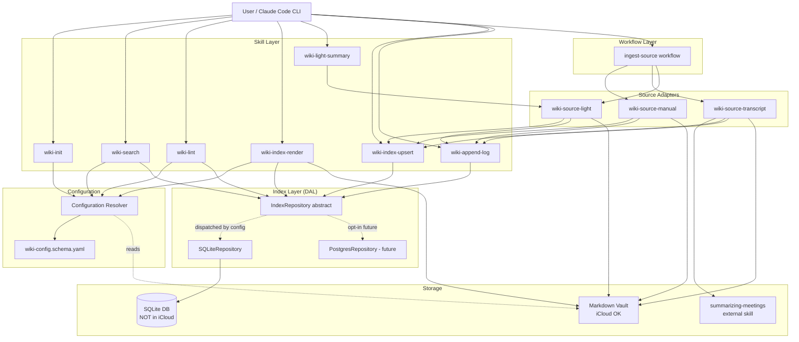
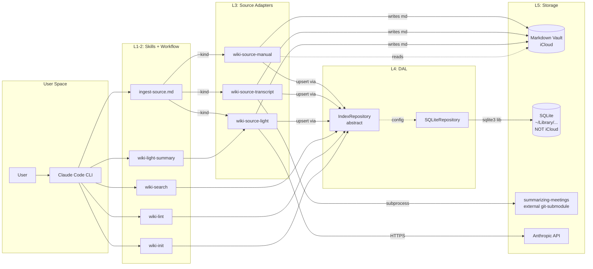
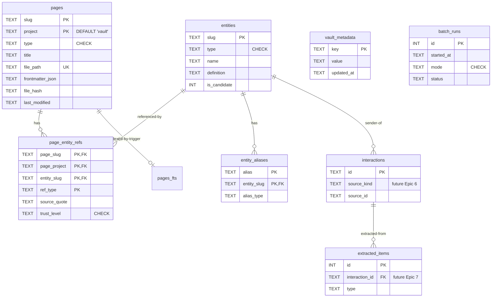

# ARCHITECTURE: LLM Wiki MVP

> **Status**: DRAFT — pending architecture-reviewer verification.
> **TASK**: [docs/TASK.md](./TASK.md) (Task 001 wiki-mvp)
> **Source spec**: [docs/TASK-ref-v2.md](./TASK-ref-v2.md) (full v2 specification, 1745 lines)
> **Schema**: [docs/SCHEMA-DRAFT.sql](./SCHEMA-DRAFT.sql) — SQLite DDL (8 tables + 3 FTS5 + 3 views, with sentinel-PK fix)
> **Backend choice**: [docs/SQLITE-VS-POSTGRES.md](./SQLITE-VS-POSTGRES.md) — SQLite default, Postgres opt-in via DAL.

---

## 1. Task Description

Реализация MVP персональной LLM Wiki поверх Obsidian-vault'а пользователя:
- **Markdown — source of truth** (Karpathy canon).
- **SQLite — derivative cache** (FTS5 + WAL для < 50ms search; rebuildable).
- **Pluggable source adapters** (manual + transcript + light для MVP).
- **Идемпотентные операции**: re-ingest того же source = no-op.
- **iCloud-aware**: SQLite вне vault'а, markdown в iCloud.

Полное описание целей см. [TASK.md §1](./TASK.md). Покрытие: 18 MVP requirements (R-01 — R-15, R-24 — R-26), 6 Use Cases, 5 Epics с 22 Issues.

---

## 2. Functional Architecture

### 2.1. Functional Components

#### Component: **Configuration Resolver**

**Purpose**: Резолвит per-vault и per-project конфигурацию из двухслойной schema (`CLAUDE.md::wiki:` + `<project>/.wiki.yaml`). Walk-up + deep-merge.

**Functions:**
- `load_config(cwd) → WikiConfig`
  - Input: текущий CWD.
  - Output: финальный merged `WikiConfig` объект (validated against JSON Schema).
  - Related Use Cases: ALL UCs (каждое skill-исполнение начинается с этого).

**Dependencies:** None (Tier 0). Все остальные компоненты depend на нём.

#### Component: **Index Layer (DAL)**

**Purpose**: Единый абстрактный repository над SQLite (default) или Postgres (opt-in). Все search/lint/upsert/resolve операции идут через него. Скрывает SQL детали от skill-кода.

**Functions:**
- `upsert_page(slug, project, type, ..., frontmatter_json)` — single-tx insert/update.
- `get_page(slug, project) → Page | None`.
- `delete_page(slug, project)`.
- `search_pages(query, *, project, types, limit) → list[PageHit]` — FTS5 BM25.
- `replace_refs(page_slug, page_project, refs[])` — atomic delete + insert.
- `get_backlinks(entity_slug) → list[Backlink]`.
- `find_orphan_links() → list[OrphanLink]`.
- `find_pages_missing_in_index(vault_root) → list[str]`.
- `check_drift() → DriftReport`.
- `begin_batch_run(mode) → run_id` / `finish_batch_run(run_id, status, **stats)`.
- `last_batch_run() → BatchRun | None`.
- `get_vault_metadata(key) → str | None` / `set_vault_metadata(key, value)`.
- `resolve_entity(...) → Entity | None` — **stub в MVP** (raises `NotImplementedError` если called в strict-mode; entity-resolver в Epic 7).

**Inputs:** `WikiConfig` (для backend/path resolution).
**Outputs:** Repository instance с указанным backend.
**Related Use Cases:** UC-01 (init seeds vault_metadata), UC-02 (upsert), UC-03 (search), UC-04 (lint queries), UC-05 (bulk-migration), UC-06 (light-summary upsert).

**Dependencies:** Configuration Resolver. Used by ALL skills.

#### Component: **Source Adapters**

**Purpose**: Pluggable extractors для разных типов входов. Унифицированный контракт `SourceAdapter`.

**MVP adapters:**
1. **`wiki-source-manual`** — для уже-существующих markdown-файлов. Не модифицирует body. Validates path внутри vault_root. Ставит `trust_level='high'` для refs.
2. **`wiki-source-transcript`** — wraps **`/generate-detailed-meeting-summary` workflow** (educational overlay поверх `summarizing-meetings` skill) через subprocess. Multi-pass LLM workflow генерирует pyramid summary с расширенным frontmatter (`type: lesson-summary`, `content_type`, `course`, `module`, `speaker`, `concepts[]`, `prerequisites[]`), Mermaid-диаграммами, `<!-- SECTION:* -->` anchors, `Content Fingerprint` блоком. Применяет §6.1 type-mapping (`lesson-summary` → DB `summary` + tag) при upsert. Ставит `trust_level='medium'`. См. TASK.md R-06.3 + R-07.4 + R-07.5 + I-3.3 + UC-07.
3. **`wiki-source-light`** (R-24) — single-call LLM для arbitrary md-куска. Не делает full pyramid. Ставит `trust_level='medium'`. Frontmatter `type: summary` (схема CHECK constraint), tag `summary-light` для filtering.

**Functions per adapter:**
- `authenticate(config) → None` — first-run setup (manual/light/transcript: no-op; future email: OAuth).
- `fetch(since=None) → Iterator[SourceItem]` — для pull-источников; для manual/light = single-shot.
- `normalize_to_md(item, vault_paths) → SourceOutput` — генерирует markdown файл.
- `dedup_state_file(config) → str | None` — для pull-источников.

**Related Use Cases:** UC-02 (manual), UC-06 (light), implicit транscript flow.

**Dependencies:** Index Layer (для post-write upsert), Configuration Resolver.

#### Component: **Skill Layer**

**Purpose**: User-facing entry points (slash-commands в Claude Code).

**MVP skills:**
- `wiki-init` (UC-01) — bootstrap.
- `wiki-index-upsert` (UC-02 step 7) — упрощённый wrapper над `Index Layer.upsert_page`.
- `wiki-index-render` (UC-05 step 7) — projection из SQLite в `index.md`.
- `wiki-append-log` (UC-02 step 11) — chronological log + monthly rotation.
- `wiki-search` (UC-03) — FTS5 query + nice formatting.
- `wiki-lint` (UC-04) — health-check через SQL.
- `wiki-light-summary` (UC-06) — wraps `wiki-source-light`.
- `ingest-source` workflow (meta) — dispatcher на `wiki-source-{kind}`.

**Functions:** Каждый skill = thin Python wrapper, читает stdin/argv, вызывает Index Layer + Source Adapters, возвращает JSON.

**Related Use Cases:** Каждый skill соответствует одному или нескольким UCs.

**Dependencies:** Configuration Resolver, Index Layer, Source Adapters.

#### Component: **Workflow Orchestrator** (`ingest-source`)

**Purpose**: Meta-workflow в `.claude/commands/` (markdown с frontmatter). Вызывает chain: detect kind → dispatch adapter → upsert → log → optional lint quick-pass. Failure handling с partial-recovery.

**Functions:**
- Resolve config + open repo.
- Detect `--kind` (если не указан — по path/extension/protocol).
- Dispatch: `transcript` → `wiki-source-transcript`; `manual` → `wiki-source-manual`; `light` → `wiki-source-light`.
- Index upsert.
- Append log.
- (Опц.) Quick-pass lint на новые pages.
- Final report stdout.

**Related Use Cases:** UC-02 step 1, UC-05 step 5, UC-06 step 1.

**Dependencies:** Source Adapters, Index Layer.

#### Component: **Migration Tools**

**Purpose**: One-off скрипты для bulk operations.

**MVP scripts:**
- `wiki-migrate-flat-to-folders` (I-5.1) — flat `<file>.md` → `<slug>/body.md` subfolder. Idempotent + `--dry-run`.
- `wiki-bulk-ingest` (I-5.2) — sequential ingest всех файлов в директории.
- `benchmark.py` (I-5.3) — synthetic vault generator + per-operation latency measurement.

**Related Use Cases:** UC-05.

**Dependencies:** Index Layer, Source Adapters.

### 2.2. Functional Components Diagram



---

## 3. System Architecture

### 3.1. Architectural Style

**Layered Architecture** (5 layers):

| Layer | Responsibility | Components |
|---|---|---|
| **L1: Skill Layer** | User-facing entry points. Argument parsing, output formatting, JSON envelopes. | `wiki-init`, `wiki-search`, `wiki-lint`, etc. |
| **L2: Workflow Layer** | Multi-step orchestration, dispatch, error-handling chains. | `ingest-source` workflow |
| **L3: Source Adapter Layer** | Pluggable input normalizers. Common contract. | `wiki-source-manual / -transcript / -light` |
| **L4: Index Layer (DAL)** | Storage abstraction. Repository pattern. Single-place SQL. | `IndexRepository` + `SQLiteRepository` |
| **L5: Storage** | Persistence: filesystem + SQLite. | Markdown vault + SQLite DB |

**Justification**:
- **Simplicity** (skill-architecture-design TIER 0): Layers — простейшая модель для CLI-tool с DB.
- **No microservices**: single-user, single-machine — overkill.
- **No event-driven**: операции синхронные, сложность очередей не оправдана.
- **No frameworks**: stdlib `sqlite3` + `argparse` + `python-frontmatter` — достаточно. Никакого ORM (SQL queries напрямую через repository).
- **Pluggable adapters**: даёт extensibility под будущий email/telegram (Epic 6) без переделки L1/L2/L4.
- **Repository pattern**: позволяет swap SQLite → Postgres через config (R-04). **Test-isolation bonus**: skill unit-tests используют in-memory mock `IndexRepository` (no real SQLite файл, no FS pollution, fast tests).

### 3.2. System Components

#### Component: **wiki-init** (Skill)

- **Type**: Python CLI script + skill markdown wrapper.
- **Purpose**: Bootstrap нового vault'а. Implements UC-01.
- **Implemented Functions**: Configuration resolution, iCloud detection, SQLite creation, vault_metadata seeding, directory mkdir, CLAUDE.md template write.
- **Technologies**: Python 3.11+, `sqlite3` (stdlib), `pathlib`, `hashlib` (sha256), `pyyaml`, `jsonschema`.
- **Interfaces**:
  - **Inbound**: User via `/wiki-init [--root ...] [--language ...] [--non-interactive]`.
  - **Outbound**: filesystem (mkdir, write CLAUDE.md), SQLite (apply DDL, seed vault_metadata).
- **Dependencies**: `python-slugify`, `pyyaml`, `jsonschema`. Internal: Configuration Resolver, Index Layer (для DDL apply).

#### Component: **IndexRepository** (DAL abstract base)

- **Type**: Python abstract class (`abc.ABC`).
- **Purpose**: Generic interface для всех storage operations. Скрывает SQL/SQLite-specific код от skills.
- **Implemented Functions**: 15 methods listed в TASK §3 I-2.1.
- **Technologies**: Python 3.11+ ABC, dataclasses.
- **Interfaces**:
  - **Inbound**: Skills + Source Adapters call via `make_repo(config)` factory.
  - **Outbound**: Concrete implementations (`SQLiteRepository`, future `PostgresRepository`).
- **Dependencies**: None (это сам по себе абстрактный contract).

#### Component: **SQLiteRepository** (DAL concrete)

- **Type**: Python class implementing `IndexRepository`.
- **Purpose**: SQLite-specific implementation. WAL mode, FTS5 queries, JSON-extract для frontmatter, atomic transactions.
- **Implemented Functions**: ALL `IndexRepository` methods.
- **Technologies**: `sqlite3` (stdlib, version ≥ 3.38), `python-slugify`, `python-frontmatter`. Опц. `sqlite-vec` (.dylib/.so) для future vector layer.
- **Interfaces**:
  - **Inbound**: Through `IndexRepository` interface.
  - **Outbound**: SQLite filesystem (`<db_path>.db`).
- **Dependencies**: SQLite library (system или bundled). DDL из `sql/wiki-index.sql` (= `SCHEMA-DRAFT.sql`).

#### Component: **wiki-index-upsert** (Skill — standalone-only entry point)

- **Type**: Python CLI script + skill markdown wrapper.
- **Purpose**: Standalone skill для index upsert одной markdown-страницы которая **уже** на диске. **НЕ** вызывается изнутри Source Adapter chain — adapter сам вызывает `repo.upsert_page(...)` напрямую (см. §3.2 «Adapter <-> repository contract»: single transactional boundary, no subprocess overhead, нет race window). Это избегает дублирования и double-write semantics.
- **Когда вызывается**:
  1. Пользователь вручную: `/wiki-index-upsert --page <path>` для already-on-disk файла, который не нуждается в normalization (manual workflow альтернатива `wiki-source-manual` adapter).
  2. `wiki-lint --fix` для re-индексации orphan'ов (drift fix).
  3. Bulk migration script для tmp2/ (I-5.2 sequential calls).
- **Implemented Functions**: Read file, parse frontmatter, `repo.upsert_page(...)`, `repo.replace_refs(...)`, return JSON envelope.
- **Technologies**: Python 3.11+, `python-frontmatter`.
- **Interfaces**:
  - **Inbound**: `/wiki-index-upsert --page <path>`.
  - **Outbound**: SQLite via Index Layer.
- **Dependencies**: Configuration Resolver, Index Layer.
- **Implements**: R-07.
- **Distinct from `wiki-source-manual` adapter**: adapter does input validation + path-traversal check + (LLM if applicable) + write markdown → then upsert. This skill assumes markdown is already valid and on-disk — only does upsert. Different responsibilities; canonically called for different scenarios.

#### Component: **wiki-index-render** (Skill)

- **Type**: Python CLI script + skill markdown wrapper.
- **Purpose**: Generate `index.md` (read-only projection) from SQLite. Implements UC-05 step 7. Auto-shards если pages > 200 → создаёт `00-Vault-Index/by-{category}.md` shards + `index.md` router.
- **Implemented Functions**: SQL query через `repo.search_pages(...)` (или `repo.list_pages(...)` если добавлен в IndexRepository v2), grouping by `wiki.index_render.group_by`, markdown rendering, atomic write через tempfile.
- **Technologies**: Python 3.11+. Reuses Index Layer.
- **Interfaces**:
  - **Inbound**: `/wiki-index-render [--scope vault|project] [--out <path>]`.
  - **Outbound**: Atomically writes `<vault>/00-Vault-Index/index.md` (overwrite). 
- **Dependencies**: Configuration Resolver, Index Layer.
- **Implements**: R-08.

#### Component: **wiki-search** (Skill)

- **Type**: Python CLI script + skill wrapper.
- **Purpose**: FTS5-backed text search. Implements UC-03.
- **Implemented Functions**: `repo.search_pages(...)` + markdown rendering + co-occurrence collection (для concept-type queries).
- **Technologies**: Python 3.11+. Reuses Index Layer.
- **Interfaces**:
  - **Inbound**: User via `/wiki-search "query" [--type ...] [--project ...] [--limit N]`.
  - **Outbound**: stdout markdown formatted output.
- **Dependencies**: Configuration Resolver, Index Layer.

#### Component: **wiki-lint** (Skill)

- **Type**: Python CLI script + skill wrapper.
- **Purpose**: Health-check корпуса через SQL. Implements UC-04.
- **Implemented Functions**: 9 чеков (orphan, missing-backlinks, stale, frontmatter, taxonomy, drift, log-gaps, duplicate-concepts strict-only, external-only-orphans). Все через SQL.
- **Technologies**: Python 3.11+, `sqlite3`. Markdown rendering для report.
- **Interfaces**:
  - **Inbound**: User via `/wiki-lint [--root ...] [--fix] [--report ...] [--strict]`.
  - **Outbound**: Markdown report file + JSON sidecar. Опц. `--fix` apply mutations.
- **Dependencies**: Configuration Resolver, Index Layer, filesystem walk (для drift).

#### Subsection: **SourceAdapter Interface** (abstract contract — R-06.1)

Все Source Adapters имплементируют этот контракт. Спрятан в `scripts/wiki_source/base.py`.

```python
from abc import ABC, abstractmethod
from dataclasses import dataclass
from typing import Iterator, Optional

@dataclass
class SourceItem:
    """Один атомарный input — manual md-file, light text-chunk, transcript path."""
    source_kind: str            # 'manual' | 'transcript' | 'light' | future 'email'/'telegram'/'web'
    source_id: str              # для manual = file path, для light = sha256(text), для transcript = transcript path
    timestamp: str              # ISO-8601, when item was fetched/seen
    sender: Optional[dict]      # {name, email, telegram_handle} — для cross-source entity resolution (future Epic 6)
    recipients: list[dict]      # same — future use
    subject: Optional[str]      # для emails/light = title; для manual/transcript = file basename
    body: str                   # raw markdown / raw text content
    metadata: dict              # source-specific fields

@dataclass
class SourceOutput:
    """Что adapter возвращает после обработки SourceItem."""
    file_path: str              # relative to vault — куда положили markdown
    interaction_id: Optional[str]  # для future Epic 6 (interactions table); None в MVP
    summary_excerpt: str        # first 200 chars of generated/indexed summary

class SourceAdapter(ABC):
    """Каждый источник имплементирует этот interface. Контракт R-06.1."""

    @property
    @abstractmethod
    def kind(self) -> str:
        """'manual' | 'transcript' | 'light' | future 'email'/'telegram'/'web'."""

    @abstractmethod
    def authenticate(self, config: dict) -> None:
        """First-run setup. manual/light/transcript: no-op. Future email: OAuth flow.
        Idempotent — повторный вызов не делает re-auth если уже OK."""

    @abstractmethod
    def fetch(self, since: Optional[str] = None) -> Iterator[SourceItem]:
        """Pull новых items. Для manual/light — single-shot (yield один SourceItem из argv).
        Для future pull-источников — pagination + dedup через source_state.
        `since` = ISO-8601; если None — adapter решает default (e.g., last 3 days)."""

    @abstractmethod
    def normalize_to_md(self, item: SourceItem, vault_paths: dict, repo: 'IndexRepository') -> SourceOutput:
        """Сгенерировать markdown с frontmatter, записать в vault, вызвать repo.upsert_page().
        Returns SourceOutput. Errors — raise SourceAdapterError(code, message)."""

    @abstractmethod
    def dedup_state_file(self, config: dict) -> Optional[str]:
        """Путь к .state.json для этого adapter'а. None для manual/light/transcript (нет state).
        Для future email/telegram — путь к persistent dedup state."""


class SourceAdapterError(Exception):
    """Унифицированная ошибка из adapter'а. Передаётся в JSON envelope."""
    def __init__(self, code: str, message: str, details: Optional[dict] = None):
        self.code = code           # 'INVALID_FRONTMATTER' | 'PATH_OUTSIDE_VAULT' | 'LLM_RATE_LIMIT' | etc.
        self.message = message
        self.details = details or {}
```

**Error envelope contract** — все adapters при failure возвращают (через workflow JSON output):

```json
{"error": "<code>", "message": "<human-readable>", "details": {<context>}}
```

with non-zero exit code. Common codes (defined в `scripts/wiki_source/base.py`):
- `INVALID_FRONTMATTER` — YAML parse error.
- `MISSING_REQUIRED_FIELD` — config-driven required field missing.
- `PATH_OUTSIDE_VAULT` — path-traversal attempt detected (R-26.2).
- `INPUT_TOO_LARGE` — wiki-source-light > 10K chars (per UC-06 §A1).
- `EMPTY_INPUT` — wiki-source-light empty text.
- `LLM_RATE_LIMIT` — Anthropic API throttling после max retries.
- `LLM_AUTH_FAILED` — invalid API key.
- `WORKFLOW_NOT_FOUND` — `/generate-detailed-meeting-summary` workflow или `claude` CLI отсутствует (TASK I-3.3 step a). Error JSON: `{missing: [...], expected_paths: [...]}`.
- `WORKFLOW_TIMEOUT` — subprocess exceeded `wiki.transcript.timeout_seconds` (default 600s). Partial output moved to `_raw/failed/` (TASK I-3.3 step c.1).
- `WORKFLOW_FAILED` — subprocess non-zero exit (TASK I-3.3 step c.1). Includes `exit_code, stderr_tail`.
- `WORKFLOW_INCOMPLETE` — output validation failed (missing SECTION marker, unrendered `{{N}}` fingerprint placeholders) (TASK I-3.3 step d).
- `UNMAPPED_TYPE` — frontmatter `type` ∉ §6.1 mapping table (TASK UC-07 A3).
- `BodyNormalizationError` — unclosed Mermaid fence detected (TASK R-07.5 anti-tail-eat).
- `CONCURRENT_INGEST_TIMEOUT` — flock contention >60s on `.summary.lock` (TASK UC-07 A8).
- `EXTERNAL_SKILL_FAILED` — generic fallback subprocess exit code != 0 (legacy; prefer `WORKFLOW_FAILED`).
- `STATE_FILE_CORRUPT` — .state.json parse error (future Epic 6).

**Adapter <-> repository contract**: adapter calls `repo.upsert_page(...)` сам (внутри `normalize_to_md`). Workflow `ingest-source` НЕ делает upsert — только dispatch + post-actions (log, lint quick-pass). Это explicit чтобы adapter решал atomicity (например, light-summary должен сначала записать markdown, потом upsert; rollback complicated).

**Transactional boundary** (resolves M-3): `repo.upsert_page` обёрнут в `BEGIN IMMEDIATE` ... `COMMIT`. Если внутри — exception, transaction rolls back, FTS5 trigger автоматически undo'ит свои writes (потому что они в той же tx). Markdown файл остаётся on-disk (already-written) — это OK: rerun ingest = idempotent (file_hash check).

#### Component: **wiki-source-manual** (Source Adapter)

- **Type**: Python class implementing `SourceAdapter`.
- **Purpose**: Index already-existing markdown файлов. Не модифицирует body, не перемещает.
- **Implemented Functions**: Path-traversal validation, frontmatter parse, refs extraction, repo.upsert.
- **Technologies**: Python 3.11+, `python-frontmatter`, `python-slugify`.
- **Interfaces**:
  - **Inbound**: `ingest-source --kind manual --source <path>` (через workflow).
  - **Outbound**: Index Layer upsert + log append.
- **Dependencies**: Index Layer, Configuration Resolver.

#### Component: **wiki-source-transcript** (Source Adapter)

- **Type**: Python class implementing `SourceAdapter` + subprocess wrapper над external workflow.
- **Purpose**: Generate educational-overlay pyramid summary from transcript via `/generate-detailed-meeting-summary` **workflow** (НЕ базовый `summarizing-meetings` skill — workflow extends его educational fields, Mermaid, SECTION-anchors, Agent Metadata).
- **Implemented Functions**: (a) Discovery (workflow file + `claude` CLI presence, escape-hatch `WIKI_GENSUMMARY_CMD` env var); (b) Idempotency short-circuit (TASK UC-07 A4 — `source_state` hash query); (c) Subprocess spawn с `timeout=600s`, `TimeoutExpired` handler с partial-file cleanup в `_raw/failed/`; (d) Output validation — `<!-- SECTION:agent-metadata -->` marker + rendered `Content Fingerprint` (NOT `{{N}}` placeholders); (e) Apply TASK R-07.4 (type-mapping `lesson-summary` → `summary`+tag, concepts slugify через `python-slugify`) and R-07.5 (Mermaid+SECTION strip regex, anti-tail-eat on unclosed fence) перед upsert; (f) Persist `source_state.source_hash`; (g) Set `trust_level='medium'` для refs.
- **Technologies**: Python 3.11+, `subprocess`, `flock` (UC-07 A8 concurrent-ingest lock), `python-slugify`. **External dependencies**: `summarizing-meetings` skill + `/generate-detailed-meeting-summary` workflow (git-submodule в `~/.claude/skills/` + `~/.claude/commands/`).
- **Interfaces**:
  - **Inbound**: `/ingest-source --kind transcript --source <transcript-path> --output <output-dir>`.
  - **Outbound**: New markdown summary in `<output-dir>/summary.md` (file frontmatter retains `type: lesson-summary`); `pages` DB row с `type='summary'` + tags `[lesson-summary, ...slugified-concepts]`; `source_state` row для idempotency.
- **Dependencies**: External workflow, Index Layer, Configuration Resolver, `wiki-source-manual` (delegated final upsert).

#### Component: **wiki-source-light** (Source Adapter — R-24)

- **Type**: Python class implementing `SourceAdapter`.
- **Purpose**: Single-call LLM summary для arbitrary md-куска. Не делает full pyramid.
- **Implemented Functions**: Input validation (≤ 10K chars), LLM call (Claude Haiku/Sonnet via Anthropic API), structured response parsing (`{tldr, tags}`), markdown file generation с frontmatter `type: summary` + tag `summary-light`.
- **Technologies**: Python 3.11+, `anthropic` SDK (или httpx + raw API), `python-frontmatter`. Использует Anthropic API key из env (`ANTHROPIC_API_KEY`).
- **Interfaces**:
  - **Inbound**: `/wiki-light-summary --text "..." | --source <path>`.
  - **Outbound**: New markdown в `Summaries/light/<date>-<slug>.md`.
- **Dependencies**: Anthropic API, Index Layer, Configuration Resolver.

#### Component: **ingest-source** (Workflow markdown)

- **Type**: Markdown workflow file в `.claude/commands/ingest-source.md`.
- **Purpose**: Dispatcher и orchestration chain.
- **Implemented Functions**: Detect kind, dispatch adapter, chain to index-upsert + log + opt lint, failure handling.
- **Technologies**: Markdown с YAML frontmatter (Claude Code workflow format).
- **Interfaces**:
  - **Inbound**: User via `/ingest-source --kind X --source Y`.
  - **Outbound**: Calls Source Adapters, ultimately mutates filesystem + SQLite.
- **Dependencies**: Source Adapters, Index Layer.

### 3.3. Components Diagram



---

## 4. Data Model (Conceptual)

### 4.1. Conceptual Data Model

> **Полная DDL**: см. [SCHEMA-DRAFT.sql](./SCHEMA-DRAFT.sql) (8 tables + 3 FTS5 virtual + 3 views + опц. vec0).

**Entities (high-level):**

#### Entity: **Page**
- **Description**: Любая markdown-страница vault'а — summary, concept, query, brief, research, index, log.
- **Key Attributes**:
  - `slug` (TEXT) — kebab-case, vault-wide unique для (slug, project).
  - `project` (TEXT NOT NULL DEFAULT '_vault_') — sentinel `_vault_` для vault-wide; иначе project-slug.
  - `type` (TEXT, CHECK constraint).
  - `file_path` (TEXT UNIQUE) — relative to vault_root.
  - `frontmatter_json` (TEXT) — full YAML frontmatter as JSON.
  - `file_hash` (TEXT, sha256) — для change detection.
- **Relationships**: 1:N с `page_entity_refs` (page содержит N ref'ов на entities).
- **Business Rules**:
  - PK = (slug, project) — sentinel '_vault_' для NULL — предотвращает SQLite NULL-PK semantics (R-26.1).
  - `last_modified` отслеживает file mtime для delta-reindex.
  - Frontmatter required-fields определяются `wiki.lint.required_frontmatter` (для flat layout — без `project`).

#### Entity: **Entity** (concept / person / company / product / group)
- **Description**: Атомарная сущность — концепт (Karpathy), person/company (cybos cross-source). MVP использует только `concept` + `external` types.
- **Key Attributes**:
  - `slug` (TEXT PRIMARY KEY) — kebab-case, vault-wide unique.
  - `type` (TEXT CHECK).
  - `name` (TEXT) — canonical display.
  - `definition` (TEXT) — 1-3 sentences.
  - `is_candidate` (INTEGER 0/1) — two-tier (cybos pattern).
- **Relationships**: 1:N с `entity_aliases`; M:N с `pages` через `page_entity_refs`.
- **Business Rules**:
  - `is_candidate=true` для LLM-extracted без exact match (Epic 7).
  - В MVP entity-resolver — stub. Entities создаются только вручную или migration tools.

#### Entity: **PageEntityRef**
- **Description**: М:М связь page ↔ entity (concept упомянут на странице) с provenance v1.1.
- **Key Attributes**:
  - `(page_slug, page_project, entity_slug, ref_type)` — composite PK.
  - `source_quote` (TEXT) — verbatim 10-50 слов.
  - `source_span` (TEXT — line numbers `Lstart-Lend`).
  - `trust_level` (TEXT CHECK 'high'/'medium'/'low').
- **Relationships**: FK к `pages` и `entities` с `ON DELETE CASCADE`.
- **Business Rules**:
  - `wiki-source-manual` ставит `trust_level='high'` (user-curated).
  - `wiki-source-transcript` / `wiki-source-light` — `'medium'` (LLM-generated).
  - `replace_refs(...)` атомарно delete + insert (для re-ingest без drift'а).

#### Entity: **VaultMetadata** (NEW в v2 — R-25)
- **Description**: Key-value таблица для vault identity и schema versioning. Keys: `vault_hash`, `vault_root_path`, `schema_version`, `created_at`, `language`, `layout`.
- **Key Attributes**:
  - `key` (TEXT PRIMARY KEY).
  - `value` (TEXT NOT NULL).
  - `updated_at` (TEXT, ISO-8601).
- **Relationships**: Standalone.
- **Business Rules**: Seeded `wiki-init`. `schema_version` инкрементируется migration scripts.

#### Entity: **BatchRun**
- **Description**: Лог reindex-операций для freshness check.
- **Key Attributes**: `id`, `started_at`, `finished_at`, `status`, `mode`, counters.
- **Relationships**: Standalone (но связан с операциями через `notes` field).
- **Business Rules**: SessionStart hook читает last row для warning'а «БД устарела > 24h».

#### Entity: **Interaction** (готова в schema, но **не используется в MVP**)
- **Description**: Cybos-style raw-source row (email, telegram, call, transcript, web). Activated в Epic 6.
- **MVP usage**: Schema присутствует, но wiki-* skills не пишут в `interactions` table в MVP. Только future Epics.

#### Entity: **ExtractedItem** (готова в schema, но **не используется в MVP**)
- **Description**: LLM-extracted structured facts (promise, action_item, decision). Activated в Epic 7 (entity-resolver + LLM extraction).

#### Entity: **SourceState**
- **Description**: Per-source dedup state. Future Epic 6 (email messageIds, telegram msg_ids).

#### Entity: **EntityAlias**
- **Description**: Alias-имена для дедупликации. Future Epic 7.

### 4.2. Logical Data Model

См. [SCHEMA-DRAFT.sql](./SCHEMA-DRAFT.sql) для полного DDL.

**Key indexes (для MVP performance — R-14)**:
- `pages_fts` — FTS5 virtual table, BM25 ranking. Triggers держат в sync с `pages`.
- `idx_pages_type` — для `--type` filter в search.
- `idx_pages_project_date` — для project-scoped queries + sort by date.
- `idx_pages_frontmatter` — JSON-extract на `tags` для tag-based queries.
- `idx_refs_entity` — для backlinks queries (concept-pages).
- `idx_refs_page` — для лint orphan checks.

### 4.3. Data Model Diagram



### 4.4. Migrations and Versioning

**Стратегия**:
- `vault_metadata.schema_version` хранит текущую версию (стартует с `'1'`).
- Migration scripts в `scripts/migrations/v{N}_to_v{N+1}.py`, выполняются в порядке.
- Каждая migration:
  1. Проверяет `schema_version`.
  2. Применяет ALTER/CREATE/etc. в transaction.
  3. Обновляет `vault_metadata.schema_version`.
  4. Logs в `batch_runs` (mode='migrate').

**Backward compatibility**:
- Markdown — single source of truth → DB можно дропнуть и пересобрать в любой момент. Migration в worst case = `wiki-reindex --full`.
- v1 → v2 migration описан в [MIGRATION-v1-to-v2.md](./MIGRATION-v1-to-v2.md).

---

## 5. Interfaces

### 5.1. External APIs

**No exposed APIs.** Вся система — local CLI (Claude Code skills). Внешние API только потребляются:
- **Anthropic API** (Claude Haiku/Sonnet) — для `wiki-source-light`. HTTPS, JSON, key-auth via `ANTHROPIC_API_KEY` env.
- **Future** (Epic 6): Gmail-MCP (OAuth), Telegram MTProto (session keys via GramJS), Exa/Perplexity/Firecrawl MCPs.

### 5.2. Internal Interfaces

**Skill ↔ Skill**: через subprocess + stdout JSON contract. Каждый skill эмиттит:

```json
{
  "action": "added" | "updated" | "unchanged" | "skipped",
  "slug": "...",
  "details": { ... }
}
```

или error envelope:

```json
{
  "error": "ERROR_CODE",
  "message": "...",
  "file": "..."
}
```

**Skill ↔ DAL**: через Python imports. `make_repo(config)` factory.

**DAL ↔ SQLite**: через stdlib `sqlite3` module. Все queries — parameterized statements. Никакого f-string concatenation.

**Adapter ↔ External Skill (transcript)**: Subprocess. Capture stdout, проверить exit code, расковырять JSON envelope.

### 5.3. Integrations with External Systems

| System | Purpose | Protocol | Error Handling |
|---|---|---|---|
| `summarizing-meetings` skill | Generate full pyramid transcript summary | Subprocess, JSON via stdout | Exit code != 0 → fail-fast с user-friendly message |
| Anthropic API (Claude) | LLM call для `wiki-light-summary` | HTTPS POST `/v1/messages` | Rate-limit → exponential backoff (3 retries); auth error → fail-fast |
| Filesystem (markdown vault) | Source-of-truth для контента | POSIX | Atomic writes (`tempfile + os.replace`); read-only on `_raw/` |
| SQLite | Index storage | Library API | WAL retry on `database is locked`; corruption → `PRAGMA integrity_check` + restore from markdown |

---

## 6. Technology Stack

### 6.1. Backend

- **Language**: **Python 3.11+** для всех wiki-* скиллов.
  - **Justification**: SQLite stdlib, mature ecosystem (`python-frontmatter`, `pyyaml`, `python-slugify`, `jsonschema`), CLAUDE.md `LOCAL DEVELOPMENT RULES` mandate `pip + .venv`. Python 3.11+ для `match` statements, type hints (`X | None`), and structural pattern matching.
- **Framework**: **None** (per skill-architecture-design TIER 0 «No frameworks if API is easier on lower-level libs»). `argparse` (stdlib) для CLI, `dataclasses` для models, raw `sqlite3` для DB.
- **Future TypeScript**: Future Epic 6 `wiki-source-telegram` — TS/Bun для GramJS MTProto (cybos pattern). MVP — Python only.

### 6.2. Frontend

- **None.** CLI-only tool. Обsidian — внешний viewer markdown (не часть нашей system).
- **Future**: web UI for `wiki-search` — explicit non-goal (TASK §7c).

### 6.3. Database

- **MVP default**: **SQLite 3.38+** (stdlib).
  - **Justification**: см. [SQLITE-VS-POSTGRES.md §1-§2](./SQLITE-VS-POSTGRES.md). Decision matrix 9-4 в favor of SQLite для personal vault use-case. Embedded, zero-config, iOS-compatible, < 50ms FTS5 на 100K rows.
  - **Pragmas**: `journal_mode=WAL`, `synchronous=NORMAL`, `foreign_keys=ON`, `mmap_size=256MB`.
  - **Extensions**: FTS5 (built-in). Опц. `sqlite-vec` для future vector layer (Epic 8).
- **Opt-in**: **PostgreSQL 15+** через DAL — для users у которых корпус > 100K или multi-user team setup. Реализуется в future Epic 8.

### 6.4. Infrastructure

- **Containerization**: **None** в MVP. Personal CLI tool.
- **Orchestration**: **None**. Single-machine.
- **Middleware**: **None**.
- **Observability**: **`log.md`** chronological + JSON sidecar lint reports. SessionStart hook reads `batch_runs`. 
- **CI**: GitHub Actions (если репо public) — pytest + benchmark suite + JSON Schema validation. Stub для Now: `Makefile` с `test`, `bench`, `lint` targets.

---

## 7. Security

### 7.1. Authentication and Authorization

**Single-user personal tool. No auth.**

- Skills исполняются под user-account, читают/пишут within vault permissions.
- `ANTHROPIC_API_KEY` хранится в `~/.config/wiki-mcp/keys.env` (env file, **никогда** не commit'ится; `.gitignore`).
- Future Epic 6: Gmail OAuth + Telegram MTProto session keys тоже в `~/.config/wiki-mcp/`.

### 7.2. Data Protection

- **At rest**: Markdown в iCloud Obsidian — encrypted iCloud sync. SQLite — local FS, **не** в iCloud (R-03). No additional encryption (vault уже под user permissions).
- **In transit**: HTTPS для всех external API calls (Anthropic).
- **PII**: `wiki.research.private_concepts` + `private_tags: [confidential]` — fail-fast в research/external-share. MVP не имеет research/external-share, но schema готова.
- **Backups**: Vault уже git-versionable (рекомендация); SQLite — derivative, всегда rebuildable. **Скиллы не делают бэкапы** (per TASK §22 v2).

### 7.3. Attack Protection (OWASP-aligned)

- **A03 Injection**:
  - **SQL Injection**: все queries через parameterized statements (`?` для SQLite, `%s` для Postgres). Test: ingest файла с frontmatter `title: "'; DROP TABLE pages--"` → table остаётся.
  - **Command Injection**: `wiki-source-transcript` использует `subprocess.run([...], shell=False)` — argv list, не shell-string.
- **A01 Broken Access Control**:
  - **Path Traversal**: `wiki-source-manual` validates `os.path.realpath(source).startswith(os.path.realpath(vault_root))`. Test: `--source ../../../etc/passwd` → fail-fast.
- **A04 Insecure Design**:
  - SQLite вне iCloud (R-03) — phys-design защита от sync-corruption.
- **A05 Security Misconfiguration**:
  - JSON Schema validation для config до запуска любого skill (R-01.3).
  - Fail-fast если `wiki:` блок отсутствует в `CLAUDE.md`.
- **A08 Software & Data Integrity**:
  - `pages.file_hash` (sha256) для change detection.
  - `vault_metadata.schema_version` для migration tracking.
- **A09 Logging Failures**:
  - `log.md` append-only с monthly rotation. Не редактируется автоматически.
- **A10 SSRF**: `wiki-source-light` отправляет только в Anthropic API (hard-coded host). Не принимает user-supplied URL.

**Out-of-scope для MVP** (per TASK):
- Multi-user RBAC.
- Audit logs beyond `log.md`.
- Encryption at rest (vault encryption — responsibility пользователя).

---

## 8. Scalability and Performance

### 8.1. Scaling Strategy

**Vertical only** для MVP — single-machine, single-user.

- **Корпус ≤ 100K документов**: SQLite FTS5 + WAL. Все SLOs из TASK §5.1 hold.
- **Корпус > 100K**: trigger Postgres backend (opt-in через config). См. [SQLITE-VS-POSTGRES.md §7](./SQLITE-VS-POSTGRES.md).
- **Future horizontal scaling**: multi-user — out of scope, future Epic.

### 8.2. Caching

- **No application-level cache в MVP**.
- **OS-level**: SQLite mmap (256MB) — file-content cached в page-cache.
- **WAL mode** даёт snapshot-isolation для readers без блокировок writers.

### 8.3. DB Optimization

- **Indexes**: 9 indexes на `pages` / `entities` / `page_entity_refs` (см. [SCHEMA-DRAFT.sql](./SCHEMA-DRAFT.sql)).
- **FTS5 BM25 ranking** — out-of-the-box, sub-50ms на 100K rows.
- **JSON computed columns**: `idx_pages_frontmatter` ON `json_extract(frontmatter_json, '$.tags')` — fast tag queries.
- **Partial indexes**: `idx_inter_pending` WHERE `extracted_at IS NULL` (для future LLM-extraction work-queue).
- **WAL checkpoint** — SQLite handles automatically; никаких manual `PRAGMA wal_checkpoint(...)`.

**Performance budget** — см. [TASK §5.1](./TASK.md). Verification — benchmark suite (R-14, I-5.3).

---

## 9. Reliability and Fault Tolerance

### 9.1. Error Handling

- **Fail-fast philosophy**: invalid input/config → immediate non-zero exit с structured error envelope.
- **No silent corruption**: каждый failure path emits:
  ```json
  {"error": "ERROR_CODE", "message": "...", "context": {...}}
  ```
- **Atomic writes** для всех state-mutation: `tempfile.NamedTemporaryFile + os.replace` (POSIX-atomic).
- **SQLite locked** retry: 3 attempts с 50ms backoff. На 4-й — fail-fast.
- **Subprocess errors** (`wiki-source-transcript` → `summarizing-meetings`): non-zero exit code → log + fail-fast workflow.
- **API rate-limits** (`wiki-source-light` → Anthropic): exponential backoff (1s, 2s, 4s) up to 3 retries.

### 9.2. Backup

- **Markdown vault**: пользователь должен иметь git/iCloud backup. Скиллы не делают.
- **SQLite**: derivative, rebuildable из markdown. Backup — file copy `<db>.db` + `<db>.db-wal` (atomic при `journal_mode=WAL`). Restore — replace files. Если corrupt → `PRAGMA integrity_check` + если bad → drop + `wiki-reindex --full`.

### 9.3. Monitoring and Alerting

- **Local-only.** Никаких внешних monitoring tools.
- **Metrics на `batch_runs`**: last reindex time, errors, items processed.
- **SessionStart hook** (опц., в Claude Code): warn если last `batch_runs` > 24h.
- **Lint health**: `wiki-lint --strict` weekly cron — emits report; пользователь reviews.

---

## 10. Deployment

### 10.1. Environments

- **Dev**: разработчик на своей машине (macOS / Linux). `tests/fixtures/minimal-vault/` для unit/integration.
- **Staging**: ad-hoc — `tmp2/` для bulk-migration validation; `/private/tmp/wiki-test-vault/` для iCloud-simulation.
- **Prod**: пользовательский Obsidian vault (`~/Library/Mobile Documents/iCloud~md~obsidian/Documents/ObsidianNotes/`). Realistic e2e на rsync-копии в `/private/tmp/wiki-validation/`.

### 10.2. CI/CD Pipeline

**Stub для MVP** — Makefile с targets:

```makefile
# Makefile
.PHONY: install test bench lint format clean

install:
	python3 -m venv .venv
	.venv/bin/pip install -r requirements.txt
	.venv/bin/pip install -e .

test:
	.venv/bin/pytest tests/ -v

bench:
	.venv/bin/python scripts/benchmark.py --vault-sizes 100,1000,10000

lint:
	.venv/bin/ruff check scripts/ skills/
	.venv/bin/python -m jsonschema -i schemas/wiki-config.example.yaml schemas/wiki-config.schema.yaml

format:
	.venv/bin/ruff format scripts/ skills/

clean:
	rm -rf .venv build dist *.egg-info
```

**Future**: GitHub Actions с тем же flow + matrix testing на macOS / Ubuntu.

### 10.3. Configuration

- **`~/.config/wiki-mcp/keys.env`** — API keys (gitignored).
- **`<vault>/CLAUDE.md`** — per-vault schema (под git если vault git-repo).
- **`<project>/.wiki.yaml`** — per-project override.
- **`requirements.txt`** — Python deps pinned (`python-slugify==8.x`, `python-frontmatter`, `pyyaml`, `jsonschema`, `anthropic`).

### 10.4. Deployment Instructions

```bash
# 1. Clone repo
cd ~/Antigravity
git clone <repo-url> obsidian-llm-wiki  # already exists

# 2. Setup Python env
cd obsidian-llm-wiki
python3 -m venv .venv
source .venv/bin/activate
pip install -r requirements.txt
pip install -e .  # install wiki-* skills as commands

# 3. Symlink skills to ~/.claude/skills/
for skill in skills/wiki-*; do
    ln -sf "$(pwd)/$skill" "$HOME/.claude/skills/$(basename $skill)"
done

# 4. Install summarizing-meetings (transcript adapter dep)
git submodule add https://github.com/MatrixFounder/Universal-skills.git external/Universal-skills
ln -sf "$(pwd)/external/Universal-skills/skills/summarizing-meetings" "$HOME/.claude/skills/summarizing-meetings"

# 5. Set API key
mkdir -p ~/.config/wiki-mcp
echo "ANTHROPIC_API_KEY=sk-ant-..." > ~/.config/wiki-mcp/keys.env
chmod 600 ~/.config/wiki-mcp/keys.env

# 6. Test on minimal vault
make test
make bench

# 7. Initialize a real vault
cd ~/Library/Mobile\ Documents/iCloud~md~obsidian/Documents/ObsidianNotes/
claude
> /wiki-init
```

---

## 11. Open Questions

### 11a. RESOLVED (по итогам TASK iteration 2)

- Q-A: SQLite vs Postgres — **SQLite default**, Postgres opt-in через DAL. См. [SQLITE-VS-POSTGRES.md](./SQLITE-VS-POSTGRES.md).
- Q-B: Code location — этот репо `obsidian-llm-wiki/`.
- Q-C: PK NULL semantics — fixed sentinel `'_vault_'` в schema.
- Q-D: vault_hash storage — `vault_metadata` table.
- Q-E: trust_level per adapter — manual=high, transcript/light=medium.
- Q-F: required_frontmatter для flat — без `project`.

### 11b. Defer-able (не блокирует Architecture, можно решать в Plan/Dev)

- **Q-1: Embedding модель для Epic 8**.
- **Q-2: light-summary LLM model** — Haiku (default, $) vs Sonnet (quality).
- **Q-3: Cron / launchd для daily automation** — Epic 6 detail.
- **Q-4: Plugin packaging format** — после MVP стабилизации.
- **Q-5: `wiki-source-light` text input limit** — спека `≤ 10K chars` стоит ли расширить? Решается в Dev по UX feedback'у.

### 11c. Architecture-specific Open Questions

- **Q-A1: ABI compatibility transcript adapter ↔ summarizing-meetings**. Какой именно contract?
  - **Default assumption**: subprocess invocation `claude /generate-detailed-meeting-summary --source <transcript>` → читаем stdout JSON envelope с output path. Если skill эмиттит другой формат — adapter parser нужно адаптировать.
  - **Resolution**: подтверждается при первом end-to-end тесте transcript adapter (Epic E3 I-3.3).

- **Q-A2: Should `wiki-init` cron-job creation быть default ON or OFF?**
  - **Current TASK answer**: interactive prompt, default OFF.
  - **Architecture stance**: согласен — automation — opt-in для предотвращения surprise behavior.

- **Q-A3: Schema migration framework выбор**.
  - **Default assumption**: rolling files в `scripts/migrations/v{N}_to_v{N+1}.py` без external lib (Alembic-style — overkill).
  - **Resolution**: confirmed для MVP. Re-evaluate если migration count > 5.

---

## Verification Map (TASK requirements ↔ Architecture sections)

| TASK Requirement | Architecture coverage | Test/AC reference |
|---|---|---|
| R-01 (config schema) | §3.2 Configuration Resolver, §10.3 | UC-01 AC (CLAUDE.md valid YAML) |
| R-02 (SQLite + FTS5) | §6.3 Database, [SCHEMA-DRAFT.sql](./SCHEMA-DRAFT.sql) | UC-01 AC `journal_mode=wal`; FTS5 contentless mode (post C-1 fix) |
| R-03 (iCloud-aware DB location) | §6.4 / §3.2 wiki-init, §7.2 Data Protection | UC-01 AC «DB path не содержит Mobile Documents/iCloud~» |
| R-04 (DAL) | §3.2 IndexRepository (15 methods), SQLiteRepository | I-2.4 unit tests на minimal vault fixture |
| R-05 (wiki-init) | §3.2 wiki-init component, §10.4 deployment step 7 | UC-01 entire |
| R-06.1 (SourceAdapter contract) | §3.2 SourceAdapter Interface subsection (NEW) | I-3.1 abstract base + base.py module |
| R-06.2 (manual adapter) | §3.2 wiki-source-manual | UC-02 entire |
| R-06.3 (transcript adapter) | §3.2 wiki-source-transcript + Q-A1 resolution required | UC-02 by reference (transcript flow goes through manual chain) |
| R-07 (wiki-index-upsert as standalone skill) | §3.2 wiki-index-upsert (через SQLiteRepository.upsert_page wrapper) | UC-02 step 7 + AC |
| R-08 (wiki-index-render) | §3.2 wiki-index-render component (separate skill, projection generator) | UC-05 step 7 |
| R-09 (wiki-append-log) | §3.2 wiki-append-log component, §9.3 Monitoring (log/{YYYY-MM}.md rotation) | UC-02 step 11 |
| R-10 (wiki-search) | §3.2 wiki-search, §8.3 DB Optimization | UC-03 entire |
| R-11 (wiki-lint) | §3.2 wiki-lint, §9.3 Monitoring | UC-04 entire |
| R-12 (ingest-source workflow) | §3.2 Workflow Orchestrator | UC-02 step 1, UC-05 step 5, UC-06 step 1 |
| R-13 (bulk migration) | §3.2 Migration & Validation Tools, §10.4 | UC-05 entire |
| R-14 (benchmark) | §10.2 CI bench target, §8.3 + §28 Performance budget | I-5.3 benchmark suite output (CI-fail если > target) |
| R-15.1-15.2 (provenance v1.1 in DDL + extracted_items) | §4.1 PageEntityRef + extracted_items entities | SCHEMA CHECK constraint enforcement |
| R-15.3 (per-adapter trust_level) | §3.2 wiki-source-manual=high, transcript/light=medium | UC-02 AC |
| R-24 (wiki-light-summary) | §3.2 wiki-source-light, §5.3 Anthropic API integration | UC-06 entire |
| R-25 (vault_metadata) | §4.1 VaultMetadata entity, §4.4 Migrations | UC-01 AC `vault_metadata seeded` |
| R-26.1 (sentinel-PK fix) | §4.1 Page (sentinel '_vault_'), SCHEMA L106 | UC-02 AC idempotency test |
| R-26.2 (path-traversal validation) | §3.2 wiki-source-manual + §7.3 A01 + SourceAdapter contract `PATH_OUTSIDE_VAULT` error code | UC-02 AC path-traversal test |
| **R-26.3** (path-traversal AC test) | UC-02 AC explicit binary test (re-running `--source ../../../etc/passwd` returns error envelope, no SQLite write) | UC-02 AC line 8 |

Все 18 MVP requirements + sub-features покрыты Architecture sections + tied к binary test references.

---

## Quality Checklist (VDD)

- [x] **Data Model**: Defined entities + key attributes + relationships + indexes (§4 + SCHEMA-DRAFT.sql).
- [x] **Traceability**: Verification Map выше связывает каждый TASK requirement с Architecture section.
- [x] **Security**: AuthN — N/A (single-user); AuthZ — file permissions; Path-traversal + SQL-injection защиты explicit (§7.3).
- [x] **Template**: Extended template применён (Sections 1-11 покрыты).
