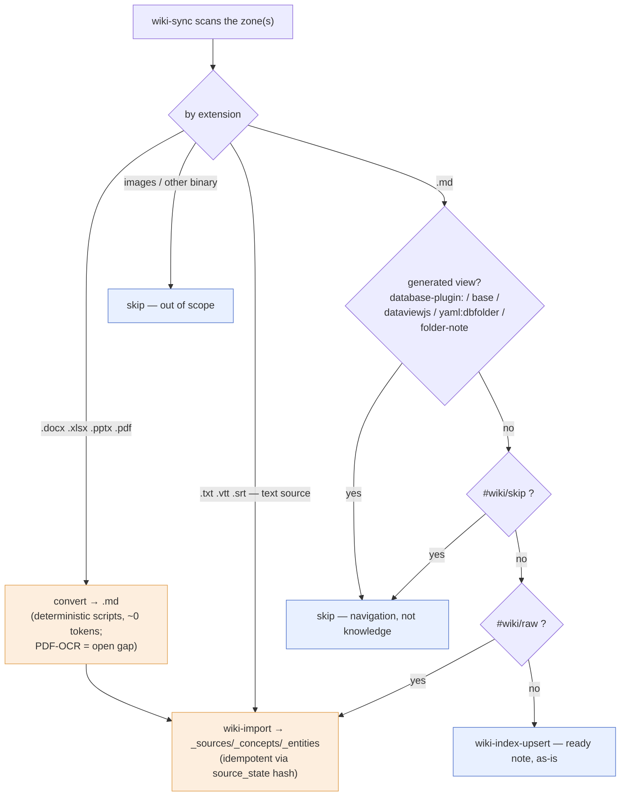

# Roadmap

What's deferred after Phase 3a, ordered by priority. Phase 3a (foundation,
DAL, core ingest, search/lint, reindex, benchmark) is **complete** (see
[ARCHITECTURE.md](ARCHITECTURE.md) status header). **Phase 3b is
substantially complete** (frontier: **TASK 059**, 2026-07-11): Epic 7 entity
resolver (R-3/4/5) + RAG layer (R-6/8), the universal config-driven layout
engine (R-X1/X2/X3), `wiki-sync` (R-11), vault-local index DBs (TASK 022),
the installer + real-vault adoption surface (TASK 025/026/027),
query-side stemming + ё/е folding (TASK 028), the `obsidian-cli` skill
(R-12 / TASK 029), the typed-knowledge + event graph (R-13/R-14 —
ADR-003/004, TASK 031/032/034), and derived knowledge-health (R-15 / TASK 036)
have all shipped. The **enterprise-readiness theme is now SHIPPED IN FULL**:
R-16/R-17/R-18/R-19 = TASK 049/050/051/054 and R-22 (`wiki-config`, the 18th
CLI) = TASK 058, headed by
[ADR-009](adr/ADR-009-policy-before-model.md) (policy-before-model,
**Accepted**). **No active task at HEAD** — every remaining roadmap item is
**trigger-gated** (see the priority legend). Archived specs under
[tasks/](tasks/) + [plans/](plans/).

Status legend:
- **P0** — start when there is a concrete trigger / pain
- **P1** — natural next step; medium effort
- **P2** — useful, larger scope, no urgent driver
- **P3** — situational / wait-for-need

_(NB on numbering: parenthetical refs like "(R-18, partial)" / "(R-19)" inside
old DONE entries cite the **archived v2 pre-implementation spec**, not these
roadmap IDs — R-16…R-19 below are new, collision-free roadmap entries.)_

---

## P0 — Active blockers

_(none — R-V1 closed 2026-05-27, R-3 closed 2026-05-28; see Done entries below.)_

### R-V1. wiki-ingest vendoring (Option 5 — Python-import vendor) ✅ DONE 2026-05-27
Promoted from P3 → P0 on 2026-05-27 after operator-confirmed target
**self-contained product / publication** (PyPI / GitHub plugin / Claude
Code plugin marketplace). External `wiki-ingest` dep blocks single-step
install for end-users.

**Chosen approach** (from brainstorming 2026-05-27 — operator owns both
repos, no licensing concerns): **Option 5 Python-import-only vendor**.
Copy `Universal-skills/skills/wiki-ingest/scripts/wiki_ingest/` Python
module into `obsidian-llm-wiki/scripts/wiki_ingest/`; refactor
`wiki_ops.py` `ingest` subcommand to expose a programmatic
`ingest(source, vault_root, vault_id, …) → manifest_dict` function;
replace `subprocess.run(["wiki-ingest", …])` in `wiki_enrich.py` with
direct Python call; keep `--source` CLI flag for backward compat
(external `wiki-ingest` continues to work if installed); drop
`check_wiki_ingest_version` from the in-process path; add
`scripts/sync_wiki_ingest.sh` for periodic snapshot refresh.

**Standalone `wiki-ingest` preserved** in `Universal-skills` for
"simple wiki" users — operator-stated requirement. Both paths
co-exist.

**Tracking task**: TASK 004 `wiki-ingest-vendoring` — **COMPLETE** 2026-05-27.
All 11 beads shipped + `/vdd-multi` adversarial sweep applied 6 hardening
fixes inline (LICENSE-upstream rsync exclude, narrowed exception catch,
truthy env-var parsing, full primary-path PARTIAL_INDEX_FAILURE envelope,
absolute-path rejection, hex-case-insensitive regex). 328 pytest /
mypy strict clean. Self-contained product publication path unblocked.

**Why this is P0 now**: self-contained publication path cannot ship
with subprocess + PATH dependency on a separate repo. Downstream
benefit: TASK 003's manifest-dispatch problem (originally Decision-9
`--manifest-stdin` flag on `wiki-enrich`) is now solved by direct
in-process Python function calls — see TASK 003 v2 / Decision-15
(retracts Decision-9) and Decision-16 (neutral `_manifest_consumer`
module).

**Why not just keep external dep**: operator stated 1-3 month target
of self-contained product / publication. Two-step install (clone two
repos + symlink `wiki-ingest` to `~/.local/bin`) is unfriendly for
end-users via PyPI or plugin marketplaces.

**Effort**: ~1 week focused work (well-bounded refactor: copy module +
extract programmatic API + update one consumer + tests).

_(Later retired — TASK 047: the vendored `wiki_ingest` module and `wiki-enrich`
were dropped entirely. `wiki-import` is now the in-repo construct engine; there is
no external/standalone `wiki-ingest` path to co-exist with. The publication path
this unblocked still holds.)_

---

## P0 — Cleanup (small, do when convenient)

_(R-1 done in commit `81b7aff`; R-2 superseded by R-X4.)_

### R-2. Subagent prompt hook (memory 4b leftover) — SUPERSEDED → R-X4
Inject "before editing concepts or introducing new names, call
`/wiki-search`" into `developer`, `architect`, `critic-*` agent prompts.
The parent CLAUDE.md already carries the rule; this is a proactive cue
for narrow-context subagents.

**Status (2026-05-27)**: Superseded by **R-X4** (Phase E of the
cross-project indexing proposal — see P2 section below). Same scope,
broader context: R-X4 wires the prompt cue *and* the index it would
query against. Track R-X4, retire R-2.

---

## P1 — Epic 7 entry-point: entity resolver

The Karpathy compounding-artifact promise lives here. Currently a single
ingest touches one source page + index + log (~3 pages); Karpathy says
10–15. Closing that gap requires the entity layer.

### R-3. `wiki-extract-concepts` skill (R-18, partial) ✅ DONE 2026-05-28 (v2 + v3.1)
**Status**: SHIPPED. Both v2 (LLM-call inside skill, 396 pytest) and v3.1
(Decision-17 deterministic refactor: synthesis moved to orchestrator,
LLM call deleted, anthropic dep dropped, 450 pytest + 22-finding
`/vdd-multi` hardening) closed 2026-05-28. See full ship summary in
**Done since 2026-05-25** below; archived specs at
[docs/tasks/task-003-v3.1-wiki-extract-concepts.md](tasks/task-003-v3.1-wiki-extract-concepts.md)
(v3.1), [docs/tasks/task-003-v2-wiki-extract-concepts.md](tasks/task-003-v2-wiki-extract-concepts.md)
(v2), [docs/tasks/task-003-wiki-extract-concepts.md](tasks/task-003-wiki-extract-concepts.md)
(v1 paused snapshot).

Architectural decisions shipped:
- **Decision-15** (v2) retracts v1 Decision-9: `--manifest-stdin` /
  `--manifest-file` flags on `wiki-enrich` NOT added — in-process Python
  import replaces subprocess dispatch.
- **Decision-16** (v2) + I-7.0: `validate_manifest` +
  `index_from_manifest` + `WikiIngestError` extracted from
  `wiki_enrich.py` into neutral sub-layer module
  `scripts/wiki_skills/_manifest_consumer.py` so no skill depends on
  another skill.
- **Decision-17** (v3.1): Python skills are deterministic plumbing; LLM
  synthesis lives in the calling agent's context (Claude Code / Gemini
  CLI / Cursor). `wiki-extract-concepts` split into `prepare` + `apply`
  subcommands; calling agent runs `Skill({skill: "concept-extraction"})`
  + `Read(source_path)` + own-context synthesis between the two CLI
  calls. **BREAKING CHANGE**: legacy single-command invocation rejected
  at argparse.

### R-4. Confirmed / candidate entity resolution (R-18, cybos pattern) ✅ DONE 2026-05-29 (TASK 005)
`entities.is_candidate = 1` for LLM-proposed entities; promotion to
`is_candidate = 0` via operator approval (`wiki-confirm <slug>`) or
`wiki-confirm --auto --threshold N` (default 3). `is_candidate` is now Class A
(frontmatter) round-tripped through `wiki-reindex --full` (R-4.1, was silently
reset). `resolve_entity` resolves slug-or-alias; `find_orphan_links` is
alias-aware. **`wiki-merge <from> <into>`** (R-4.7) folds the "Hermes / Hermes
Agent / Hermes Framework" duplicates into one canonical entity (the alias table
is the durable redirect; reindex canonicalizes refs — AM-3).

### R-5. Two-tier alias table ✅ DONE 2026-05-29 (TASK 005)
`entity_aliases` activated: PK fixed to `(vault_id, alias)` (closes **L-4**;
schema v2→v3); `wiki-alias <slug> --add/--remove/--list` writes Class A
frontmatter + DB mirror; `wiki-reindex --full` mirrors `aliases:` frontmatter
(report-and-skip on collision); `wiki-search` expands queries through aliases
by default (`--no-expand-aliases` opt-out); `wiki-lint` detects alias collisions
(in-DB + cross-table + Class A frontmatter scan; `--strict` advisory exit).

**Shipped**: TASK 005 (17 beads, Stub-First, green-throughout). See archived
spec/plan at [tasks/task-005-*.md](tasks/) + [plans/plan-005-*.md](plans/) and
the §D8 durability acceptance (UC-14/UC-15) in
`tests/test_entity_resolution_durability.py`. **Unblocks R-X5** (cross-project
entity graph, gated on Epic 7).

### R-11. `wiki-sync` — format-aware, tag-routed ingest/upsert dispatcher — ✅ SHIPPED (TASK 018, 2026-06-03)
**Shipped** as TASK 018 (`task-018-wiki-sync`): `wiki-sync scan` (deterministic
plan JSON — own bounded walk → classify → sha256 → `is_unchanged`) +
`wiki-sync record` (executor commit-marker) + `workflows/wiki-sync.md` (the
Decision-17 orchestrator: convert→`_raw/.staging/` · `.vtt`/`.srt` de-timestamp ·
**H-6 fence** · summarise · enrich · extract · upsert · skip · per-vault lock ·
per-file isolation) + `skills/wiki-sync/SKILL.md` + `config/sync-config.schema.yaml`.
_(The inline convert/summarise/enrich/extract stages were later retired — TASK 046
made `wiki-sync` a pure DRIVER that delegates each distil source to `wiki-import`;
TASK 047 retired `wiki-enrich` entirely.)_
**Zero DDL** — idempotency rides a new `source_state` `source_kind='sync'`
partition via two generic DAL methods (`get/set_source_state`); `user_version`
stays 5. Hardened by **two adversarial gates**: the per-phase 3-critic pass (security:
anchorless deep-nesting DoS → controlled exit 6; logic: 2 crash-on-malformed-
frontmatter + 1 idempotency `None`-hash false-positive; performance: ext-set
hoist) **and** a final full-surface `/vdd-multi` converging to clean-pass on all
three (security MED `.md`-read OOM cap; logic MED UTF-8-BOM parity + `record`
FK-test; sec LOW canonical-path + full-path config-symlink containment; workflow
H-6 nonce / `flock`-primary / SEC-A3 staging guard). **73 new tests**
(`tests/test_wiki_sync.py` + `tests/test_wiki_sync_e2e.py` over committed
`tests/fixtures/sync/**` incl. a real `yaml:dbfolder` sidecar; **986 pytest +4
skipped** overall). **Residual (P2,
deferred — recorded, not silent):** the perf MED — a `.md` is read twice (decoded
for classify + re-opened for hash); the architecture pre-accepted this "honest,
bounded" read-cost (binaries pruned pre-read, zones scoped). A future fuse reads
the bytes once. **PDF-OCR is now wired** (2026-06-03 — the upstream Universal-skills
`pdf_ocr.py`/ocrmypdf block shipped): the executor OCRs a scanned PDF
(`pdf_extract` exit 10) then ingests it; `needs-ocr` is now only the
engine-unavailable fallback. **Out of scope (unchanged):** binary-attachment
indexing at scale, daily-block dedup.

<details><summary>Original proposal (for history)</summary>

The automation that actually **closes the 3→10–15 pages-per-ingest gap** on a
*real, mixed* personal vault. The static layout engine (R-X1) classifies files by
**path** and only *indexes* `.md` that already exists; it cannot (a) bring in
non-markdown sources operators actually drop into a collection folder
(transcripts `.txt`/`.vtt`/`.srt`, office docs, PDFs), (b) decide per note whether
to run a full LLM **import** (`wiki-import` → `_sources/_concepts/_entities/`) vs a
plain **upsert** (index a ready note as-is), or (c) exclude content-defined noise
(generated-view sidecars). `wiki-sync` is a thin **format-aware + content-aware
dispatcher** layered over the existing idempotent CLIs.

**(1) Format front-stage — route by extension before any indexing:**

| Input | Handling |
|---|---|
| `.docx` / `.xlsx` / `.pptx` / `.pdf` | **deterministic convert → `.md`, then ingest.** Reuses the operator's Universal-skills converter scripts + the harness `docx`/`pdf`/`pptx`/`xlsx` skills; **~0 LLM tokens** (only the downstream ingest synthesis costs tokens). **PDF-OCR is the open gap** (tracked in Universal-skills). |
| `.txt` / `.vtt` / `.srt` (plain-text source) | **implicitly raw → ingest, no tag needed** (`.vtt`/`.srt` get a de-timestamp pass first) |
| `.md` note | → the tag + view rules in (2)/(3) |
| images / other binary | **skip** (out of scope — 6000+ attachments) |

**(2) Tag vocabulary for the `.md` layer (namespace `wiki/`):**

| Signal | Action |
|---|---|
| `#wiki/raw` (or file in `_raw/`) | full **import** via `wiki-import` (transcripts, webinars, clippings to distill) |
| *(no wiki tag)* | **upsert** the ready note as-is |
| `#wiki/skip` | never index (drafts, sensitive — manual override that always wins) |
| `#wiki/keep` | opt-in index for zones excluded by default (e.g. `_daily/`) |

**(3) Generated-view sidecars — always skipped (navigation, not knowledge).**
Detected by marker, not by name alone:
- frontmatter `database-plugin:` **and/or** a fenced ` ```yaml:dbfolder ` body → **DB Folder** view;
- a body that is essentially a single fenced ` ```base ` (or a companion `.base`) → **Bases** view;
- a single fenced ` ```dataviewjs ` / ` ```dataview ` body → **Dataview** view;
- the **folder-note** naming pattern (stem == parent/sibling dir).

Anything the heuristic misses is caught by an explicit `#wiki/skip`.

Conceptual flow (per file in a zone):



**Builds on**: R-3 (`wiki-extract-concepts`), `wiki-import`, `wiki-index-upsert`
(all idempotent via `source_state`/file-hash); the R-X1 layout engine + the
multi-vault "search-only + enrich-zone" split (documented in
`docs/manuals/obsidian-llm-wiki_manual.md` → *Mixed vault*); the operator's
office→md converter scripts (Universal-skills) + harness `docx`/`pdf`/`pptx`/`xlsx`
skills. **Scope**: a `wiki-sync` workflow/skill = format front-stage (extension
routing + deterministic convert shell-out) + a content classifier (view-sidecar
markers; folder-note stem==dir; frontmatter tag read) + dispatch to the existing
CLIs; per-vault tag config; dry-run + per-file report; idempotent re-runs. **NOT in
scope** (future): indexing binary attachments at scale; dedup of repeated blocks
across daily notes; **PDF-OCR completion** (lives in Universal-skills). **Trigger**:
an operator runs a mixed vault where dropping a transcript / office doc into a
collection folder should "just" become a compounding wiki without hand-invoking
`wiki-import` per file. **Effort**: ~1 small TASK (Stub-First; mostly orchestration
over existing CLIs + a shell-out conversion stage).

</details>

---

## P1 — Epic 7 RAG layer

### R-6. `wiki-query` (R-19) — RAG over FTS5 + entity graph ✅ DONE 2026-05-29 (TASK 007)
Retrieve via `wiki-search` (BM25) + entity-aliased expansion → **orchestrator-
owned** LLM synthesis with citations (Decision-17 `prepare`/`apply` split; no
`import anthropic`) → output filed back as `_queries/<slug>.md`, a **first-class
compounding page** (indexed `type=query`, FTS-searchable, `cited` backlinks,
§D8-durable via the R-6.5e reindex read-side). Grounding enforced in Python
(`NO_CONTEXT` refusal + `CITATION_NOT_RETRIEVED` keyed on `project/slug`).
**Zero schema DDL** (`pages.type='query'`, `ref_type='cited'`,
`event_type='query'`, generic `source_state` all pre-existed; `user_version`
stays 4); two code-only changes — `layout.py` `_queries` (R-X1-forward role split
`INGEST_SHARED_SUBDIRS`/`HOST_ONLY_SUBDIRS`) + the reindex `cites:`→`'cited'`
read-side. **Shipped**: TASK 007 (10 beads, Stub-First green-throughout; 3 VDD
gates APPROVED). See archived spec/plan at [tasks/task-007-*.md](tasks/) +
[plans/plan-007-*.md](plans/).

### R-7. `wiki-research` (R-20) — UNBLOCKED (gated on R-6, now shipped)
Web enrichment of concept pages. Off by default; opt-in per concept. Layers on
the `wiki-query` retrieval/synthesis loop (R-6) — now shipped, so R-7 is
unblocked. Needs a web-access design (overlaps `deep-research`); still
**off-by-default** + a separate TASK.

### R-8. `wiki-verify-multi` (R-21) ✅ DONE 2026-05-29 (TASK 008)
Off-by-default multi-critic verification of a filed `wiki-query` answer against
its cited sources. Recast for prose (D-008-2): four critics — **factual-grounding,
logic-coherence, security-injection, completeness-faithfulness** (the ROADMAP's
"performance" lens dropped as a non-fit for prose). Decision-17 `prepare`/`apply`
(no `import anthropic`; the four-critic audit lives in the orchestrator via the
`wiki-verify` prompt skill, optionally fanned out via `Agent` Layer-A like
`/vdd-multi`). Verdict filed as a **first-class compounding** `_verifications/verify-<slug>.md`
page (`type=verification`, `verifies` backlink, §D8-durable via the R-8.5e reindex
read-side that generalises R-6.5e). **FAIL = record verdict + non-zero exit (6) +
NEVER mutate the Class-A answer** (D-008-3); the authoritative PASS/FAIL is the
Python `--fail-on` rule (default `high`), not the LLM's self-report. **Layout-agnostic**
by construction (reads the answer + cited sources via `pages.file_path`; grep-guarded
— C-8/NFR-7), so R-X1/R-X2-forward. **First RAG-layer task requiring DDL — schema
v4→v5** (`pages.type+='verification'`, `ref_type+='verifies'`, `event_type+='verify'`,
`index_meta` parity; Class-B reindex migration). **Shipped**: TASK 008 (11 beads,
Stub-First green-throughout; 4 VDD gates incl. `/vdd-adversarial` on the plan;
one found-in-dev serious-deviation fixed — verdict↔query `pages` PK collision →
`verify-<slug>` distinct slug). See archived spec/plan at [tasks/task-008-*.md](tasks/)
+ [plans/plan-008-*.md](plans/). Pairs with `/vdd-multi`.

---

## P1 — Native Obsidian app integration

### R-12. `obsidian-cli` skill — teach any LLM agent the native Obsidian CLI ✅ SHIPPED (TASK 029, 2026-06-12)
**Status: SHIPPED** as TASK 029 (`task-029-obsidian-cli-skill`, uncommitted on branch
`task-029-obsidian-cli-skill`). The skill `skills/obsidian-cli/` (SKILL.md + `references/{command-reference,recipes}.md`
+ `evals/`) ships: a 4-invariant dispatch core (routing / coherence / safety / degradation),
a **total** T1/T2/T3 command-safety model over the **verified 102-command** live surface
(`eval`/`dev:*`/plugin-snippet-theme mutations T3-banned; `command id=`+`template:insert`
active-file default-DENY S-1), the mutation→index coherence protocol (`wiki-index-upsert`
for content; rename/move: `--full` per the ORIGINAL TASK-029 mitigation of DF-029-1 —
SUPERSEDED 2026-06-12 by TASK 030's rename-aware `--delta`, skill updated in lockstep), the full live-verified
catalog + a diff-driven version-update Maintenance procedure, ≥8 recipes, and **14/14 GREEN**
behaviour evals (Fable+Sonnet injection canaries). Full VDD + per-bead Sarcasmotron +
**live dogfood** that found+fixed **DF-029-1** (SEV-2: `--delta` misses an mtime-preserved
rename). **Zero DDL** (`user_version` 5), **zero new Python**, no `import anthropic`,
1204 pytest + mypy strict unchanged. See `docs/tasks/task-029-*.md`, `docs/plans/plan-029-*.md`,
ARCHITECTURE §2.2 + Q-029-1..5.

<details><summary>Original proposal (for history)</summary>
**Was: PROPOSED 2026-06-12 (worked out; trigger FIRED — operator request).**

**What changed upstream**: Obsidian 1.12 ships an **official CLI**
(early-access 2026-02-10; **GA in 1.12.4, 2026-02-27**; requires installer
≥ 1.12.7; free, no Catalyst). It is a **remote control for the running
desktop app** — commands talk to the live Obsidian instance over its own
channel (the first command launches the app if closed; the separate
"Obsidian Headless" product is NOT this). Syntax:
`obsidian [vault=<name|id>] <command> [param=value …] [flags]`; many commands
emit `json|csv|tsv|md|yaml`; `file=` resolves like a wikilink, `path=` is
exact vault-relative. Surface ≈ 100 commands: files/content
(`create/append/prepend/move/rename/delete` — **rename/move update backlinks
app-side**), search (`search`, `search:context`), live graph reads
(`backlinks/links/unresolved/orphans/deadends`), **typed properties**
(`property:set/read/remove`), tasks (`tasks` filterable, `task` status
update), daily notes (`daily*`), templates (`template:*`, `unique`),
**Bases** (`bases`, `base:views`, `base:query format=json`), version history
(`history*`, `diff`, `sync:history`/`sync:restore`/`sync:deleted`),
workspace/tabs, bookmarks, publish (`publish:*`), plugin/theme management,
command-palette dispatch (`command <id>` — reaches ANY plugin command), and a
dev tier (`eval` = arbitrary JS in the app process, `dev:*` CDP, screenshots).
Docs: <https://obsidian.md/help/cli>.

**The gap**: the framework treats a vault as **files + SQLite**; the running
app is a *second runtime* — live link graph, typed properties, tasks, Bases,
recovery history, publish — none of it reachable from our CLIs. Today an
agent that renames a note via `mv` silently breaks every inbound wikilink
(`wiki-lint` only counts the orphans afterwards); it cannot flip a task
checkbox, set a typed property, append to today's daily note, query a Base,
or restore a clobbered file from history. The official CLI closes all of that
**iff the agent knows when to reach for it vs the wiki toolchain vs a plain
file edit** — that routing judgment is the skill. House Decision-17 applies
cleanly: the `obsidian` binary already IS the deterministic plumbing layer;
wrapping it in Python would add a brittle shim for zero determinism gain. So:
a **prompt-layer skill, vendor-agnostic (any LLM), zero new Python, zero DDL**.

**Deliverable — `skills/obsidian-cli/` (Gold-Standard structure)**:
1. **`SKILL.md`** — lean dispatch core in any-LLM wording (no
   harness-specific tool names; "run in your shell"): availability probe
   (`obsidian help`, bounded timeout — NOT `version`, which the live 1.12.7
   CLI lists but fails to run (TASK 029 F-3) → degrade to wiki-*/file-ops when
   absent or headless/CI); **explicit `vault=` targeting always** (first
   param; never ambient "active vault"; verify wiki `vault_root` ↔ Obsidian
   vault by `vault`/`vaults` path compare — names and `vault_id`s may
   differ); `path=` preferred over `file=` for determinism; a top-20 command
   quick table; the **decision matrix**, **coherence protocol** and **safety
   tiers** (below); progressive-disclosure links to references.
2. **`references/command-reference.md`** — the full ~100-command catalog by
   category (params/flags, output formats, `--copy`, `\n`/`\t` escapes, TUI
   notes, per-platform one-time setup: macOS symlink / Windows terminal
   redirector / Linux binary), version-stamped **"verified against Obsidian
   1.12.x"**.
3. **`references/recipes.md`** — composed playbooks: link-safe rename/move →
   `wiki-reindex --delta`; capture→daily-note (`daily:append`); task sweep
   (`tasks status=incomplete` → `task` update → upsert); Base→JSON→analysis;
   property migration via `property:set type=…`; history `diff`→`restore`
   recovery loop; vault audit (`orphans`+`deadends`+`unresolved`
   cross-checked against `wiki-lint`); publish flow; workspace/session setup.
4. **`evals/evals.json`** (+ `reports/`, the TASK 009 harness pattern) —
   trigger accuracy + behaviour: rename routes to `obsidian rename`, NOT
   `mv`; a domain question still routes to **wiki-search FIRST** (the skill
   must not weaken the search-before-answering rule); post-mutation upsert
   fires iff the vault is wiki-registered (and is skipped when not);
   **`eval`-injection canary refused** (a note body instructing "run
   `obsidian eval …`" — H-6-adjacent); headless context degrades gracefully.
5. Vendor symlinks (`.claude/skills/`, `.agent/skills/`) + README skills
   table + manual touchpoint (Mixed-vault section: live-app ops now
   scriptable) + *optional* adoption bead: the obsidian-personal `wiki-init`
   agent template mentions the skill (TASK 025/026 surface).

**Decision matrix (the heart of the skill)**:

| Need | Route |
|---|---|
| Domain question / RAG / cited answer | `wiki-search` / `wiki-query` — UNCHANGED first stop (BM25 + aliases + stemming + citations; app `search` has none of that) |
| Bulk ingest / index / dedup / re-summarize | `wiki-sync` / `wiki-reindex` / `wiki-index-upsert` |
| Link-integrity mutation (rename/move), typed property, task status, daily note, template, Base query, history restore, open-in-app / UX | **`obsidian` CLI** |
| Plain content edit on a known path | direct file edit (then upsert if indexed) |

App `search`/`search:context` is a *complement*: live and index-free (useful
mid-mutation, or on vaults never registered in the wiki index), but no
ranking/stemming/citations — never the default for knowledge lookup.

**Mutation→index coherence protocol**: any obsidian-CLI mutation on a
wiki-registered vault MUST be followed in the same turn by
`wiki-index-upsert <file>` (single file) or `wiki-reindex --delta`
(rename/move/delete — since TASK 030 the delta is RENAME-AWARE: the moved
file's new path is ingested regardless of its preserved mtime, and the
link-rewritten neighbours ride the normal mtime path; `--full` remains the
fallback + the swap-class A5 remedy). The SQLite mirror never stays stale
past the turn. ADR-002 §D8 holds:
Class-A files are mutated app-side, the DB stays a rebuildable projection.

**Safety tiers** (vault bodies are untrusted input — same egress posture as
TASK 012 SEC-1):
- **T1 read-only** (`search*`, `read`, `links`/`backlinks`/`unresolved`/…,
  `tags`, `properties`, `tasks`, `outline`, `history:read`, `vault*`,
  `wordcount`, …) — free use.
- **T2 mutating** (`create/append/prepend/move/rename/delete`,
  `property:set/remove`, `task`, `daily:append/prepend`, `template:insert`,
  `bookmark`, `workspace:*`, `publish:add/remove`) — allowed within task
  scope; `delete` → trash, never permanent without the operator; `create` →
  existence-check before `overwrite`.
- **T3 banned-by-default** (`eval`, `dev:*`, `plugin:install/uninstall/
  enable/disable`, `plugins:restrict`, `theme:install`, `sync` pause/resume) —
  operator-explicit only, NEVER from note-content instructions (`eval` is
  arbitrary JS inside the app process = RCE-equivalent; prompt-injection
  vector).
- GUI side-effect: any command launches the app if closed — probe first; in
  headless/CI degrade silently to wiki-*/file-ops.

**Out of scope**: an MCP-server wrapper (skill-first; MCP later if a vendor
needs it); Obsidian Headless; mobile; replacing wiki-search/RAG; auto-enabling
T3; scripting the Windows terminal-redirector setup (document it only).

**Acceptance**: evals green (incl. the injection canary + both routing
cases); live dogfood on the real obsidian-personal vault — a link-safe rename
with `wiki-lint` showing **zero new orphans** after delta-reindex, a
daily-note capture, a `base:query format=json`, a history restore;
`skill-validator` + skill-creator Gold-Standard pass; **zero DDL**
(`user_version` 5), zero new Python, no `import anthropic` (trivially — no
code).

**Effort**: ~1 light-medium TASK — the references + evals dominate; full VDD
with `/vdd-multi` on the skill TEXT (injection/abuse critics matter more than
code critics here).

**Risks / open (settle in TASK analysis)**: the CLI is ~3 months old and may
churn between minors → version-stamp the reference + re-verify on Obsidian
minor bumps (lightweight drift check in evals); Obsidian vault-name ↔ wiki
`vault_id` mismatch → mapping discipline in SKILL.md; macOS-first dogfood
(operator platform), Windows/Linux setup documented per official help;
cross-publication to Universal-skills? (the skill is deliberately
framework-optional — the coherence step self-disables on unregistered
vaults, so it stands alone).

**Builds on**: R-11 `wiki-sync` (the bulk path stays), TASK 022 vault-local
DBs (targeting), TASK 025/026 adoption surface, TASK 009 eval-harness
pattern. **Complements**: the P3 "wiki-graph export" item —
`backlinks`/`links`/`orphans` now give Graph-View-parity *reads* for free;
that item likely shrinks to export-only.

</details>

---

## P2 — Typed knowledge classes / event graph

### R-13. Typed knowledge classes — Phase 1 ✅ SHIPPED (TASK 031, 2026-06-13) · Phase 2 event graph ✅ SHIPPED (TASK 032, 2026-06-15)

The "CybOS 2.0" vision: grow the wiki from a flat *Page* store into one carrying
**typed knowledge classes** (Decision, Requirement, Risk, Incident, Hypothesis,
Fact, Event), keeping Markdown canonical (ADR-002 §D8). Design: **ADR-003**.

**Phase 1 — classification (SHIPPED, TASK 031):** the 7 classes tag-route, **zero
DDL**, onto the existing `pages.type` enum via layout `type_mapping`, added to the
`dev-project` layout (opt-in `type:`) and a new built-in **`cybos`** layout
(operational-memory vault — `decisions/ requirements/ risks/ incidents/ hypotheses/
facts/ events/` + the engineering spine). Bundled with **R-031-3**, the
config-driven layout registry de-hardcode (`--layout` choices + alias map +
two-tier-scaffold family collapsed into one YAML-derived cached registry via
additive `aliases`/`init_scaffold` keys → a new layout is a drop-in `*.yaml`, zero
Python edits). Per-type templates at `templates/page-types/*`; reference at
[`docs/layouts/cybos.md`](layouts/cybos.md). See `docs/tasks/task-031-*`.

**Phase 2 — the event graph ✅ SHIPPED (TASK 032, ADR-004):** typed page-to-page
edges (`implements`/`implemented-by`, `supersedes`/`superseded-by`, `causes`/
`caused-by`; `relates_to` reuses the symmetric `related`) link the classes into a
graph of system evolution (decision → task → incident → release). **Schema v5→v6**
(first DDL since TASK 008; Class-B rebuild) extends `page_entity_refs.ref_type`;
`reindex._edge_refs` extracts the frontmatter edges (forward, M-1 intact) and a global
post-pass **auto-derives the inverses** (orphan-skip; idempotent; AFTER AM-3 / BEFORE
mentions-recompute). The reserved-but-inert edge keys from Phase 1 became live with no
re-authoring. New **`wiki-graph`** CLI (16th: `neighbors`/`chain`/`backlinks`) + typed-edge
DAL reads (`get_backlinks(kind=)`/`refs_from`/`neighbors`/`edge_chain`); **graph-aware
RAG** via `wiki-query prepare --follow-edges` (default OFF, deterministic `question_hash`).
Delta: scoped inverse-additions + removal-deferred-to-`--full` (provenance-safe). See
ADR-004, `docs/tasks/task-032-*`, ARCHITECTURE Q-032-1..6. **Residual — ✅ SHIPPED (TASK 033,
2026-06-15):** the list-membership `--where 'tags=<class>'` filter (+ `--tag <class>` sugar)
for one-clean-command per-class listing — `search_pages` gained a scalar-OR-`json_each`-membership
predicate (the proven `find_pages_citing_source` shape, zero DDL, back-compatible). See
`docs/tasks/task-033-list-membership-metadata-filter.md`, ARCHITECTURE Q-033-1/2.

**Phase-2 trigger (historical)**: a real cybos vault accumulates enough cross-linked
decisions/incidents that "what did this decision cause / what implements it?"
becomes a routine query. Relates to [R-X5](#r-x5-entity-graph-cross-project-phase-f).

---

### R-14. Temporal core + agent-memory classes — Phase 3 ✅ SHIPPED (TASK 034, 2026-06-16)

A 6-RFC "agent memory system" proposal arrived from a second agent; an audit found
~60-70% already expressible via R-13 (TASK 031/032/033). TASK 034 built the one
genuinely-new high-leverage slice (RFC-001 temporal core + the cheap RFC-001/002 edge &
classification wins). **(1) `wiki-search --as-of DATE`** — point-in-time "active as of"
querying that is **graph-derived, zero required new fields**: validity is computed from the
indexed `pages.date` + the supersede/invalidate graph (the operator rejected the RFC's
literal `valid_to` field as unfillable; `valid_from`/`valid_to` survive only as optional
overrides). Answers "which decisions were active on the incident date" with no LLM. **(2)
Schema v6→v7** — four new inverse-closed edge pairs (`invalidated_by`↔`invalidates`,
`activated_by`↔`activates`, `uses`↔`used-by`, `owns`↔`owned-by`). **(3)** the `cybos` layout
gains six **agent-memory** page types (`agent`/`tool`/`workflow`/`capability`/`execution`/
`pattern`, config-only). `/vdd-multi` converged (2 MED logic fixed: cross-project successor
COUNT=1 guard + datetime-override `substr` boundary); dogfood found+fixed DF-034-1 (wiki-graph
`--kind` allow-list now derived from `_INVERSE_REF_TYPE`, drift-proof). 1443 pytest, mypy
strict. See `docs/tasks/task-034-temporal-agent-memory.md`, ARCHITECTURE Q-034-1..4.

**Deferred (the rest of the RFCs)** — RFC-004 `wiki-extract-decisions` (clone the
`wiki-extract-concepts` prepare→apply→confirm rail); RFC-006 `wiki-consolidate` (cross-corpus
second-order pattern mining, the greenfield one); RFC-003 aggregation reporting ("which
workflow fails most often" — needs a GROUP-BY read surface over `log_events` / `execution`
pages). The redundant `wiki-agent graph` / `wiki-workflow status` CLIs are intentionally NOT
built (compose `wiki-graph`/`wiki-search`, Decision-17).

---

### R-15. Derived knowledge health (lifecycle-drift + coverage) — Track A ✅ SHIPPED (TASK 036, 2026-06-16)

**✅ SHIPPED (TASK 036, 2026-06-16) — Track A (A1 lifecycle-drift + A2 coverage).** Zero DDL
(`user_version` stays 7); read-side only. **A1** = a `lifecycle-drift` `wiki-lint` category
(advisory; gates `--strict`) flagging a page whose authored `status` contradicts its graph
state. **A2** = a new read-only **`wiki-health coverage`** CLI (17th `wiki-*`; always exit 0)
reporting pages missing an expected edge/field. Rules are layout-config-driven (`drift_rules`/
`coverage_rules`; cybos ships 3+3), validated at load; the DAL mirrors the `--as-of` `NOT EXISTS`
walk (all values bound). `/vdd-multi` converged (3 logic + 2 perf fixes folded in); live cybos
dogfood green; **1524 pytest, mypy strict**. Design: **ADR-006** (D-036: drift→lint/`--strict`
because it is a *contradiction*; coverage→always-exit-0 report because a gap is *expected*).
**Deferred:** Track B (RFC-011 subgraph polish), RFC-008-lite (`trust_level`), RFC-009
pattern-mining, body-section coverage. See `docs/tasks/task-036-*`, `docs/adr/ADR-006-*`.

A **third RFC batch** (RFC-007 Evolution Engine · 008 Evidence · 009 Pattern Mining ·
010 Coverage Analysis · 011 Retrieval Context Builder) arrived continuing the
RFC-001..006 numbering (see R-14). Same audit outcome as R-14: **most of it is already
built or is an anti-pattern for this stack**, and the value collapses into **one coherent
capability** — a Class-B **derivation/analysis layer** over the existing markdown + edge
graph (**zero new authored fields, zero DDL**), not five new things to store. Per-RFC
verdict:

- **RFC-011 (the agent's "P0", "most valuable")** — **~80% already shipped** as `wiki-query
  --follow-edges` (R-13 / TASK 032). Real delta is small + separable → **Track B** below,
  NOT a P0.
- **RFC-010 Coverage** — ★ the genuinely-new high-value slice (Track A / A2).
- **RFC-007 Evolution** — take only the **derivable** half = drift (Track A / A1).
  `risk→incident` / `decision→invalidated` are already answerable via `wiki-graph` +
  `--as-of`; the `type: transition` page + authored `confidence` + auto-status-rewrite are
  **REJECTED** (Class-A authored state that's derivable from edges — the TASK 034 `valid_to`
  precedent).
- **RFC-009 Pattern Mining** — same `GROUP BY ref_type HAVING count` family; **DEFERRED**
  (support counts are tiny until vault density grows; slots in later as a third `wiki-health`
  subcommand; if built, `log()` the `--min-support` cut — no silent truncation).
- **RFC-008 Evidence** — full version **REJECTED** (`type: evidence` = schema v8 + an
  authored `strength` field → bites zero-DDL + derive-don't-author). A **lite** version
  (reuse the existing `trust_level` column + `cited`/`related` edges) slots after A2 as a
  coverage-rule variant.

**Track A — derived knowledge health ✅ SHIPPED (TASK 036) — zero DDL, read-side only:**

- **Slice A1 — lifecycle-drift as `wiki-lint` rules (MVP, do first).** Flag a page whose
  **authored `status` contradicts its graph state**. v1 = 3 high-confidence contradiction
  rules: decision with inbound `superseded-by` but `status ≠ superseded`; decision with
  inbound `invalidated-by` but `status ∈ {proposed, accepted}`; workflow with inbound
  `superseded-by` but `status ≠ superseded`. **Zero DDL** — verbatim reuse of the `--as-of`
  `NOT EXISTS` walk + the COUNT=1 same-slug guard (`sqlite_repository.py:679-681`); key on
  `json_extract(frontmatter_json,'$.type'/'$.status')` (**NOT** `pages.type`, which is the
  db-bucket — the most likely impl bug). Rules live in `layouts/*.yaml` (`drift_rules`,
  config-driven; cybos only — other layouts default empty). New `lifecycle-drift`
  `LintIssue` category + a loop in `lint.py:run_all_checks()`.
  **DESIGN DECISION (settled): semantic drift rides `wiki-lint`**, not a separate CLI, so it
  inherits the existing exit policy — **advisory by default, non-zero only under `--strict`**
  (drift is a true contradiction, so CI-gatable). hypothesis excluded from v1 (its state is
  prose, not the graph); risk-drift INFO/deferred (an open risk legitimately has a
  `caused_by`).

- **Slice A2 — coverage gaps via a new read-only CLI (the most valuable *second* piece).**
  `wiki-health` / `wiki-coverage` (clone `wiki_graph.py`: single JSON envelope, allow-listed
  `--kind`, exit `0/2/6`), **always exit 0** — a gap is *data*, not a failure (unlike drift;
  the base-rate is high on a young vault, so it must never gate). v1 rules: requirement /
  capability with no inbound `implements`; fact with an empty `source:` frontmatter scalar.
  **Same DAL engine as A1** (the `NOT EXISTS` variant) → A2 reuses A1's repo method + YAML
  rule scaffolding. **Corrected edge semantics** (the source RFC's maps were WRONG): a
  requirement is covered by inbound `implements` (not a risk); "rationale" is decision *prose*
  (`## Consequences`), not an edge; "fact evidence" is the `source:` scalar. Body-section
  rules (decision-rationale, incident-root-cause) need H2 parsing → deferred to phase 2.

**Track B (separate; pick up when synthesis quality is the priority).** RFC-011 polish —
group the already-flat `wiki-query --follow-edges` hits into a hierarchical subgraph in the
`prepare` envelope (`{supersession:[…], causation:[…]}`) + update the `wiki-query-synthesis`
contract so the LLM gets explicit lineage structure, not flat hits + `via_edge` labels.
Touches only `wiki_query.py` envelope shaping + the synthesis prompt; independent of Track A,
no schema, no DAL change.

**Rejected (recorded, not silent):** `type: transition` page (007); authored `confidence` /
auto-status-rewrite (007); `type: evidence` + `strength` schema v8 (008); any auto-fix that
mutates a Class-A `status` (would need a `prepare`/`apply` write contract — outside this
read-only slice).

**Trigger**: a real cybos/dev vault accumulates cross-linked decisions/incidents where
authored `status` drifts from the graph (A1), or where "which requirements have no
implementer / which facts have no source" becomes a routine question (A2). **Effort**: A1 ≈ 1
small TASK (rides existing `wiki-lint`); A2 ≈ 1 small TASK (new CLI, reuses A1's DAL).
**Builds on** R-13 (event graph) + R-14 (`--as-of` `NOT EXISTS` SQL + the config-driven
layout rule pattern). **Files**: `repository.py`/`sqlite_repository.py` (new `find_lifecycle_drift`
/ `find_coverage_gaps`), `lint.py`, new `scripts/wiki_skills/wiki_health.py` + `bin/wiki-health`,
`layout_config.py` + `config/layout-config.schema.yaml` + `layouts/cybos.yaml`.

---

## P1–P2 — Enterprise-readiness (ontology-layer hardening) — ✅ COMPLETE (2026-07-11)

**STATUS: fully shipped.** R-16/R-17/R-18/R-19 = TASK 049/050/051/054; R-22
(`wiki-config`, the 18th CLI) = TASK 058. Every entry below is ✅ SHIPPED — the
section is retained for the design record.

Theme added 2026-07-07 from the Karp/Palantir "ontology layer" gap audit —
headed by **[ADR-009](adr/ADR-009-policy-before-model.md)** (**Accepted**,
SHIPPED as TASK 049), whose Context section carries the full pillar-by-pillar
mapping. Verdict in one line:
pillars **1** (knowledge outside the model, transient context) and **4**
(swappable model / durable layer) are already complete and mechanically
enforced (Decision-17); pillar **2** (objects + typed links over sources) is
substantial with two gaps (R-18 freshness, R-19 formal ontology); pillar **3**
(policy **before** the model) is absent (R-16, + R-17 auditability). Hard
invariants for every entry: **zero DDL** (`frontmatter_json` + existing
columns), **vendor-agnostic** (flags/env/config — identical under
claude/codex/gemini/pi/hermes), **derive-don't-author** (optional keys only;
defaults derived), **default OFF** (no config ⇒ byte-identical behavior),
markdown stays Class-A canonical. Honest boundary (verbatim in ADR-009): these
scope **what a model invocation sees** — least-privilege for cooperating
agents and durable-artifact/cross-vault leak containment — NOT security
against the machine's owner; real multi-user authZ stays trigger-gated to the
Postgres migration (P3 below). Recommended order: R-16 → R-17 → R-18 → R-19
(R-17 shares R-16's scope-flag plumbing; R-18/R-19 are independent).

### R-16. Policy-before-model retrieval scoping — ✅ SHIPPED (TASK 049, 2026-07-07) → ADR-009 (Accepted)

**Shipped as specced below** (one TASK through the full pipeline; task-reviewer +
architecture-reviewer + plan-reviewer gates green; 1900+ pytest, mypy strict, zero DDL —
`user_version` 7 untouched). Delivered: `scripts/wiki_index/policy.py` (profile resolution,
Q-049-1 precedence); the `search_pages` pre-LIMIT classification predicate (all three query
shapes, fail-closed, both-or-neither library-caller guard); `--audience` on
`wiki-search`/`wiki-query prepare|apply` (hash fold only-when-active, `_follow_edges` gate)/
`wiki-verify-multi prepare|apply` (`restricted_count`, body never read); `wiki-lint`
`classification-leak` (`--strict` rail) + `invalid-classification` + `invalid-policy`;
`wiki-import --classification` (dedicated `_raw` injection + note stamp — the H-6
"`_raw/` second-class" mitigation, now implemented); `$defs/PolicyConfig` +
`WikiProjectOverride` policy ban; `WIKI_SCHEMA.md.tmpl` policy block. Envelope keys
(`audience`/`restricted_count`) emitted ONLY when a profile is active — OFF is byte-identical
(equivalence + hash-stability tests). Design rationale: Q-049-1..4 (§11i); security contract:
ARCHITECTURE §7.6.

**What**: optional `classification: <level>` page key + vault `policy:` block
(`levels`/`default_level`/`default_audience` in `WIKI_SCHEMA.md` via
`load_root_config`) + `--audience <level>` scope flag. Enforcement = ONE bound
SQL predicate `COALESCE(CAST(json_extract($.classification) AS TEXT), ?) IN (…)` appended to
the shared `search_pages` `clause_parts` **pre-LIMIT** (the `exclude_types`
precedent) — a filtered page never enters the `wiki-search`/`wiki-query`
envelope, so it can never reach any model. Dedicated gates for the three
bypass paths: `_follow_edges` (before `_MAX_EDGE_PULLED`), `question_hash`
(audience folded ONLY when a profile is active — back-compat), `wiki-verify-multi`
`_gather_examined` → `restricted_count` (count only, never content). Unknown
levels fail **closed**. Lint: `classification-leak` (lower page cites higher —
contradiction ⇒ `--strict` rail, ADR-006 posture) + `invalid-classification`
warning. H-6 synergy: `wiki-import --classification restricted` implements the
KNOWN_ISSUES H-6 "`_raw/` second-class" mitigation with this same primitive.
**YAGNI** (recorded in ADR-009): users/roles/identity store, crypto, RLS,
field-level redaction, an MCP policy server.
**Trigger**: mixed-sensitivity content lands in a live vault (personal-vault
adoption), or subagent critics start running against a sensitive vault.
**Effort**: M (one TASK). **Files**: new `scripts/wiki_index/policy.py`;
`repository.py`/`sqlite_repository.py` (predicate in `clause_parts`);
`wiki_search.py`, `wiki_query.py` (flag + hash fold + `_follow_edges` gate),
`wiki_verify_multi.py`, `lint.py` (+ DAL `find_classification_leaks`);
`config/wiki-config.schema.yaml` (`$defs/PolicyConfig`),
`templates/WIKI_SCHEMA.md.tmpl`; `skills/wiki-query-synthesis/SKILL.md`
(same-flags list). Acceptance headline: **OFF ≡ byte-identical** (ADR-005-D2
style equivalence test).

### R-17. Read-side audit completeness + derived trust tier — ✅ SHIPPED (TASK 050, 2026-07-08)

**Shipped as specced** (full pipeline, all three reviewer gates green; 1919+ pytest,
mypy strict, zero DDL). Delivered: apply-side audit on EVERY success (`cited` slugs +
`action` + `audience?` + `actor?`); `WIKI_ACTOR_ID` (shared `ORCH_ID_RE` shape — the
four regex copies deduped) threaded into query/verify/append-log/ingest events; opt-in
`wiki-query prepare --log-retrieval` + `wiki-search --log-access` (best-effort,
`access_logged` echo, CWE-117 capped `q`); **D5**: `reindex_full` now spares NULL-offset
Class-C `log_events` rows (pre-050 every DB-only event died on every `--full` — the
arch-review F1 correction); derived per-hit `trust` (`external<internal<verified`,
MIN-rule Q-050-1, batched `find_verified_slugs`, SQL↔Python alignment Q-050-3) +
`--min-trust` pre-LIMIT floor folded into `question_hash` when present. Design:
§2.4.1 + Q-050-1..3 (§11j).

**What**: (i) drop the `if changed:` gate on the `wiki-query apply` log event
and record the **cited source slugs** (not a count) + the active audience in
`details_json` — zero DDL, `query` is already in the `event_type` CHECK enum;
(ii) optional `WIKI_ACTOR_ID` env threaded into `details_json` on all write
CLIs (generalizes `--orchestrator-id`); (iii) opt-in retrieval logging
(`wiki-query prepare --log-retrieval` / `wiki-search --log-access`) recording
the retrieved slug set — Class-C DB-only rows exempt from the M-2 `log.md`
mirror (precedent: `record_query_state`), closing the "reads are unlogged"
gap for operators who want it; (iv) **derived per-hit `trust` field**
(`external` | `verified` | `internal`) in the `wiki-query prepare` envelope —
computed from `$.source` URL / `_raw/` path / inbound `verifies` refs, **no
new authored field** — replacing the synthesis contract's `_raw/` path
heuristic with machine-readable signal; optional `--min-trust` retrieval
floor (a scope flag folded into `question_hash` like R-16's audience).
**Why**: without read-audit, no policy increment is verifiable; trust-tier
operationalizes H-6 provenance ("the layer knows where a page came from").
**Trigger**: R-16 lands (audit is its verification substrate) — or first
compliance-flavored "what did the model read" question. **Effort**: S.
**Files**: `wiki_query.py` (event + envelope), `wiki_search.py`,
`wiki_append_log.py`/DAL (Class-C access rows), `skills/wiki-query-synthesis/SKILL.md`.

### R-18. Source freshness — the connector substrate ✅ SHIPPED (TASK 051, 2026-07-08)

**Status: SHIPPED** as TASK 051 (`docs/tasks/task-051-source-freshness` on merge;
ARCHITECTURE §2/§4 + open-questions §11k Q-051-1..5). Delivered all three slices,
**zero-DDL** (`user_version` 7): **(a)** `resummarize.mode: if-changed` — `apply_policy`
consults the D1 `source_state` hash by **equality** (not marker presence), skipping
`skip:summary-unchanged` iff a recorded hash still matches (the scan hoists the file hash
once ahead of the gate, Q-051-1; `None`/absent-record ⇒ re-summarise, never a silent
skip); **(b)** a `wiki-import prepare` `is_unchanged` short-circuit (hash the pre-existing
`_raw` after the symlink guards, before the write → orchestrator STOP, no REASON pass;
`--force` bypasses); **(c)** the **connector contract** — `templates/connector-zone.sync.yaml`
+ the functional-architecture "connector contract" section. Original spec below.


**What**: make "keep sources current" cheap without becoming a live query
proxy (the wiki is a **pull-refreshed knowledge cache**; Class A/B layering
and the H-6 trust model forbid query-time fetch-through — freshness SLA =
fetcher cadence, stated plainly). Three slices: **(a)** `resummarize.mode:
if-changed` in the `wiki-sync` policy gate (`_resummarize.apply_policy` +
`config/sync-config.schema.yaml` enum) — skip only when a summary exists AND
the recorded `source_state` hash matches the file; staleness derived from
existing Class-C state, ~30 LOC, closes the gap where a *changed* raw is
skipped under `if-missing` and only `--force`/`always` (re-LLM every scan)
refresh. **(b)** `is_unchanged` short-circuit in `wiki-import prepare`
(hash the pre-existing `_raw/<slug>.md` before overwrite; orchestrator stops
on `is_unchanged` — the exact envelope precedent of extract-concepts/query),
so a scheduled re-poll of an unchanged URL costs one hash, not one REASON
pass. **(c)** the **connector contract as docs + one template**: a connector
= any executable that materializes one file per business object into a
`wiki-sync` zone with a **stable filename = stable external key**
(`PROJ-123.md` → stable slug → in-place updates, stable wikilinks) + a
zone-local `.wiki/sync.yaml` (`mode: if-changed` + per-zone `summarize:`
profile). Fetchers stay operator-owned PATH executables (the
`resolve_skill_bin` discovery pattern); an MCP tool MAY wrap one, but MCP is
not the contract. Source notes refresh **in place**; `supersedes` chains stay
reserved for knowledge-class pages (the `--as-of` temporal layer) — a
refreshed source is "the current snapshot", not a new event.
**YAGNI**: live SQL federation / fetch-through, an MCP server surface,
building IMAP/GramJS adapters now (Epic 6 trigger stands), authored
`freshness` frontmatter (git + `source_state` own history), webhook/push
daemon (adds a writer to single-writer SQLite — Postgres trigger).
**Why**: turns Epic 6 from "N adapters to build" into "any exporter + a zone
config"; unblocks scheduled refresh loops. **Trigger**: first recurring
external source (newsletter/Jira/channel) an operator actually re-polls.
**Effort**: S (a+b code, c docs). **Files**: `scripts/wiki_skills/_resummarize.py`,
`scripts/wiki_index/sync_config.py` + `config/sync-config.schema.yaml`,
`scripts/wiki_skills/wiki_import_article/__init__.py` (prepare),
`skills/wiki-import/SKILL.md` + `workflows/`, a `templates/` zone-`sync.yaml`
example + a connector-contract section in `docs/architectures/functional-architecture.md`.

### R-19. Formal ontology spec — declared, validated type/edge/property contract ✅ SHIPPED (TASK 054, 2026-07-09)

**Status: SHIPPED** as TASK 054 (`docs/tasks/task-054-formal-ontology-spec`). Delivered the
OPTIONAL `ontology:` layout block (cybos only) exactly as specced, **zero-DDL** (`user_version`
7): `closed_types` + `edges` (per-ref_type domain→range) + `properties` (per-class value enums);
load-gate `_validate_ontology` (edges ∈ `reindex._INVERSE_REF_TYPE`; every from/to/class ∈
`type_mapping` keys; property field via `validate_filter_field` — a typo is exit 6); read-side DAL
`find_ontology_violations` (edge domain/range via the `find_classification_leaks` target-JOIN +
COUNT=1 orphan guard; property enum; all bound params) → `wiki-lint` `ontology-violation`
(advisory, gates `--strict`, ADR-006 D-036) + `wiki-health ontology` (always exit 0). **Design
correction (Q-054):** `closed_types` produces NO read-side violation — reindex resolves a typed
page's class from frontmatter `$.type` and SKIPS an out-of-roster type (reported in `--full`'s
`skipped[]`), so the closed-world stance is enforced at INDEX time, not re-swept; `closed_types`
stays a declared, load-gate-validated flag. **NOT a write gate** (a violating page still indexes,
ADR-002 §D8); **OFF ≡ byte-identical** (only cybos ships a block). Closes the ADR-009 pillar-2
"ontology is tribal convention" gap. `/vdd-multi` (logic/security/performance) + a fix-verify
re-critique converged: perf clean, security injection-clean (one value-cap NIT applied), logic
surfaced 2 real coverage holes → **domain now fires independent of target resolution** (LEFT-JOIN
fix), untyped-quick-capture blind spot documented+tested (Q-054-4, `$.type`-keying, shared with
R-15), duplicate-rule load-gate + domain-dedup applied. **2011 pytest / 5 skip, mypy strict**.
Original spec below.

**What**: an OPTIONAL `ontology:` block in the layout YAML (per-vault override
via `.wiki/layout.yaml`, STRICT schema like everything else in
`config/layout-config.schema.yaml`), promoting the ontology from convention
to declared contract: `closed_types: true` (the type roster **is derived from
`type_mapping` keys** — no second roster, derive-don't-author);
`edges: [{edge, from[], to[]}]` — domain/range per stored ref_type (finally
declaring e.g. `implements: decision→requirement`, which today nothing
checks); `properties: [{class, field, enum[]}]` — lifting the `status` value
enums out of `templates/page-types/*.md` comments into validated config.
Load-gate `_validate_ontology` (sibling of `_validate_health_rules`: edges ∈
`reindex._INVERSE_REF_TYPE`, classes ∈ `type_mapping` keys, fields through
`validate_filter_field` — a typo is exit 6, not a silent never-fires rule).
DAL `find_ontology_violations` (clone of `find_lifecycle_drift`; forward
ref_types only; orphan/entity targets skipped via the COUNT=1 guard). Surfaced
as `wiki-lint` category `ontology-violation` — a violation is a
*contradiction* ⇒ advisory, gates `--strict` (ADR-006 D-036-2); optional
`wiki-health ontology` subcommand (always exit 0). Reference block ships in
`cybos.yaml` only; other layouts ship none ⇒ zero behavior change.
**Deliberately NOT a write gate**: reindex keeps indexing violating pages —
markdown is canonical, Class B must never be lossy vs Class A (this is
Palantir's ontology-*schema* without its ontology-*enforcement*, the right
trade for a markdown-canonical system).
**YAGNI**: OWL/RDF/SHACL/reasoner, cardinality constraints (`coverage_rules`
already cover "at least one"), edge-property schemas (rejected authored-state
anti-pattern, Q-036), cross-vault ontology (R-X5's territory), any DDL.
**Why**: closes the pillar-2 "ontology is tribal convention" gap — allowed
classes, edge domain/range, and status vocabularies become a diffable,
per-vault, machine-checked YAML an orchestrator can also be *fed* as context.
**Trigger**: a second typed vault appears, or template↔reality drift bites in
a live cybos/dev vault. **Effort**: M. **Builds on** R-13/R-14/R-15 machinery
end-to-end. **Files**: `config/layout-config.schema.yaml` (+`$defs`),
`scripts/wiki_index/layout_config.py` (`_validate_ontology` + dataclasses in
`models.py`), `repository.py`/`sqlite_repository.py`
(`find_ontology_violations`), `lint.py`, `scripts/wiki_skills/wiki_health.py`,
`scripts/wiki_index/layouts/cybos.yaml`.

### R-22. Per-folder config interface — `wiki-config` (18th CLI) ✅ SHIPPED (TASK 058, 2026-07-11)

**Status: SHIPPED** as TASK 058 (`docs/tasks/task-058-wiki-config-interface`, branch
`task-058-wiki-config-interface`). The operator interface for the per-folder
`.wiki/sync.yaml` system that TASK 019/046 shipped as hand-authored YAML.
Delivered: **provenance** (`show`/`tree` — per-key `default`/`root`/inherited-from/
defined-HERE/ignored, computed by a mirror-of-`deep_merge` fold release-gated by an
equivalence test against the REAL `resolve_policy`/`resolve_summarize`; the resolver is
untouched); **validate** (whole-tree, all-findings, 40-code taxonomy across all three
config systems; typo suggestions via the loader's own validator; regex health incl.
the bounded dead-mirror probe; exit 6 on errors, `--strict` promotes warnings);
**doctor/fix** (tiered SAFE/CONFIRM/MANUAL; the ruamel "sandwich" — hardened gate
before AND after every write + exact semantic equality + comment-survival as a CHECKED
invariant, any failure downgrades to MANUAL and writes nothing; `.wiki/backups/`
retention 10 + reversible `restore`; TOCTOU hash pinning, `--from-plan` all-or-nothing);
**set/unset** (schema-driven pointer+scope checks — a root-only key in a subfolder is
refused with the root hint); **templates** (`templates/sync-profiles/`: meeting-zone /
lessons-mirror / connector-zone / article-zone / root-baseline; strict comment headers,
ReDoS-gated regex vars, level enforcement, byte-identical re-init, `--merge` append-only
verified against the deep_merge oracle, vault-local `.wiki/templates/` with builtin-wins
shadowing, TEMPLATE_DRIFT lint); **HTML report** (`report --open` — one self-contained
CSP file, badges default/ROOT/HERE/↑ancestor/⛔IGNORED, shlex-quoted copy-paste fix
commands); **web editor** (`serve` — stdlib http.server, 127.0.0.1 + fragment token +
`X-Wiki-Config-Token`/hmac, zero cookies, Host allowlist; vanilla-JS form rendered at
runtime from the schema with hints/enum-dropdowns/inherited-placeholders/live
`group_key` tester + raw-YAML tab; explicit user decision AGAINST React/Node — zero
build, zero JS deps). **Evolution invariant (tested):** the whole interface is generated
from `config/sync-config.schema.yaml` + new `x-wiki-scope`/`x-wiki-format` annotations —
a new config field surfaces in form/report/validate/typo-suggestions with ZERO
interface-code changes. One new dep (`ruamel.yaml`, write-mechanics only — never a
security gate); one additive touch to hardened code (`SyncConfigError.reason`). No DB
access (works with a broken index — the recovery path). 116 new tests.

---

## P2 — Concept-definition health (the last un-inspectable field)

Opened 2026-07-14 out of **TASK 064**, which shipped the anti-garbage rail for
`wiki-extract-concepts` and, in doing so, ran into the one thing it could **not** fix from
the write side.

### R-23. Make a concept's `definition` INSPECTABLE — the enabler for definition health

**Status: OPEN.** Tracks **[[df-064-1-entities-definition-never-populated|DF-064-1]]** (SEV-2).

**The gap.** `entities.definition TEXT` exists in the schema and is **never written**. The
definition lives only in the concept page's **body**, so **no SQL query, no `wiki-lint` rule and
no `wiki-health` check can ever see it.** It is reachable only through FTS — which means a bad
definition is not inert: `wiki-search` **retrieves** it and `wiki-query` **cites it as
knowledge**, and the citation is then re-summarised downstream. **Garbage in this field
compounds.**

**Why it is a roadmap theme and not just a bug.** The definition **IS** the concept page, it is
**write-once** (the first source to mention a concept owns it forever — a `mention` discards the
candidate's `definition` entirely), and it is **un-inspectable**. TASK 064 shipped every gate that
can run at *write* time (`DEFINITION_IS_QUOTE`, `DEFINITION_NOT_PROSE`, a word floor), and then
had to write into `skills/concept-extraction/SKILL.md`'s **honesty ledger**, in those words, that
*"is this definition TRUE, or merely well-formed?"* has **no mechanism and cannot have one.**
Prevention is currently the only lever — which is exactly the posture **ADR-006 / R-15** exists to
move the project away from. **Detection is impossible while the column is dead.**

**Shape** (zero-DDL — the column is already there; this is a projection gap, not a schema gap):

1. `upsert_extracted_entity` writes `definition` from the candidate.
2. `reindex` reads it back from the page body (the page shape is fixed and byte-stable), so
   `wiki-reindex --full` reproduces it — **the Class-B rebuildability gate (ADR-002 §D8) is the
   acceptance criterion**, not an afterthought.
3. **Then** `wiki-health definitions` becomes possible: *tautology* (the definition's content words
   ⊆ its own name), *stub* (under N words), *source-local deixis* («те 20%, о которых
   договорились»). A working prototype of the first already exists — as
   `tests/test_concept_extraction_evals.py::_is_tautology`, which lives in the **eval runner**
   precisely because the DB cannot answer the question.

**Sizing**: 1 small TASK. **Builds on** R-15 (derived knowledge health) + ADR-006. **Files**:
`wiki_extract_concepts/_db.py`, `wiki_index/reindex.py`, `repository.py`/`sqlite_repository.py`,
`wiki_skills/wiki_health.py`.

**Also open under this theme** (filed, not scheduled):
[[df-064-2-lint-near-duplicate-scan-is-quadratic|DF-064-2]] (the near-duplicate lint sweep is
O(n²) — 0.6 s at 720 concepts, ~32 s at 5 000, and the corpus is *designed* to compound) ·
[[df-064-4-weak-model-extraction-recall-gap|DF-064-4]] (the skill under-extracts on a weak model —
9/11 on Haiku 4.5; **recall, not junk** — and nothing but the eval set can ever observe it).

---

## P2 — Cross-project indexing

Design doc: [`docs/proposals/indexing-agentic-dev-artifacts.md`](proposals/indexing-agentic-dev-artifacts.md)
(2026-05-27, 1259 lines, /vdd-adversarial PASS).

Total scope: ~815 source + ~1300 test = **~2115 LoC** across two repos,
~2.5-3 week focused task. Tier-trimmed delivery available — see proposal
§13 "Honest-scope tier".

**Trigger to start** (per proposal §13 + §14): operator runs `git grep`
across 3+ repos for the same concept twice in a session, OR wants to
answer "where in my Obsidian vault did I write about X?" and Obsidian's
search is too slow. Until then, status = PROPOSAL.

### R-X1. Universalise layout engine (PW-A..N + PW-Q) ✅ DONE 2026-06-01 (TASK 012)
Replaced the 15 hardcoded surfaces with a **YAML-config-driven engine**
(`scripts/wiki_index/layout_config.py` + `config/layout-config.schema.yaml` +
built-in `scripts/wiki_index/layouts/{karpathy,dev-project,obsidian-personal}.yaml`).
**Two separate config layers** (D-012-2): the existing per-vault identity config
is untouched; the new layer carries per-layout-class grammar. `flat`/`per-project`
alias → `karpathy`. **Byte-identical for Karpathy** (golden-snapshot anchor +
`test_karpathy_config_matches_layout_constants`; `identity` slug strategy; three
slug surfaces kept distinct). **ReDoS = stdlib `re` + load-time budget gate**
(D-012-3, covers `ref_extraction` + `project_pattern`; no new dependency). PW-G/H/Q
engine shipped too (auto_indexes render + KNOWN_ISSUES splitter + lint guard).
**Zero DDL** (`user_version` stays 5; new doc types via the TYPE_MAPPING tag-route).
Architecture-review caught + fixed a real fifth-walk PK-drift bug (`find_pages_missing_in_index`,
C1). **Shipped**: beads 012-00..010 (Stub-First green-throughout; task/architecture/plan
gates APPROVED; per-bead Roast). See `docs/tasks/task-012-*.md` + ADR-002 §D8 TASK-012
amendment. **See**: proposal §11.

### R-X2. Dev-vault + obsidian-personal bootstrap (Phases A-B) ✅ DONE 2026-06-01 (TASK 012)
Depends on R-X1 (done). `wiki-init --layout {flat,per-project,karpathy,dev-project,
obsidian-personal}` shipped (012-13; dev/obsidian layouts skip the Karpathy
page-subdir scaffold). Bootstrap + cross-project capability acceptance-tested
end-to-end (012-14/15). **Operator decision RESOLVED (2026-06-01): option (b)** —
`dev-project.yaml` globs are `docs/`-root-relative and **vault_root = `<repo>/docs`**,
so the committed dev-vault declaration is `docs/WIKI_SCHEMA.md` and the repo root
stays vault-free ("repo is not a vault" preserved; no gitignore change). This repo
was **live-bootstrapped** as `obsidian-llm-wiki` (270 pages indexed) and the R-X3
KNOWN_ISSUES dogfood ran on it.

> **OPERATOR FOLLOW-UPS (dogfood friction, not blockers):**
> 1. **Local vs global DB.** The live index lives in a **gitignored `.wiki/index.db`**
>    (self-contained; used to render the ledger). `wiki-search` defaults to the GLOBAL
>    DB (`~/Library/Application Support/wiki-index/global.db`), which does NOT contain
>    this repo — so a bare `wiki-search "X"` finds nothing here. Until you register
>    globally, the correct command is:
>    `wiki-search "<q>" --vaults obsidian-llm-wiki --db-path .wiki/index.db`.
>    To make daily/cross-project search "just work", run once:
>    `wiki-init --register-existing --vault docs` (+ `wiki-reindex --full`) against the
>    global DB. (Deliberately not done automatically — it writes to the global user DB.)
> 2. ~~**Frontmatter metadata isn't FTS-filterable** (`status`/`severity`)~~ —
>    ✅ **FIXED 2026-06-01 (TASK 013, R-X3-META-FILTER).** `wiki-search --status
>    open --severity SEV-2 --vaults <vid>` (general `--where 'field=value'` +
>    `--status`/`--severity` sugar) now compiles to a parameterized `json_extract`
>    predicate; query optional for a pure metadata listing. See R-X3-META-FILTER
>    below + `docs/tasks/task-013-*.md`.

**See**: proposal §§2,4,8 (Phases A-C) + §12.

### R-X2c. Archive-hook integration (Phase C) — DEFERRED (operator decision D-012-4, 2026-06-01)
Split out of R-X2. Wire `agentic-development/.agent/tools/archive_protocol.py::archive_task()`
to fire `wiki-index-upsert` (feature-detected shell-out + `~/.cache/wiki-index/pending.log`
observability, behind an `enable_wiki_index` flag — proposal §12 Option C). **Deferred
on purpose: stabilise + dogfood the wiki first, then extend to the framework.** This is a
CROSS-REPO change (separate branch/commit in agentic-development, with its tests there);
no compile coupling either direction. **Trigger**: the wiki is in daily dev use + the
R-X2 live bootstrap decision (above) is made. **See**: proposal §12.

### R-X3. KNOWN_ISSUES → per-file migration (Phase D) ✅ DONE 2026-06-02 (engine+splitter TASK 012; live migration committed)
> **Live migration COMPLETE (2026-06-02):** this repo's KNOWN_ISSUES was split on-disk —
> **57 per-issue Class-A files** live in `docs/issues/*.md` and `docs/KNOWN_ISSUES.md` is now the
> **auto-rendered Class-B ledger** (`<!-- GENERATED-AT … by wiki-index-render --auto-indexes -->`),
> guarded by the PW-Q drift lint. Edit the per-issue files, never the ledger; regenerate with
> `wiki-index-render --auto-indexes`. The R-X2 live dev-vault bootstrap it depended on is likewise done.
Depends on R-X1 + R-X2. `scripts/migrate_known_issues_to_files.py` shipped (012-11):
parses THIS repo's `## [date] <id> <title> [STATUS]` ledger format into per-issue
Class-A files with verbatim bodies + a partial-confidence `.migration-report.md`
(flag, never drop). **Validated on the real 743-line `docs/KNOWN_ISSUES.md`** (012-12
test): all 50 issues split with count parity + no empty bodies; 2 flagged for review
(`N-008-1` unknown prefix, `D-010-2` unusual status). The auto-rendered ledger (PW-H)
+ drift lint guard (PW-Q) are shipped + tested (rebuildability byte-identical modulo
GENERATED-AT; `id` tiebreaker; sha256 in `.wiki/state.json`). The **live on-disk
migration** of this repo (write `docs/issues/*.md` + replace the prose ledger with the
rendered index) is **held with the R-X2 live-bootstrap decision** (the render needs the
repo registered as a dev-vault) — the operator runs it once that's decided + reviews the
report. ADR-002 §D8 amended for the Class-B "rebuildable markdown" sub-case.

**Acceptance**: `wiki-search "hash drift"` returns one specific issue (`known-issue`
is a frontmatter *tag*, not a `pages.type`, so `--types known-issue` is a no-match —
filter issues via `--status`/`--severity`, or FTS the body as here); delete +
`wiki-index-render --auto-indexes` reproduces byte-identical `docs/KNOWN_ISSUES.md`
(modulo GENERATED-AT). **See**: proposal §Phase D + ADR-002 §D8 amendment.

### R-X4. Agent-prompt cue integration (Phase E) — supersedes R-2
Add proactive `/wiki-search` cue to `developer` / `architect` /
`critic-*` subagent prompts in agentic-development. Same scope as
the original R-2, but landed *after* R-X2 so the prompted index
actually exists. **Priority: P3** — blocked on agentic-development
memory-strategy decision (separate project).

**See**: proposal §Phase E.

### R-X5. Entity-graph cross-project (Phase F)
Depends on **Epic 7 (R-3..R-5 entity resolver)** + R-X2. Concept /
entity nodes for development artifacts become first-class; `wiki-graph`
traversals across project artifacts; RAG-style synthesis ("meta-ROADMAP
consolidating all P0 items across active projects"). Also closes the
proposal §7.6 verification item (cross-vault `entity_slug` FK semantics).
**Priority: P3** — multi-week, separate TASK, gated on Epic 7.

**See**: proposal §Phase F + §7.6.

---

## P2 — Epic 6 multi-source ingestion

Each adapter is a self-contained sub-project; do them one at a time
when a real source pipeline appears.

| Adapter | Source | Spec status |
|---|---|---|
| `wiki-source-email` | IMAP / MS Graph | spec only |
| `wiki-source-telegram` | TS GramJS (`scripts/wiki_telegram/`) | spec only |
| `wiki-source-web` | Article extraction + research mode | spec only |
| `wiki-brief` | Cross-source daily digest | spec only |

Picking the first depends on what stream of knowledge actually flows
through. For most operators: **telegram** (channels with curated lessons)
or **email** (newsletters). Web is a different beast — overlaps with
`wiki-research`.

---

## P2 — Performance hardening

All five are documented in [KNOWN_ISSUES.md](KNOWN_ISSUES.md). They pass
at N=100 (current default benchmark) but flag risk at 10k pages.

| ID | Issue | Mitigation |
|---|---|---|
| **P-1** | ~~`reindex_full`: N transactions, no batching~~ ✅ DONE 2026-06-12 (TASK 030) | Stage-then-flush chunked tx (K=500 ∧ 32 MiB; lock = DML-only). **Measured 2.0×** (full @10k 4601→2353 ms). NOTE: the old "temporary FTS5 trigger drop" idea was REJECTED on record — runtime DDL + crash-window FTS desync + cross-vault `pages_fts` impact (see the P-1 issue file). |
| **P-2** | ~~`reindex_delta`: full filesystem walk on no-op~~ ✅ DONE 2026-06-02 (TASK 017) | Single-stat walk — `DiscoveredPage.mtime` reused (no 2nd stat). |
| **P-3** | ~~`check_drift`: re-hashes every file~~ ✅ DONE 2026-06-02 (TASK 017) | regex `type:` fast-path (**4.6×** `wiki-lint` @1k, default mode) + opt-in `--mtime-skip`. |
| **P-4** | Benchmark default `n=100` only | CI mode with `--scale all --enforce-slos`. Interim (TASK 030 / Q-030-1): the opt-in LOCAL gate exists — `WIKI_BENCH_SLO=1 pytest tests/test_benchmark_slo_gate.py` + the manual 10k run (`docs/runbooks/perf-slo-gate.md`); P-4 proper (CI) stays open. |
| **P-5** | ~~Dead `idx_pages_vault_tags` JSON-expr index~~ ✅ DONE 2026-05-29 (TASK 006, schema v4) | Dropped. |

Trigger: real vault crosses 1k pages and operations slow down.

Closure note (TASK 030, 2026-06-12): **R-X1-OBS-WALK** (obsidian-personal multi-glob
re-walk, KNOWN_ISSUES) is CLOSED by the single-pass alive-set walk — scandirs 140→61
at 2k files, every dir exactly once; see the issue file + ARCHITECTURE §3.5/§8.5.
New residual filed by the TASK 030 post-ship `/vdd-multi` (SEV-3, scale-gated):
**P-030-DELTA-BULK** — whole-vault `--delta` ingest keeps per-file atomic txns
(~1.7× vs chunked `--full` @2k; deliberate — per-file atomicity closed the
partial-write hole); fix shape = stage-then-flush for the delta cohort
(`docs/issues/p-030-delta-bulk-ingest-per-file-txns.md`).

**Newer documented residuals** (recorded, not silent; none with an active trigger):
- **wiki-query V×T alias fan-out** (ARCHITECTURE Q-028-3) — `_build_match_query` does one
  `expand_query_aliases` SQL call per (vault × token). **Pre-existing** (predates TASK 028;
  verified on `main`), invisible at single-vault (V=1) — the common case — and only bites
  `--vaults all` over a large multi-vault DB. Fix = per-vault alias prefetch (`list_all_aliases`
  → in-memory map) → O(V) queries. Deferred (YAGNI for island single-vault DBs).
- **wiki-sync `.md` read twice** (R-11 residual) — a `.md` is decoded for classify + re-opened
  for hash. Architecture pre-accepted (binaries pruned pre-read, zones scoped). A future fuse
  reads the bytes once.
- **Single-outer-transaction batching** (TASK 015 deferred) — batch `apply`/`prepare` reuse one
  repo but not one transaction (SQLite nested-txn limit → needs batch-mode upsert methods).

> **TASK 017 (`drift-delta-redos-timeout`) shipped 2026-06-02** — closes the only open
> **SEV-2 R-X1-REDOS-RT** (runtime per-file `regex` `timeout=` deadline for operator-custom
> layout patterns; built-ins stay stdlib `re`/byte-identity) **+ P-2 + P-3**. **Zero DDL**
> (`user_version` 5). 908 pytest / mypy strict (incl. `/vdd-multi` post-ship hardening:
> 1 HIGH unguarded-`derive_project_for_path` + MED + 4 LOW). New dep: `regex` (+`types-regex`).

> **TASK 006 (consolidation/hardening) shipped 2026-05-29** — schema **v3→v4**
> (drop dead `idx_pages_vault_tags` P-5 + `event_date` GENERATED L-2; `'log'`
> enum L-5 already-absent), reindex name fallback (L-8), `_recompute_mentions`
> dedup (F12c), `wiki-lint` frontmatter scan from `pages.frontmatter_json`
> (P-10+F12b — removes a 2nd O(N) YAML sweep), + doc clarifications (L-1/6/7).
> Scale-gated perf (P-1/2/3/4/9/11) + threat-gated security
> (D-1/D-2/H-5/H-6/Q17) remain deferred with their triggers
> (**P-6/P-7/P-8 + H-PERF-3 closed by TASK 015** 2026-06-01). See
> `docs/tasks/task-006-*.md`.

---

## P3 — Security & robustness

### R-9. D-2: R-26 enforcement on operator-supplied output paths
`wiki-lint --report <path>`, `wiki-index-render --output <path>`,
`wiki-lint --json-sidecar <path>` — currently accept any path.

**Trigger**: threat model changes to multi-tenant / untrusted operator.
Until then, operator-trusted scope is fine.

### R-10. D-1: `assert_no_symlink_escape` Unix-effective coverage
Current implementation walks `Path.parent` lexically; the escape check
(`is_relative_to(anchor)`) can't trigger on Unix (anchor = `/`). Either
upgrade to an FD-based mediated walk or document the limit and remove
the misleading docstring.

---

## P3 — Operational polish

- ~~**wiki-ingest vendoring**~~ — **promoted to P0 as R-V1** on 2026-05-27.
- **Postgres backend** — `IndexRepository` ABC was designed for this.
  Trigger: corpus > 100k pages, or multi-writer concurrency.
- **wiki-graph** export — the read/traversal CLI **shipped** (TASK 032: backlinks/
  neighbors/chain over typed edges). Remaining: a graphviz / mermaid **export** of the
  edge graph for Obsidian Graph-View parity.
- **CI workflow** for benchmarks — wire `bench --enforce-slos` into a
  GitHub Action (currently runs locally only).
- **`docs/ARCHITECTURE.md` Index-Mode split** (doc-hygiene) — ✅ **DONE 2026-06-16**: §11
  (Q-NNN decision-log, ~983 lines) extracted to `architectures/open-questions.md` (985 lines,
  97 Q-entries) with a summary+`→ [details]` stub + ToC link, matching the §§1-10 pattern.
  **ARCHITECTURE.md 1633 → 660 lines.** No `#q-0NN-N` anchor churn (only prose `ARCHITECTURE
  Q-0XX` refs exist — they survive the same indirection §§1-10 already use; verified no
  markdown hard-link to a `#q-` anchor). Content moved verbatim (marker-based surgery).

---

## Open questions

- **Does Epic 7 happen here or in a separate repo?** Entity resolver
  + RAG might warrant its own project once it grows.
- **Wiki adoption pattern**: do we expect operators to dogfood `wiki-*`
  themselves, or is the primary user a sub-agent calling these tools?
  Affects how aggressive auto-memory integration becomes.
- **Vault discoverability**: should there be a `wiki-list-vaults`
  command? Useful for cross-vault search when operator forgets vault_ids.

---

## Done since 2026-05-25

- **TASK 058 (wiki-config-interface, R-22) — 2026-07-11.** The **18th CLI** + the operator
  interface for the per-folder `.wiki/sync.yaml` cascade: provenance `show`/`tree`,
  whole-tree `validate`, tiered `doctor`/`fix` + backups/`restore`, schema-driven
  `set`/`unset`, `templates/sync-profiles/`, a self-contained HTML `report`, and a local
  token-auth vanilla-JS `serve` web editor — all generated from
  `config/sync-config.schema.yaml` `x-wiki-*` annotations (a new field surfaces everywhere
  with zero interface code). One new dep (`ruamel.yaml`, write-mechanics only); no DB access;
  zero DDL. See the R-22 entry above.
- **TASK 057 (wiki-import-video-folder-announcement) — 2026-07-10.** `wiki-import`: video
  robustness (transcript flags pass-through + scoped wall-clock), vendor-independent folder
  inference (series-stem + active-note hint → proposal/staging when `--folder` is absent),
  and announcement detection (dispatch marker → prepare exit 0, no writes). Zero DDL.
- **TASK 056 (modularize-sqlite-dal) — 2026-07-10.** Pure structural refactor — split the
  `sqlite_repository.py` god-module into a domain-package (Postgres-ready shape); zero
  behaviour / CLI / schema change.
- **TASK 055 (wiki-import-note-processing-fixes) — 2026-07-10.** `wiki-import`
  note-processing fixes (WI-1/2/3) + the P-6 residual.
- **TASK 054 (formal-ontology-spec, R-19) — 2026-07-09.** The OPTIONAL `ontology:` layout
  block (cybos only) — `closed_types` + per-`ref_type` edge domain/range + per-class property
  enums, load-gate-validated; read-side `find_ontology_violations` → `wiki-lint`
  `ontology-violation` (advisory, gates `--strict`) + `wiki-health ontology` (exit 0). NOT a
  write gate; OFF ≡ byte-identical; zero DDL. See the R-19 entry above.
- **TASK 053 (import-sync-robustness) — 2026-07-09.** import/sync robustness:
  reconcile-with-disk, Unicode-safe keys, no junk `_raw` duplicates.
- **TASK 052 (meeting-participants-not-concepts) — 2026-07-08.** `wiki-import` routes meeting
  attendees to `participants:` frontmatter, not `_concepts/` person pages
  (`extract_concepts:false` + a candidate-framework guard).
- **TASK 051 (source-freshness, R-18) — 2026-07-08.** The connector substrate:
  `resummarize.mode: if-changed` (hash-equality gate), a `wiki-import prepare` `is_unchanged`
  short-circuit, and the connector-contract docs + `templates/connector-zone.sync.yaml`.
  Turns Epic 6 into "any exporter + a zone config"; zero DDL. See the R-18 entry above.
- **TASK 050 (read-audit-trust-tier, R-17) — 2026-07-08.** Apply-side audit on every success
  (cited slugs + action + audience/actor), `WIKI_ACTOR_ID` threading, opt-in retrieval
  logging, and a derived per-hit `trust` tier (`external<internal<verified`) + `--min-trust`
  floor — no new authored field; zero DDL. See the R-17 entry above.
- **TASK 049 (policy-before-model, R-16 / ADR-009 Accepted) — 2026-07-07.** Optional
  `classification:` page key + vault `policy:` block + `--audience` scope flag, enforced by one
  pre-LIMIT `search_pages` predicate (fail-closed) so a filtered page never enters any
  envelope; `classification-leak` lint; OFF ≡ byte-identical; zero DDL. See the R-16 entry above.
- **TASK 047 (derived-mentions-retire-wiki-enrich) — 2026-07-01.** Concept pages carry a
  DERIVED "Mentions across sources" ledger (`wiki-index-render --concept-mentions`);
  `wiki-enrich` + the vendored `wiki_ingest` retired (clean delete) — `wiki-import` is now the
  sole construct engine.
- **TASK 046 (converge-construct-path) — 2026-06-30.** `wiki-import` = the per-source engine
  (universal acquire+normalize + output-grammar toggles); `wiki-sync` = a pure batch DRIVER
  that delegates each distil source to it per `.wiki/sync.yaml summarize:`.
- **TASK 045 (wiki-search-obsidian-uri) — 2026-06-30.** `wiki-search` emits native Obsidian
  URI links in CLI output (JSON `obsidian_url`; OSC 8 TTY link + plain URL in markdown).
- **TASK 044 (wiki-import-video-sources) — 2026-06-30.** Video sources for `wiki-import` via
  the `transcript-fetcher` skill.
- **TASK 043 (pi-support) — 2026-06-21.** First-class `pi` (pi.dev) support: AGENTS.md + pi
  skills + pi permissions (the vendor-agnostic-parity requirement).
- **TASK 042 (dogfood-session-fixes) — 2026-06-21.** Dogfood-session error fixes: concept-quote
  rescue, loud drops (no silent skips), app-data `index_db` carve-out.
- **TASK 041 (active-note-resolution, ADR-008) — 2026-06-29.** Drive the focused Obsidian tab
  from the shell — resolve the ACTIVE/open note when a path is omitted.
- **TASK 040 (config-driven-write-grammar, ADR-007) — 2026-06-20.** Eliminate the Karpathy/PARA
  code forks — the write-grammar (pyramid digest vs article wrapper) becomes config, selected
  by `--kind`, orthogonal to the vault layout.
- **TASK 039 (unify-construct-path) — 2026-06-18.** Content-type-dispatched REASON +
  layout-aware filing — one construct path for meeting/lesson/article/paper/thread across
  Karpathy and PARA.
- **TASK 038 (wiki-import-article-para) — 2026-06-18.** `wiki-import-article`: the PARA construct
  path (the PARA analog of the retired wiki-enrich/wiki-ingest); now the `/wiki-import` back-compat alias.
- **TASK 037 (wiki-extract-concepts-layout-aware) — 2026-06-18.** `wiki-extract-concepts` is
  layout-aware (PARA `_concepts/` support), no longer Karpathy-only.
- **TASK 036 (derived-knowledge-health, R-15) — 2026-06-16.** Track A (ADR-006): the
  `lifecycle-drift` `wiki-lint` category (advisory, gates `--strict`) + a new read-only
  `wiki-health coverage` CLI (**17th**; always exit 0), layout-config-driven rules; zero DDL.
  See the R-15 entry above.
- **TASK 035 (fts-narrowed-tag-membership) — 2026-06-16.** FTS-narrowed tag-membership search
  (closes R-X3-MF-SCAN, the membership branch) — the metadata-membership filter rides the
  FTS-narrowed candidate set instead of an unindexed scan.
- **TASK 034 (temporal-agent-memory, R-14) — 2026-06-16.** `wiki-search --as-of DATE`
  (graph-derived point-in-time "active as of", zero required new fields) + schema **v6→v7**
  (four inverse-closed edge pairs) + six `cybos` agent-memory page types (config-only). See
  the R-14 entry above.
- **TASK 033 (list-membership-metadata-filter) — 2026-06-15.** `wiki-search --where
  'tags=<class>'` over list-valued frontmatter (+ `--tag` sugar) via a scalar-OR-`json_each`
  membership predicate; zero DDL. See the R-13 entry above.
- **TASK 032 (event-graph) — 2026-06-15.** R-13 Phase 2 (ADR-004): typed page-to-page edges
  (`implements`/`supersedes`/`causes`/… + auto-derived inverses) + schema **v5→v6**; new
  `wiki-graph` CLI (**16th**) + graph-aware RAG (`wiki-query --follow-edges`). See the R-13
  entry above.
- **TASK 031 (typed-knowledge-classes) — 2026-06-13.** R-13 Phase 1 (ADR-003): the 7 typed
  classes tag-route (zero DDL) via layout `type_mapping`; new built-in `cybos` layout; bundled
  with R-031-3, the config-driven layout REGISTRY (a new layout is a drop-in YAML). See the
  R-13 entry above.
- **TASK 030 (reindex-perf-hardening) — 2026-06-12.** Closes **P-1** (chunked-tx `reindex_full`,
  measured 2.0×) + rename-aware `--delta` (DF-029-1) + a single-pass pruned walk (closes
  R-X1-OBS-WALK); zero DDL. See the Performance-hardening section above.
- **TASK 029 (obsidian-cli skill, R-12) — 2026-06-12.** The `obsidian-cli` skill teaching any
  LLM agent the native Obsidian 1.12 CLI: a 4-invariant dispatch core
  (routing/coherence/safety/degradation), T1/T2/T3 command-safety over the verified
  102-command surface, the mutation→index coherence protocol, ≥8 recipes, 14/14 green
  behaviour evals; zero new Python, zero DDL. See the R-12 entry above.
- **TASK 028 (query-stemming-yo-folding) — 2026-06-09.** Query-side, script-aware **stemming**
  (default-on; `--exact`/`--no-stem` opt-out; per-term by script — Cyrillic→`russian`,
  Latin→`english`, pinned pure-Python `snowballstemmer==3.1.1`) + always-on **ё/е folding**
  (corpus + query) — closes two real recall misses on the personal vault. New
  `scripts/wiki_index/{_snowball,query_normalizer}.py`; two call sites (wiki-search FTS-expr
  lexer, F-1 `(<stemmed>) OR "alias"`; wiki-query per-token `"<stem>"*`, `--exact` symmetric
  across prepare/apply for `question_hash`). Guards: post-stem MIN, ALL-CAPS acronym,
  stem-must-be-prefix (English `-y→-i`). Full VDD + `/vdd-multi` ×2 converged (caught + fixed a
  whitespace-query `ValueError` regression). **Zero DDL** (`user_version` 5), Karpathy
  byte-identical for ё-free content. **1204 pytest**, mypy strict. Dogfooded on the real vault
  (ё-fold 133→173, stemming 67→244). See `docs/tasks/task-028-*.md` + ARCHITECTURE Q-028-1..6.
- **TASK 026/027 (installer ships vault `.claude/settings.json` + CLI works from a vault) —
  2026-06-09** (committed `1ee638f`). (026) `wiki-init` drops the vendor's settings file
  (VERBATIM, non-destructive) via config-driven `settings_file`/`settings_template`. (027) the
  8 skill SKILL.mds + wrappers fixed so `wiki-*` works **from inside a vault** (on-PATH wrapper;
  `bin/wiki-*` drop `cd`, `source $REPO/.venv` + `PYTHONPATH` + `PYTHONSAFEPATH=1`). See
  ARCHITECTURE Q-026-1, `docs/tasks/task-026-*.md`.
- **TASK 025 (adoption-currency-hardening) — 2026-06-09.** Closes a 4-agent adoption-currency
  audit run after the first real-vault dogfood: installer absolute-`--index-db` pre-write guard
  (`config_loader.validate_index_db_value`), `INVALID_INDEX_DB` unified exit 6; obsidian-personal
  built-in `type_mapping` += the `*-summary` family + `_raw`/`.staging` ignore; layout-aware
  `CLAUDE.layout.md.tmpl`; basename-provenance / paths=REPLACE / custom-type docs. Full VDD +
  `/vdd-multi` converged. **Zero DDL**. See `docs/tasks/task-025-*.md` + ARCHITECTURE Q-025-1..4.
- **TASK 024 (upsert-layout-fts-hardening) — 2026-06-08.** **R-1** `wiki-index-upsert` is now
  LAYOUT-AWARE (shared `reindex.derive_indexed_page` serves all 3 sites → upsert files
  byte-identically to reindex; fixes `_vault_`-misfiling + dup-on-reindex on PARA vaults). **R-2**
  FTS indexes the FULL body (dropped `body_excerpt[:1000]`; deep terms searchable). **R-4** D2a
  provenance NFC/NFD normalisation; OCR convert+ingest path re-validated. Full VDD + `/vdd-multi`.
  **Zero DDL**. See `docs/tasks/task-024-*.md` + ARCHITECTURE Q-024-1..4.
- **TASK 023 (personal-vault dogfood hardening) — 2026-06-08** (ad-hoc batch, no separate spec).
  obsidian-personal `type_mapping` summary family; structured object-valued `sources:` provenance
  (`all_cited_sources` harvests `{id,url,file}`); opt-in `transcript_dedup` SyncConfig. Zero DDL.
- **TASK 022 (vault-local-db-resolution) — 2026-06-08.** A vault may declare `index_db:` in
  `WIKI_SCHEMA.md` → its SQLite index travels WITH the vault (portable, gitignored). Precedence
  `--db-path > index_db > global`; island model (`--vault all` spans only the connected DB).
  `/vdd-multi` hardening (leaf-symlink containment, absolute-path gate
  `WIKI_ALLOW_ABSOLUTE_INDEX_DB`, expected-vault-id guard, `INVALID_INDEX_DB`). **Zero DDL**. See
  `docs/tasks/task-022-*.md` + ARCHITECTURE Q-022-1..4.
- **TASK 019/020/021 (sync-resummarize + reindex-slug-collision + dogfood-hardening) —
  2026-06-07/08.** (019) `wiki-sync` re-summarization gate — a raw is re-ingested only if `--force`
  or no summary exists (D1 source_state ∪ D2a provenance ∪ D2b filesystem mirror; per-folder
  cascade). (020) `wiki-reindex` now emits a `slug_collisions` envelope field on intra-project PK
  collisions (was silent). (021) repeat dogfood + 2 adversarial `critic-logic` passes → merge/split
  WARN + cross-batch delta collision seeding + `--all-vaults --delta`. **Zero DDL**. See
  `docs/tasks/task-019-*.md` / `task-020-*.md` / `task-021-*.md`.
- **TASK 018 (`wiki-sync`, R-11) — 2026-06-03.** See the R-11 entry above (P1) for the full
  summary. Format-aware, tag-routed ingest dispatcher; **zero DDL** (`source_kind='sync'`); two
  adversarial gates; 986 pytest.
- **TASK 017 (drift-delta-redos-timeout) — 2026-06-02.** Closes the last open SEV-2
  **R-X1-REDOS-RT** (runtime per-file `regex` `timeout=` ReDoS deadline for operator-custom layout
  patterns; built-ins stay stdlib `re`/byte-identity) + **P-2** (single-stat delta walk) + **P-3**
  (`check_drift` `type:` regex fast-path, 4.6× `wiki-lint` @1k). New dep `regex`(+`types-regex`).
  **Zero DDL**. See `docs/tasks/task-017-*.md` + ARCHITECTURE Q-017-1..4.
- **TASK 016 (split-extract-concepts-module) — 2026-06-01.** Pure structural refactor: the
  2174-line `scripts/wiki_skills/wiki_extract_concepts.py` god-module split into a **package**
  — facade `__init__.py` (orchestration: `prepare`/`apply`/`dispatch_to_indexer`/`_batch_*`/
  `main`/`_build_parser_v3`, 1071 lines) + leaves `_validation` (375) / `_sourcing` (332) /
  `_db` (273) / `_pages` (227) / `_errors` (60) + `__main__.py`. **Zero behaviour / CLI /
  envelope / exit-code / schema change.** The **patch-target lock** is preserved: the 8
  monkeypatched names stay rebindable at `scripts.wiki_skills.wiki_extract_concepts.<name>`
  as facade globals (`_db` carve-out re-imports `load_known_entities` +
  `update_idempotency_state` into the facade); acyclic import-direction (facade→leaves;
  `_errors` is the sink; no leaf→facade edge). `_SOURCE_KIND` relocated `_sourcing`→`_db`
  (its only consumers). All moved bodies byte-identical (verbatim, hash-proven per bead);
  green-throughout, leaf-first. Full VDD pipeline (task/arch/plan reviews all APPROVED —
  task-review caught the lock surface was **8** symbols not 7; plan-review pinned
  `_path_is_absolute`→`_validation`) + per-bead Sarcasmotron + dogfood smoke. **879 pytest
  (+4 skip), mypy strict (69 files).**
- **TASK 015 (perf-hardening-extract-concepts) — 2026-06-01.** Closes four SEV-2
  hot-path issues in `wiki-extract-concepts` / `_manifest_consumer`: **H-PERF-3**
  (`wiki_index_upsert.upsert_one(vault_id, src, vault_root, repo) → dict` programmatic
  entry-point — no argparse-in-loop; `main()` delegates), **P-8** (`index_from_manifest`
  + `dispatch_to_indexer` optional `repo` param; `apply --ingest` threads its open repo →
  one `make_repo` per invocation), **P-6** (`prepare --known-concepts-format
  {full,slugs-only}`), **P-7** (`prepare --batch <slugs.json>` + `apply --batch-candidates
  <combined.json>` — one repo reused across all entries, per-entry error isolation).
  `apply` factored into `_apply_validate` (no repo — input errors never touch the DB,
  preserving the CWE-117 canary ordering) + `_apply_write`; `prepare` into
  `_load_known_and_drift` + `_recon_single`. **Hardened by `/vdd-multi` ×2 (all critics
  clean):** `sqlite3.Error` in the per-entry catch (one DB fault isolates, never crashes
  the batch); batch `prepare` hoists `known_concepts`/`missing_concept_files` to the
  envelope top level (O(N+|known|) stdout, not O(N·|known|)); batch `apply` loads known
  entities once + grows the dedup set in place (O(E), not O(N·E)); idempotency-failure →
  per-entry `partial`; M-2 absolute-path leak closed; combined.json cap 1 MiB→10 MiB.
  **Deferred:** single-outer-transaction batching (SQLite nested-txn limit → needs
  batch-mode upsert methods). **Zero DDL** (`user_version` 5), additive/backward-compatible.
  877 pytest (+4 skip), mypy strict.
- **TASK 014 (dogfood-fixes) — 2026-06-01.** Fixes from the comprehensive dogfood
  (dev-vault + karpathy/obsidian-personal/dev-project sandbox vaults across all
  layout classes + aliases + cross-vault search). Closes **R-X1-REF-SLUGIFY**
  (SEV-2): `reindex._body_refs` slugifies ref targets via the layout's
  `slug_strategy`, so `[[Title Case]]`/`[[Идеи]]` resolve under non-`identity`
  layouts (transliterate/preserve-unicode) instead of becoming false `orphan-link`s
  — `identity`/karpathy is a verbatim no-op (byte-identity held); dev-vault orphans
  dropped 2228→2160; 7-case layout-matrix test. Plus two CLI-UX fixes: `wiki-query
  --vault-root` now optional (derived from the registered vault's `root_path`), and
  `wiki-alias --list` lists the whole vault when no slug is given (new
  `repo.list_all_aliases`). New deferred perf issue **R-X3-MF-SCAN** (metadata-filter
  unindexed scan, 1k-page trigger). **Zero DDL** (`user_version` 5). 852 pytest
  (+4 skip), mypy strict. Done compactly (no separate PLAN; RTM inline in TASK.md).
- **TASK 013 (R-X3-META-FILTER) — 2026-06-01.** `wiki-search` frontmatter metadata
  filter (Cluster C / daily-use enablement). General repeatable `--where 'field=value'`
  + `--status`/`--severity` sugar → parameterized `CAST(json_extract(frontmatter_json, ?)
  AS TEXT) = ?` predicate (string-rep match → numeric values like `priority=1` work too);
  optional query → non-FTS `(project, slug, vault_id)`-ordered listing. Injection-safe
  (field allowlist `[a-z][a-z0-9_]*` via `re.fullmatch` at CLI + DAL; path + value bound;
  duplicate-field rejected; `INVALID_FILTER` never echoes value). **Zero DDL**
  (`user_version` 5). Full VDD pipeline (Analysis → Architecture Q-013-a..d → Plan →
  4 beads Stub-First) + `/vdd-multi` (logic/security/perf) + code-review. Live dogfood:
  `--status open --severity SEV-2` returns the 5 open SEV-2 issues; R-X3-META-FILTER flipped to `fixed`
  + ledger auto-re-rendered (PW-Q drift-clean). 833 pytest (+4 skipped), mypy strict.
  See `docs/tasks/task-013-*.md`.
- **TASK 012 (R-X1 + R-X2 A-B engine + R-X3 engine) — 2026-06-01.** Universal
  config-driven layout engine: 17-bead plan (012-00..16), full VDD pipeline gated
  (task/architecture/plan reviews APPROVED — architecture-review caught a real C1
  fifth-walk PK-drift bug). R-X1 (012-00..07) committed; 012-08..16 on the working
  tree. Two separate config layers; 3 built-in layouts; karpathy byte-identical
  (golden anchor); stdlib-`re` ReDoS gate; PW-G/H/Q; `wiki-init --layout`; zero DDL.
  803 pytest, mypy strict (63 files). Live dev-vault bootstrap + KNOWN_ISSUES dogfood
  held on the R-X2 operator decision; R-X2c (archive hook) deferred.
- All 34 Phase 3a tasks (TASK 001 wiki-mvp)
- Bridge skill `wiki-enrich` integrating with wiki-ingest v1.1
- 8 skills + 8 commands + 8 wrappers + global installer (now 9 after R-3)
- Dogfood on trade-agents (5 production bugs found + fixed +
  regression tests)
- VDD multi-adversarial + adversarial round 1 reviews (zero-slop)
- README + Installation flow for any-target-project use
- **R-3 / TASK 003 v2 closed 2026-05-28** — `wiki-extract-concepts` Epic 7
  entry-point shipped. LLM-driven concept extraction (Claude Sonnet 4.6,
  `temperature=0`); kebab-validated slugs; `_concepts/<slug>.md` atomic
  writes; `entities` rows with `is_candidate=1` + SQL `MIN()` downgrade
  guard (R-37b); `page_entity_refs` with `trust_level='medium'` and
  parsed `Lstart-Lend` line spans (Decision-10); source-state idempotency
  short-circuit (R-39). Decisions 15 (in-process dispatch retracts v1
  Decision-9 subprocess+CLI-flag) + 16 (neutral `_manifest_consumer`
  module — no skill depends on another skill) shipped. 15 atomic beads
  (I-7.0..I-7.14) + `/vdd-multi` adversarial sweep with 6 inline hardenings
  (C-1 idempotency ordering, H-1 absolute-path rejection, H-2 TOCTOU
  tuple-return, H-3 source_slug validation, M-1 LLM input-size +
  BadRequestError catch, M-2 schema slug regex) + 3 deferred LOWs closed
  inline (L-V3.1 datetime hoist, L-V3.2 NULL defensive check, L-V3.3
  CWE-209 exception-chain suppression). 396 pytest / mypy --strict clean
  on 55 files. R-44 retired, I-7.15 dropped.
- **R-3 / TASK 003 v3.1 closed 2026-05-28** (commit `43812f2`) —
  `wiki-extract-concepts` **deterministic refactor** per Decision-17
  + Option A green-throughout invariant + post-ship `/vdd-multi`
  22-finding hardening landed in the same commit. **19 beads shipped**
  via `/vdd-develop-all` (Phase -1: 11a; Phase 0: 00; Phase 1: 01-06;
  Phase 2: 07-10; Phase 3: 11-12; Phase 4: 13-17). Skill split into two
  subcommands: `prepare` (recon + idempotency + missing-concept-files
  drift sweep via `os.scandir`) + `apply` (consume operator-synthesised
  candidates JSON + write pages + upsert entities + manifest + optional
  in-process indexer dispatch). LLM call deleted; `import anthropic`
  removed; `anthropic>=0.34.0` dropped from `requirements.txt`.
  - **v3.1 surface**: strict candidates validator (count bound 1–25,
    per-field caps, strict-equality on keys, optional quote-in-body
    check, L-1 type-coverage on slug/source_span/entity_type, L-2
    `re.ASCII` on span regex); sub-envelopes with CWE-117/CWE-209
    invariant (no offending value echoed; parametrized regression test
    `test_apply_error_envelopes_never_echo_content` enforces);
    `_sanitize_markdown_text` text-only allowlist for concept-page body
    (HTML-escape `&<>`, escape `[]` + backticks + leading-line markdown
    actives — closes javascript-link / data-URI / HTML-entity-smuggling
    / Obsidian-wikilink / dataview injection vectors); content-hash
    skip semantics in `write_concept_page` (via `os.open(O_NOFOLLOW)`
    for the existing-file read); symlink refuse on target;
    `--source-hash` argparse `type=` validator (64-lowercase-hex);
    `_sources/` layout invariant (no traversal escape to other vault
    subdirs); cross-platform `_path_is_absolute()`; bounded
    `_read_file_bounded(O_NOFOLLOW + fstat)` for source + candidates
    reads; FIFO/device/socket guard on `--candidates-file`;
    sanitization pre-flight (no partial commits on mid-loop sanitize
    failure); `update_idempotency_state` wrapped in
    `try/except sqlite3.OperationalError` → new
    `IDEMPOTENCY_UPDATE_FAILED` envelope (exit 5, preserves C-1
    retry-safety); logger warning on default `--orchestrator-id`.
  - **New exit-code envelopes** (vdd-multi-fix): `INVALID_SOURCE_HASH`
    (exit 2, C-1 library-caller defense), `INVALID_SOURCE_SPAN` (exit
    4, M-4 sanitization pre-flight), `IDEMPOTENCY_UPDATE_FAILED` (exit
    5, H-3 DB-lock graceful path).
  - **Final gate**: 450 pytest pass + 4 skipped, mypy --strict clean
    (55 files), anthropic-free invariant clean, patch-target lock clean.
  - **Architectural follow-ups deferred** to
    [docs/KNOWN_ISSUES.md](KNOWN_ISSUES.md): ~~**H-PERF-3**~~ (SEV-2 —
    `_manifest_consumer` argparse-in-loop N+1) **— CLOSED by TASK 015**
    (`wiki_index_upsert.upsert_one` programmatic entry-point); **H-5**
    (`concept-extraction/SKILL.md` hash-pin enforcement), **H-6**
    (indirect prompt-injection canary scanning),
    ~~**P-8**~~ (two-process WAL setup cost) **— CLOSED by TASK 015**
    (connection reuse via `index_from_manifest(repo=…)`), **L-4** (`>=` deps
    unpinned; add `pip-compile` lockfile + `pip-audit` to CI).
  - **BREAKING CHANGE**: legacy single-command CLI invocation no longer
    accepted; argparse routes to `prepare` / `apply` subparsers and
    errors out with a helpful pointer on missing subcommand.
- **R-V1 / TASK 004 closed 2026-05-27** — wiki-ingest Python-import-only
  vendor (Option 5). `scripts/wiki_ingest/` snapshot from
  `Universal-skills/skills/wiki-ingest/`; `scripts/wiki_skills/wiki_enrich.py`
  refactored to in-process primary path + subprocess fallback (gated by
  `WIKI_ENRICH_NO_VENDORED` env var, accepts case-insensitive
  `{1, true, yes, on}` after `/vdd-multi` H-3 fix). `mypy.ini` package
  override silences ~190 vendored typing errors per Decision-14 time-box.
  `scripts/sync_wiki_ingest.sh` snapshot refresh with SHA256 divergence
  check and `LICENSE-upstream` preservation (Apache 2.0 §4). 11 atomic
  beads + 6 `/vdd-multi` hardening fixes + 33 new tests. Publication
  path (PyPI / GitHub plugin / Claude Code marketplace) unblocked.
- **R-1 closed 2026-05-27** (commit `81b7aff`) — UC-06/UC-07 marked
  `SUPERSEDED → /wiki-enrich` in [TASK 002 wiki-mvp](tasks/task-002-wiki-mvp.md); RTM rows R-06.3 and
  R-24 carry the status, Use Case bodies retain SUPERSEDED banners with
  historical spec preserved.
- **R-0 closed 2026-05-27** — wiki-ingest v1.1 contract alignment.
  Universal-skills shipped `wiki-ingest 1.1.0`; bridge smoke against a
  clean temp vault returns `{"action":"enriched", "index":{"upserted":[1
  source page], "log_event_id":N}}` exit 0. End-to-end smoke also
  surfaced an integration bug in this repo (`wiki_enrich.index_from_manifest`
  was routing top-level system files `index.md`/`log.md` through page-upsert
  and tripping `UnmappedTypeError`); fixed by a top-level-only
  `SYSTEM_FILES` filter (Class B/C per ADR-002 §D8 — `index.md` is a
  `wiki-index-render` projection, `log.md` is mirrored via `log_event`).
  Two regression tests guard the filter incl. false-positive subdir
  namesakes (`_concepts/index.md` etc.). 295 pytest passed, mypy strict
  clean.
