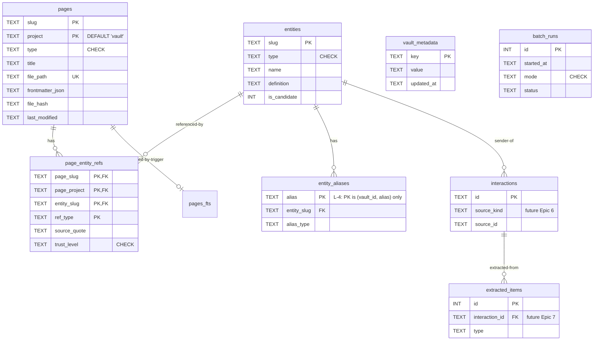

# 4. Data Model (Conceptual)

> Part of [docs/ARCHITECTURE.md](../ARCHITECTURE.md).

### 4.1. Conceptual Data Model

> **Полная DDL**: см. [SCHEMA-DRAFT.sql](./SCHEMA-DRAFT.sql) (8 tables + 3 FTS5 virtual + 3 views + опц. vec0).

**Entities (high-level):**

#### Entity: **Page**
- **Description**: Любая markdown-страница vault'а — summary, concept, query, brief, research, index, log.
- **Key Attributes**:
  - `slug` (TEXT) — kebab-case, vault-wide unique для (slug, project).
  - `project` (TEXT NOT NULL DEFAULT '_vault_') — sentinel `_vault_` для vault-wide; иначе project-slug.
  - `type` (TEXT, CHECK constraint).
  - `file_path` (TEXT UNIQUE) — relative to vault_root.
  - `frontmatter_json` (TEXT) — full YAML frontmatter as JSON.
  - `file_hash` (TEXT, sha256) — для change detection.
- **Relationships**: 1:N с `page_entity_refs` (page содержит N ref'ов на entities).
- **Business Rules**:
  - PK = (slug, project) — sentinel '_vault_' для NULL — предотвращает SQLite NULL-PK semantics (R-26.1).
  - `last_modified` отслеживает file mtime для delta-reindex.
  - Frontmatter required-fields определяются `wiki.lint.required_frontmatter` (для flat layout — без `project`).

#### Entity: **Entity** (concept / person / company / product / group)
- **Description**: Атомарная сущность — концепт (Karpathy), person/company (cybos cross-source). MVP использует только `concept` + `external` types.
- **Key Attributes**:
  - `slug` (TEXT PRIMARY KEY) — kebab-case, vault-wide unique.
  - `type` (TEXT CHECK).
  - `name` (TEXT) — canonical display.
  - `definition` (TEXT) — 1-3 sentences.
  - `is_candidate` (INTEGER 0/1) — two-tier (cybos pattern).
- **Relationships**: 1:N с `entity_aliases`; M:N с `pages` через `page_entity_refs`.
- **Business Rules**:
  - `is_candidate=1` — LLM-extracted candidate; `is_candidate=0` — confirmed (operator-approved or auto-promoted). Two-tier cybos resolution (R-4, **active since TASK 005**).
  - **is_candidate is Class A** (ADR-002 §D8): persisted in concept-page frontmatter (`is_candidate: true|false`, already emitted by `write_concept_page`). `wiki-reindex --full` now **reads** the flag from frontmatter (R-4.1); an absent key ⇒ confirmed (`0`) for back-compat with pre-TASK-005 vaults. The DB column is the Class B mirror. This closes the durability gap where a full reindex previously reset every candidate to confirmed (reindex registered entities with `INSERT OR IGNORE` omitting the column → schema default 0).
  - **Confirm path (R-4.2/4.3):** `wiki-confirm <slug>` flips Class A frontmatter + DB to confirmed; `--undo` reverses. Both use an **explicit DB setter** that **bypasses** the `MIN()` downgrade-guard — operator intent is authoritative. The guard still protects the *re-extraction* path (`upsert_entity`), so a re-run of `wiki-extract-concepts` can never silently demote a confirmed entity.
  - **Auto-promote (R-4.4):** `wiki-confirm --auto [--threshold N]` recomputes `mentions_count` (single set-based `UPDATE` over `page_entity_refs`, identical to reindex Step 3) then promotes every candidate with `mentions_count ≥ N` (default 3, configurable). `--dry-run` reports without writing.
  - **Read path (R-4.5):** `resolve_entity(vault_id, slug)` is **implemented** (retires the Epic-7 `NotImplementedError` stub): resolves a slug *or an alias surface string* → its canonical `Entity` (confirmed or candidate); `None` on no match. The same alias-resolution makes `find_orphan_links` **alias-aware** (R-4.5d): a ref whose target is a registered alias is **not** an orphan.
  - **Merge path (R-4.7):** `wiki-merge <from> <into>` folds an LLM-spawned duplicate into its canonical entity. **Class A first** (C-8): append `from`'s slug + name + aliases to `into`'s frontmatter `aliases:` (`alias_type=former_name`) and **delete the `from` concept page** (so a full reindex cannot re-materialise it — the merge needs **no merge-ledger table**, it is fully expressed in Class A). **Then** the Class B mirror in one `merge_entities(...)` transaction: re-point `page_entity_refs.entity_slug from→into` (dedup on the composite PK, keep higher `trust_level`); re-point `entity_aliases` (skip+report on hard-PK collision); register the redirect aliases; delete the `from` row; recompute `into.mentions_count`. **The alias table is the durable redirect** — stale `[[from-slug]]` references in source bodies re-materialise on reindex but resolve through the alias (R-4.5b/d), never orphaned. No `[[...]]` wikilink rewriting (C-7). `--dry-run` reports without writing.
  - **Entity write-path:** `entities`, `entity_aliases`, `page_entity_refs` are read+write. Canonical write path is `repo.upsert_entity(...)`. Per ADR-002 §D8: concept page files (`_concepts/<slug>.md`) are **Class A canonical** (semantic truth; Obsidian-rendered; git-versioned; survive DB drop + reindex). Entity rows are **Class B cache** (rebuildable from concept-page frontmatter via `wiki-reindex --full`; vault wins on conflict).

#### Entity: **PageEntityRef**
- **Description**: М:М связь page ↔ entity (concept упомянут на странице) с provenance v1.1.
- **Key Attributes**:
  - `(page_slug, page_project, entity_slug, ref_type)` — composite PK.
  - `source_quote` (TEXT) — verbatim 10-50 слов.
  - `source_span` (TEXT — line numbers `Lstart-Lend`).
  - `trust_level` (TEXT CHECK 'high'/'medium'/'low').
- **Relationships**: FK к `pages` и `entities` с `ON DELETE CASCADE`.
- **Business Rules**:
  - `wiki-source-manual` ставит `trust_level='high'` (user-curated).
  - `wiki-source-transcript` / `wiki-source-light` — `'medium'` (LLM-generated).
  - `replace_refs(...)` атомарно delete + insert (для re-ingest без drift'а).
  - **Merge re-pointing (R-4.7):** `merge_entities` rewrites `entity_slug from→into`. There is **no FK on `entity_slug`** (schema note: refs may target unresolved wiki-link slugs), so the re-point is free; the only conflict is the composite PK `(vault_id, page_slug, page_project, entity_slug, ref_type)` when the page already refs `into` with the same `ref_type` — dedup keeps the higher `trust_level`. Covered by the existing `idx_refs_entity (vault_id, entity_slug)` index (no new index needed).
  - **Canonical-slug invariant (AM-3):** a `page_entity_refs` row names the **canonical** entity whenever its raw `[[surface]]` target is a known alias. `reindex_full` enforces this by resolving each ref target through the alias table at build time (phase order entities → aliases → refs → recompute_mentions), so `recompute_mentions`/`get_backlinks` (`WHERE entity_slug = entities.slug`) stay correct after a full rebuild — the merge §D8 round-trip (UC-15) depends on this. Between reindexes the immediate `merge_entities` UPDATE holds the same invariant; `find_orphan_links` query-time alias resolution (R-4.5d) covers partially-indexed gaps.

#### Entity: **VaultMetadata** (NEW в v2 — R-25)
- **Description**: Key-value таблица для vault identity и schema versioning. Keys: `vault_hash`, `vault_root_path`, `schema_version`, `created_at`, `language`, `layout`.
- **Key Attributes**:
  - `key` (TEXT PRIMARY KEY).
  - `value` (TEXT NOT NULL).
  - `updated_at` (TEXT, ISO-8601).
- **Relationships**: Standalone.
- **Business Rules**: Seeded `wiki-init`. `schema_version` инкрементируется migration scripts.

#### Entity: **BatchRun**
- **Description**: Лог reindex-операций для freshness check.
- **Key Attributes**: `id`, `started_at`, `finished_at`, `status`, `mode`, counters.
- **Relationships**: Standalone (но связан с операциями через `notes` field).
- **Business Rules**: SessionStart hook читает last row для warning'а «БД устарела > 24h».

#### Entity: **Interaction** (готова в schema, но **не используется в MVP**)
- **Description**: Cybos-style raw-source row (email, telegram, call, transcript, web). Activated в Epic 6.
- **MVP usage**: Schema присутствует, но wiki-* skills не пишут в `interactions` table в MVP. Только future Epics.

#### Entity: **ExtractedItem** (готова в schema, но **не используется в MVP**)
- **Description**: LLM-extracted structured facts (promise, action_item, decision). Activated в Epic 7 (entity-resolver + LLM extraction).

#### Entity: **SourceState**
- **Description**: Per-source dedup state. Future Epic 6 (email messageIds, telegram msg_ids).

#### Entity: **EntityAlias** (active since TASK 005 — R-5)
- **Description**: Two-tier alias surface-strings resolving many display names to one canonical entity ("Hermes" / "Hermes Agent" / "Hermes Framework" → `hermes-agent`). Powers search expansion (R-5.5) and dedup.
- **Key Attributes**:
  - `alias` (TEXT) — surface string.
  - `entity_slug` (TEXT, FK → `entities`) — canonical target.
  - `alias_type` (TEXT CHECK: `spelling_variant` | `translation` | `nickname` | `acronym` | `former_name` | `product_codename`).
- **Relationships**: N:1 → `entities` (FK `ON UPDATE CASCADE ON DELETE CASCADE`).
- **Business Rules**:
  - **PK = `(vault_id, alias)`** (R-5.4 — was `(vault_id, alias, entity_slug)`; closes KNOWN_ISSUES **L-4**). One alias resolves to **exactly one** entity in a vault; `entity_slug` is now a regular column. Hard-enforced at write time.
  - **Class A canonical:** entity-page frontmatter `aliases:` (flat Obsidian-native list). **Class B mirror:** `entity_aliases` table, rebuilt by `wiki-reindex --full` (R-5.3). This closes the schema's previously-documented-but-unimplemented Class A→B path (reindex never read `aliases:` before TASK 005).
  - `wiki-alias <slug> --add/--remove/--list` (R-5.1/5.2) is the write path: mutates frontmatter + mirrors to DB. `alias_type` defaults to `spelling_variant` on the reindex mirror (the flat list carries no type — documented round-trip limitation; a richer `--type` is Class B only and normalises on full reindex).
  - **Collision policy (R-5.6):** the hard PK blocks same-alias→two-slugs *inside the DB*. The canonical conflict can therefore only survive at the **Class A frontmatter** layer (two pages claiming the same alias); reindex **reports + skips** the loser (never silent `INSERT OR IGNORE`), and `wiki-lint` scans the DB (legacy/pre-migration rows) **and** frontmatter, plus the cross-table case (an alias string equal to a *different* entity's `slug`/`name`).

### 4.2. Logical Data Model

См. [SCHEMA-DRAFT.sql](./SCHEMA-DRAFT.sql) для полного DDL.

**Key indexes (для MVP performance — R-14)**:
- `pages_fts` — FTS5 virtual table, BM25 ranking. Triggers держат в sync с `pages`.
- `idx_pages_type` — для `--type` filter в search.
- `idx_pages_project_date` — для project-scoped queries + sort by date.
- `idx_pages_frontmatter` — JSON-extract на `tags` для tag-based queries.
- `idx_refs_entity` — для backlinks queries (concept-pages).
- `idx_refs_page` — для лint orphan checks.
- **entity_aliases PK `(vault_id, alias)`** (TASK 005) — alias→entity lookup (R-5.5 expansion entry point). The pre-existing `idx_aliases_lookup ON entity_aliases(vault_id, alias)` becomes a **redundant duplicate of the PK index** under the v2→v3 PK change → **drop it** (dead-weight hygiene, cf. P-5).
- **`idx_aliases_entity (vault_id, entity_slug)`** — **NEW (TASK 005, R-5)**: reverse lookup for `list_aliases` (R-5.2) + sibling-alias gathering during search expansion (R-5.5) + alias re-pointing during merge (R-4.7). The old composite PK put `entity_slug` as the 3rd column (not a usable index prefix), so these paths would otherwise table-scan.
- **Merge (R-4.7) needs no new index or DDL** — it is pure DML (UPDATE/DELETE) over existing tables; re-pointing uses `idx_refs_entity` + `idx_aliases_entity`, both already present after the v3 revision.
- **`idx_pages_vault_tags` — DROPPED in v4 (TASK 006 / P-5)**: the functional index `ON pages(vault_id, json_extract(frontmatter_json,'$.tags'))` indexed a JSON array (string-compared) that no query path uses — tag selectivity routes through `pages_fts.tags`. It was dead weight maintained on every page write; removed.

### 4.3. Data Model Diagram

### 4.4. Migrations and Versioning

**Стратегия**:
- `vault_metadata.schema_version` хранит текущую версию (стартует с `'1'`).
- Migration scripts в `scripts/migrations/v{N}_to_v{N+1}.py`, выполняются в порядке.
- Каждая migration:
  1. Проверяет `schema_version`.
  2. Применяет ALTER/CREATE/etc. в transaction.
  3. Обновляет `vault_metadata.schema_version`.
  4. Logs в `batch_runs` (mode='migrate').

**Backward compatibility**:
- Markdown — single source of truth → DB можно дропнуть и пересобрать в любой момент. Migration в worst case = `wiki-reindex --full`.
- v1 → v2 migration описан в [MIGRATION-v1-to-v2.md](./MIGRATION-v1-to-v2.md).
- **v2 → v3 (TASK 005):** `entity_aliases` PK `(vault_id, alias, entity_slug)` → `(vault_id, alias)` (closes L-4). Because the DB is a Class B rebuildable cache, this is **not** an in-place `ALTER` — bump `PRAGMA user_version 2→3` (+ `schema_meta`) in the DDL and rebuild via `wiki-reindex --full`. Operators on an existing DB run one full reindex; aliases reconstruct from Class A frontmatter under the new PK, with any collisions surfaced per R-5.6. `apply_schema` (`CREATE TABLE IF NOT EXISTS`) cannot mutate an existing table's PK, so the rebuild path is mandatory — documented in the migration note + ADR-002 amendment (or ADR-003 stub). The same DDL revision **drops** the now-redundant `idx_aliases_lookup` and **adds** `idx_aliases_entity (vault_id, entity_slug)` (see §4.2).
- **v3 → v4 (TASK 006 — consolidation/hardening):** three Class-B DDL hygiene changes — (a) **drop** the dead `idx_pages_vault_tags` functional index (P-5); (b) **drop** the unused `'log'` value from the `pages.type` CHECK enum (L-5; no code emits it); (c) `log_events.event_date` → `TEXT GENERATED ALWAYS AS (substr(event_ts,1,10)) STORED` (L-2 — schema-level guarantee; `append_log_event` stops setting it; the existing `idx_log_vault_date` indexes the STORED generated column; no FTS trigger touches `log_events`). Same Class-B contract: bump `PRAGMA user_version 3→4` (+ `schema_meta`), migrate via `wiki-reindex --full`, **no in-place `ALTER`** (a STORED generated column can't be ALTER-added to a populated table — the rebuild path is mandatory). SQLite ≥3.31 supports STORED generated columns (runtime is 3.51). Verified: no `CREATE TRIGGER` references `event_date`.

---

