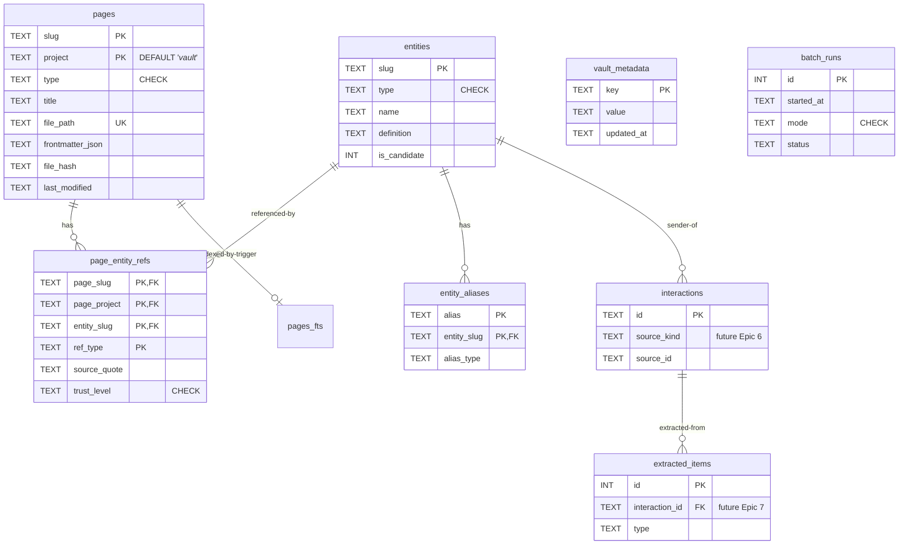

# 4. Data Model (Conceptual)

> Part of [docs/ARCHITECTURE.md](../ARCHITECTURE.md).

### 4.1. Conceptual Data Model

> **Полная DDL**: см. [SCHEMA-DRAFT.sql](./SCHEMA-DRAFT.sql) (8 tables + 3 FTS5 virtual + 3 views + опц. vec0).

**Entities (high-level):**

#### Entity: **Page**
- **Description**: Любая markdown-страница vault'а — summary, concept, query, brief, research, index, log.
- **Key Attributes**:
  - `slug` (TEXT) — kebab-case, vault-wide unique для (slug, project).
  - `project` (TEXT NOT NULL DEFAULT '_vault_') — sentinel `_vault_` для vault-wide; иначе project-slug.
  - `type` (TEXT, CHECK constraint).
  - `file_path` (TEXT UNIQUE) — relative to vault_root.
  - `frontmatter_json` (TEXT) — full YAML frontmatter as JSON.
  - `file_hash` (TEXT, sha256) — для change detection.
- **Relationships**: 1:N с `page_entity_refs` (page содержит N ref'ов на entities).
- **Business Rules**:
  - PK = (slug, project) — sentinel '_vault_' для NULL — предотвращает SQLite NULL-PK semantics (R-26.1).
  - `last_modified` отслеживает file mtime для delta-reindex.
  - Frontmatter required-fields определяются `wiki.lint.required_frontmatter` (для flat layout — без `project`).

#### Entity: **Entity** (concept / person / company / product / group)
- **Description**: Атомарная сущность — концепт (Karpathy), person/company (cybos cross-source). MVP использует только `concept` + `external` types.
- **Key Attributes**:
  - `slug` (TEXT PRIMARY KEY) — kebab-case, vault-wide unique.
  - `type` (TEXT CHECK).
  - `name` (TEXT) — canonical display.
  - `definition` (TEXT) — 1-3 sentences.
  - `is_candidate` (INTEGER 0/1) — two-tier (cybos pattern).
- **Relationships**: 1:N с `entity_aliases`; M:N с `pages` через `page_entity_refs`.
- **Business Rules**:
  - `is_candidate=true` для LLM-extracted без exact match (Epic 7).
  - В Phase 3a entity-resolver — stub. Entities создаются только вручную или migration tools.
  - **Entity write-path:** `entities`, `entity_aliases`, and `page_entity_refs` tables are read+write. The canonical write path is `repo.upsert_entity(...)`. Data layering per ADR-002 §D8: concept page files (`_concepts/<slug>.md`) are **Class A canonical** (semantic truth; Obsidian-rendered; git-versioned; survive DB drop + reindex). Entity rows in the `entities` table are **Class B cache** (rebuildable from concept-page frontmatter via `wiki-reindex --full`; vault wins on conflict). Entity rows written by extraction carry `is_candidate=1`; promotion to `is_candidate=0` (confirmed) is R-4 scope (deferred). The SQL-level downgrade guard (`MIN(excluded.is_candidate, entities.is_candidate)`) ensures re-extraction cannot demote a previously confirmed entity.

#### Entity: **PageEntityRef**
- **Description**: М:М связь page ↔ entity (concept упомянут на странице) с provenance v1.1.
- **Key Attributes**:
  - `(page_slug, page_project, entity_slug, ref_type)` — composite PK.
  - `source_quote` (TEXT) — verbatim 10-50 слов.
  - `source_span` (TEXT — line numbers `Lstart-Lend`).
  - `trust_level` (TEXT CHECK 'high'/'medium'/'low').
- **Relationships**: FK к `pages` и `entities` с `ON DELETE CASCADE`.
- **Business Rules**:
  - `wiki-source-manual` ставит `trust_level='high'` (user-curated).
  - `wiki-source-transcript` / `wiki-source-light` — `'medium'` (LLM-generated).
  - `replace_refs(...)` атомарно delete + insert (для re-ingest без drift'а).

#### Entity: **VaultMetadata** (NEW в v2 — R-25)
- **Description**: Key-value таблица для vault identity и schema versioning. Keys: `vault_hash`, `vault_root_path`, `schema_version`, `created_at`, `language`, `layout`.
- **Key Attributes**:
  - `key` (TEXT PRIMARY KEY).
  - `value` (TEXT NOT NULL).
  - `updated_at` (TEXT, ISO-8601).
- **Relationships**: Standalone.
- **Business Rules**: Seeded `wiki-init`. `schema_version` инкрементируется migration scripts.

#### Entity: **BatchRun**
- **Description**: Лог reindex-операций для freshness check.
- **Key Attributes**: `id`, `started_at`, `finished_at`, `status`, `mode`, counters.
- **Relationships**: Standalone (но связан с операциями через `notes` field).
- **Business Rules**: SessionStart hook читает last row для warning'а «БД устарела > 24h».

#### Entity: **Interaction** (готова в schema, но **не используется в MVP**)
- **Description**: Cybos-style raw-source row (email, telegram, call, transcript, web). Activated в Epic 6.
- **MVP usage**: Schema присутствует, но wiki-* skills не пишут в `interactions` table в MVP. Только future Epics.

#### Entity: **ExtractedItem** (готова в schema, но **не используется в MVP**)
- **Description**: LLM-extracted structured facts (promise, action_item, decision). Activated в Epic 7 (entity-resolver + LLM extraction).

#### Entity: **SourceState**
- **Description**: Per-source dedup state. Future Epic 6 (email messageIds, telegram msg_ids).

#### Entity: **EntityAlias**
- **Description**: Alias-имена для дедупликации. Future Epic 7.

### 4.2. Logical Data Model

См. [SCHEMA-DRAFT.sql](./SCHEMA-DRAFT.sql) для полного DDL.

**Key indexes (для MVP performance — R-14)**:
- `pages_fts` — FTS5 virtual table, BM25 ranking. Triggers держат в sync с `pages`.
- `idx_pages_type` — для `--type` filter в search.
- `idx_pages_project_date` — для project-scoped queries + sort by date.
- `idx_pages_frontmatter` — JSON-extract на `tags` для tag-based queries.
- `idx_refs_entity` — для backlinks queries (concept-pages).
- `idx_refs_page` — для лint orphan checks.

### 4.3. Data Model Diagram

### 4.4. Migrations and Versioning

**Стратегия**:
- `vault_metadata.schema_version` хранит текущую версию (стартует с `'1'`).
- Migration scripts в `scripts/migrations/v{N}_to_v{N+1}.py`, выполняются в порядке.
- Каждая migration:
  1. Проверяет `schema_version`.
  2. Применяет ALTER/CREATE/etc. в transaction.
  3. Обновляет `vault_metadata.schema_version`.
  4. Logs в `batch_runs` (mode='migrate').

**Backward compatibility**:
- Markdown — single source of truth → DB можно дропнуть и пересобрать в любой момент. Migration в worst case = `wiki-reindex --full`.
- v1 → v2 migration описан в [MIGRATION-v1-to-v2.md](./MIGRATION-v1-to-v2.md).

---

