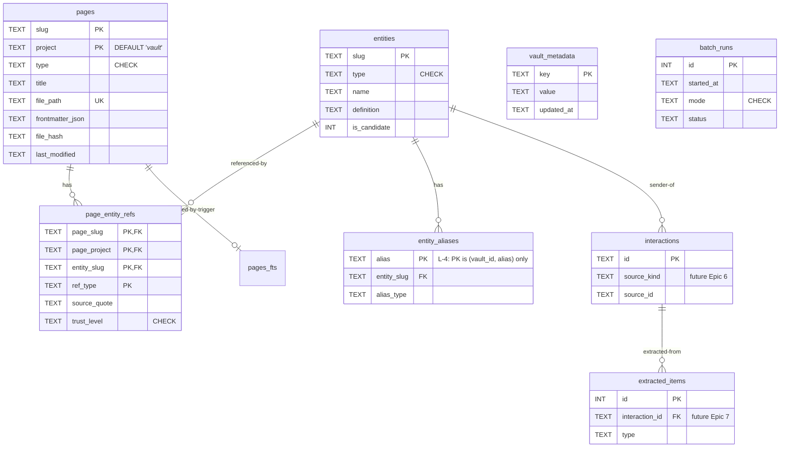

# 4. Data Model (Conceptual)

> Part of [docs/ARCHITECTURE.md](../ARCHITECTURE.md).

### 4.1. Conceptual Data Model

> **Полная DDL**: см. [SCHEMA-DRAFT.sql](./SCHEMA-DRAFT.sql) (8 tables + 3 FTS5 virtual + 3 views + опц. vec0).

**Entities (high-level):**

#### Entity: **Page**
- **Description**: Любая markdown-страница vault'а — summary, concept, query, brief, research, index, log.
- **Key Attributes**:
  - `slug` (TEXT) — kebab-case, vault-wide unique для (slug, project).
  - `project` (TEXT NOT NULL DEFAULT '_vault_') — sentinel `_vault_` для vault-wide; иначе project-slug.
  - `type` (TEXT, CHECK constraint).
  - `file_path` (TEXT UNIQUE) — relative to vault_root.
  - `frontmatter_json` (TEXT) — full YAML frontmatter as JSON.
  - `file_hash` (TEXT, sha256) — для change detection.
- **Relationships**: 1:N с `page_entity_refs` (page содержит N ref'ов на entities).
- **Business Rules**:
  - PK = (slug, project) — sentinel '_vault_' для NULL — предотвращает SQLite NULL-PK semantics (R-26.1).
  - `last_modified` отслеживает file mtime для delta-reindex.
  - Frontmatter required-fields определяются `wiki.lint.required_frontmatter` (для flat layout — без `project`).
  - **Query page (`type='query'`) — first-class compounding artifact (TASK 007, R-6).** A `_queries/<slug>.md` page filed by `wiki-query apply` is an ordinary `pages` row: indexed, FTS-searchable, and reachable by `wiki-search` like any other page — this is the Karpathy "query → page" loop (a synthesised answer accretes back into searchable knowledge). The `pages.type` CHECK enum **already** admits `'query'` and `TYPE_MAPPING["query"]` is wired, so the page needs **no schema/DDL change**. The only layout change is adding `_queries` to `PAGE_SUBDIRS`/`SCAFFOLD_DIRS`/`_PATH_TYPE_FALLBACK` ([layout.py](../../scripts/wiki_index/layout.py)) so `discover_pages` walks it on reindex (else query pages are written but never re-discovered → compounding + §D8 silently break). Class A canonical = `_queries/<slug>.md` frontmatter (`type: query`, `question:`, `date:`, `cites: [project/slug, …]`); Class B = the `pages` row + its `cited` refs.
  - **Verification page (`type='verification'`) — first-class compounding artifact (TASK 008, R-8).** A `_verifications/<slug>.md` page filed by `wiki-verify-multi apply` is an ordinary `pages` row recording an **independent multi-critic audit** of a `_queries/<slug>.md` answer against its cited sources (four prose lenses: factual-grounding, logic/coherence, security/injection, completeness/faithfulness). It is indexed, FTS-searchable (the `pages_fts_*` triggers index **every** row regardless of `type`), and reachable by `wiki-search --types verification`. **Unlike the query page, the verdict-page type is NOT pre-provisioned** — `'verification'` is absent from the `pages.type` CHECK + `TYPE_MAPPING`, so TASK 008 is the first RAG-layer task that bumps the schema **v4→v5** (verdict-page type + `verifies` ref-type + `verify` log-event; see §4.4). The layout change adds `_verifications` to `HOST_ONLY_SUBDIRS` — the **R-X1-forward role-split `_queries` established, now with a second member proving the seam generalises** (per the operator's binding R-X1/R-X2-compat constraint) — so `discover_pages` walks it on reindex. Class A canonical = `_verifications/<slug>.md` frontmatter (`type: verification`, `verifies: project/query-slug`, `verdict: pass|fail`, `critics:`, `answer_hash:` — the sha256 of the audited answer body, the verdict's TOCTOU anchor, `date:`, optional `cites:`); Class B = the `pages` row + its `verifies` (+ optional `cited`) refs. **The verdict page's own slug defaults to `verify-<query-slug>` (NOT the bare query slug)** — the `pages` PK `(vault_id, slug, project)` is subdir-independent, so a verdict at `_verifications/<query-slug>.md` would collide with + overwrite the audited query page row (`<query-slug>`, `_vault_`); the `verify-` prefix gives it a distinct PK (found-in-dev fix, operator-approved 2026-05-29; regression `test_query_page_row_survives_verification`). A verdict page **never creates `entities`** (C-10), and the Class-A **answer it audits is never mutated/quarantined** — the verdict page + the `apply` exit code (non-zero on FAIL) are the only outputs (D-008-3).

#### Entity: **Entity** (concept / person / company / product / group)
- **Description**: Атомарная сущность — концепт (Karpathy), person/company (cybos cross-source). MVP использует только `concept` + `external` types.
- **Key Attributes**:
  - `slug` (TEXT PRIMARY KEY) — kebab-case, vault-wide unique.
  - `type` (TEXT CHECK).
  - `name` (TEXT) — canonical display.
  - `definition` (TEXT) — 1-3 sentences.
  - `is_candidate` (INTEGER 0/1) — two-tier (cybos pattern).
- **Relationships**: 1:N с `entity_aliases`; M:N с `pages` через `page_entity_refs`.
- **Business Rules**:
  - `is_candidate=1` — LLM-extracted candidate; `is_candidate=0` — confirmed (operator-approved or auto-promoted). Two-tier cybos resolution (R-4, **active since TASK 005**).
  - **is_candidate is Class A** (ADR-002 §D8): persisted in concept-page frontmatter (`is_candidate: true|false`, already emitted by `write_concept_page`). `wiki-reindex --full` now **reads** the flag from frontmatter (R-4.1); an absent key ⇒ confirmed (`0`) for back-compat with pre-TASK-005 vaults. The DB column is the Class B mirror. This closes the durability gap where a full reindex previously reset every candidate to confirmed (reindex registered entities with `INSERT OR IGNORE` omitting the column → schema default 0).
  - **Confirm path (R-4.2/4.3):** `wiki-confirm <slug>` flips Class A frontmatter + DB to confirmed; `--undo` reverses. Both use an **explicit DB setter** that **bypasses** the `MIN()` downgrade-guard — operator intent is authoritative. The guard still protects the *re-extraction* path (`upsert_entity`), so a re-run of `wiki-extract-concepts` can never silently demote a confirmed entity.
  - **Auto-promote (R-4.4):** `wiki-confirm --auto [--threshold N]` recomputes `mentions_count` (single set-based `UPDATE` over `page_entity_refs`, identical to reindex Step 3) then promotes every candidate with `mentions_count ≥ N` (default 3, configurable). `--dry-run` reports without writing.
  - **Read path (R-4.5):** `resolve_entity(vault_id, slug)` is **implemented** (retires the Epic-7 `NotImplementedError` stub): resolves a slug *or an alias surface string* → its canonical `Entity` (confirmed or candidate); `None` on no match. The same alias-resolution makes `find_orphan_links` **alias-aware** (R-4.5d): a ref whose target is a registered alias is **not** an orphan.
  - **Merge path (R-4.7):** `wiki-merge <from> <into>` folds an LLM-spawned duplicate into its canonical entity. **Class A first** (C-8): append `from`'s slug + name + aliases to `into`'s frontmatter `aliases:` (`alias_type=former_name`) and **delete the `from` concept page** (so a full reindex cannot re-materialise it — the merge needs **no merge-ledger table**, it is fully expressed in Class A). **Then** the Class B mirror in one `merge_entities(...)` transaction: re-point `page_entity_refs.entity_slug from→into` (dedup on the composite PK, keep higher `trust_level`); re-point `entity_aliases` (skip+report on hard-PK collision); register the redirect aliases; delete the `from` row; recompute `into.mentions_count`. **The alias table is the durable redirect** — stale `[[from-slug]]` references in source bodies re-materialise on reindex but resolve through the alias (R-4.5b/d), never orphaned. No `[[...]]` wikilink rewriting (C-7). `--dry-run` reports without writing.
  - **Entity write-path:** `entities`, `entity_aliases`, `page_entity_refs` are read+write. Canonical write path is `repo.upsert_entity(...)`. Per ADR-002 §D8: concept page files (`_concepts/<slug>.md`) are **Class A canonical** (semantic truth; Obsidian-rendered; git-versioned; survive DB drop + reindex). Entity rows are **Class B cache** (rebuildable from concept-page frontmatter via `wiki-reindex --full`; vault wins on conflict).

#### Entity: **PageEntityRef**
- **Description**: М:М связь page ↔ entity (concept упомянут на странице) с provenance v1.1.
- **Key Attributes**:
  - `(page_slug, page_project, entity_slug, ref_type)` — composite PK.
  - `source_quote` (TEXT) — verbatim 10-50 слов.
  - `source_span` (TEXT — line numbers `Lstart-Lend`).
  - `trust_level` (TEXT CHECK 'high'/'medium'/'low').
- **Relationships**: FK к `pages` и `entities` с `ON DELETE CASCADE`.
- **Business Rules**:
  - `wiki-source-manual` ставит `trust_level='high'` (user-curated).
  - `wiki-source-transcript` / `wiki-source-light` — `'medium'` (LLM-generated).
  - `replace_refs(...)` атомарно delete + insert (для re-ingest без drift'а).
  - **Merge re-pointing (R-4.7):** `merge_entities` rewrites `entity_slug from→into`. There is **no FK on `entity_slug`** (schema note: refs may target unresolved wiki-link slugs), so the re-point is free; the only conflict is the composite PK `(vault_id, page_slug, page_project, entity_slug, ref_type)` when the page already refs `into` with the same `ref_type` — dedup keeps the higher `trust_level`. Covered by the existing `idx_refs_entity (vault_id, entity_slug)` index (no new index needed).
  - **Canonical-slug invariant (AM-3):** a `page_entity_refs` row names the **canonical** entity whenever its raw `[[surface]]` target is a known alias. `reindex_full` enforces this by resolving each ref target through the alias table at build time (phase order entities → aliases → refs → recompute_mentions), so `recompute_mentions`/`get_backlinks` (`WHERE entity_slug = entities.slug`) stay correct after a full rebuild — the merge §D8 round-trip (UC-15) depends on this. Between reindexes the immediate `merge_entities` UPDATE holds the same invariant; `find_orphan_links` query-time alias resolution (R-4.5d) covers partially-indexed gaps.
  - **Citation ref (`ref_type='cited'`) — query→source backlink (TASK 007, R-6.4/R-6.5e).** When `wiki-query apply` files a query page, it writes one `cited` ref per cited source via the page's single `replace_refs(page_slug=query-slug, …)` call, with the `cited` rows included in that ref-set (entity_slug=cited-slug, ref_type='cited'). The `ref_type` CHECK enum **already** admits `'cited'` — **no DDL**. Per-ref columns for a `cites:`-derived `cited` ref: `trust_level='medium'` (the citation rides an LLM-synthesised answer even though retrieval is deterministic — consistent with the LLM-mediated adapters), and `line_start`/`line_end`/`source_quote` are **`NULL`** (a frontmatter `cites:` entry has no body line/quote; the columns are nullable). **Durability read-side (R-6.5e — the load-bearing §D8 fix):** the current reindex ref-rebuild reads **body `[[wikilinks]]` only** (`extract_wiki_links` scans `body.splitlines()`, hardcoding `ref_type='mentioned'` in [manual.py:44](../../scripts/wiki_source/manual.py)) and the frontmatter read-side that exists is **gated on `_concepts`/`_entities`** ([reindex.py:284](../../scripts/wiki_index/reindex.py)). So a query page's `cited` refs would be **lost on a full reindex** without a new read-side. R-6.5e adds a **type-aware branch in `reindex.py`** (not the generic `ManualSourceAdapter`) that, for a `type=query` page, parses the `cites:` frontmatter list into `ref_type='cited'` `PageRef`s. **Same-table merge, NOT a second `replace_refs` (M-1):** unlike R-5.3 (which mirrors `aliases:` into the *separate* `entity_aliases` table), `cited` refs land in the **same** `page_entity_refs` table that reindex Step 2 already rebuilds via one `replace_refs(vault_id, slug, project, out.refs)` — and `replace_refs` is **delete-all-for-the-page then insert** ([sqlite_repository.py:381-399](../../scripts/wiki_index/sqlite_repository.py)). A second `replace_refs` (or a write before Step 2's) would therefore **clobber** the body-`mentioned` refs. So R-6.5e must **union the `cited` `PageRef`s into the page's `out.refs` set *before* the single Step-2 `replace_refs` call** (the body-wikilink `mentioned` refs and the frontmatter-`cites:` `cited` refs are written together, once). Skip-and-report malformed `cites:` entries (never silent-drop). A query page may legitimately carry **both** a `cited` ref (from `cites:`) and a `mentioned` ref (from a body `## Sources` `[[wikilink]]`) to the same target; the composite PK `(vault_id, page_slug, page_project, entity_slug, ref_type)` keeps them distinct (no collision — see Open Question Q9 / dual-ref).
  - **Reindex phase order for query pages (M-2):** Step 2 builds `out.refs` = body `mentioned` refs + (for `type=query`) `cites:`-derived `cited` refs → one `replace_refs`. **Step 2.5 (AM-3)** then canonicalizes **every** ref's `entity_slug` through the alias map ([reindex.py:372-409](../../scripts/wiki_index/reindex.py)) — `cited` refs **participate**: a cited target that is a registered alias (e.g. a merged-away `[[former-name]]`) re-points to the canonical entity, which is the desired behaviour (the citation still resolves). Step 2.5 rewrites **`entity_slug` only, never `ref_type`**, so a `cited` ref **cannot degrade to `mentioned`** — UC-20's AC holds structurally. Then **Step 3** recomputes `mentions_count`. (On a `(page, canonical, ref_type)` PK collision Step 2.5 drops the duplicate alias-ref, same as today.)
  - **Verifies ref (`ref_type='verifies'`) — verdict→query backlink (TASK 008, R-8.4/R-8.5e).** When `wiki-verify-multi apply` files a verdict page, it writes one `verifies` ref from the verdict page → the audited query page via the page's single `replace_refs(page_slug=verification-slug, …)` call (`entity_slug=query-slug`, `ref_type='verifies'`). **The `ref_type` CHECK enum does NOT admit `'verifies'`** — TASK 008 adds it (schema v5; **Q-008-a** chose a dedicated ref-type over reusing `'cited'` because the verify relationship is the queryable point of R-8 — "what verifies this answer?" via the existing `idx_refs_type`). Per-ref columns: `trust_level='medium'`; `line_start`/`line_end`/`source_quote` `NULL` (a `verifies:` frontmatter entry has no body line/quote — the columns are nullable). A verdict page MAY also carry `cites:` (the subset of sources a finding referenced, **Q-008-f**) → `ref_type='cited'` rows, reusing the query-page citation-ref machinery verbatim. **Durability read-side (R-8.5e — the §D8 spine, the exact R-6.5e analog):** the reindex ref-rebuild reads body `[[wikilinks]]` only (hardcoded `'mentioned'`), so a verdict page's `verifies` ref would be **lost on a full reindex** without a new read-side. R-8.5e **generalises** the R-6.5e type-aware branch in `reindex.py` (refactor `_cited_refs_from_frontmatter` toward a `_frontmatter_refs(db_type, fm, …)` helper, DRY — C-6): for a `type=verification` page, parse `verifies:` → a `ref_type='verifies'` `PageRef` (and `cites:` → `'cited'`), **unioned into the page's single `out.refs` set before the one Step-2 `replace_refs`** (same-table merge, **NOT** a second `replace_refs` — the M-1 clobber lesson), in **both** `reindex_full` **and** `reindex_delta` (the delta-symmetry lesson). Skip-and-report malformed entries (never silent-drop). **Coexistence:** a verdict page can hold `verifies` (→query) + `cited` (→source) + body `mentioned` refs to the same target; the composite PK `(vault_id, page_slug, page_project, entity_slug, ref_type)` keeps all three distinct (no collision). Step 2.5 (AM-3) canonicalizes `entity_slug` only — never `ref_type` — so a `verifies` ref **cannot degrade** to `mentioned`; UC-26's §D8 AC holds structurally.

#### Entity: **VaultMetadata** (NEW в v2 — R-25)
- **Description**: Key-value таблица для vault identity и schema versioning. Keys: `vault_hash`, `vault_root_path`, `schema_version`, `created_at`, `language`, `layout`.
- **Key Attributes**:
  - `key` (TEXT PRIMARY KEY).
  - `value` (TEXT NOT NULL).
  - `updated_at` (TEXT, ISO-8601).
- **Relationships**: Standalone.
- **Business Rules**: Seeded `wiki-init`. `schema_version` инкрементируется migration scripts.

#### Entity: **BatchRun**
- **Description**: Лог reindex-операций для freshness check.
- **Key Attributes**: `id`, `started_at`, `finished_at`, `status`, `mode`, counters.
- **Relationships**: Standalone (но связан с операциями через `notes` field).
- **Business Rules**: SessionStart hook читает last row для warning'а «БД устарела > 24h».

#### Entity: **Interaction** (готова в schema, но **не используется в MVP**)
- **Description**: Cybos-style raw-source row (email, telegram, call, transcript, web). Activated в Epic 6.
- **MVP usage**: Schema присутствует, но wiki-* skills не пишут в `interactions` table в MVP. Только future Epics.

#### Entity: **ExtractedItem** (готова в schema, но **не используется в MVP**)
- **Description**: LLM-extracted structured facts (promise, action_item, decision). Activated в Epic 7 (entity-resolver + LLM extraction).

#### Entity: **SourceState**
- **Description**: Generic per-source dedup / idempotency state — a `(vault_id, source_kind, scope, key) → value` key-value table (Class C operational cache, fully rebuildable: a lost row just means the next run recomputes). **Active**, not future: `wiki-extract-concepts` uses `source_kind='extract-concepts'` (source-body hash); **TASK 007 reuses it for `wiki-query` with `source_kind='query'`** (`scope=query_slug`, `key='question_hash'`, `value=<hash>`); **TASK 008 reuses it for `wiki-verify-multi` with `source_kind='verification'`** (`scope=verification_slug`, `key='verify_hash'`, `value=<hash>`) — so verify idempotency, like query idempotency, needs **no new table** and **no DDL** (the `source_state` reuse is the one part of R-8 that is zero-DDL). Future Epic 6 adds `source_kind='email'|'telegram'` (messageIds, msg_ids).
- **Business Rules**:
  - **No raw SQL in skills (DAL boundary):** TASK 007 adds `record_query_state` / `check_query_state` `IndexRepository` methods rather than the `repo._connect().execute(...)` shortcut the `wiki-extract-concepts` precedent currently uses — `wiki-query` is the *cleaner* path (H-PERF-3 "expose a programmatic method" lesson). A future hygiene bead may backport the same methods to `wiki-extract-concepts`.
  - **Idempotency hash content (Q3 / Q-A6) — binding default:** `value` = `sha256(question ‖ ordered retrieved `project/slug` set)`, **not** the question alone, so a re-query after the corpus changed re-synthesises (defines UC-17's `is_unchanged` semantics + whether the compounding loop picks up new sources). This is the **committed contract shape** Planning decomposes R-6.6 against (and the shape `apply`'s `QUESTION_CHANGED` TOCTOU check recomputes); Planning tunes details (separator, ordering canonicalisation) but does not silently re-open the question-vs-question+hits decision.
  - **Verify idempotency hash content (Q-008-b) — binding default:** for `source_kind='verification'`, `value` = `sha256(answer_hash ‖ ordered examined `project/slug` set)`, where `answer_hash` is the hash of the audited query page's answer body and the examined set is the query page's `cites:` frontmatter (the sources actually verified — **Q-008-c**: `prepare` derives the examined set from `cites:`, i.e. it audits *the cited answer as filed*, not a fresh retrieval; this avoids the Q-007-1 double-FTS cost and is the correct semantics). A re-verify re-triggers the critics iff **either** the answer body **or** any cited source changed since the last verdict. `apply`'s `ANSWER_CHANGED` TOCTOU recomputes `answer_hash` and rejects a mid-pipeline answer edit. Committed shape Planning decomposes R-8.6 against.

#### Entity: **EntityAlias** (active since TASK 005 — R-5)
- **Description**: Two-tier alias surface-strings resolving many display names to one canonical entity ("Hermes" / "Hermes Agent" / "Hermes Framework" → `hermes-agent`). Powers search expansion (R-5.5) and dedup.
- **Key Attributes**:
  - `alias` (TEXT) — surface string.
  - `entity_slug` (TEXT, FK → `entities`) — canonical target.
  - `alias_type` (TEXT CHECK: `spelling_variant` | `translation` | `nickname` | `acronym` | `former_name` | `product_codename`).
- **Relationships**: N:1 → `entities` (FK `ON UPDATE CASCADE ON DELETE CASCADE`).
- **Business Rules**:
  - **PK = `(vault_id, alias)`** (R-5.4 — was `(vault_id, alias, entity_slug)`; closes KNOWN_ISSUES **L-4**). One alias resolves to **exactly one** entity in a vault; `entity_slug` is now a regular column. Hard-enforced at write time.
  - **Class A canonical:** entity-page frontmatter `aliases:` (flat Obsidian-native list). **Class B mirror:** `entity_aliases` table, rebuilt by `wiki-reindex --full` (R-5.3). This closes the schema's previously-documented-but-unimplemented Class A→B path (reindex never read `aliases:` before TASK 005).
  - `wiki-alias <slug> --add/--remove/--list` (R-5.1/5.2) is the write path: mutates frontmatter + mirrors to DB. `alias_type` defaults to `spelling_variant` on the reindex mirror (the flat list carries no type — documented round-trip limitation; a richer `--type` is Class B only and normalises on full reindex).
  - **Collision policy (R-5.6):** the hard PK blocks same-alias→two-slugs *inside the DB*. The canonical conflict can therefore only survive at the **Class A frontmatter** layer (two pages claiming the same alias); reindex **reports + skips** the loser (never silent `INSERT OR IGNORE`), and `wiki-lint` scans the DB (legacy/pre-migration rows) **and** frontmatter, plus the cross-table case (an alias string equal to a *different* entity's `slug`/`name`).

### 4.2. Logical Data Model

См. [SCHEMA-DRAFT.sql](./SCHEMA-DRAFT.sql) для полного DDL.

**Key indexes (для MVP performance — R-14)**:
- `pages_fts` — FTS5 virtual table, BM25 ranking. Triggers держат в sync с `pages`.
- `idx_pages_type` — для `--type` filter в search.
- `idx_pages_project_date` — для project-scoped queries + sort by date.
- `idx_pages_frontmatter` — JSON-extract на `tags` для tag-based queries.
- `idx_refs_entity` — для backlinks queries (concept-pages).
- `idx_refs_page` — для лint orphan checks.
- **entity_aliases PK `(vault_id, alias)`** (TASK 005) — alias→entity lookup (R-5.5 expansion entry point). The pre-existing `idx_aliases_lookup ON entity_aliases(vault_id, alias)` becomes a **redundant duplicate of the PK index** under the v2→v3 PK change → **drop it** (dead-weight hygiene, cf. P-5).
- **`idx_aliases_entity (vault_id, entity_slug)`** — **NEW (TASK 005, R-5)**: reverse lookup for `list_aliases` (R-5.2) + sibling-alias gathering during search expansion (R-5.5) + alias re-pointing during merge (R-4.7). The old composite PK put `entity_slug` as the 3rd column (not a usable index prefix), so these paths would otherwise table-scan.
- **Merge (R-4.7) needs no new index or DDL** — it is pure DML (UPDATE/DELETE) over existing tables; re-pointing uses `idx_refs_entity` + `idx_aliases_entity`, both already present after the v3 revision.
- **`idx_pages_vault_tags` — DROPPED in v4 (TASK 006 / P-5)**: the functional index `ON pages(vault_id, json_extract(frontmatter_json,'$.tags'))` indexed a JSON array (string-compared) that no query path uses — tag selectivity routes through `pages_fts.tags`. It was dead weight maintained on every page write; removed.

### 4.3. Data Model Diagram

### 4.4. Migrations and Versioning

**Стратегия**:
- `vault_metadata.schema_version` хранит текущую версию (стартует с `'1'`).
- Migration scripts в `scripts/migrations/v{N}_to_v{N+1}.py`, выполняются в порядке.
- Каждая migration:
  1. Проверяет `schema_version`.
  2. Применяет ALTER/CREATE/etc. в transaction.
  3. Обновляет `vault_metadata.schema_version`.
  4. Logs в `batch_runs` (mode='migrate').

**Backward compatibility**:
- Markdown — single source of truth → DB можно дропнуть и пересобрать в любой момент. Migration в worst case = `wiki-reindex --full`.
- v1 → v2 migration описан в [MIGRATION-v1-to-v2.md](./MIGRATION-v1-to-v2.md).
- **v2 → v3 (TASK 005):** `entity_aliases` PK `(vault_id, alias, entity_slug)` → `(vault_id, alias)` (closes L-4). Because the DB is a Class B rebuildable cache, this is **not** an in-place `ALTER` — bump `PRAGMA user_version 2→3` (+ `schema_meta`) in the DDL and rebuild via `wiki-reindex --full`. Operators on an existing DB run one full reindex; aliases reconstruct from Class A frontmatter under the new PK, with any collisions surfaced per R-5.6. `apply_schema` (`CREATE TABLE IF NOT EXISTS`) cannot mutate an existing table's PK, so the rebuild path is mandatory — documented in the migration note + ADR-002 amendment (or ADR-003 stub). The same DDL revision **drops** the now-redundant `idx_aliases_lookup` and **adds** `idx_aliases_entity (vault_id, entity_slug)` (see §4.2).
- **v3 → v4 (TASK 006 — consolidation/hardening):** three Class-B DDL hygiene changes — (a) **drop** the dead `idx_pages_vault_tags` functional index (P-5); (b) **drop** the unused `'log'` value from the `pages.type` CHECK enum (L-5; no code emits it); (c) `log_events.event_date` → `TEXT GENERATED ALWAYS AS (substr(event_ts,1,10)) STORED` (L-2 — schema-level guarantee; `append_log_event` stops setting it; the existing `idx_log_vault_date` indexes the STORED generated column; no FTS trigger touches `log_events`). Same Class-B contract: bump `PRAGMA user_version 3→4` (+ `schema_meta`), migrate via `wiki-reindex --full`, **no in-place `ALTER`** (a STORED generated column can't be ALTER-added to a populated table — the rebuild path is mandatory). SQLite ≥3.31 supports STORED generated columns (runtime is 3.51). Verified: no `CREATE TRIGGER` references `event_date`.
- **v4 unchanged (TASK 007 — `wiki-query` RAG):** **no schema migration** — `pages.type='query'`, `page_entity_refs.ref_type='cited'`, `log_events.event_type='query'`, and the generic `source_state` table all pre-exist, so `PRAGMA user_version` stays **4** and there is no DDL/ALTER. The two structural changes are **code-only**: (1) `layout.py` adds `_queries` to `PAGE_SUBDIRS`/`SCAFFOLD_DIRS`/`_PATH_TYPE_FALLBACK`; (2) a type-aware reindex read-side parses a `type=query` page's `cites:` frontmatter into `ref_type='cited'` refs (R-6.5e — the §D8 durability fix, mirroring the R-5.3 `aliases:` read-side). Existing vaults without a `_queries/` dir reindex unchanged (additive).
- **v4 → v5 (TASK 008 — `wiki-verify-multi`):** the **first RAG-layer task that requires DDL** — the verdict-page type, the verify relationship, and the verify event are **not** pre-provisioned (contrast R-6's `query`/`cited`/`query`-event, which were). Four CHECK/view edits in `sql/wiki-index-v2.sql` (+ `docs/SCHEMA-v2.sql` mirror): `pages.type += 'verification'`; `page_entity_refs.ref_type += 'verifies'` (Q-008-a); `log_events.event_type += 'verify'`; `index_meta` view WHERE `+= 'verification'` (catalog/render parity with `query`). Same **Class-B rebuildable** contract as v2→v3→v4: bump `PRAGMA user_version 4→5` (+ `schema_meta`), **no in-place `ALTER`** (SQLite cannot ALTER-relax a CHECK constraint on a populated table). **Migration on an existing populated v4 DB (precise, per adversarial-plan DUR-2):** `wiki-reindex --full` alone only `DELETE`s+re-`INSERT`s rows and does **not** recreate the table, so the old v4 CHECK would persist and a `verification` insert would raise `IntegrityError` — the migration is **delete `.db`/`-wal`/`-shm` first** (forcing `apply_schema_if_missing` to apply the fresh v5 DDL), **then `wiki-init --register-existing` + `wiki-reindex --full`** (the deletion also wipes the `vaults` row, which `reindex_full` requires). The `pages_fts_*` triggers need **no** change (they index all `type`s — so a `verification` page is FTS-searchable the moment the CHECK admits it). Code-side (**three parts that must land together** — `layout.py` alone is insufficient, the TASK 007 C-1 lesson): (1) `layout.py` adds `_verifications` to `HOST_ONLY_SUBDIRS` (the second member of the R-X1-forward role-split) so `discover_pages` walks it; (2) **`normalization.py` adds `TYPE_MAPPING["verification"] = ("verification", None)` + `_PATH_TYPE_FALLBACK[VERIFICATIONS_SUBDIR] = "verification"`** — without these `normalize_frontmatter` raises `UnmappedTypeError` and the verdict page is silently skipped on reindex (found but never indexed), so the §D8 round-trip fails before R-8.5e runs; (3) the reindex read-side gains a `type=verification` branch (`verifies:`→`'verifies'`, reusing `cites:`→`'cited'`) — R-8.5e, generalising R-6.5e. Existing vaults without a `_verifications/` dir reindex unchanged (additive); a populated v4 DB upgrades by the delete-then-reregister-then-reindex procedure above (NOT a bare `wiki-reindex --full`).

---

## SourceState — `wiki-sync` partition (TASK 018 / R-11)

`wiki-sync` reuses the existing **`source_state`** table (Class C operational, no
DDL) with its own partition: `source_kind='sync'`, `scope=<vault-relative source
path>`, `key='source_hash'`, `value=sha256(file bytes)` (original binary bytes for
`convert+ingest`). It is the **only** store keyed on the raw file `wiki-sync scan`
discovers — distinct from the chain's own idempotency (`wiki-import`'s
`_sources/<slug>.md` frontmatter `source_hash:` footer, keyed by summary slug; and
`wiki-extract-concepts`'s `source_kind='extract-concepts'` row, keyed by source-page
slug — neither knowable at scan time). Written by the executor **only after the
per-file chain fully succeeds** (commit marker → partial-failure resumes). Read via
the new generic `get_source_state`; `source_state` has no `source_kind` CHECK, so the
`'sync'` value is data — `user_version` stays **5**. (See ARCHITECTURE.md §11a
Q-018-8; supersedes the architecture-018-review AM-1 contract.)

---
