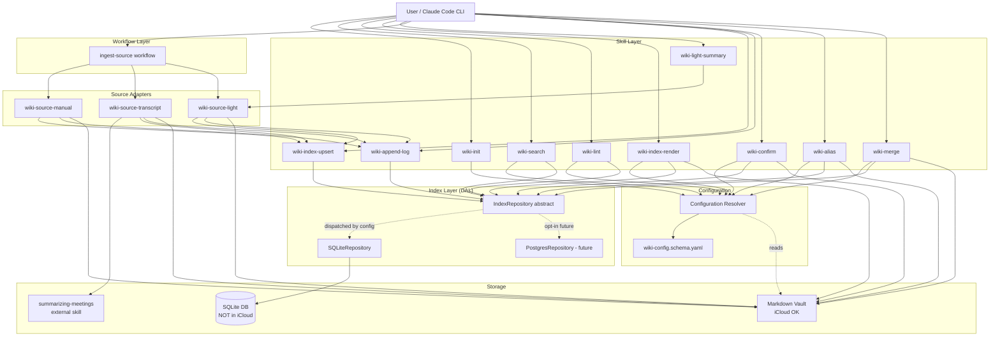

# 2. Functional Architecture

> Part of [docs/ARCHITECTURE.md](../ARCHITECTURE.md).


### 2.1. Functional Components

#### Component: **Configuration Resolver**

**Purpose**: Резолвит per-vault и per-project конфигурацию из двухслойной schema (`CLAUDE.md::wiki:` + `<project>/.wiki.yaml`). Walk-up + deep-merge.

**Functions:**
- `load_config(cwd) → WikiConfig`
  - Input: текущий CWD.
  - Output: финальный merged `WikiConfig` объект (validated against JSON Schema).
  - Related Use Cases: ALL UCs (каждое skill-исполнение начинается с этого).

**Dependencies:** None (Tier 0). Все остальные компоненты depend на нём.

#### Component: **Index Layer (DAL)**

**Purpose**: Единый абстрактный repository над SQLite (default) или Postgres (opt-in). Все search/lint/upsert/resolve операции идут через него. Скрывает SQL детали от skill-кода.

**Functions:**
- `upsert_page(slug, project, type, ..., frontmatter_json)` — single-tx insert/update.
- `get_page(slug, project) → Page | None`.
- `delete_page(slug, project)`.
- `search_pages(query, *, project, types, limit) → list[PageHit]` — FTS5 BM25.
- `replace_refs(page_slug, page_project, refs[])` — atomic delete + insert.
- `get_backlinks(entity_slug) → list[Backlink]`.
- `find_orphan_links() → list[OrphanLink]`.
- `find_pages_missing_in_index(vault_root) → list[str]`.
- `check_drift() → DriftReport`.
- `begin_batch_run(mode) → run_id` / `finish_batch_run(run_id, status, **stats)`.
- `last_batch_run() → BatchRun | None`.
- `get_vault_metadata(key) → str | None` / `set_vault_metadata(key, value)`.
- `resolve_entity(vault_id, slug) → Entity | None` — **implemented (TASK 005, R-4.5)**: resolves a canonical slug *or* an alias surface string to its `Entity` (confirmed or candidate); `None` on no match. Retires the Epic-7 `NotImplementedError` stub.
- `upsert_entity(vault_id, slug, name, type, is_candidate, canonicalized_by, first_seen, last_updated) → None` — entity write-path (extraction). Atomic `INSERT … ON CONFLICT DO UPDATE`; `is_candidate` downgrade-guard enforced at SQL level (`MIN(excluded.is_candidate, entities.is_candidate)`) so a confirmed entity cannot be demoted by a *re-extraction*.
- `set_entity_candidate(vault_id, slug, is_candidate) → None` — **explicit** confirm/undo setter (R-4.2/4.3). **Bypasses** the `MIN()` guard (operator intent is authoritative); writes the Class B mirror only — the caller (`wiki-confirm`) writes Class A frontmatter first.
- `list_candidates(vault_id) → list[Entity]` — all `is_candidate=1` rows (drives `--auto` + operator review).
- `recompute_mentions(vault_id) → None` — single set-based `UPDATE entities.mentions_count = COUNT(page_entity_refs)` (R-4.4 freshness; identical query to reindex Step 3).
- `auto_promote_candidates(vault_id, threshold) → list[str]` — recompute mentions, then promote candidates with `mentions_count ≥ threshold`; returns promoted slugs (R-4.4).
- `add_alias(vault_id, alias, entity_slug, alias_type) → None` / `remove_alias(vault_id, alias) → None` / `list_aliases(vault_id, entity_slug) → list[str]` — Class B mirror writes for R-5.1/5.2. `add_alias` raises on hard-PK collision (caller maps to `ALIAS_COLLISION`).
- `expand_query_aliases(vault_id, term) → list[str]` — given a surface term, return canonical name + sibling aliases for FTS OR-expansion (R-5.5); bounded to the matched entity's own alias set (no transitive expansion).
- `find_alias_collisions(vault_id) → list[AliasCollision]` — in-DB duplicates (legacy / pre-migration) + cross-table (alias == another entity's `slug`/`name`); the Class A frontmatter scan (R-5.6e) lives in the Lint Layer, which reads files.
- `merge_entities(vault_id, from_slug, into_slug) → MergeReport` — **(TASK 005, R-4.7)** single-transaction duplicate fold: re-points `page_entity_refs.entity_slug from→into` de-duplicating on the `(vault_id, page_slug, page_project, entity_slug, ref_type)` PK (keep higher `trust_level`); re-points `entity_aliases` (skip+report on hard-PK collision); registers `from`'s slug + name as `into` aliases (`alias_type=former_name`, the durable redirect); deletes the `from` entity row; recomputes `into.mentions_count`. Returns `{refs_repointed, aliases_absorbed, aliases_skipped}`. Pure DML — no DDL, Postgres-portable. Caller (`wiki-merge`) does the Class A mutations (append `into.aliases`, delete `from` page) **before** this DB transaction (C-8 write-order).
- `find_orphan_links(vault_id=None) → list[OrphanLink]` — **extended (TASK 005, R-4.5d): alias-aware.** A ref whose `entity_slug` matches a registered alias resolves to its canonical entity and is **no longer** reported as an orphan. Required so a merged-away `from` slug (still present as `[[from-slug]]` in source bodies and re-materialised on reindex) does not pollute lint.

**Inputs:** `WikiConfig` (для backend/path resolution).
**Outputs:** Repository instance с указанным backend.
**Related Use Cases:** UC-01 (init seeds vault_metadata), UC-02 (upsert), UC-03 (search), UC-04 (lint queries), UC-05 (bulk-migration), UC-08 (concept extraction write-path), UC-09 (idempotency).

**Dependencies:** Configuration Resolver. Used by ALL skills.

#### Component: **Source Adapters**

**Purpose**: Pluggable extractors для разных типов входов. Унифицированный контракт `SourceAdapter`.

**File-write ownership clarification:** wiki-ingest owns **raw-source** file synthesis (transcript → summary, source-page normalization, additive merge with footnote citations, contradiction flagging, etc.). Downstream skills like `wiki-extract-concepts` may write **derivative pages** (concept pages derived from already-indexed source pages) provided they emit a wiki-ingest v1.1-compatible manifest for `/wiki-enrich` consumption. This preserves the single-indexer invariant (Index Layer is the only writer to SQLite) without forcing wiki-ingest to become a god-process for every file mutation. ADR-001 ("wiki-ingest owns the file layer") governs raw-source file synthesis; `_concepts/<slug>.md` pages generated by `wiki-extract-concepts` are derivative artifacts, not raw-source synthesis.

**wiki-ingest integration transport:** `wiki-enrich` calls wiki-ingest via **in-process Python import** as the primary path (vendored module at `scripts/wiki_ingest/`). Subprocess invocation of the external `wiki-ingest` binary is retained as a fallback activated by `WIKI_ENRICH_NO_VENDORED=1` or by `ImportError` on the vendored import when the binary is on PATH. The integration contract (manifest dict in, index out via `index_from_manifest()`) is the same for both paths — only the transport mechanism differs. The `--source` flag surface of `wiki-enrich` is `required=True` with no mutual-exclusion group. See §1.5.2 for the full decision branch diagram and §1.5.7 for vendored-module details.

**MVP adapters:**
1. **`wiki-source-manual`** — для уже-существующих markdown-файлов. Не модифицирует body. Validates path внутри vault_root. Ставит `trust_level='high'` для refs.
2. **`wiki-source-transcript`** — wraps **`/generate-detailed-meeting-summary` workflow** (educational overlay поверх `summarizing-meetings` skill) через subprocess. Multi-pass LLM workflow генерирует pyramid summary с расширенным frontmatter (`type: lesson-summary`, `content_type`, `course`, `module`, `speaker`, `concepts[]`, `prerequisites[]`), Mermaid-диаграммами, `<!-- SECTION:* -->` anchors, `Content Fingerprint` блоком. Применяет §6.1 type-mapping (`lesson-summary` → DB `summary` + tag) при upsert. Ставит `trust_level='medium'`. См. TASK.md R-06.3 + R-07.4 + R-07.5 + I-3.3 + UC-07.
3. **`wiki-source-light`** (R-24) — single-call LLM для arbitrary md-куска. Не делает full pyramid. Ставит `trust_level='medium'`. Frontmatter `type: summary` (схема CHECK constraint), tag `summary-light` для filtering.

**Functions per adapter:**
- `authenticate(config) → None` — first-run setup (manual/light/transcript: no-op; future email: OAuth).
- `fetch(since=None) → Iterator[SourceItem]` — для pull-источников; для manual/light = single-shot.
- `normalize_to_md(item, vault_paths) → SourceOutput` — генерирует markdown файл.
- `dedup_state_file(config) → str | None` — для pull-источников.

**Related Use Cases:** UC-02 (manual), UC-06 (light), implicit транscript flow.

**Dependencies:** Index Layer (для post-write upsert), Configuration Resolver.

#### Component: **Skill Layer**

**Purpose**: User-facing entry points (slash-commands в Claude Code).

**MVP skills (Phase 3a):**
- `wiki-init` (UC-01) — bootstrap.
- `wiki-append-log` (UC-02 step 11) — chronological log + monthly rotation.
- `wiki-enrich` (UC-06/UC-07 bridge, ADR-001 Option I) — calls vendored `ingest()` in-process for file synthesis (subprocess fallback retained for the standalone-CLI path), then indexes the manifest into SQLite. `--source` is the sole input flag. Manifest-consumer functions (`validate_manifest`, `index_from_manifest`, `WikiIngestError`) live in the neutral module `scripts.wiki_skills._manifest_consumer`; `wiki_enrich.py` re-exports them for backward compat.
- `wiki-extract-concepts` (UC-08, UC-09) — see dedicated Component section below.
- `wiki-index-render` (UC-05 step 7) — projection из SQLite в `index.md`.
- `wiki-index-upsert` (UC-02 step 7) — упрощённый wrapper над `Index Layer.upsert_page`.
- `wiki-lint` (UC-04, UC-13) — health-check через SQL; **+ alias-collision detection** (R-5.6: DB rows + Class A frontmatter scan + cross-table).
- `wiki-search` (UC-03, UC-12) — FTS5 query + nice formatting; **alias expansion on by default** (R-5.5; `--no-expand-aliases` opt-out).
- `wiki-confirm` (UC-09, UC-10) — candidate→confirmed promotion (operator + `--auto` mention-threshold). See **Entity Resolver** component below.
- `wiki-alias` (UC-11) — register/remove/list aliases (frontmatter + DB mirror). See **Entity Resolver** component below.
- `wiki-merge` (UC-15) — fold a duplicate entity into a canonical one (re-point refs + absorb/register redirect aliases + delete `from` page). See **Entity Resolver** component below.
- `ingest-source` workflow (meta) — dispatcher на `wiki-source-{kind}`.

**Functions:** Каждый skill = thin Python wrapper, читает stdin/argv, вызывает Index Layer + Source Adapters, возвращает JSON.

**Related Use Cases:** Каждый skill соответствует одному или нескольким UCs.

**Dependencies:** Configuration Resolver, Index Layer, Source Adapters.

#### Component: **Concept Extractor** (`wiki-extract-concepts`)

**Purpose**: Deterministic Python skill that (a) reads source-page hash + known-concepts list from the DB (`prepare` subcommand), and (b) accepts operator-supplied candidates JSON from the calling agent and writes `_concepts/<slug>.md` pages atomically + upserts `entities` + `page_entity_refs` rows + emits a wiki-ingest v1.1-compatible manifest (`apply` subcommand). Activates the entity layer (Epic 7 R-3). All extracted entities are written with `is_candidate=1` (Class A frontmatter `is_candidate: true` + Class B row); promotion to confirmed is handled by the **Entity Resolver** (`wiki-confirm`, R-4) — see component below.

**Design pattern**: Python skills are deterministic plumbing; LLM synthesis lives in the calling agent's context (Claude Code / Gemini CLI / Cursor), mediated by an operator-facing prompt skill (`concept-extraction`). This matches `wiki-ingest`, `wiki-enrich`, and all other skills in the repo. Consequence: no `ANTHROPIC_API_KEY`, no `anthropic` SDK dependency, no embedded API call. Trade-off: no cron/headless mode (acceptable — was never a stated requirement; a future Pattern-C escape hatch `--llm-standalone` is documented as out-of-scope until a real cron need surfaces).

**Stack position**: Between Index Layer (reads `entities`, `pages`, `source_state`; writes `entities`, `page_entity_refs`, `source_state`) and Skill Layer (user-facing entry point). Orthogonal to Source Adapters: operates exclusively on already-indexed pages, never on raw sources. Does **not** call `wiki-ingest` and makes **no** LLM API call.

##### CLI surface

`argparse` exposes two required subcommands via `add_subparsers(required=True)`. There is no monolithic "no subcommand" form — invoking `wiki-extract-concepts` without `prepare` or `apply` errors out at argparse with a usage line pointing at the two subcommands.

**`wiki-extract-concepts prepare --vault V --vault-root P --source-page S [--db-path PATH]`**

Deterministic reconnaissance. No LLM call. Returns JSON to stdout:

```json
{
  "vault_id": "trade-agents",
  "source_slug": "self-improving-trading-agent",
  "source_path": "_sources/<slug>.md",
  "source_hash": "<sha256>",
  "is_unchanged": false,
  "known_concepts": [{"slug": "...", "name": "...", "aliases": [...], "type": "..."}],
  "missing_concept_files": []
}
```

`source_path` is emitted **relative to `--vault-root`** so the envelope never discloses the operator's absolute filesystem layout. `is_unchanged=true` → calling agent emits an "unchanged" envelope and stops (no synthesis). `missing_concept_files: [...]` warns the operator about DB rows pointing to entity files that no longer exist on disk (disk/DB drift detection; see KNOWN_ISSUES P-9 for the deferred lazy variant).

**`wiki-extract-concepts apply --vault V --vault-root P --source-page S --source-hash HEX (--candidates-file PATH | --candidates-stdin) [--orchestrator-id STRING] [--ingest] [--db-path PATH]`**

Deterministic application. No LLM call. Reads candidates JSON from the operator, validates against the strict schema, writes pages + upserts entities + refs + manifest + optional indexer dispatch.

- `--source-hash HEX` is **required**, validated at argparse time as 64 lowercase hex chars (regex `^[0-9a-f]{64}$` with `.lower()` normalize so case-variant pipelines do not misroute), and compared against `apply`'s own disk-recomputed hash. Mismatch → exit 2 `SOURCE_CHANGED_DURING_EXTRACTION` (operator re-runs prepare). Closes the TOCTOU race between prepare and apply.
- `--candidates-file PATH` is validated via `validate_inside_vault(...)` AND rejected if it resolves to a symlink, FIFO, device, or socket. Read via `os.open(O_NOFOLLOW)` + `os.fstat` + bounded `os.read(cap+1)` so a swap-after-stat race cannot exceed the cap. Total candidates JSON capped at `_MAX_CANDIDATES_BYTES = 1_048_576` (1 MiB). External transport: `--candidates-stdin`, similarly bounded at cap+1 bytes.
- `--orchestrator-id STRING` (optional; regex `^[a-z0-9._:@-]{1,64}$`) populates `canonicalized_by = f"llm:{orchestrator_id}@{date}"`. Default `"orchestrator"` if absent (with `logger.warning` so audit trails surface the opaque default). Operators who care about provenance pass their model name (`"claude-opus-4-7"`, `"gemini-2-5-pro"`).

##### Candidates JSON contract

Top-level value is a **JSON array** (no metadata wrapper — hallucination-prone fields like `model`/`extracted_at` rejected). Per-item strict schema validated by `_validate_candidates_schema`:

```json
[
  {
    "slug": "kebab-case-string",       // ^[a-z0-9][a-z0-9-]{0,62}$
    "name": "Human Name",              // allowlist regex + ≤200 chars, no leading # or ---
    "definition": "1-3 sentences.",    // ≤2000 chars; markdown-escaped on body write
    "source_quote": "verbatim quote",  // ≤500 chars; substring-of-source-body check
    "source_span": "L12-L18",          // ^L\d+-L\d+$ — ASCII-only digits
    "entity_type": "concept"           // one of {concept, person, company, product, group, event, work, external}
  }
]
```

**Strict mode**: items with keys outside the required set → `UNKNOWN_FIELD` (exit 4). **Count bound**: `1 ≤ N ≤ 25` candidates; out-of-bounds → `CANDIDATE_COUNT_OUT_OF_BOUNDS` (exit 4). **No content echo**: every error envelope emits `{error, field?, reason}` only — NEVER the offending field content (CWE-117 / CWE-209). The substring-of-body check is bypassable per-invocation via the `WIKI_EXTRACT_NO_QUOTE_CHECK=1` env var.

##### Functions

- `prepare(args) → int` — argparse handler for `prepare`. Resolves `--source-page` via `_resolve_source_inside_sources()` which enforces the `_sources/` layout invariant (rejects any traversal that lands elsewhere in the vault); reads body via `_read_file_bounded(path, _MAX_SOURCE_BODY_BYTES)` (`os.open(O_NOFOLLOW)` + `os.fstat` cap + bounded `os.read`); computes sha256; calls `check_idempotency` + `load_known_entities`; sweeps `missing_concept_files` via single `os.scandir` over `_concepts/`; emits the recon JSON envelope. Exit codes 0 / 1 / 2.
- `apply(args) → int` — argparse handler for `apply`. Loads candidates via `_load_candidates()` (stdin or vault-inside file, both bounded); resolves + reads source identically to `prepare`; runs hash-check against `--source-hash` (with `INVALID_SOURCE_HASH` library-caller defense if a non-CLI caller constructed args directly); runs `_validate_candidates_schema()` then `_preflight_sanitize()` (dry-pass sanitizers BEFORE any write so a mid-loop failure cannot leave partial pages); classifies create/mention; writes pages + upserts entities + refs + manifest; optionally dispatches via `_manifest_consumer.index_from_manifest`; `_try_update_idempotency_state()` wraps the final UPSERT in `try/except sqlite3.OperationalError` so a DB-lock or disk-full failure surfaces as `IDEMPOTENCY_UPDATE_FAILED` exit 5 instead of an uncaught traceback. Exit codes 0 / 1 / 2 / 4 / 5 / 6.
- `load_known_entities(repo, vault_id) → list[dict]` — queries `entities LEFT JOIN entity_aliases WHERE vault_id=?`; serialises to `[{"slug":..., "name":..., "aliases":[...], "type":...}]`.
- `_validate_candidates_schema(items: list[dict], source_body: str | None) → None` — defensive top-level `isinstance(items, list)` guard, then per-item: strict equality on keys (no extras, no missing); kebab-slug regex; `^L\d+-L\d+$` source-span regex (compiled with `re.ASCII` to reject Unicode digits); entity_type whitelist; per-field length caps (name ≤ 200, definition ≤ 2000, source_quote ≤ 500); type-check on slug / source_span / entity_type (so `null` slug yields "not a string" not "fails regex"); optional `source_quote ∈ source_body` substring check. Raises `ExtractionParseError` with `.error` / `.field` / `.reason` structured attrs — the apply caller maps these into the wire envelope without echoing offending values.
- `classify_candidates(items, known_slugs) → (create_list, mention_list)` — items whose slug matches a known entity → `mention` (ref only, no new page); novel slugs → `create`.
- `write_concept_page(vault_root, candidate, source_slug, today, vault_id) → tuple[Path, "created"|"updated"|"unchanged"]` — atomic write (tempfile + `os.replace`). Symlink-refuse: if `target.is_symlink()` → raise `PathTraversalError`. Content-hash skip: reads any existing file via `os.open(O_NOFOLLOW)` (so a symlink swapped in after the `is_symlink()` check cannot leak external content); compares sha256 of existing vs. would-be-written payload; identical → `"unchanged"`; different → atomic rewrite + `"updated"` + warning log. Body construction sanitises every text field via `_sanitize_markdown_text()` (text-only allowlist: HTML-escape `&<>`, escape `` ` ``, `[`, `]`, and line-leading markdown actives — closes javascript-link / data-URI / HTML-entity smuggling / Obsidian wikilink injection / dataview / mermaid code-span vectors). `name` runs through an additional regex allowlist (`re.UNICODE` for non-ASCII vault contents). `source_quote` is wrapped in a `>` blockquote with a provenance footer. Frontmatter goes through `frontmatter.dumps` (PyYAML safe-dump).
- `upsert_extracted_entity(repo, vault_id, candidate, source_slug, today, orchestrator_id) → str` — calls `repo.upsert_entity(is_candidate=1, canonicalized_by=f"llm:{orchestrator_id}@{date}")`; the SQL-level downgrade guard (`MIN(excluded.is_candidate, entities.is_candidate)`) keeps confirmed rows from being silently regressed by a re-extraction. Returns `"created" | "updated" | "confirmed"`.
- `upsert_entity_refs(repo, vault_id, source_slug, source_project, all_candidates) → None` — collects `(entity_slug, ref_type='mentioned', source_quote, line_start, line_end, trust_level='medium')`; parses `"Lstart-Lend"` via `_parse_source_span`; calls `repo.replace_refs(...)` atomically.
- `check_idempotency(repo, vault_id, source_slug, current_hash) → bool` — queries `source_state` with `source_kind='extract-concepts'`; returns `True` iff the recorded hash equals `current_hash`. Defensive NULL guard for corrupted rows.
- `update_idempotency_state(repo, vault_id, source_slug, new_hash) → None` — UPSERT on `source_state`. Called by `apply` at the END of the pipeline, gated on `summary["failed"]` being empty when `--ingest` is set, and wrapped in `_try_update_idempotency_state()` so a DB-side failure does not split the success/failure signal.
- `build_manifest(vault_id, source_slug, source_hash, create_list, mention_list, log_event, vault_root) → dict` — produces wiki-ingest v1.1-compatible JSON manifest.
- `dispatch_to_indexer(manifest_dict, vault_id, vault_root, db_path) → dict` — when `--ingest` passed, calls `validate_manifest(...)` then `index_from_manifest(...)` from the neutral module `scripts.wiki_skills._manifest_consumer` in-process. No subprocess.

##### Outputs

- `_concepts/<slug>.md` files written atomically to `<vault_root>/_concepts/` (Class A canonical per ADR-002 §D8; `mkdir -p` on first write; content-hash skip suppresses no-op rewrites).
- `entities` table rows (`is_candidate=1`; Class B cache per ADR-002 §D8 — rebuildable from concept-page frontmatter on `wiki-reindex --full`).
- `page_entity_refs` rows (`trust_level='medium'`; Class B cache; line spans parsed from `Lstart-Lend`).
- `source_state` row (`source_kind='extract-concepts'`; Class C cache for idempotency).
- Manifest JSON to stdout (wiki-ingest v1.1-compatible).

##### Multi-vault invariant (ADR-002 §D1)

Every DB query and every file-path write includes a `vault_id=?` predicate or is scoped to `vault_root`. No cross-vault entity bleed. `validate_inside_vault` is applied to every path written + to `--candidates-file PATH`.

##### Bulk-transaction semantics

For one `apply` call, all DB writes — `upsert_entity` (N calls), `replace_refs` (1 call), `source_state` update (1 call) — execute under a **single `BEGIN IMMEDIATE` transaction**. Concept-file writes happen first (atomic per-file via tempfile + rename + content-hash skip + symlink refuse). The DB commit ties them together. On any DB exception, the transaction rolls back, on-disk files remain (Class A canonical), and the next run replays via `source_state` mismatch — content-hash skip ensures files are not pointlessly rewritten if their content is already correct.

##### Operator-supplied JSON → SQL safety

All operator-supplied candidate fields flow into `repo.upsert_entity(...)` / `repo.replace_refs(...)` exclusively as **bound parameters** — no f-string SQL composition. Slugs are pre-validated against the kebab regex; `--orchestrator-id` is regex-validated before being interpolated into `canonicalized_by` (defense-in-depth; the column is parameterised anyway). Composes with the project-wide A03 parameterised-statement invariant.

##### Related Use Cases

UC-08 (primary extraction flow, including adversarial alternates A6–A13), UC-09 (idempotency re-extraction with orchestrator-level short-circuit).

##### Dependencies

Index Layer (DAL — `repo.upsert_entity`, `repo.replace_refs`, raw `source_state` queries), Configuration Resolver, `frontmatter` for YAML frontmatter handling, `_manifest_consumer` (neutral module) for in-process `--ingest` dispatch. **No external LLM API dependency. No `anthropic` SDK. No `ANTHROPIC_API_KEY`.**

##### Exit-code envelope contract (R-42)

| Code | `error` field | Cause |
|---|---|---|
| 0 | — (manifest emitted, or `action="unchanged"`) | Success or idempotency short-circuit |
| 1 | — (argparse stderr) | Missing required flag, or invocation without subcommand |
| 2 | `SOURCE_NOT_FOUND` | Page slug does not resolve inside vault |
| 2 | `INVALID_SOURCE_PATH` | `--source-page` is absolute, or resolves outside `_sources/` |
| 2 | `INVALID_SOURCE_SLUG` | Source filename doesn't yield a kebab-case slug |
| 2 | `SOURCE_TOO_LARGE` | Source body exceeds `_MAX_SOURCE_BODY_BYTES = 10 MiB` |
| 2 | `SOURCE_CHANGED_DURING_EXTRACTION` | `apply --source-hash HEX` does not match disk-recomputed hash |
| 2 | `INVALID_SOURCE_HASH` | `--source-hash` is not 64 lowercase hex chars (library-caller defense; argparse `type=` gates the CLI path) |
| 2 | `INVALID_CANDIDATES_PATH` | `--candidates-file PATH` fails `validate_inside_vault`, is missing, or resolves to a non-regular file (symlink / FIFO / device / socket) |
| 4 | `EXTRACTION_PARSE_ERROR` | Candidates JSON malformed (invalid JSON, missing required key, invalid kebab slug, invalid Lstart-Lend, invalid entity_type) |
| 4 | `CANDIDATES_TOO_LARGE` | Candidates JSON exceeds `_MAX_CANDIDATES_BYTES = 1 MiB` |
| 4 | `CANDIDATE_COUNT_OUT_OF_BOUNDS` | `len(candidates) ∉ [1, 25]` |
| 4 | `FIELD_TOO_LONG` | Per-field cap exceeded: `name>200`, `definition>2000`, `source_quote>500` |
| 4 | `UNKNOWN_FIELD` | Candidate item has keys outside the required set (strict mode) |
| 4 | `FIELD_QUOTE_NOT_IN_BODY` | Optional substring check: `source_quote` not found in source body (bypassable via `WIKI_EXTRACT_NO_QUOTE_CHECK=1`) |
| 4 | `INVALID_SOURCE_SPAN` | `source_span` fails `^L\d+-L\d+$` at the sanitisation pre-flight |
| 5 | `PARTIAL_INDEX_FAILURE` | `--ingest` succeeded but indexer reported `failed[]` non-empty; `source_state` NOT updated → next run retries |
| 5 | `IDEMPOTENCY_UPDATE_FAILED` | Pages / entities / refs committed but `update_idempotency_state` raised `sqlite3.OperationalError` (DB locked, disk full); next run safely re-extracts |
| 6 | `MANIFEST_INVALID` | `_manifest_consumer.validate_manifest` raised `WikiIngestError` (path-traversal / vault_id mismatch / missing field) |

**Universal envelope invariant** (CWE-117 / CWE-209): every error envelope emits `{error, field?, reason}` only, with NO `content`, `value`, `raw`, or `received` keys. A parametrised regression test enforces this across every sub-envelope.

##### Operational invariants

- `update_idempotency_state` is called only AFTER `apply` succeeds and (when `--ingest` is set) `summary["failed"]` is empty. Partial-failure replay does not drift between disk and DB because `write_concept_page` content-hash skip suppresses no-op rewrites.
- `--source-hash` is REQUIRED on `apply`; mismatch with the disk-recomputed value = `SOURCE_CHANGED_DURING_EXTRACTION` exit 2. This is the TOCTOU race-detection contract between `prepare` and `apply`.
- Candidate-count bound `1 ≤ N ≤ 25` and per-field caps reject pathological payloads before any sanitisation or write happens.
- `--candidates-file PATH` must live inside `--vault-root` AND be a regular file. Symlinks, FIFOs, devices, and sockets are rejected before any read.
- Markdown / YAML sanitisation is text-only-allowlist (denylist patterns have been retired); covers HTML entity smuggling, javascript / data URIs, Obsidian wikilink injection, code-span (dataview / mermaid) injection. Adversarial regression tests include non-ASCII names.
- `_concepts/<slug>.md` writes refuse symlink targets at `target.is_symlink()` BEFORE any hash compute. The hash-compare read uses `os.open(O_NOFOLLOW)` so a swap after the check cannot leak external content.
- `--orchestrator-id` populates `canonicalized_by`. The default literal `"orchestrator"` triggers a `logger.warning` so audit-trail loss is visible.

##### RTM coverage

R-30, R-31, R-32, R-33′, R-34, R-35, R-36, R-37, R-38, R-39, R-40, R-41, R-42, R-43.

---

#### Component: **Entity Resolver** (`wiki-confirm` + `wiki-alias` + `wiki-merge`)

**Purpose**: Completes Epic 7 (R-4 + R-5). Turns the *candidate* entities emitted by the Concept Extractor into a resolvable, **durable** two-tier catalog: operator (or mention-threshold) promotion of candidates to confirmed, alias surface-strings that resolve many display names to one canonical entity, and **duplicate-folding** (`wiki-merge`) that collapses LLM-spawned near-duplicates (`hermes-agent` vs `hermes-framework`) into one canonical entity — the literal "Hermes / Hermes Agent / Hermes Framework" problem R-4 names. Deterministic Python; no LLM call.

**Stack position**: Skill Layer entry points over the Index Layer DAL. Reads/writes `entities` + `entity_aliases` (Class B mirror) and the matching concept-page frontmatter (Class A canonical). Orthogonal to Source Adapters and the Concept Extractor.

##### CLI surface

**`wiki-confirm <slug> --vault V [--undo] [--db-path PATH]`** — promote candidate→confirmed (or reverse with `--undo`). Atomic frontmatter write-back (`is_candidate: false`/`true`; drop/add the `candidate` tag) via the same `O_NOFOLLOW` + temp-file + content-hash primitives as `write_concept_page`, then `repo.set_entity_candidate(...)` (Class B mirror; bypasses the `MIN()` guard). Idempotent. Emits `{"slug":..., "status":"confirmed|candidate", "changed":bool}`.

**`wiki-confirm --auto [--threshold N] [--dry-run] --vault V`** — recompute `mentions_count`, then promote every candidate with `mentions_count ≥ N` (default 3, configurable). `--dry-run` reports the would-promote set without writing. Emits `{"promoted":[...], "threshold":N, "scanned":M}`. Optionally one `entity-confirmed` log event per promotion (Q5, deferred to Planning).

**`wiki-alias <slug> (--add | --remove) "<surface>" [--type T] | --list  --vault V [--db-path PATH]`** — `--add` appends to frontmatter `aliases:` (Class A) + mirrors to `entity_aliases` (Class B, default `alias_type=spelling_variant`); `--remove` drops from both; `--list` prints the current alias set. Collision (hard-PK or cross-table per R-5.6) → `ALIAS_COLLISION` naming the conflicting slug.

**`wiki-merge <from-slug> <into-slug> --vault V [--dry-run] [--db-path PATH]`** — fold the duplicate `from` into the canonical `into` (R-4.7). **Class A first** (C-8): append `from`'s slug + name + own aliases to `into`'s frontmatter `aliases:` (`alias_type=former_name`) and **delete `_concepts/<from>.md`** atomically (`O_NOFOLLOW` + temp + `os.replace`/`os.unlink`); **then** the single-transaction `repo.merge_entities(...)` Class B mirror (re-point refs with PK-dedup, re-point/skip aliases, register redirect aliases, drop the `from` row, recompute `into.mentions_count`). The **alias is the durable redirect** — no `[[...]]` wikilink rewriting (C-7); resolution stays correct via alias-aware `resolve_entity`/`find_orphan_links` (R-4.5b/d). `--dry-run` reports `{refs_repointed, aliases_absorbed}` without writing. Emits `{"from":..., "into":..., "refs_repointed":N, "aliases_absorbed":M, "aliases_skipped":[...], "action":"merged"}`.

##### Functions

- `confirm(args) → int` / `confirm_auto(args) → int` — argparse handlers; locate `entities.file_path`, atomic frontmatter rewrite, then DAL mirror.
- `alias_add / alias_remove / alias_list(args) → int` — frontmatter mutation + DAL mirror; collision pre-check via `resolve_entity` + `find_alias_collisions`.
- `merge(args) → int` — validate both endpoints + `from ≠ into`; Class A mutation (append `into.aliases`, delete `from` page) then `repo.merge_entities(...)`; on DB failure after file ops → `MERGE_MIRROR_FAILED` pointing the operator at `wiki-reindex --delta` (Class A is canonical, state recoverable).
- Reuses `_read_file_bounded`, atomic-write, and `_sanitize_*` helpers shared with `wiki_extract_concepts` (candidate for extraction into `_common`).

##### Exit-code envelope contract

`wiki-confirm` / `wiki-alias`:

| Exit | Error code | Trigger |
|---|---|---|
| 0 | — | success (incl. idempotent `changed:false`) |
| 2 | `INVALID_ARG` | bad slug / surface / threshold |
| 3 | `ENTITY_NOT_FOUND` | slug not in `entities` |
| 4 | `ENTITY_FILE_MISSING` | `file_path` absent on disk (DB/disk drift → run `wiki-reindex --delta`) |
| 5 | `ALIAS_COLLISION` | surface already resolves to / equals a *different* entity |

`wiki-merge` (independent code space — each new CLI owns its own, no cross-binary collision):

| Exit | Error code | Trigger |
|---|---|---|
| 0 | — | success (incl. `--dry-run`) |
| 2 | `INVALID_ARG` | bad slug |
| 3 | `ENTITY_NOT_FOUND` | `from` or `into` not in `entities` (names which side) |
| 4 | `ENTITY_FILE_MISSING` | `from`'s `file_path` absent on disk (run `wiki-reindex --delta`) |
| 5 | `INVALID_MERGE` | `from == into` (self-merge) |
| 6 | `MERGE_MIRROR_FAILED` | Class A mutated, DB transaction failed → recover via `wiki-reindex --delta` |

Inherits the **universal envelope invariant** (CWE-117/209): `{error, field?, reason}` only — never echoes the offending surface/value. (Exit maps illustrative; finalised in Planning against the `wiki-extract-concepts` code space.)

##### Class A/B durability (load-bearing)

`is_candidate`, `aliases:`, **and merge outcomes** are Class A frontmatter (canonical) + Class B mirror. The ADR-002 §D8 round-trip test (UC-14, UC-15) is the binding acceptance gate: delete the DB, run `wiki-reindex --full`, and confirmed/candidate state + aliases + merges reconstruct **from markdown alone**. This requires the companion changes: `reindex_full` reads `is_candidate` from frontmatter (R-4.1, replaces the `INSERT OR IGNORE` default-0) and mirrors `aliases:` into `entity_aliases` reporting collisions (R-5.3). Merge durability is expressed entirely in Class A — the `from` page is **deleted** (so reindex cannot re-materialise it) and the old surfaces live in `into`'s frontmatter `aliases:` — so the merge needs **no new schema** and survives a full rebuild without a merge-ledger table.

**Reindex ref-canonicalization (AM-3, load-bearing for the merge §D8 gate):** source bodies still contain `[[from-slug]]` after a merge, so a naïve reindex would re-create `page_entity_refs` under `from-slug` and `recompute_mentions`/`get_backlinks` (which count `WHERE entity_slug = entities.slug`) would **silently lose** those refs — breaking UC-15's "mentions = de-duplicated union survives full reindex" AC. Therefore `reindex_full` **canonicalizes each ref target through the alias table at build time**: a raw `[[surface]]` whose target resolves to a registered alias is stored with the **canonical** `entity_slug`. This requires the reindex phase order **entities → aliases (R-5.3) → refs (canonicalized) → recompute_mentions**. The immediate `merge_entities` UPDATE keeps the same invariant *between* reindexes; the index-time canonicalization re-derives it *across* a rebuild. `find_orphan_links` query-time alias-awareness (R-4.5d) remains the defense for partially-indexed states (refs built before a merge and not yet reindexed). Net invariant: **a `page_entity_refs` row names the canonical entity whenever its raw target is a known alias** — so mentions, backlinks, and orphan detection are all correct on canonical slugs after a full rebuild.

##### Related Use Cases

UC-09 (confirm), UC-10 (auto-promote), UC-11 (alias mgmt), UC-12 (search expansion), UC-13 (lint collision), UC-14 (durability round-trip), UC-15 (duplicate-merge).

##### RTM coverage

R-4.1, R-4.2, R-4.3, R-4.4, R-4.5, R-4.6, **R-4.7**, R-5.1, R-5.2, R-5.3, R-5.4, R-5.5, R-5.6.

##### Dependencies

Index Layer (`resolve_entity`, `set_entity_candidate`, `list_candidates`, `recompute_mentions`, `auto_promote_candidates`, `add_alias`/`remove_alias`/`list_aliases`, `expand_query_aliases`, `find_alias_collisions`, `merge_entities`, alias-aware `find_orphan_links`), Configuration Resolver, `frontmatter` for YAML. No LLM, no `wiki-ingest`.

---

#### Component: **Workflow Orchestrator** (`ingest-source`)

**Purpose**: Meta-workflow в `.claude/commands/` (markdown с frontmatter). Вызывает chain: detect kind → dispatch adapter → upsert → log → optional lint quick-pass. Failure handling с partial-recovery.

**Functions:**
- Resolve config + open repo.
- Detect `--kind` (если не указан — по path/extension/protocol).
- Dispatch: `transcript` → `wiki-source-transcript`; `manual` → `wiki-source-manual`; `light` → `wiki-source-light`.
- Index upsert.
- Append log.
- (Опц.) Quick-pass lint на новые pages.
- Final report stdout.

**Related Use Cases:** UC-02 step 1, UC-05 step 5, UC-06 step 1.

**Dependencies:** Source Adapters, Index Layer.

#### Component: **Migration Tools**

**Purpose**: One-off скрипты для bulk operations.

**MVP scripts:**
- `wiki-migrate-flat-to-folders` (I-5.1) — flat `<file>.md` → `<slug>/body.md` subfolder. Idempotent + `--dry-run`.
- `wiki-bulk-ingest` (I-5.2) — sequential ingest всех файлов в директории.
- `benchmark.py` (I-5.3) — synthetic vault generator + per-operation latency measurement.

**Related Use Cases:** UC-05.

**Dependencies:** Index Layer, Source Adapters.

### 2.2. Functional Components Diagram



---

