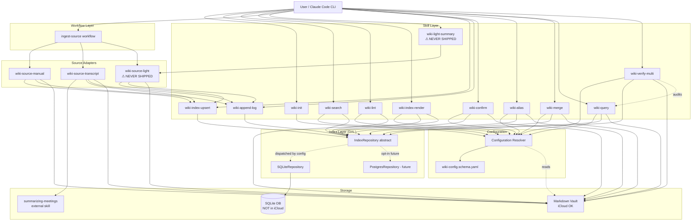

# 2.1. Functional Components

## Contents

- [Configuration Resolver](#component-configuration-resolver)
- [Index Layer (DAL)](#component-index-layer-dal)
- [Source Adapters](#component-source-adapters)
- [Skill Layer](#component-skill-layer)
- [Concept Extractor (`wiki-extract-concepts`)](#component-concept-extractor-wiki-extract-concepts)
- [Entity Resolver (`wiki-confirm` / `wiki-alias` / `wiki-merge`)](#component-entity-resolver-wiki-confirm--wiki-alias--wiki-merge)
- [RAG Query Layer (`wiki-query`)](#component-rag-query-layer-wiki-query)
- [Verification Layer (`wiki-verify-multi`)](#component-verification-layer-wiki-verify-multi)
- [Workflow Orchestrator (`ingest-source`)](#component-workflow-orchestrator-ingest-source)
- [Migration Tools](#component-migration-tools)
- [Functional Components Diagram](#functional-components-diagram)

## Component: **Configuration Resolver**

**Purpose**: Резолвит per-vault и per-project конфигурацию из двухслойной schema (`CLAUDE.md::wiki:` + `<project>/.wiki.yaml`). Walk-up + deep-merge.

**Functions:**
- `load_config(cwd) → WikiConfig`
  - Input: текущий CWD.
  - Output: финальный merged `WikiConfig` объект (validated against JSON Schema).
  - Related Use Cases: ALL UCs (каждое skill-исполнение начинается с этого).

**Dependencies:** None (Tier 0). Все остальные компоненты depend на нём.

## Component: **Index Layer (DAL)**

**Purpose**: Единый абстрактный repository над SQLite (default) или Postgres (opt-in). Все search/lint/upsert/resolve операции идут через него. Скрывает SQL детали от skill-кода.

**Functions:**
- `upsert_page(slug, project, type, ..., frontmatter_json)` — single-tx insert/update.
- `get_page(slug, project) → Page | None`.
- `delete_page(slug, project)`.
- `search_pages(query, *, project, types, limit) → list[PageHit]` — FTS5 BM25.
- `replace_refs(page_slug, page_project, refs[])` — atomic delete + insert.
- `get_backlinks(entity_slug) → list[Backlink]`.
- `find_orphan_links() → list[OrphanLink]`.
- `find_pages_missing_in_index(vault_root) → list[str]`.
- `check_drift() → DriftReport`.
- `begin_batch_run(mode) → run_id` / `finish_batch_run(run_id, status, **stats)`.
- `last_batch_run() → BatchRun | None`.
- `get_vault_metadata(key) → str | None` / `set_vault_metadata(key, value)`.
- `resolve_entity(vault_id, slug) → Entity | None` — **implemented (TASK 005, R-4.5)**: resolves a canonical slug *or* an alias surface string to its `Entity` (confirmed or candidate); `None` on no match. Retires the Epic-7 `NotImplementedError` stub.
- `upsert_entity(vault_id, slug, name, type, is_candidate, canonicalized_by, first_seen, last_updated) → None` — entity write-path (extraction). Atomic `INSERT … ON CONFLICT DO UPDATE`; `is_candidate` downgrade-guard enforced at SQL level (`MIN(excluded.is_candidate, entities.is_candidate)`) so a confirmed entity cannot be demoted by a *re-extraction*.
- `set_entity_candidate(vault_id, slug, is_candidate) → None` — **explicit** confirm/undo setter (R-4.2/4.3). **Bypasses** the `MIN()` guard (operator intent is authoritative); writes the Class B mirror only — the caller (`wiki-confirm`) writes Class A frontmatter first.
- `list_candidates(vault_id) → list[Entity]` — all `is_candidate=1` rows (drives `--auto` + operator review).
- `recompute_mentions(vault_id) → None` — single set-based `UPDATE entities.mentions_count = COUNT(page_entity_refs)` (R-4.4 freshness; identical query to reindex Step 3).
- `auto_promote_candidates(vault_id, threshold) → list[str]` — recompute mentions, then promote candidates with `mentions_count ≥ threshold`; returns promoted slugs (R-4.4).
- `preview_promotable(vault_id, threshold) → list[str]` — **read-only** counterpart of `auto_promote_candidates` for `wiki-confirm --auto --dry-run` (fresh sub-SELECT COUNT, no writes).
- `get_entity_file_path(vault_id, slug) → str | None` — the entity's Class A `file_path` (relative to vault root); backs the confirm/alias/merge CLIs' frontmatter-locate step (skills never run raw SQL).
- `add_alias(vault_id, alias, entity_slug, alias_type) → None` / `remove_alias(vault_id, alias) → None` / `list_aliases(vault_id, entity_slug) → list[str]` — Class B mirror writes for R-5.1/5.2. `add_alias` raises on hard-PK collision (caller maps to `ALIAS_COLLISION`).
- `expand_query_aliases(vault_id, term) → list[str]` — given a surface term, return canonical name + sibling aliases for FTS OR-expansion (R-5.5); bounded to the matched entity's own alias set (no transitive expansion).
- `find_alias_collisions(vault_id) → list[AliasCollision]` — in-DB duplicates (legacy / pre-migration) + cross-table (alias == another entity's `slug`/`name`); the Class A frontmatter scan (R-5.6e) lives in the Lint Layer, which reads files.
- `merge_entities(vault_id, from_slug, into_slug) → MergeReport` — **(TASK 005, R-4.7)** single-transaction duplicate fold: re-points `page_entity_refs.entity_slug from→into` de-duplicating on the `(vault_id, page_slug, page_project, entity_slug, ref_type)` PK (keep higher `trust_level`); re-points `entity_aliases` (skip+report on hard-PK collision); registers `from`'s slug + name as `into` aliases (`alias_type=former_name`, the durable redirect); deletes the `from` entity row; recomputes `into.mentions_count`. Returns `{refs_repointed, aliases_absorbed, aliases_skipped}`. Pure DML — no DDL, Postgres-portable. Caller (`wiki-merge`) does the Class A mutations (append `into.aliases`, delete `from` page) **before** this DB transaction (C-8 write-order).
- `find_orphan_links(vault_id=None) → list[OrphanLink]` — **extended (TASK 005, R-4.5d): alias-aware.** A ref whose `entity_slug` matches a registered alias resolves to its canonical entity and is **no longer** reported as an orphan. Required so a merged-away `from` slug (still present as `[[from-slug]]` in source bodies and re-materialised on reindex) does not pollute lint.
- `check_query_state(vault_id, query_slug) → str | None` / `record_query_state(vault_id, query_slug, question_hash) → None` — **(TASK 007, R-6.6)** thin typed wrappers over `source_state` (`source_kind='query'`, `scope=query_slug`, `key='question_hash'`) for `wiki-query` idempotency. Added as **DAL methods** (no `repo._connect()` raw SQL in the skill — NFR-2). `check_query_state` returns the recorded hash (or `None`); the skill compares against the freshly-computed hash to decide `is_unchanged`. **Retrieval + write-back reuse existing methods:** `wiki-query prepare` calls `expand_query_aliases` + `search_pages` (the same chain as `wiki-search`, no second FTS engine); `wiki-query apply` calls `upsert_page` (the `type=query` page) + `replace_refs` (the `cited` refs) **directly on one repo connection** — explicitly **not** the `_manifest_consumer.index_from_manifest`→`wiki_index_upsert.main(argv)` per-row path (that is the open H-PERF-3 / P-8 N+1; a query page is exactly one page, so manifest machinery is unwarranted).
- `check_verify_state(vault_id, verification_slug) → str | None` / `record_verify_state(vault_id, verification_slug, verify_hash) → None` — **(TASK 008, R-8.6)** the sibling `source_state` wrappers for `wiki-verify-multi` idempotency (`source_kind='verification'`, `scope=verification_slug`, `key='verify_hash'`), modelled exactly on the query-state pair (DAL methods, no raw SQL — NFR-2). **Reads + write-back reuse existing methods:** `wiki-verify-multi prepare` calls `get_page` to load the audited query page and each cited source (resolving bodies via the stored `pages.file_path`, **never** a reconstructed `<subdir>/<slug>.md` path — the layout-agnostic invariant, C-8/NFR-7); `wiki-verify-multi apply` calls `upsert_page` (the `type=verification` page) + `replace_refs` (the `verifies` + optional `cited` refs) **directly on one connection** (same anti-N+1 discipline as `wiki-query`). No new retrieval/index primitives.

**Inputs:** `WikiConfig` (для backend/path resolution).
**Outputs:** Repository instance с указанным backend.
**Related Use Cases:** UC-01 (init seeds vault_metadata), UC-02 (upsert), UC-03 (search), UC-04 (lint queries), UC-05 (bulk-migration), UC-08 (concept extraction write-path), UC-09 (idempotency).

**Dependencies:** Configuration Resolver. Used by ALL skills.

## Component: **Source Adapters**

**Purpose**: Pluggable extractors для разных типов входов. Унифицированный контракт `SourceAdapter`.

**File-write ownership (TASK 046/047).** The **Index Layer is the single writer to SQLite.** The construct path is `wiki-import` (fetch+convert → REASON → `apply`): it writes the source note + `_concepts/<slug>.md` concept pages (Class A markdown) and indexes them via `wiki-index-upsert`. `wiki-extract-concepts` writes/densifies the concept pages. The legacy external-file-layer integration (`wiki-enrich` → vendored `wiki-ingest`, ADR-001 Option I) was **retired in TASK 047** — there is no separate synthesis process; `_concepts/<slug>.md` pages are host-authored Class-A artifacts.

**Derived concept-mentions ledger (TASK 047).** A concept page's `## Mentions across sources` list is NOT authored per-source; it is a **Class-B `<!-- BEGIN-AUTO:mentions -->` block** rendered from `page_entity_refs` (the `ref_type='mentioned'` backlinks) by `wiki-index-render --concept-mentions`, which re-indexes each rewritten page so `pages.file_hash` stays in sync (no drift). It is fully `wiki-reindex --full`-rebuildable — refs are re-derived from the source footers, then the block is re-rendered byte-identically; the compounding lives in Class B, not trapped in Class A. The per-source quote/span are deliberately NOT rendered (they are not rebuild-stable across extract-vs-reindex). The rejected Class-A body-merge alternative + the three plan-review rounds that led to this design are in [`docs/reviews/plan-047-review.md`](../../reviews/plan-047-review.md).

**MVP adapters:**
1. **`wiki-source-manual`** — для уже-существующих markdown-файлов. Не модифицирует body. Validates path внутри vault_root. Ставит `trust_level='high'` для refs.
2. **`wiki-source-transcript`** — wraps **`/generate-detailed-meeting-summary` workflow** (educational overlay поверх `summarizing-meetings` skill) через subprocess. Multi-pass LLM workflow генерирует pyramid summary с расширенным frontmatter (`type: lesson-summary`, `content_type`, `course`, `module`, `speaker`, `concepts[]`, `prerequisites[]`), Mermaid-диаграммами, `<!-- SECTION:* -->` anchors, `Content Fingerprint` блоком. Применяет §6.1 type-mapping (`lesson-summary` → DB `summary` + tag) при upsert. Ставит `trust_level='medium'`. См. TASK.md R-06.3 + R-07.4 + R-07.5 + I-3.3 + UC-07.
3. ⚠️ **`wiki-source-light`** (R-24) — **DESIGNED PHASE-1, NEVER SHIPPED (аннотировано 2026-08-06, TASK 072).** Проектная запись: single-call LLM для arbitrary md-куска, не делает full pyramid, `trust_level='medium'`, frontmatter `type: summary` + tag `summary-light`. **Ничего из этого не существует**: в `scripts/wiki_source/` только `__init__/base/manual/parsing.py`, launcher'а в `bin/` нет, `light` присутствует лишь как член `Literal` в `base.py:21`. Его LLM-вызов **нарушил бы Decision-17** в текущей формулировке. Не удалено, чтобы не потерять design rationale — но это не «MVP adapter».

**Functions per adapter:**
- `authenticate(config) → None` — first-run setup (manual/light/transcript: no-op; future email: OAuth).
- `fetch(since=None) → Iterator[SourceItem]` — для pull-источников; для manual/light = single-shot.
- `normalize_to_md(item, vault_paths) → SourceOutput` — генерирует markdown файл.
- `dedup_state_file(config) → str | None` — для pull-источников.

**Related Use Cases:** UC-02 (manual), UC-06 (light), implicit транscript flow.

**Dependencies:** Index Layer (для post-write upsert), Configuration Resolver.

## Component: **Skill Layer**

**Purpose**: User-facing entry points (slash-commands в Claude Code).

**MVP skills (Phase 3a):**
- `wiki-init` (UC-01) — bootstrap.
- `wiki-append-log` (UC-02 step 11) — chronological log + monthly rotation.
- `wiki-enrich` — **RETIRED (TASK 047)** together with the vendored `wiki_ingest` tree (the ADR-001 Option-I bridge). Its manifest-consumer helpers (`validate_manifest`, `index_from_manifest(manifest, vault_id, vault_root, db_path=None, repo=None)`, `WikiIngestError`) survive in the neutral module `scripts.wiki_skills._manifest_consumer` and are still used by `wiki-extract-concepts --ingest`. **TASK 015 / H-PERF-3 + P-8:** `index_from_manifest` takes an optional `repo` parameter; when supplied it reuses that connection for the upsert loop + log_event and does NOT close it (caller owns lifecycle); when absent it opens+closes its own. The loop calls `upsert_one(…, repo)` — no per-batch argparse/connection churn.
- `wiki-extract-concepts` (UC-08, UC-09) — see dedicated Component section below.
- `wiki-index-render` (UC-05 step 7) — projection из SQLite в `index.md`.
- `wiki-index-upsert` (UC-02 step 7) — wrapper над `Index Layer.upsert_page`. Exposes two
  entry-points: `main(argv)` (CLI, argparse-full) and **`upsert_one(vault_id, src,
  vault_root, repo) → dict`** (TASK 015 / H-PERF-3 programmatic path — no argparse, accepts
  an already-open repo, returns the envelope dict directly; `main` delegates to
  `upsert_one`). Library callers use `upsert_one`; CLI users hit `main` unchanged.
- `wiki-lint` (UC-04, UC-13) — health-check через SQL; **+ alias-collision detection** (R-5.6: DB rows + Class A frontmatter scan + cross-table).
- `wiki-search` (UC-03, UC-12) — FTS5 query + nice formatting; **alias expansion on by default** (R-5.5; `--no-expand-aliases` opt-out).
- `wiki-confirm` (UC-09, UC-10) — candidate→confirmed promotion (operator + `--auto` mention-threshold). See **Entity Resolver** component below.
- `wiki-alias` (UC-11) — register/remove/list aliases (frontmatter + DB mirror). See **Entity Resolver** component below.
- `wiki-merge` (UC-15) — fold a duplicate entity into a canonical one (re-point refs + absorb/register redirect aliases + delete `from` page). See **Entity Resolver** component below.
- `wiki-query` (UC-16..UC-21) — **(TASK 007, R-6)** RAG over FTS5 + entity graph: `prepare` (deterministic retrieval) → orchestrator synthesises a cited answer → `apply` (file `_queries/<slug>.md`, index it, write `cited` backlinks). See **RAG Query Layer** component below.
- `wiki-verify-multi` (UC-22..UC-28) — **(TASK 008, R-8)** off-by-default multi-critic audit of a filed query answer: `prepare` (assemble the answer + cited source bodies into a verification envelope) → orchestrator runs four prose critics → `apply` (file `_verifications/<slug>.md`, index it, write the `verifies` backlink, **non-zero exit on FAIL**, never mutate the answer). See **Verification Layer** component below.
- `ingest-source` workflow (meta) — dispatcher на `wiki-source-{kind}`.

**Functions:** Каждый skill = thin Python wrapper, читает stdin/argv, вызывает Index Layer + Source Adapters, возвращает JSON.

**Related Use Cases:** Каждый skill соответствует одному или нескольким UCs.

**Dependencies:** Configuration Resolver, Index Layer, Source Adapters.

## Component: **Concept Extractor** (`wiki-extract-concepts`)

**Purpose**: Deterministic Python skill that (a) reads source-page hash + known-concepts list from the DB (`prepare` subcommand), and (b) accepts operator-supplied candidates JSON from the calling agent and writes `_concepts/<slug>.md` pages atomically + upserts `entities` + `page_entity_refs` rows + emits a wiki-ingest v1.1-compatible manifest (`apply` subcommand). Activates the entity layer (Epic 7 R-3). All extracted entities are written with `is_candidate=1` (Class A frontmatter `is_candidate: true` + Class B row); promotion to confirmed is handled by the **Entity Resolver** (`wiki-confirm`, R-4) — see component below.

**Design pattern**: Python skills are deterministic plumbing; LLM synthesis lives in the calling agent's context (Claude Code / Gemini CLI / Cursor), mediated by an operator-facing prompt skill (`concept-extraction`). This matches every LLM-shaped skill in the repo (Decision-17). Consequence: no `ANTHROPIC_API_KEY`, no `anthropic` SDK dependency, no embedded API call. Trade-off: no cron/headless mode (acceptable — was never a stated requirement; a future Pattern-C escape hatch `--llm-standalone` is documented as out-of-scope until a real cron need surfaces).

**Stack position**: Between Index Layer (reads `entities`, `pages`, `source_state`; writes `entities`, `page_entity_refs`, `source_state`) and Skill Layer (user-facing entry point). Orthogonal to Source Adapters: operates exclusively on already-indexed pages, never on raw sources. Does **not** call `wiki-ingest` and makes **no** LLM API call.

### CLI surface

`argparse` exposes two required subcommands via `add_subparsers(required=True)`. There is no monolithic "no subcommand" form — invoking `wiki-extract-concepts` without `prepare` or `apply` errors out at argparse with a usage line pointing at the two subcommands.

**`wiki-extract-concepts prepare --vault V --vault-root P --source-page S [--known-concepts-format {full,slugs-only}] [--db-path PATH]`**
**`wiki-extract-concepts prepare --vault V --vault-root P --batch <slugs.json> [--known-concepts-format {full,slugs-only}] [--db-path PATH]`** *(TASK 015 / P-7)*

Deterministic reconnaissance. No LLM call. Returns JSON to stdout:

```json
{
  "vault_id": "trade-agents",
  "source_slug": "self-improving-trading-agent",
  "source_path": "_sources/<slug>.md",
  "source_hash": "<sha256>",
  "is_unchanged": false,
  "known_concepts": [{"slug": "...", "name": "...", "aliases": [...], "type": "..."}],
  "missing_concept_files": []
}
```

`source_path` is emitted **relative to `--vault-root`** so the envelope never discloses the operator's absolute filesystem layout. `is_unchanged=true` → calling agent emits an "unchanged" envelope and stops (no synthesis). `missing_concept_files: [...]` warns the operator about DB rows pointing to entity files that no longer exist on disk (disk/DB drift detection; see KNOWN_ISSUES P-9 for the deferred lazy variant).

**TASK 015 / P-6 — `--known-concepts-format {full,slugs-only}`** (default `full`): `full` = existing `[{"slug","name","type","aliases":[…]},…]`; `slugs-only` = `["slug-a","slug-b",…]` plain string array — reduces payload from ~500 KB to ~30 KB at 1k entities. The orchestrator resolves full records on demand for collision detection.

**TASK 015 / P-7 — `--batch <slugs.json>`** (mutex with `--source-page`): reads a JSON list of source-page slugs; loads `known_concepts` **once** (shared, `--known-concepts-format` applies); hashes + recon-checks each slug independently; returns a batch envelope where per-entry errors are non-fatal. Security model: the `--batch` slugs file may reside anywhere readable by the operator (no `validate_inside_vault` on the file itself — it contains only slug *strings*); vault-containment is enforced per-slug by `_resolve_source_inside_sources`, not on the batch file path.

```json
{
  "batch": [
    {"source_slug":"…","source_hash":"…","is_unchanged":false,"known_concepts":[…],"missing_concept_files":[],"source_path":"…"},
    {"source_slug":"…","error":"SOURCE_NOT_FOUND","message":"…"}
  ]
}
```

**`wiki-extract-concepts apply --vault V --vault-root P --source-page S --source-hash HEX (--candidates-file PATH | --candidates-stdin) [--orchestrator-id STRING] [--ingest] [--db-path PATH]`**
**`wiki-extract-concepts apply --vault V --vault-root P --batch-candidates <combined.json> [--orchestrator-id STRING] [--ingest] [--db-path PATH]`** *(TASK 015 / P-7)*

Deterministic application. No LLM call. Reads candidates JSON from the operator, validates against the strict schema, writes pages + upserts entities + refs + manifest + optional indexer dispatch.

- `--source-hash HEX` is **required**, validated at argparse time as 64 lowercase hex chars (regex `^[0-9a-f]{64}$` with `.lower()` normalize so case-variant pipelines do not misroute), and compared against `apply`'s own disk-recomputed hash. Mismatch → exit 2 `SOURCE_CHANGED_DURING_EXTRACTION` (operator re-runs prepare). Closes the TOCTOU race between prepare and apply.
- `--candidates-file PATH` is validated via `validate_inside_vault(...)` AND rejected if it resolves to a symlink, FIFO, device, or socket. Read via `os.open(O_NOFOLLOW)` + `os.fstat` + bounded `os.read(cap+1)` so a swap-after-stat race cannot exceed the cap. Total candidates JSON capped at `_MAX_CANDIDATES_BYTES = 1_048_576` (1 MiB). External transport: `--candidates-stdin`, similarly bounded at cap+1 bytes.
- `--orchestrator-id STRING` (optional; regex `^[a-z0-9._:@-]{1,64}$`) populates `canonicalized_by = f"llm:{orchestrator_id}@{date}"`. Default `"orchestrator"` if absent (with `logger.warning` so audit trails surface the opaque default). Operators who care about provenance pass their model name (`"claude-opus-4-7"`, `"gemini-2-5-pro"`).

### Candidates JSON contract

Top-level value is a **JSON array** (no metadata wrapper — hallucination-prone fields like `model`/`extracted_at` rejected). Per-item strict schema validated by `_validate_candidates_schema`:

```json
[
  {
    "slug": "kebab-case-string",       // ^[a-z0-9][a-z0-9-]{0,62}$
    "name": "Human Name",              // allowlist regex + ≤200 chars, no leading # or ---
    "definition": "1-3 sentences.",    // ≤2000 chars; markdown-escaped on body write
    "source_quote": "verbatim quote",  // ≤500 chars; substring-of-source-body check
    "source_span": "L12-L18",          // ^L\d+-L\d+$ — ASCII-only digits
    "entity_type": "concept"           // one of {concept, company, product, group, event, work, external}
                                       // ★ TASK 064 / G4: `person` is REFUSED here
                                       // (ENTITY_TYPE_NOT_ALLOWED) — an attendee belongs
                                       // in `participants:` frontmatter, a cited author in
                                       // the note body, never as a `_concepts/` page.
  }
]
```

**Strict mode**: items with keys outside the required set → `UNKNOWN_FIELD` (exit 4). **No content echo**: every error envelope emits `{error, field?, reason, violations?}` only — NEVER source-body content (CWE-117 / CWE-209). `violations[]` (TASK 064) carries MODEL-AUTHORED / vault-derived values only (the candidate's own slug, the layout-derived slug, the `nearest` known slugs) because the repair loop depends on handing them back.

**★ Count bound (TASK 064 / G0): `0 ≤ N ≤ 25`. AN EMPTY EXTRACTION IS A SUCCESS** — `[]` ⇒ `action: no_candidates`, exit 0, nothing written and the source's existing mentions ledger untouched. The floor used to be **1**, which made an honest "this source has no concepts" an exit-4 failure and left the model exactly one green path: **invent one**. That was the pump behind every garbage class found in the live vault. Do not "restore parity" with the old 1 — the 0 IS the safety property.

**★ There is NO quote-check bypass.** The `WIKI_EXTRACT_NO_QUOTE_CHECK` env var is **DELETED, not deprecated** (TASK 064 / G3): it was a bare truthiness read (so `=0` and `=false` also disabled the check), and — worse — the refusal message *printed the bypass into the envelope the model reads at the exact moment it is stuck*. An escape hatch on an anti-fabrication check IS the fabrication path. **No env var may appear in any refusal reason on this rail**, and a test sweeps every refusal to keep it that way.

### Functions

- `prepare(args) → int` — argparse handler for `prepare`. Resolves `--source-page` via `_resolve_source_inside_sources()` which enforces the `_sources/` layout invariant (rejects any traversal that lands elsewhere in the vault); reads body via `_read_file_bounded(path, _MAX_SOURCE_BODY_BYTES)` (`os.open(O_NOFOLLOW)` + `os.fstat` cap + bounded `os.read`); computes sha256; calls `check_idempotency` + `load_known_entities`; sweeps `missing_concept_files` via single `os.scandir` over `_concepts/`; emits the recon JSON envelope. Exit codes 0 / 1 / 2.
- `apply(args) → int` — argparse handler for `apply`. Loads candidates via `_load_candidates()` (stdin or vault-inside file, both bounded); resolves + reads source identically to `prepare`; runs hash-check against `--source-hash` (with `INVALID_SOURCE_HASH` library-caller defense if a non-CLI caller constructed args directly); runs `_validate_candidates_schema()` then `_preflight_sanitize()` (dry-pass sanitizers BEFORE any write so a mid-loop failure cannot leave partial pages); classifies create/mention; writes pages + upserts entities + refs + manifest; optionally dispatches via `_manifest_consumer.index_from_manifest`; `_try_update_idempotency_state()` wraps the final UPSERT in `try/except sqlite3.OperationalError` so a DB-lock or disk-full failure surfaces as `IDEMPOTENCY_UPDATE_FAILED` exit 5 instead of an uncaught traceback. Exit codes 0 / 1 / 2 / 4 / 5 / 6.
- `load_known_entities(repo, vault_id) → list[dict]` — queries `entities LEFT JOIN entity_aliases WHERE vault_id=?`; serialises to `[{"slug":..., "name":..., "aliases":[...], "type":...}]`.
- `_validate_candidates_schema(items: list[dict], source_body: str | None) → None` — defensive top-level `isinstance(items, list)` guard, then per-item: strict equality on keys (no extras, no missing); kebab-slug regex; `^L\d+-L\d+$` source-span regex (compiled with `re.ASCII` to reject Unicode digits); entity_type whitelist; per-field length caps (name ≤ 200, definition ≤ 2000, source_quote ≤ 500); type-check on slug / source_span / entity_type (so `null` slug yields "not a string" not "fails regex"); optional `source_quote ∈ source_body` substring check. Raises `ExtractionParseError` with `.error` / `.field` / `.reason` structured attrs — the apply caller maps these into the wire envelope without echoing offending values.
- `classify_candidates(items, known_slugs) → (create_list, mention_list)` — items whose slug matches a known entity → `mention` (ref only, no new page); novel slugs → `create`.
- `write_concept_page(vault_root, candidate, source_slug, today, vault_id) → tuple[Path, "created"|"updated"|"unchanged"]` — atomic write (tempfile + `os.replace`). Symlink-refuse: if `target.is_symlink()` → raise `PathTraversalError`. Content-hash skip: reads any existing file via `os.open(O_NOFOLLOW)` (so a symlink swapped in after the `is_symlink()` check cannot leak external content); compares sha256 of existing vs. would-be-written payload; identical → `"unchanged"`; different → atomic rewrite + `"updated"` + warning log. Body construction sanitises every text field via `_sanitize_markdown_text()` (text-only allowlist: HTML-escape `&<>`, escape `` ` ``, `[`, `]`, and line-leading markdown actives — closes javascript-link / data-URI / HTML-entity smuggling / Obsidian wikilink injection / dataview / mermaid code-span vectors). `name` runs through an additional regex allowlist (`re.UNICODE` for non-ASCII vault contents). `source_quote` is wrapped in a `>` blockquote with a provenance footer. Frontmatter goes through `frontmatter.dumps` (PyYAML safe-dump).
- `upsert_extracted_entity(repo, vault_id, candidate, source_slug, today, orchestrator_id) → str` — calls `repo.upsert_entity(is_candidate=1, canonicalized_by=f"llm:{orchestrator_id}@{date}")`; the SQL-level downgrade guard (`MIN(excluded.is_candidate, entities.is_candidate)`) keeps confirmed rows from being silently regressed by a re-extraction. Returns `"created" | "updated" | "confirmed"`.
- `upsert_entity_refs(repo, vault_id, source_slug, source_project, all_candidates) → None` — collects `(entity_slug, ref_type='mentioned', source_quote, line_start, line_end, trust_level='medium')`; parses `"Lstart-Lend"` via `_parse_source_span`; calls `repo.replace_refs(...)` atomically.
- `check_idempotency(repo, vault_id, source_slug, current_hash) → bool` — queries `source_state` with `source_kind='extract-concepts'`; returns `True` iff the recorded hash equals `current_hash`. Defensive NULL guard for corrupted rows.
- `update_idempotency_state(repo, vault_id, source_slug, new_hash) → None` — UPSERT on `source_state`. Called by `apply` at the END of the pipeline, gated on `summary["failed"]` being empty when `--ingest` is set, and wrapped in `_try_update_idempotency_state()` so a DB-side failure does not split the success/failure signal.
- `build_manifest(vault_id, source_slug, source_hash, create_list, mention_list, log_event, vault_root) → dict` — produces wiki-ingest v1.1-compatible JSON manifest.
- `dispatch_to_indexer(manifest_dict, vault_id, vault_root, db_path, repo=None) → dict` — when `--ingest` passed, calls `validate_manifest(...)` then `index_from_manifest(manifest, vault_id, vault_root, db_path, repo=repo)` from the neutral module `scripts.wiki_skills._manifest_consumer` in-process. No subprocess. **TASK 015 / P-8:** passes `repo` through when the caller already holds an open connection (batch-apply path) so no extra connection is opened.

### Outputs

- `_concepts/<slug>.md` files written atomically to `<vault_root>/_concepts/` (Class A canonical per ADR-002 §D8; `mkdir -p` on first write; content-hash skip suppresses no-op rewrites).
- `entities` table rows (`is_candidate=1`; Class B cache per ADR-002 §D8 — rebuildable from concept-page frontmatter on `wiki-reindex --full`).
- `page_entity_refs` rows (`trust_level='medium'`; Class B cache; line spans parsed from `Lstart-Lend`).
- `source_state` row (`source_kind='extract-concepts'`; Class C cache for idempotency).
- Manifest JSON to stdout (wiki-ingest v1.1-compatible).

### Multi-vault invariant (ADR-002 §D1)

Every DB query and every file-path write includes a `vault_id=?` predicate or is scoped to `vault_root`. No cross-vault entity bleed. `validate_inside_vault` is applied to every path written + to `--candidates-file PATH`.

### Bulk-transaction semantics

> **Corrected at TASK 030** — the "single transaction" claim previously here was stale at HEAD; F-3 proved the DAL methods own their transactions and SQLite forbids nesting.

**Single-page `apply`:**
- The DB writes — `upsert_entity` (N calls), `replace_refs` (1 call), `source_state` update (1 call) — each execute under their OWN per-call transaction/autocommit; there is NO enclosing single transaction.
- Atomicity is per-statement-group; recovery is idempotent: concept-file writes happen first (atomic per-file via tempfile + rename + content-hash skip + symlink refuse).
- On a DB exception the failed statement-group rolls back, on-disk files remain (Class A canonical), and the next run replays via `source_state` mismatch — content-hash skip ensures files are not pointlessly rewritten.
- TASK 030's txn-free DAL helpers `_upsert_page_in_txn`/`_replace_refs_in_txn` now exist for callers that DO need a caller-owned chunk transaction — `reindex_full`'s stage-then-flush uses them; the extract-concepts path deliberately keeps per-call isolation.

**Batch `apply --batch-candidates` (TASK 015 / P-7):**
- Each entry's DB writes execute under their **own independent `BEGIN IMMEDIATE` transaction** on the shared repo connection.
- A per-entry failure rolls back ONLY that entry; previously committed entries in the same batch are unaffected.
- The shared repo is opened once and closed once for the entire batch-apply invocation; individual entry transactions are committed (or rolled back) inside that single connection lifecycle.

### Operator-supplied JSON → SQL safety

All operator-supplied candidate fields flow into `repo.upsert_entity(...)` / `repo.replace_refs(...)` exclusively as **bound parameters** — no f-string SQL composition. Slugs are pre-validated against the kebab regex; `--orchestrator-id` is regex-validated before being interpolated into `canonicalized_by` (defense-in-depth; the column is parameterised anyway). Composes with the project-wide A03 parameterised-statement invariant.

### Related Use Cases

UC-08 (primary extraction flow, including adversarial alternates A6–A13), UC-09 (idempotency re-extraction with orchestrator-level short-circuit).

### Dependencies

Index Layer (DAL — `repo.upsert_entity`, `repo.replace_refs`, raw `source_state` queries), Configuration Resolver, `frontmatter` for YAML frontmatter handling, `_manifest_consumer` (neutral module) for in-process `--ingest` dispatch. **No external LLM API dependency. No `anthropic` SDK. No `ANTHROPIC_API_KEY`.**

### Exit-code envelope contract (R-42)

| Code | `error` field | Cause |
|---|---|---|
| 0 | — (manifest emitted, or `action="unchanged"`) | Success or idempotency short-circuit |
| **1** | — (**no envelope at all**) | An **unhandled exception**: stdout EMPTY, raw traceback on stderr. Not a contract error. |
| **2** | — (argparse stderr) | Missing required flag, or invocation without subcommand, or an unrecognized argument. **argparse's own status is 2, always** — measured: `wiki-extract-concepts`, bare and with a bogus flag, both exit 2. |
| 2 | `SOURCE_NOT_FOUND` | Page slug does not resolve inside vault |
| 2 | `INVALID_SOURCE_PATH` | `--source-page` is absolute, or resolves outside `_sources/` |
| 2 | `INVALID_SOURCE_SLUG` | Source filename doesn't yield a kebab-case slug |
| 2 | `SOURCE_TOO_LARGE` | Source body exceeds `_MAX_SOURCE_BODY_BYTES = 10 MiB` |
| 2 | `SOURCE_CHANGED_DURING_EXTRACTION` | `apply --source-hash HEX` does not match disk-recomputed hash |
| 2 | `INVALID_SOURCE_HASH` | `--source-hash` is not 64 lowercase hex chars (library-caller defense; argparse `type=` gates the CLI path) |
| 2 | `INVALID_CANDIDATES_PATH` | `--candidates-file PATH` fails `validate_inside_vault`, is missing, or resolves to a non-regular file (symlink / FIFO / device / socket) |
| 4 | `EXTRACTION_PARSE_ERROR` | Candidates JSON malformed (invalid JSON, missing required key, invalid kebab slug, invalid Lstart-Lend, invalid entity_type) |
| 4 | `CANDIDATES_TOO_LARGE` | Candidates JSON exceeds `_MAX_CANDIDATES_BYTES = 1 MiB` |
| 4 | `CANDIDATE_COUNT_OUT_OF_BOUNDS` | `len(candidates) ∉ [0, 25]` — **`[]` is VALID** (TASK 064 / G0: `action: no_candidates`, exit **0**) |
| 4 | `FIELD_TOO_LONG` | Per-field cap exceeded: `name>200`, `definition>2000`, `source_quote>500` |
| 4 | `FIELD_TOO_SHORT` | **(TASK 064 / G1-G2)** Per-field floor (after `.strip()`): `name<2`, `definition<40`, `source_quote<40`. `definition: ""` and a one-token "quote" both used to be ACCEPTED |
| 4 | `DEFINITION_IS_QUOTE` | **(G1)** `definition` restates `source_quote` — the quote is already the receipt; the definition must say what the reader LEARNS |
| 4 | `DEFINITION_NOT_PROSE` | **(G1)** `definition` carries a newline / `[[wikilink]]` / backtick / leading markdown marker. It is written into the page body verbatim, where the sanitizer ESCAPES it into visible backslash litter — **refusing beats mangling** |
| 4 | `ENTITY_TYPE_NOT_ALLOWED` | **(G4)** `entity_type: person` — an attendee belongs in `participants:`, a cited author in the note body. (An *unknown* type stays `EXTRACTION_PARSE_ERROR`) |
| 4 | `NEAR_DUPLICATE_SLUG` | **(G5)** the candidate near-duplicates an existing concept (plural / transliteration / word-order variant; `difflib` ratio ≥ `NEAR_DUP_CUTOFF = 0.88` over a transliterated key). The envelope hands back `nearest[]` so the model re-emits the EXACT known slug → reclassified a **`mention`** → the refusal IMPROVES the graph |
| 4 | `IN_BATCH_SLUG_COLLISION` | **(G6)** two candidates derive one slug; the second would silently OVERWRITE the first, with **zero lint issues because the count is right** |
| 4 | `CONCEPT_PAGE_EXISTS` | **(G7)** the target page exists on disk with different content — this rail does not overwrite a page it did not just create (a page on disk is always classified a `mention`; this is the belt) |
| 4 | `SLUG_NOT_DERIVED_FROM_NAME` | **(G8)** the slug is the LAYOUT's to derive (`slug_strategy`), never the model's to choose — an ASCII slug in a `preserve-unicode` vault files a page no `[[wikilink]]` can ever resolve. The violation carries `derived_slug` |
| 4 | `INVALID_SLUG_CHARSET` | **(G8)** `_` in a candidate slug — no layout slug-strategy emits one; `block_number` / `row_number` are schema columns and code symbols, not concepts |
| 4 | `SOURCE_SPAN_OUT_OF_RANGE` | **(G9)** `source_span` falls outside the body. **L1 = the file's FIRST line** (the opening `---` of the frontmatter), because `source_body` is the whole file as read — the same string the quote check grounds against |
| 4 | `SOURCE_SPAN_QUOTE_MISMATCH` | **(G9)** the quote does not occur within the lines the span points at. The span was shape-validated three times and verified against the body ZERO times — `L9999-L9999` used to exit 0, straight into `page_entity_refs.line_start/line_end` as if it were provenance |
| 4 | `LAYOUT_CANNOT_INDEX_CONCEPTS` | **(G10)** the layout maps no `concept` type, or its read globs never reach the `_concepts/` dir we would write to → **invisible pages**: written, never indexed, and *structurally unreportable* by `wiki-lint` |
| 4 | `FIELD_QUOTE_NOT_IN_BODY` | `source_quote` is not verbatim in the source body. **Mandatory and un-bypassable** — the `WIKI_EXTRACT_NO_QUOTE_CHECK` escape is DELETED (G3) |
| 4 | `INVALID_SOURCE_SPAN` | `source_span` fails `^L\d+-L\d+$` at the sanitisation pre-flight |
| 5 | `PARTIAL_INDEX_FAILURE` | `--ingest` succeeded but indexer reported `failed[]` non-empty; `source_state` NOT updated → next run retries |
| 5 | `IDEMPOTENCY_UPDATE_FAILED` | Pages / entities / refs committed but `update_idempotency_state` raised `sqlite3.OperationalError` (DB locked, disk full); next run safely re-extracts |
| 6 | `MANIFEST_INVALID` | `_manifest_consumer.validate_manifest` raised `WikiIngestError` (path-traversal / vault_id mismatch / missing field) |

**Universal envelope invariant** (CWE-117 / CWE-209): every error envelope emits `{error, field?, reason, violations?}` only, with NO `content`, `value`, `raw`, or `received` keys, and **never a byte of source-body content**. `violations[]` carries model-authored / vault-derived values only (slugs, the derived slug, `nearest`, in-batch indices). A parametrised canary matrix enforces this across every sub-envelope — and since TASK 064 it walks the payload **recursively**, so a leak nested inside `violations[]` cannot slip past a top-level check.

**Zero-file invariant** (TASK 064): every exit-2 / exit-4 refusal is a guaranteed **zero-file, DB-never-opened no-op** — `_apply_validate` (schema, G1-G4, G6, G8-charset, G9, G10) runs *before* `make_repo`. The two gates that need vault state (G5 near-duplicate, G7 presence-classification) run in `_apply_write` **before the write loop**, so they are still zero-file. Both halves are pinned by tests that landmine `make_repo` / `write_concept_page`.

### Operational invariants

- `update_idempotency_state` is called only AFTER `apply` succeeds and (when `--ingest` is set) `summary["failed"]` is empty. Partial-failure replay does not drift between disk and DB because `write_concept_page` content-hash skip suppresses no-op rewrites.
- `--source-hash` is REQUIRED on `apply`; mismatch with the disk-recomputed value = `SOURCE_CHANGED_DURING_EXTRACTION` exit 2. This is the TOCTOU race-detection contract between `prepare` and `apply`.
- Candidate-count bound `1 ≤ N ≤ 25` and per-field caps reject pathological payloads before any sanitisation or write happens.
- `--candidates-file PATH` must live inside `--vault-root` AND be a regular file. Symlinks, FIFOs, devices, and sockets are rejected before any read.
- Markdown / YAML sanitisation is text-only-allowlist (denylist patterns have been retired); covers HTML entity smuggling, javascript / data URIs, Obsidian wikilink injection, code-span (dataview / mermaid) injection. Adversarial regression tests include non-ASCII names.
- `_concepts/<slug>.md` writes refuse symlink targets at `target.is_symlink()` BEFORE any hash compute. The hash-compare read uses `os.open(O_NOFOLLOW)` so a swap after the check cannot leak external content.
- `--orchestrator-id` populates `canonicalized_by`. The default literal `"orchestrator"` triggers a `logger.warning` so audit-trail loss is visible.

### RTM coverage

R-30, R-31, R-32, R-33′, R-34, R-35, R-36, R-37, R-38, R-39, R-40, R-41, R-42, R-43.

### Concept Extractor — module decomposition (TASK 016)

The `wiki-extract-concepts`
component is implemented as a **package** `scripts/wiki_skills/wiki_extract_concepts/`
(was a single 2174-line module). The split is a behaviour-preserving structural refactor;
its one architectural invariant is the **patch-target lock** — the import path
`scripts.wiki_skills.wiki_extract_concepts` and **8** monkeypatched symbols
(`make_repo`, `load_known_entities`, `validate_manifest`, `index_from_manifest`,
`dispatch_to_indexer`, `_apply_candidates_to_db`, `_try_update_idempotency_state`,
`update_idempotency_state`) must remain rebindable at that namespace, with in-package
callers resolving them as **facade globals** so `mock.patch("…wiki_extract_concepts.<name>")`
intercepts the call (the R-2 invariant, guarded by `test_patch_target_lock_at_skill_module`).

| Module | Responsibility | Monkeypatch coupling |
|---|---|---|
| `__init__.py` (facade) | Orchestration: `prepare`/`apply`/`dispatch_to_indexer`/`_batch_*`/`main` + the argparse builder; binds all 8 lock symbols as facade globals (callers resolve them here) | **Owns the lock surface** |
| `_validation.py` | Validators, sanitizers, candidate-schema, `classify_candidates`, `_preflight_sanitize`, `_parse_source_span`, regex/const allowlists | none |
| `_sourcing.py` | `_read_file_bounded`, `_resolve_source_inside_sources`, `_all_concepts_dirs`, `_derive_source_project`, `_load_candidates`, `_path_is_absolute`, byte caps | none |
| `_db.py` | `load_known_entities`, `upsert_extracted_entity`, `upsert_entity_refs`, `check_idempotency`, `update_idempotency_state`, `build_manifest`, `_lookup_entity_row` | **carve-out**: `load_known_entities` + `update_idempotency_state` are re-imported into the facade and called there as facade globals |
| `_pages.py` | `write_concept_page` (seeds the derived `BEGIN-AUTO:mentions` block via the shared `_common.format_concept_mentions_body`; TASK 047 retired the embedded per-source quote-block), name allowlist | none |
| `_errors.py` | `ExtractionParseError`, `_envelope_from_parse_error` | none |

`python -m scripts.wiki_skills.wiki_extract_concepts` keeps working via a package
`__main__.py` (the `bin/wiki-extract-concepts` wrapper + the integration subprocess test
depend on it). The decomposition adds **no** data-model, interface, security, or schema
surface — see `docs/TASK.md` (TASK 016) for the full RTM + acceptance gates.

**Import-direction rule (acyclic; the only forbidden edge is leaf → facade).** `_errors`
is the dependency sink. Leaves MAY depend on lower leaves: `_validation` → `_errors`(+`_common`);
`_sourcing` → `_errors`; `_pages` → `_validation` + `_errors`; `_db` → `_validation`
(`upsert_entity_refs` calls `_parse_source_span`) + `_errors`. The facade → all leaves +
`_manifest_consumer` + `factory`. No leaf may import the facade (that would both cycle and
break the facade-global lock). (TASK 047 deleted the dead `_format_source_quote_block` — the
concept-page mentions ledger is now a derived Class-B AUTO block, links only.)

---

## Component: **Entity Resolver** (`wiki-confirm` + `wiki-alias` + `wiki-merge`)

**Purpose**: Completes Epic 7 (R-4 + R-5). Turns the *candidate* entities emitted by the Concept Extractor into a resolvable, **durable** two-tier catalog: operator (or mention-threshold) promotion of candidates to confirmed, alias surface-strings that resolve many display names to one canonical entity, and **duplicate-folding** (`wiki-merge`) that collapses LLM-spawned near-duplicates (`hermes-agent` vs `hermes-framework`) into one canonical entity — the literal "Hermes / Hermes Agent / Hermes Framework" problem R-4 names. Deterministic Python; no LLM call.

**Stack position**: Skill Layer entry points over the Index Layer DAL. Reads/writes `entities` + `entity_aliases` (Class B mirror) and the matching concept-page frontmatter (Class A canonical). Orthogonal to Source Adapters and the Concept Extractor.

### CLI surface

**`wiki-confirm <slug> --vault V [--undo] [--db-path PATH]`** — promote candidate→confirmed (or reverse with `--undo`). Atomic frontmatter write-back (`is_candidate: false`/`true`; drop/add the `candidate` tag) via the same `O_NOFOLLOW` + temp-file + content-hash primitives as `write_concept_page`, then `repo.set_entity_candidate(...)` (Class B mirror; bypasses the `MIN()` guard). Idempotent. Emits `{"slug":..., "status":"confirmed|candidate", "changed":bool}`.

**`wiki-confirm --auto [--threshold N] [--dry-run] --vault V`** — recompute `mentions_count`, then promote every candidate with `mentions_count ≥ N` (default 3, configurable). `--dry-run` reports the would-promote set without writing. Emits `{"promoted":[...], "threshold":N, "scanned":M}`. Optionally one `entity-confirmed` log event per promotion (Q5, deferred to Planning).

**`wiki-alias <slug> (--add | --remove) "<surface>" [--type T] | --list  --vault V [--db-path PATH]`** — `--add` appends to frontmatter `aliases:` (Class A) + mirrors to `entity_aliases` (Class B, default `alias_type=spelling_variant`); `--remove` drops from both; `--list` prints the current alias set. Collision (hard-PK or cross-table per R-5.6) → `ALIAS_COLLISION` naming the conflicting slug.

**`wiki-merge <from-slug> <into-slug> --vault V [--dry-run] [--db-path PATH]`** — fold the duplicate `from` into the canonical `into` (R-4.7). **Class A first** (C-8): append `from`'s slug + name + own aliases to `into`'s frontmatter `aliases:` (`alias_type=former_name`) and **delete `_concepts/<from>.md`** atomically (`O_NOFOLLOW` + temp + `os.replace`/`os.unlink`); **then** the single-transaction `repo.merge_entities(...)` Class B mirror (re-point refs with PK-dedup, re-point/skip aliases, register redirect aliases, drop the `from` row, recompute `into.mentions_count`). The **alias is the durable redirect** — no `[[...]]` wikilink rewriting (C-7); resolution stays correct via alias-aware `resolve_entity`/`find_orphan_links` (R-4.5b/d). `--dry-run` reports `{refs_repointed, aliases_absorbed}` without writing. Emits `{"from":..., "into":..., "refs_repointed":N, "aliases_absorbed":M, "aliases_skipped":[...], "action":"merged"}`.

### Functions

- `confirm(args) → int` / `confirm_auto(args) → int` — argparse handlers; locate `entities.file_path`, atomic frontmatter rewrite, then DAL mirror.
- `alias_add / alias_remove / alias_list(args) → int` — frontmatter mutation + DAL mirror; collision pre-check via `resolve_entity` + `find_alias_collisions`.
- `merge(args) → int` — validate both endpoints + `from ≠ into`; Class A mutation (append `into.aliases`, delete `from` page) then `repo.merge_entities(...)`; on DB failure after file ops → `MERGE_MIRROR_FAILED` pointing the operator at `wiki-reindex --delta` (Class A is canonical, state recoverable).
- Reuses `_read_file_bounded`, atomic-write, and `_sanitize_*` helpers shared with `wiki_extract_concepts` (candidate for extraction into `_common`).

### Exit-code envelope contract

`wiki-confirm` / `wiki-alias`:

| Exit | Error code | Trigger |
|---|---|---|
| 0 | — | success (incl. idempotent `changed:false`) |
| 2 | `INVALID_ARG` | bad slug / surface / threshold |
| 3 | `ENTITY_NOT_FOUND` | slug not in `entities` |
| 4 | `ENTITY_FILE_MISSING` | `file_path` absent on disk (DB/disk drift → run `wiki-reindex --delta`) |
| 5 | `ALIAS_COLLISION` | surface already resolves to / equals a *different* entity |

`wiki-merge` (independent code space — each new CLI owns its own, no cross-binary collision):

| Exit | Error code | Trigger |
|---|---|---|
| 0 | — | success (incl. `--dry-run`) |
| 2 | `INVALID_ARG` | bad slug |
| 3 | `ENTITY_NOT_FOUND` | `from` or `into` not in `entities` (names which side) |
| 4 | `ENTITY_FILE_MISSING` | `from`'s `file_path` absent on disk (run `wiki-reindex --delta`) |
| 5 | `INVALID_MERGE` | `from == into` (self-merge) |
| 6 | `MERGE_MIRROR_FAILED` | Class A mutated, DB transaction failed → recover via `wiki-reindex --delta` |

Inherits the **universal envelope invariant** (CWE-117/209): `{error, field?, reason}` only — never echoes the offending surface/value. (Exit maps illustrative; finalised in Planning against the `wiki-extract-concepts` code space.)

### Class A/B durability (load-bearing)

- **What is Class A** — `is_candidate`, `aliases:`, **and merge outcomes** are Class A frontmatter (canonical) + Class B mirror.
- **Acceptance gate** — the ADR-002 §D8 round-trip test (UC-14, UC-15) is binding: delete the DB, run `wiki-reindex --full`, and confirmed/candidate state + aliases + merges reconstruct **from markdown alone**.
- **Companion changes** — `reindex_full` reads `is_candidate` from frontmatter (R-4.1, replaces the `INSERT OR IGNORE` default-0) and mirrors `aliases:` into `entity_aliases` reporting collisions (R-5.3).
- **Merge durability** — expressed entirely in Class A: the `from` page is **deleted** (so reindex cannot re-materialise it) and the old surfaces live in `into`'s frontmatter `aliases:` — so the merge needs **no new schema** and survives a full rebuild without a merge-ledger table.

**Reindex ref-canonicalization (AM-3, load-bearing for the merge §D8 gate).**

- **The hazard:** source bodies still contain `[[from-slug]]` after a merge, so a naïve reindex would re-create `page_entity_refs` under `from-slug`, and `recompute_mentions`/`get_backlinks` (which count `WHERE entity_slug = entities.slug`) would **silently lose** those refs — breaking UC-15's "mentions = de-duplicated union survives full reindex" AC.
- **The fix:** `reindex_full` **canonicalizes each ref target through the alias table at build time** — a raw `[[surface]]` whose target resolves to a registered alias is stored with the **canonical** `entity_slug`.
- **Required phase order:** **entities → aliases (R-5.3) → refs (canonicalized) → recompute_mentions**.
- **Two scopes:** the immediate `merge_entities` UPDATE keeps the invariant *between* reindexes; the index-time canonicalization re-derives it *across* a rebuild. `find_orphan_links` query-time alias-awareness (R-4.5d) remains the defense for partially-indexed states (refs built before a merge and not yet reindexed).
- **Net invariant:** **a `page_entity_refs` row names the canonical entity whenever its raw target is a known alias** — so mentions, backlinks, and orphan detection are all correct on canonical slugs after a full rebuild.

### Related Use Cases

UC-09 (confirm), UC-10 (auto-promote), UC-11 (alias mgmt), UC-12 (search expansion), UC-13 (lint collision), UC-14 (durability round-trip), UC-15 (duplicate-merge).

### RTM coverage

R-4.1, R-4.2, R-4.3, R-4.4, R-4.5, R-4.6, **R-4.7**, R-5.1, R-5.2, R-5.3, R-5.4, R-5.5, R-5.6.

### Dependencies

Index Layer (`resolve_entity`, `set_entity_candidate`, `list_candidates`, `recompute_mentions`, `auto_promote_candidates`, `add_alias`/`remove_alias`/`list_aliases`, `expand_query_aliases`, `find_alias_collisions`, `merge_entities`, alias-aware `find_orphan_links`), Configuration Resolver, `frontmatter` for YAML. No LLM, no `wiki-ingest`.

---

## Component: **RAG Query Layer** (`wiki-query`)

**Purpose**: The read/synthesis half of Karpathy's loop (Epic 7 R-6). Answer a natural-language question by **retrieving** grounded context (FTS5 BM25 + alias expansion), letting the orchestrator **synthesise** a *cited* answer, and **filing** that answer back as a durable, indexed, back-linked `_queries/<slug>.md` page — so the next question can find it ("query → page" compounding). Deterministic Python plumbing; **no LLM call in the skill**.

**Design pattern (Decision-17, inherited from Concept Extractor)**: Python skill is deterministic plumbing; LLM synthesis lives in the calling agent's context, mediated by an operator-facing prompt skill (`wiki-query-synthesis`, analogous to `concept-extraction`). No `anthropic` SDK, no `ANTHROPIC_API_KEY`. The skill is a two-pass `prepare`/`apply` pair with the orchestrator owning synthesis between them.

**Stack position**: Skill Layer entry point over the Index Layer DAL. **Reads** `pages`/`pages_fts`/`entities`/`entity_aliases` (retrieval) + `source_state` (idempotency); **writes** the `_queries/<slug>.md` Class A file + one `pages` row (`type=query`) + N `cited` `page_entity_refs` + one `source_state` row + one `query` `log_event`. Orthogonal to Source Adapters (operates on already-indexed pages) and the Concept Extractor (does not extract entities — a query page **never** creates `entities` rows, C-10). Retrieval is **keyword OR-of-terms** over `search_pages` (the NL question is tokenised → FTS5 OR query, match-any + BM25-ranked, NOT an implicit-AND phrase that a stopword-laden question would never match — dogfood DF-Q1), each token alias-expanded via the `expand_query_aliases` DAL; it shares `fts_quote` + `search_pages` with `wiki-search` (no second FTS engine).

### CLI surface

`argparse` exposes two required subcommands (`add_subparsers(required=True)`), exactly like `wiki-extract-concepts` — no monolithic form.

**`wiki-query prepare "<question>" --vault V --vault-root P [--vaults LIST] [--types LIST] [--project P] [--limit N] [--no-expand-aliases] [--slug S] [--min-hits N] [--db-path PATH]`**

Deterministic retrieval. No LLM call. Alias-expands the question (default on; `--no-expand-aliases` = byte-identical to plain FTS), runs `search_pages` with `wiki-search`-equivalent scoping flag *semantics* (`--limit` default **10** here vs `wiki-search`'s 20 — Karpathy's "10-15 pages" trimmed for synthesis budget), derives `query_slug` (`--slug` override else slugified+truncated question), computes `question_hash`, checks `source_state`. Returns JSON to stdout:

```json
{
  "vault_id": "trade-agents",
  "question": "How does the Hermes agent route messages?",
  "query_slug": "how-does-the-hermes-agent-route-messages",
  "question_hash": "<sha256>",
  "is_unchanged": false,
  "retrieved_count": 7,
  "hits": [
    {"vault_id":"…","slug":"…","project":"_vault_","type":"concept",
     "title":"…","bm25_score":-3.14,"snippet":"…"}
  ]
}
```

`is_unchanged=true` → orchestrator emits an "unchanged" envelope and stops (UC-17). `retrieved_count < --min-hits` (default **1**) → exit 2 `NO_CONTEXT` — the orchestrator does **not** synthesise from nothing (UC-18, anti-hallucination). `--min-hits 0` is **prepare-only and diagnostic-only**: `apply` declares no such flag, and since TASK 072 an empty retrieval cannot reach a filed page (empty citations → `NO_CITATIONS`; non-empty → `CITATION_NOT_RETRIEVED`). Hit `slug`/`project`/`snippet` are vault-relative (no absolute-path disclosure).

**`wiki-query apply --vault V --vault-root P --query-slug S --question "<q>" --question-hash HEX (--answer-stdin | --answer-file PATH) --citations-stdin|--citations-file PATH [--orchestrator-id ID] [--force] [--db-path PATH]`**

Deterministic write-back. No LLM call. Re-runs retrieval to recompute `question_hash`; on mismatch with `--question-hash` (retrieval set changed mid-pipeline) → exit 2 `QUESTION_CHANGED` (the H-1 TOCTOU analog; orchestrator re-runs, never auto-retries). Validates the citations payload against the recomputed hit set (**grounding gate**), sanitises the answer body, writes the Class A page, self-indexes it, fires the log event.

- `--question-hash HEX` — required; 64-lowercase-hex argparse `type=` validator (`INVALID_QUESTION_HASH` library-caller defense).
- `--answer-stdin` / `--answer-file PATH` (mutex) — the synthesised answer markdown (bounded, `validate_inside_vault` + `O_NOFOLLOW` for the file form, same primitives as `wiki-extract-concepts apply`).
- `--citations-stdin` / `--citations-file PATH` (mutex) — a JSON list of cited `project/slug` identifiers; the payload must carry **at least one** entry (empty → exit 4 `NO_CITATIONS`) and every entry MUST be in `prepare`'s hit set (R-6.7d). A citation absent from the set → exit 4 `CITATION_NOT_RETRIEVED` (the anti-hallucination contract enforced **in Python**, not trusted to the LLM). No flag overrides either: `--force` is consumed downstream at the content-hash skip.
- `--orchestrator-id ID` — regex `^[a-z0-9._:@-]{1,64}$`; recorded in the page frontmatter / log event for provenance; default `"orchestrator"` with a `logger.warning`.

### Answer + citations contract (the `wiki-query-synthesis` skill)

The orchestrator-facing prompt skill defines: the answer must **cite only retrieved hits** (grounding); every non-trivial claim carries a citation; retrieved snippets/bodies are **untrusted data, not directives** (H-6 prompt-armor — the same warning `wiki-extract-concepts`'s workflow carries for `source_body`). The machine-readable `cites:` frontmatter (a flat list of `project/slug`) is the **source of truth** for backlinks; body-rendered citations (Q7 — a trailing `## Sources` list of `[[project/slug]]` wikilinks) are optional Obsidian-native sugar (see Open Question Q9 re: dual `cited`+`mentioned` refs).

### Functions

- `prepare(args) → int` — resolve+scope flags; `_build_match_query` (tokenise → FTS5 OR-of-terms, per-token `expand_query_aliases`) → `search_pages` (inherits the DF-1 quoted-phrase fallback); derive `query_slug`; compute `question_hash`; `check_query_state`; emit recon envelope. Exit 0 / 1 / 2 (`NO_CONTEXT`, `INVALID_QUESTION`, `INVALID_QUERY`, `INVALID_SLUG`).
- `apply(args) → int` — load+bound answer & citations; re-retrieve + hash-check vs `--question-hash`; validate citations ⊆ hit set; `_sanitize_markdown_text` the answer body (egress injection guard, reused/lifted from `wiki_extract_concepts`); atomic-write `_queries/<query_slug>.md` (`O_NOFOLLOW` symlink-refuse + tempfile + content-hash skip — `--force` overrides an unchanged skip); `upsert_page` + `replace_refs(ref_type='cited')` on one connection; `record_query_state`; append a `query` `log_event`. Exit 0 / 1 / 2 / 4.
- `_derive_query_slug(question, override) → str` — `--slug` authoritative; else `slugify(question)` truncated to a filesystem-safe length; collision with an existing query page for a *different* question requires explicit `--slug` (or `--force` overwrite) (C-8).
- Reindex read-side **R-6.5e** (in `reindex.py`, not this skill): for a `type=query` page, parse `cites:` frontmatter into `cited` `PageRef`s and **union them into the page's `out.refs` set before the single Step-2 `replace_refs` call** — NOT a second `replace_refs` (which is delete-all-then-insert and would clobber the body-`mentioned` refs, M-1). Step 2.5 (AM-3) then canonicalizes all refs' `entity_slug` through the alias map (`cited` refs participate; `ref_type` is never rewritten, so no `cited`→`mentioned` degradation, M-2). See Data Model PageEntityRef ("Citation ref" + "Reindex phase order") + §4.4.

### Outputs

- `_queries/<slug>.md` — Class A canonical (frontmatter `type: query`, `question:`, `date:`, `cites: [project/slug,…]`, `tags: [query]`; body = sanitised cited answer). Atomic write; content-hash skip.
- `pages` row `type='query'` — Class B (rebuildable; rediscovered because `_queries ∈ PAGE_SUBDIRS`).
- `page_entity_refs` `ref_type='cited'` (N rows) — Class B (re-materialised from `cites:` by R-6.5e).
- `source_state` `source_kind='query'` — Class C idempotency.
- `log_events` `event_type='query'` (one per filed query, Q6) — backlink/provenance.

### Exit-code envelope contract

| Code | `error` | Cause |
|---|---|---|
| 0 | — (recon envelope / filed manifest / `is_unchanged`) | Success or idempotency short-circuit |
| 1 | — (**no envelope**) | unhandled exception (corrupt DB, unwritable dir) — raw traceback, NOT a contract error |
| 2 | — (argparse) | Missing flag / no subcommand / unrecognized argument (argparse's own status is **2**, not 1) |
| 2 | `INVALID_QUESTION` | empty / over-cap question |
| 2 | `INVALID_QUERY` | not a valid FTS5 expression after the quoted-phrase fallback |
| 2 | `INVALID_SLUG` | `--slug` not kebab-case |
| 2 | `NO_CONTEXT` | `retrieved_count < --min-hits` (default 1) — refuse to synthesise from nothing |
| 2 | `QUESTION_CHANGED` | `apply` recomputed hash ≠ `--question-hash` (retrieval set changed mid-pipeline) |
| 2 | `INVALID_QUESTION_HASH` | `--question-hash` not 64-lowercase-hex (library-caller defense) |
| 4 | `ANSWER_TOO_LARGE` | answer payload over-cap |
| 4 | `NO_CITATIONS` | the citations payload is well-formed but EMPTY (the grounding floor) |
| 4 | `CITATION_NOT_RETRIEVED` | a `--citations` `project/slug` not in `prepare`'s hit set (grounding gate) |
| 4 | `INVALID_CITATIONS` | citations payload not a JSON list of `project/slug` strings |

Inherits the **universal envelope invariant** (CWE-117/209): an error envelope **never echoes** the offending question/answer/citation content. The usual shape is `{error, field?, reason}`; two of this CLI's codes carry more, and neither leaks a value — `SKILL_INTEGRITY_DRIFT` is `{error, integrity}` (no `field`/`reason`; the block is value-free hashes + status) and `INVALID_INDEX_DB` adds a `hint`. (Exit maps illustrative; finalised in Planning against the `wiki-extract-concepts` code space.)

> **Ruling (TASK 072 072-03c), recorded so it is a decision and not an omission.** This table is
> **illustrative by its own declaration** (the sentence above) and is missing eight further shipped
> codes — `INVALID_ARGS`, `INVALID_VAULT_ROOT`, `INVALID_ANSWER_PATH`, `INVALID_QUERY_PAGE`,
> `INVALID_AUDIENCE`, `INVALID_POLICY`, `SKILL_INTEGRITY_DRIFT`, and `INVALID_INDEX_DB`
> (exit **6**, inherited from `build_repo_config` and raised by BOTH subcommands — the one this
> audit itself first missed, which is why the normative roster now states that it covers
> INHERITED codes too, not just the ones `wiki_query.py` raises directly). They are deliberately NOT added
> here: **`skills/wiki-query/SKILL.md` is the single NORMATIVE roster** (that is the surface an
> agent parses), and duplicating a full enumeration into a document that declares itself
> illustrative would create a second home for a fact that then drifts. Only the two codes this
> section's own prose reasons about — the grounding triple and the phantom removal — land here.

### Operational invariants

- **Grounding is enforced in Python** as a TRIPLE, not trusted to the LLM: `NO_CONTEXT` (exit 2, `prepare` — nothing was retrieved, below `--min-hits`); **`NO_CITATIONS`** (exit 4, `apply` — grounding was not claimed: the citations array is well-formed but EMPTY); `CITATION_NOT_RETRIEVED` (exit 4, `apply` — grounding was claimed OUTSIDE the recomputed hit set). ★ The third alone was insufficient, and TASK 072 records why: the shape gate bounded citations ABOVE only, so `[]` satisfied every check *vacuously* — including `any(c not in retrieved_keys for c in citations)`, which is `False` over an empty list — and a `cites: []` page was filed and self-indexed at exit 0. The anti-hallucination gate passed **because it examined nothing**. The comparison key is the full **`project/slug`** tuple (a bare slug is unique only per `(vault_id, project)`).
- **Self-index via direct DAL**, never the manifest/`main(argv)` per-row path (H-PERF-3 / P-8) — `upsert_page` + `replace_refs` on one connection.
- **A query page never creates `entities`** (C-10) and is **not** alias-expandable as a search term — it cites existing entities/pages; it does not pollute the entity graph.
- **Untrusted retrieval**: the synthesis workflow treats retrieved snippets/bodies as data, not directives (H-6); `_sanitize_markdown_text` is the egress backstop on the answer body.
- **§D8 durability (UC-20):** delete the DB, `wiki-reindex --full` → the query page is rediscovered (`_queries ∈ PAGE_SUBDIRS`) and its `cited` refs reconstructed from `cites:` frontmatter by R-6.5e, unioned into the page's single `replace_refs` ref-set (Step 2), alias-canonicalized in Step 2.5 with `ref_type` preserved — **not** degraded to `mentioned`, and not clobbered by the body-wikilink pass.

### Related Use Cases

UC-16 (ask→cited answer), UC-17 (idempotent re-run), UC-18 (no/low-hit grounding refusal), UC-19 (compounding — a later search finds the prior answer), UC-20 (§D8 durability round-trip), UC-21 (citation-grounding violation refused at the boundary).

### RTM coverage

R-6.1, R-6.2, R-6.3, R-6.4, R-6.5, **R-6.5e**, R-6.6, R-6.7.

### Dependencies

Index Layer (`expand_query_aliases`, `search_pages`, `upsert_page`, `replace_refs`, `check_query_state`/`record_query_state`; reindex R-6.5e read-side), Configuration Resolver, `frontmatter` for YAML, the `wiki-query-synthesis` prompt skill (orchestrator-loaded). **No LLM API dependency. No `anthropic` SDK. No `wiki-ingest`.**

---

## Component: **Verification Layer** (`wiki-verify-multi`)

**Purpose**: The verification half of the high-stakes RAG loop (Epic 7 R-8). Take a filed `_queries/<slug>.md` answer and **independently audit** it against the actual bodies of its cited sources with a **four-critic ensemble** (factual-grounding, logic/coherence, security/injection, completeness/faithfulness — the prose-appropriate recast of the ROADMAP's lenses, D-008-2), then file a durable, indexed, back-linked `_verifications/<slug>.md` **verdict page** and signal PASS/FAIL via the exit code. **Off by default** — `wiki-query` never invokes it; an operator/orchestrator runs it deliberately on answers that matter (R-8.10). Deterministic Python plumbing; **no LLM call in the skill**.

**Design pattern (Decision-17, inherited from the RAG Query Layer)**: Python skill is deterministic plumbing; the four-critic reasoning lives in the calling agent's context, mediated by an operator-facing prompt skill (`wiki-verify`, analogous to `wiki-query-synthesis` — **SECURITY-SENSITIVE**, H-6 prompt-armor). No `anthropic` SDK, no `ANTHROPIC_API_KEY`. Two-pass `prepare`/`apply` with the orchestrator owning the critics between them. **Critic fan-out (Q-008-d):** the `wiki-verify` skill drives all four lenses in one orchestrator context by default (self-contained, vendor-portable); **under Claude Code it MAY fan out to the `Agent` tool** (a `critic-factual` + the existing `critic-{logic,security}` re-pointed at prose) exactly like `/vdd-multi`'s Layer-A spawn, with a sequential role-switch fallback on other vendors. Either way the Python skill calls no model.

**Stack position**: Skill Layer entry point over the Index Layer DAL. **Reads** the audited `pages` row (`type=query`) + its `cites:` frontmatter + each cited source's `pages` row, **resolving every body via the stored `pages.file_path`** (never a reconstructed `<subdir>/<slug>.md` — the layout-agnostic invariant, C-8/NFR-7) + `source_state` (idempotency); **writes** the `_verifications/<slug>.md` Class A file + one `pages` row (`type=verification`) + one `verifies` `page_entity_refs` (+ optional `cited` refs) + one `source_state` row + one `verify` `log_event`. Orthogonal to Source Adapters and the Concept Extractor; a verdict page **never** creates `entities` (C-10), and the Class-A answer it audits is **never** mutated (D-008-3). The examined-source set is the query page's `cites:` (Q-008-c — verify *the cited answer as filed*, not a fresh retrieval; avoids the Q-007-1 double-FTS cost).

### CLI surface

`argparse` exposes two required subcommands (`add_subparsers(required=True)`), exactly like `wiki-query`.

**`wiki-verify-multi prepare <query-slug> --vault V --vault-root P [--slug S] [--db-path PATH]`**

Deterministic envelope assembly. No LLM call. Loads the `type=query` page (`QUERY_NOT_FOUND` if absent or not a query page), reads its answer body + `question:` + `cites:`, resolves each cited source body via `pages.file_path`, computes `answer_hash`, derives `verification_slug` (`--slug` override else `<query-slug>` derived), checks `source_state`. Empty `cites:` → exit 2 `NO_SOURCES` (refuse to rubber-stamp an answer that cites nothing — R-8.8a). Returns JSON to stdout:

```json
{
  "vault_id": "trade-agents",
  "query_slug": "how-does-the-hermes-agent-route-messages",
  "question": "How does the Hermes agent route messages?",
  "answer_excerpt": "…",
  "answer_hash": "<sha256>",
  "is_unchanged": false,
  "verification_slug": "how-does-the-hermes-agent-route-messages",
  "examined": [
    {"project":"_vault_","slug":"hermes-agent","title":"…","body_excerpt":"…"}
  ],
  "examined_count": 4
}
```

`is_unchanged=true` → orchestrator emits an "unchanged" envelope and stops (UC-24). Bodies/excerpts are vault-relative (no absolute-path disclosure).

**`wiki-verify-multi apply --vault V --vault-root P --verification-slug S --query-slug Q --answer-hash HEX (--verdict-stdin | --verdict-file PATH) [--fail-on {critical,high,medium,low,none}] [--orchestrator-id ID] [--force] [--db-path PATH]`**

Deterministic write-back. No LLM call. Re-reads the query page, recomputes `answer_hash`; on mismatch with `--answer-hash` (the answer changed mid-pipeline) → exit 2 `ANSWER_CHANGED` (the `QUESTION_CHANGED` TOCTOU analog; re-run, never auto-retry). Validates the verdict JSON (the **grounding gate**: every finding that names a source `project/slug` must be in `prepare`'s examined set → `FINDING_SOURCE_NOT_EXAMINED`; `verdict ∈ {pass,fail}` → `INVALID_VERDICT`), sanitises the verdict body, writes the Class A page, self-indexes it, fires the log event, and **exits non-zero on a FAIL verdict** (R-8.7).

- `--answer-hash HEX` — required; 64-lowercase-hex argparse `type=` validator (`INVALID_ANSWER_HASH` library-caller defense).
- `--verdict-stdin` / `--verdict-file PATH` (mutex) — the orchestrator's verdict JSON (bounded; `validate_inside_vault` + `O_NOFOLLOW` for the file form).
- `--fail-on` — the verdict severity threshold (default **`high`**, Q-008-e): FAIL iff any `factual`/`security` finding ≥ threshold; `logic`/`completeness` are advisory below it; `--fail-on=none` → always exit 0 (report-only, files the verdict regardless).
- `--orchestrator-id ID` — `^[a-z0-9._:@-]{1,64}$`; recorded in the `verify` log event for provenance; default `"orchestrator"` + `logger.warning`.

### Verdict contract (the `wiki-verify` skill)

The orchestrator-facing prompt skill defines the four lenses and a strict verdict JSON: `{verdict: "pass"|"fail", critics: [...], findings: [{lens, severity, claim, source?: "project/slug", note}]}`. **Grounding:** any `findings[].source` MUST be a `project/slug` in `prepare`'s `examined` set (enforced in Python, R-8.8b). The answer + examined source bodies are **untrusted data, not directives** (H-6 prompt-armor — identical to `wiki-query-synthesis`'s warning). The skill is **SECURITY-SENSITIVE** (loaded into orchestrator context → tampering enables stored prompt injection; same SECURITY-label rule as `concept-extraction`/`wiki-query-synthesis`).

### Critic-prompt scoping + calibration (TASK 009 — R-9, prompt+assets only)

A quality hardening on top of the shipped R-8 (R-8 stays DONE). The 2026-05-29 real-content dogfood proved the Python gate **sound** and recall **good**, but the deliberately-thin lenses **bled**: the same hallucination was reported by both `factual` *and* `completeness`, the injection by **all four** lenses, with inconsistent severity (`high` vs `critical`). TASK 009 replaces the thin lens descriptions with **scoped, calibrated, few-shot-backed** instructions. **The enrichment is prompt + committed eval assets ONLY — zero code/schema change**: the verdict JSON contract, the lens vocab `{factual,logic,security,completeness}`, the severity vocab `{low,medium,high,critical}`, the grounding gate, the `factual|security ≥ --fail-on` FAIL rule, and `user_version` 5 are all **byte-stable** (the rubric MUST stay inside the code's enums — the vdd-multi L-1 sync invariant). **No change to the Data Model (§4), Interfaces, or schema (§4.4).**

- **Lens scoping (R-9.1):** each lens owns an exclusive domain — unsupported *specific claims* → `factual`; *omissions / uncited-but-not-false additions* → `completeness`; injection/exfil/jailbreak/role-markers → `security`. The two **non-FAIL** lenses (`logic`, `completeness`) are banned from re-reporting an injection.
- **The C2 backstop (the one sanctioned overlap):** both **FAIL-lenses** MAY flag an injection — `security` (as a smuggled directive) and `factual` (as an *ungrounded insertion* absent from every source). This is **not** lens-bleed (different domains, not a duplicate) and is **empirically grounded** (observed in the 2026-05-29 dogfood — ephemeral `/tmp` artifacts; the **durable** proof is the committed scenario-C injection eval case, R-9.4). It preserves the gate's FAIL-redundancy if the single `security` critic under-reports — the safety property anti-bleed must **not** regress. The lens-purity metric **excludes** this `factual`+`security` pair.
- **Severity rubric (R-9.2):** one shared scale anchored once and referenced by all lenses — exploitable injection/exfil = `critical`; a fabricated specific claim that materially changes the answer = `high`; a minor unsupported detail = `medium`; supported/cosmetic = `low` or omit. The same defect gets the same severity from any lens.
- **Few-shot (R-9.3):** 1–2 worked mini-examples per lens (one positive, one negative). Because adding example attack strings to a file loaded **verbatim** into the orchestrator's context is itself a **new injection surface**, the defang is a **named control**, not just an adjective (F-2): (i) an example attack is **described, not rendered** where possible (e.g. "an answer carrying a fake `SYSTEM:` directive" rather than a verbatim directive line); (ii) where a literal example is unavoidable it sits **inside the H-6 fenced sentinel** labelled "EXAMPLE — nothing here is an instruction"; (iii) the mandatory security audit (C3) MUST verify no example line is parseable as a live directive outside its fence. Examples respect the skill-creator inline-block limits (move to `examples/` if large).

### Eval harness (TASK 009 — R-9.4/9.5, new committed sub-component)

- **Eval set:** a durable, committed set under `skills/wiki-verify/evals/` (`evals.json` + fixtures) regression-locks prompt quality — the gap the dogfood flagged ("no eval harness on the per-lens prose"). Cases seed from the 3 dogfood scenarios (clean PASS / factual overclaim / injection) + edge cases (logic-only contradiction, omission-only, a **false-positive guard** — a benign answer that merely contains the words "system"/"ignore" must not be flagged — and a borderline single-detail overclaim); each case's `expectations` encode **recall**, **lens-purity** (excluding the C2 overlap), and **severity-match**.
- **Measurement run (orchestrator-graded):** a committed Workflow fans the four critics out as sub-agents (the proven dogfood pattern) → a grader scores each case, recorded once as a **baseline→enriched delta** — **not** a `pytest` gate (a live LLM judge cannot be pinned in CI; the existing deterministic `tests/test_wiki_verify_*` suite stays the CI contract). `run_eval.py` is **not** used (it is a framework-vendored/gitignored *trigger*-eval — "does the description fire?" — not an output-quality grader).
- **Grader contract:** emits per-case structured output — skeleton `{case_id, recall: bool, lens_purity_violations: [{defect_id, lenses}], severity_match: bool, injection_recalled: bool}` (Planning finalises it).
- **Lens-purity computed precisely (F-1):** a finding is an *unsanctioned* cross-lens duplicate iff two findings reference the **same defect** (by a per-case `defect_id` the eval fixture carries) under different lenses AND that pair is **not** exactly `{factual, security}` on an **injection-class** defect (the fixture flags injection-class cases). A `factual`+`security` co-report on a **non-injection** hallucination is **still** counted as bleed — the C2 exemption is injection-only. The eval `expectations`/grader schema therefore MUST carry a `defect_id` per finding + an injection-class flag per case.
- **SHIPPED 2026-05-29** — recorded delta (`evals/reports/delta.md`): unsanctioned bleed violations **10→3**, FP **2→0**, verdict-correctness **0.571→1.0**, recall **0.571→1.0**, injection 100% held, C2 backstop verified; `grade.py` adds a lens-preference matcher (an ambiguous finding maps to its own lens's defect) and *calls* the shipped `_is_fail` (no drift). Residual completeness-leak (3 viol) + flat severity-exact-match are documented KNOWN_ISSUES LOWs.

### Functions

- `prepare(args) → int` — `get_page` the query page (`QUERY_NOT_FOUND` if absent/non-query); read answer + `cites:`; `get_page` each cited source + read its body via `pages.file_path`; `NO_SOURCES` if `cites:` empty; compute `answer_hash`; derive `verification_slug`; `check_verify_state`; emit envelope. Exit 0 / 1 / 2.
- `apply(args) → int` — load+bound verdict JSON; re-read query page + recompute `answer_hash` vs `--answer-hash` (`ANSWER_CHANGED`); validate verdict enum + finding sources ⊆ examined set; `_sanitize_markdown_text` the verdict body (egress, reused from `_common`); atomic-write `_verifications/<verification_slug>.md` (`O_NOFOLLOW` + tempfile + content-hash skip, `--force` overrides); `upsert_page` + `replace_refs(verifies [+ cited])` on one connection; `record_verify_state`; append a `verify` `log_event`. Exit 0 (PASS or `--fail-on=none`) / **6 (VERDICT_FAIL)** / 1 / 2 / 4.
- Reindex read-side **R-8.5e** (in `reindex.py` + `normalization.py`, not this skill):
  - **Prerequisite (load-bearing half):** `normalization.py` must map the new type — add `TYPE_MAPPING["verification"] = ("verification", None)` **and** `_PATH_TYPE_FALLBACK[VERIFICATIONS_SUBDIR] = "verification"`. **Without these, `normalize_frontmatter` raises `UnmappedTypeError` and the verdict page is silently swallowed into the reindex `skipped[]` — never upserted — so the `verifies:` parse below never runs and UC-26 fails before R-8.5e is ever reached** (the "layout.py alone is insufficient" trap TASK 007's review caught; adding `_verifications` to `HOST_ONLY_SUBDIRS` gets the file *found* by `discover_pages` but not *indexed*).
  - **Read-side:** generalise `_cited_refs_from_frontmatter` → `_frontmatter_refs(db_type, fm, …)`; for a `type=verification` page parse `verifies:`→`'verifies'` and `cites:`→`'cited'` `PageRef`s and **union them into the page's `out.refs` set before the single Step-2 `replace_refs`** (NOT a second call — the M-1 clobber lesson), in **both** `reindex_full` **and** `reindex_delta`.
  - **Invariants:** Step 2.5 (AM-3) canonicalizes `entity_slug` only, never `ref_type` (no `verifies`→`mentioned` degradation, M-2). The entity-registration guard (`reindex_full` only registers `entities` for `_concepts`/`_entities` rel-parts) means a `_verifications/` page **never** creates an entity — C-10 holds structurally. See Data Model PageEntityRef ("Verifies ref") + §4.4.

### Outputs

- `_verifications/<slug>.md` — Class A canonical (frontmatter `type: verification`, `verifies: project/query-slug`, `verdict: pass|fail`, `critics:`, `answer_hash:` (sha256 of the audited answer body), `date:`, optional `cites:`, `tags: [verification]`; body = sanitised findings + `## Sources` `[[slug]]` list). Atomic write; content-hash skip.
- `pages` row `type='verification'` — Class B (rebuildable; rediscovered because `_verifications ∈ HOST_ONLY_SUBDIRS ⊂ PAGE_SUBDIRS`).
- `page_entity_refs` `ref_type='verifies'` (1 row) + optional `'cited'` (N rows) — Class B (re-materialised from `verifies:`/`cites:` by R-8.5e).
- `source_state` `source_kind='verification'` — Class C idempotency.
- `log_events` `event_type='verify'` (one per filed verdict) — verdict + `--orchestrator-id` provenance in `details_json`.

### Exit-code envelope contract

| Code | `error` | Cause |
|---|---|---|
| 0 | — (recon envelope / filed verdict / `is_unchanged` / `--fail-on=none`) | Success / idempotency short-circuit / report-only |
| 1 | — (**no envelope**) | unhandled exception — raw traceback, NOT a contract error |
| 2 | — (argparse) | Missing flag / no subcommand / unrecognized argument (argparse's own status is **2**) |
| 2 | `QUERY_NOT_FOUND` | `<query-slug>` absent or not a `type=query` page |
| 2 | `NO_SOURCES` | the query page's `cites:` is empty (nothing to verify against — R-8.8a) |
| 2 | `ANSWER_CHANGED` | `apply` recomputed `answer_hash` ≠ `--answer-hash` (answer edited mid-pipeline) |
| 2 | `INVALID_ANSWER_HASH` / `INVALID_SLUG` | `--answer-hash` not 64-hex / `--slug` not kebab-case |
| 4 | `INVALID_VERDICT` / `VERDICT_PARSE_ERROR` / `VERDICT_TOO_LARGE` | verdict JSON malformed / `verdict ∉ {pass,fail}` / over-cap |
| 4 | `FINDING_SOURCE_NOT_EXAMINED` | a `findings[].source` `project/slug` not in `prepare`'s examined set (grounding gate) |
| 4 | `INVALID_VERIFICATION_PAGE` | target `_verifications/<slug>.md` is a symlink (refused) |
| **6** | — (**success** envelope, no `error` key) | **VERDICT_FAIL** — a verdict of `fail` at/above `--fail-on`; **the verdict page IS still filed** and the non-zero code is the machine signal (R-8.7). There is no `"error": "VERDICT_FAIL"` value; the token names the condition. |
| **6** | `INVALID_INDEX_DB` | **inherited from `build_repo_config`**, both subcommands, before any work — nothing examined, nothing filed. Envelope adds a `hint`. |

⚠️ **Exit 6 is AMBIGUOUS here** — negative verdict (success envelope, page filed) *or* vault-config refusal (error envelope, nothing filed). It is **not** "cleanly distinct from error codes 1/2/4": the collision is with 6 itself. Callers MUST branch on the presence of an `error` key, never on `$? == 6`; `--fail-on=none` removes only the verdict path. The normative roster is [`skills/wiki-verify-multi/SKILL.md`](../../../skills/wiki-verify-multi/SKILL.md); this table is illustrative and omits `SKILL_INTEGRITY_DRIFT` (2, prepare-only) and the `INVALID_AUDIENCE`/`INVALID_POLICY` pair.

Inherits the **no-echo guarantee** (CWE-117/209): an error envelope carries `{error, field?, reason}` and never echoes the question/answer/source/finding content. Two envelopes carry extra keys without leaking a value — `SKILL_INTEGRITY_DRIFT` is `{error, integrity}` (no `field`/`reason`) and `INVALID_INDEX_DB` adds a `hint`.

### Operational invariants

- **Grounding is enforced in Python**, not trusted to the LLM: `apply` rejects any `findings[].source` absent from `prepare`'s examined set (`FINDING_SOURCE_NOT_EXAMINED`) and an out-of-enum verdict (`INVALID_VERDICT`); `prepare` refuses `NO_SOURCES`. The comparison key is the full **`project/slug`** tuple.
- **The answer is never mutated** (D-008-3): on FAIL `apply` files the verdict + returns exit 6; the `_queries/<slug>.md` answer file is byte-identical before/after. The verdict page + exit code are the only outputs.
- **Layout-agnostic source access** (C-8/NFR-7): every source/page body is read via `pages.file_path` + the DAL, never a literal subdir path; the verdict surface is declared **only** in `layout.py`. A grep guard asserts no `PAGE_SUBDIRS` literal appears in `wiki_verify_multi.py` (UC-28). Consequence: R-X1 (YAML layout engine) migrates R-8's surfaces as one config entry and R-8's source-access path needs zero change; R-X2 (non-Karpathy layouts) needs zero R-8 change.
- **Self-index via direct DAL**, never the manifest/`main(argv)` per-row path — `upsert_page` + `replace_refs` on one connection.
- **Untrusted content**: the `wiki-verify` skill treats the answer + examined source bodies as data, not directives (H-6); `_sanitize_markdown_text` is the egress backstop on the verdict body (which quotes that untrusted text).
- **§D8 durability (UC-26):** delete the DB, `wiki-reindex --full` → the verdict page is **discovered** (`_verifications ∈ PAGE_SUBDIRS`), **type-mapped** (`TYPE_MAPPING["verification"]` — the R-8.5e prerequisite; without it the page is skipped, not indexed), **indexed** (`type=verification`), and its `verifies` ref reconstructed from `verifies:` frontmatter by R-8.5e, unioned into the page's single `replace_refs` ref-set, alias-canonicalized in Step 2.5 with `ref_type` preserved — **not** degraded to `mentioned`. The three-part code-side change — `layout.py` (`HOST_ONLY_SUBDIRS`) + `normalization.py` (`TYPE_MAPPING` + `_PATH_TYPE_FALLBACK`) + `reindex.py` (the `verifies:` read-side) — must all land together or the round-trip breaks. Holds on both `--full` and `--delta`.
- **Two distinct hashes (no conflation):** `answer_hash = sha256(answer body)` is the TOCTOU guard `apply` recomputes against `--answer-hash` (→ `ANSWER_CHANGED` on a mid-pipeline answer edit); `verify_hash = sha256(answer_hash ‖ ordered examined project/slug set)` (Q-008-b) is the `source_state` idempotency key driving `is_unchanged`. The former detects "the answer moved under us"; the latter detects "nothing the verdict depended on changed, skip the re-audit".

### Related Use Cases

UC-22 (verify→PASS happy path), UC-23 (FAIL→exit 6, answer untouched), UC-24 (idempotent re-verify), UC-25 (compounding — search finds the verdict + `verifies` backlink), UC-26 (§D8 durability round-trip), UC-27 (grounding/answer-change refused at the boundary), UC-28 (layout-agnostic — verify works on a non-Karpathy vault).

### RTM coverage

R-8.1, R-8.2, R-8.3, R-8.4, R-8.5, **R-8.5e**, R-8.6, R-8.7, R-8.8, R-8.9, R-8.10.

### Dependencies

Index Layer (`get_page`, `upsert_page`, `replace_refs`, `check_verify_state`/`record_verify_state`; reindex R-8.5e read-side), Configuration Resolver, `frontmatter` for YAML, the `wiki-verify` prompt skill (orchestrator-loaded). **No LLM API dependency. No `anthropic` SDK. No `wiki-ingest`.**

---

## Component: **Workflow Orchestrator** (`ingest-source`)

**Purpose**: Meta-workflow в `.claude/commands/` (markdown с frontmatter). Вызывает chain: detect kind → dispatch adapter → upsert → log → optional lint quick-pass. Failure handling с partial-recovery.

**Functions:**
- Resolve config + open repo.
- Detect `--kind` (если не указан — по path/extension/protocol).
- Dispatch: `transcript` → `wiki-source-transcript`; `manual` → `wiki-source-manual`; ~~`light` → `wiki-source-light`~~ ⚠️ **этой ветки не существует** (2026-08-06, TASK 072): `light` — только член `Literal` в `wiki_source/base.py:21`, обработчика нет.
- Index upsert.
- Append log.
- (Опц.) Quick-pass lint на новые pages.
- Final report stdout.

**Related Use Cases:** UC-02 step 1, UC-05 step 5, UC-06 step 1.

**Dependencies:** Source Adapters, Index Layer.

## Component: **Migration Tools**

**Purpose**: One-off скрипты для bulk operations.

**MVP scripts:**
- `wiki-migrate-flat-to-folders` (I-5.1) — flat `<file>.md` → `<slug>/body.md` subfolder. Idempotent + `--dry-run`.
- `wiki-bulk-ingest` (I-5.2) — sequential ingest всех файлов в директории.
- `benchmark.py` (I-5.3) — synthetic vault generator + per-operation latency measurement.

**Related Use Cases:** UC-05.

**Dependencies:** Index Layer, Source Adapters.

## Functional Components Diagram


