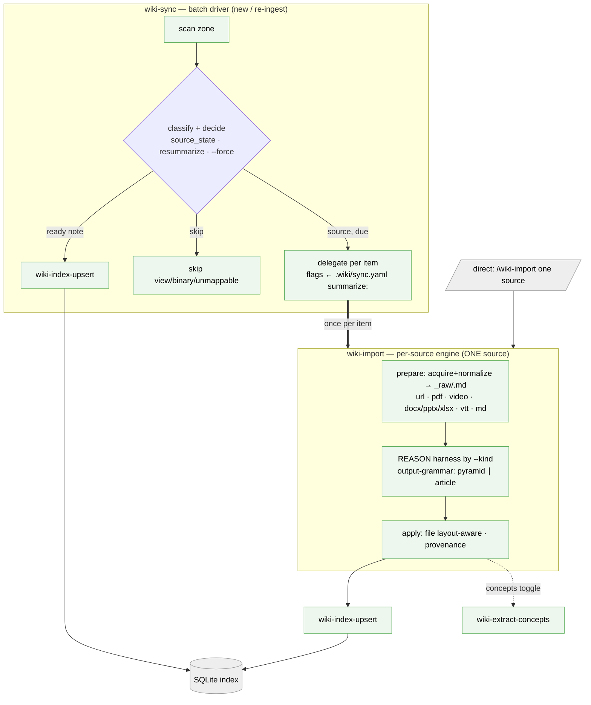

# 2.3. The construct path — one pipeline, two orthogonal axes (TASK 039)

**Contents**

- [2.3.1 Construct-path hardening](#231-construct-path-hardening-2026-06-dogfooding--a-14-round-adversarial-vdd-multi)
- [2.3.2 Transcript-fetcher — a third wrapped external skill for video sources](#232-transcript-fetcher--a-third-wrapped-external-skill-for-video-sources-task-044--extends-adr-001)
- [2.3.3 Embedded-video discovery](#233-embedded-video-discovery-opt-in---embedded-videos--task-044-r-13)
- [2.3.4 Converged construct pipeline — one engine, one batch driver](#234-converged-construct-pipeline--one-engine-one-batch-driver-task-046)
- [2.3.5 Video robustness, folder inference & announcement detection](#235-video-robustness-folder-inference--announcement-detection-task-057)
- [Legacy PARA-import framing (superseded)](#legacy-para-import-framing-superseded-23--task-038-retired-task-047)

Knowledge enters the wiki through **one** config-driven construct path, **`wiki-import`**
(`wiki-import-article` is a back-compat alias). It is **not** forked per layout; it has two
**orthogonal** concerns:

- **content-type → WHICH REASON harness** (the generation step — the orchestrator's one LLM step,
  Decision-17): **all content-types run the ONE universal `summarizing-meetings` harness** (it
  auto-detects + handles meetings AND articles/papers/threads); finished `summary` → no REASON
  (register directly). `prepare --kind auto` detects the kind (for the note `type:` + reporting); `--kind` overrides.
- **layout (CONFIG) → WHERE it files**: `resolve_layout_config` decides Karpathy (`_sources/` + **root**
  `_concepts/`) vs PARA (topic-folder + **sibling** `_concepts/`) — the SAME code path already used by
  `wiki-index-upsert` (TASK 024) and `wiki-extract-concepts` (TASK 037).

The two axes are independent, so `{meeting, article, paper, thread, summary} × {Karpathy, PARA, …}`
all flow through this one path. The load-bearing discipline — **the REASON harness is fed
`known_concepts`** so `[[wikilinks]]` reuse existing names and never dangle/collide — holds for every cell.


**Orthogonality (every cell = the same path):**

| content-type \ layout | Karpathy (`_sources/`+root) | PARA (folder+sibling) |
|---|---|---|
| **meeting** → `summarizing-meetings` | ✓ | ✓ (closes the TASK 038 hole) |
| **article/paper/thread** → `summarizing-meetings` (same universal harness) | ✓ | ✓ (TASK 038) |
| **finished summary** → register directly | ✓ | ✓ |

**Retired (TASK 047):** the original Karpathy-raw on-ramp `wiki-enrich` → vendored `wiki-ingest`
(ADR-001 Option I) that overlapped the top-left cells was **deleted** — `wiki-import` is the unified
construct path (any layout), and concept-page compounding is a derived Class-B render (see §2.3).
Decision-17 throughout: every CLI is deterministic plumbing; the single reasoning step is the
harness-guided LLM, never inside a CLI. Skill-call detail + the `summarizing-meetings` note-JSON
alignment: TASK 039 + the `summarizing-meetings` postanovka.

## 2.3.1 Construct-path hardening (2026-06; dogfooding + a 14-round adversarial `/vdd-multi`)

Six properties were added/repaired so the path works **universally across all four built-in
layouts and any output language**:

- **Internationalization (no hardcoded locale).** The rendered note's language follows the
  vault's `language` (`WIKI_SCHEMA`; **English fallback**, via the guarded `_vault_language`).
  Section headings/labels/origin phrases are localized through a `NOTE_TEMPLATES` registry
  (en + ru built in; a new language = one dict entry); `prepare` emits `language` so the REASON
  step produces title/tldr/bullets/body in it. The note-JSON contract uses **neutral
  `title`/`body`** (legacy `title_ru`/`ru_body` accepted as back-compat aliases).
- **Clickable `_raw` link.** The filed note links to its source capture with an Obsidian
  wikilink `[[_raw/<slug>]]` (resolves in any vault), and `reindex._body_refs` **skips
  `_raw/`-targeted refs** so the link is never a false orphan; `sources:` frontmatter still
  carries the machine-readable path (resummarization).
- **Concept-filing gate.** Concept pages are filed only when the resolved layout can actually
  index a `_concepts/<slug>.md` page (`_layout_indexes_concepts`: a `concept` `type_mapping`
  **and** a glob reaching the sibling `_concepts/`). Concept-capable = karpathy / obsidian-personal
  / cybos; a structured-doc layout like dev-project files the summary note **without** concepts
  (reported, not a failure) — preserving the Class A/B rebuildability invariant (no orphaned,
  non-`--full`-rebuildable markdown).
- **Layout `type_mapping` + ignore.** dev-project + cybos gained `summary`/`article-summary`/
  `meeting-summary`/`lesson-summary` → db_type summary (imported notes index); cybos also gained
  concept/external/person/company/product/group (its concept pages index). karpathy +
  dev-project + cybos gained `**/_raw/**` in `ignore` (the `_raw/` capture is never indexed as a
  phantom page that could clobber the curated note on a shared `(vault_id, slug, project)`).
- **Decision-17 entry points.** A missing `--folder`/`--vault-root` → clean `INVALID_FOLDER`/
  `INVALID_VAULT_ROOT`; a schemaless vault → language `en` (no crash); a hung `html` →
  `FETCH_FAILED(timeout)` with the temp dir reclaimed; the note JSON is a **bounded read**
  (`NOTE_TOO_LARGE` over 32 MiB); and `main()` has a **catch-all backstop** emitting a typed
  `INTERNAL_ERROR` (exception class only — never `str(e)`, CWE-209) so no path raw-tracebacks.
- **Global install is reproducible.** `bin/install-globally.sh` (→ `~/.local/bin` + `~/.claude/ skills` + `~/.claude/commands`) and `bin/install-project-symlinks.sh` (in-repo `.claude`/
  `.agent` vendor trees) are safe + idempotent (skip-foreign / repair-repo-owned / per-item
  report). **Run them after adding a new `bin/wiki-*`, `skills/wiki-*/`, or `commands/wiki-*.md`**
  — new entries are not auto-propagated.

## 2.3.2 Transcript-fetcher — a third wrapped external skill for video sources (TASK 044 — extends ADR-001)

`dispatch_fetch` in `scripts/wiki_skills/wiki_import_article/_fetch.py` previously routed every
source to one of TWO external skills (`html` or `pdf`). A video URL therefore hit the `html` skill
and captured only the watch-page chrome — no spoken content. TASK 044 adds a THIRD external-skill
fetch branch, `transcript-fetcher`, following the exact composition pattern of `html`/`pdf`
(NF-2, ADR-001 "Wrap + Index").

**External skill contract.** `transcript-fetcher` lives at
`/Users/sergey/dev-projects/Universal-skills/skills/transcript-fetcher/`; its own venv is
`scripts/.venv/bin/python scripts/fetch.py`.

- **CLI:** `fetch.py <URL> --out <path.txt> --json-errors [--lang <code>] [--prefer manual|auto] [--with-description] [--cookies-file PATH] [--cookies-from-browser BROWSER] [--max-duration-min N]`.
- **Output:** a plain-text `.txt` (no frontmatter) + a sibling `<out>.stat.json` sidecar carrying
  `transcript_origin` (`embedded-captions | macwhisper | whisper-cli | whisper-cpp | openai-api`),
  `quality_flag` (e.g. `english_auto_translation`), and title/uploader/duration. Optional
  `<out>.description.md`.
- **Exit codes:** typed; exit 7 = `MissingDependency`.
- **Interpreter:** a `_transcript_python()` helper mirrors `_pdf_python()` — prefers the skill's own
  venv interpreter.

**Routing table (DECISION 2 — hybrid, URL-shape + `--video` flag; Decision-17: zero LLM guesses,
zero network probes in the default path).**

| Source shape | Default route | `--video` flag |
|---|---|---|
| `youtube.com`, `youtu.be`, `vimeo.com` | transcript-fetcher AUTO | n/a (unambiguous) |
| Skool lesson URL (`skool.com/*/…/lesson/`) | transcript-fetcher AUTO | n/a (unambiguous) |
| `x.com/i/broadcasts/<id>`, `x.com/i/spaces/<id>` | transcript-fetcher AUTO | n/a (unambiguous) |
| `x.com/<user>/status/<id>` (ambiguous: text OR video) | existing `html` path | forces transcript path |
| Any other URL / local file | existing `html`/`pdf` dispatch (byte-identical) | — |

Auto-routing applies only to hosts that have **no usable text path** (html returns login/landing
chrome) — it is a pure win with zero regression. The ambiguous `status/<id>` URL stays on the html
default (most tweets are text) so the existing text-only path is never broken.

**Text + video concatenation for `--video` on a status URL (DECISION 3).** When `--video` is
given on an `x.com/<user>/status/<id>` URL both fetches are run: the `html` skill (tweet prose)
AND `transcript-fetcher` (video). The written `_raw/<slug>.md` = the tweet text as a header
section followed by the video transcript as the body. Nothing is lost; neither branch is
short-circuited.

**Typed-error / FETCH_FAILED mapping and the no-media → html fallback.** The `_fetch_transcript()`
function maps transcript-fetcher exit codes into `FetchResult.error` using the same
`FetchResult(ok=False, engine="transcript:<origin>", error={…})` shape as `_fetch_html`/
`_fetch_pdf_url`. Key behaviours:

- **"No media" (transcript-fetcher exit 3 = "no transcript producible") — fallback is SCOPED BY
  HOST CLASS:**
  - on an **`ambiguous_x_status`** URL under `--video`, `_fetch_transcript` returns a typed
    no-media result → `dispatch_fetch` falls back to the existing `_fetch_html` path (mirrors the
    `arxiv_no_html` → pdf fallback). A misused `--video` flag degrades gracefully to the tweet prose.
  - on an **`unambiguous_video`** URL (YouTube/Vimeo/Broadcast/Space) exit 3 maps to
    **`FETCH_FAILED` (exit 10), NO html fallback** — there is no useful text path (html would return
    only the watch-page chrome this task removes). Note exit 3 conflates genuine no-media with
    "ASR produced nothing on real media"; on an unambiguous-video host both are a hard FETCH_FAILED.
  - No `_raw/` is written on an empty/failed result either way (R-3 holds).
- **Broadcast/Space with no ASR backend (exit 7)** — mapped to the `FETCH_FAILED` envelope with
  `DEP_MISSING` semantics (exit code 6), carrying an actionable "install ffmpeg + a whisper
  backend" message. No `_raw/` is written on failure (R-3). The `--transcript-bin` flag enables
  fail-fast absent-binary detection via the existing `require_bin()` helper.
- **Login-walled video** — surfaces the same cookies guidance as the existing `_is_x_login_wall`
  check; suggests `--cookies-from-browser` / `--cookies-file`.
- **`quality_flag: english_auto_translation`** — surfaced to the operator in the prepare envelope
  AND recorded in the note frontmatter provenance. This is a hard rule of the transcript-fetcher
  skill.

**Provenance.**

- `FetchResult.engine` is set to `transcript:<origin>`.
- As shipped (S0 contract verification against the real transcript-fetcher source):
  `transcript_origin` is set ONLY by the X adapter, so for youtube/vimeo/skool the origin falls
  back to the stat's `chosen_track_kind` (+`asr_backend` for ASR) — e.g.
  `transcript:embedded-captions` / `transcript:auto`.
- wiki-import ALWAYS passes `--with-description` (so the stat carries `title`/`uploader`/`upload_date`)
  and `--lang <vault-language>` (never the skill's `ru` default).
- The `.txt` output carries no frontmatter, so the existing `ensure_source_frontmatter()` function
  — which already handles the PDF/text-dump no-FM case — injects the `source:` field without any new code.
- The `<out>.txt.stat.json` sidecar + exit-code map (transcript 7→DEP_MISSING exit 6 ·
  6=rate-limit→FETCH_FAILED · 5=auth→cookies hint · 3=no-media) were pinned against the real source
  (resolves Q-044-2).

**Content-type axis stays orthogonal (Decision-17 + `_detect.py` unaffected).** `--kind`
detection in `_detect.py` is unchanged: a transcript body with timestamps/speaker-turns heuristically
maps to `kind=meeting`; the operator may override `--kind`. The one universal `summarizing-meetings`
harness handles all kinds — no new `kind` is introduced. The routing decision in `dispatch_fetch`
is deterministic (URL shape + `--video` flag), never an LLM guess.

**Path-dependent dependency posture.** Captioned YouTube/Vimeo/x-status-video need only `yt-dlp`
(light path). Caption-less broadcasts/spaces additionally need `ffmpeg` + a whisper backend (ASR
path). `ffmpeg` is REQUIRED for HLS sources; absent → exit 7 → `DEP_MISSING` envelope in
`dispatch_fetch`. No new entry in `requirements.txt` — `transcript-fetcher` is an external binary
(like `html`/`pdf`) loaded via `--transcript-bin` (or discovered via `require_bin()`), not a Python
runtime import. **Zero new Python runtime deps; zero SQLite DDL** (`user_version` 7 untouched).

**Invariants preserved.**

- Decision-17 (no `import anthropic`; deterministic routing).
- Class A/B/C layering (`_raw/` written only on a non-empty `ok` result, R-3).
- `validate_inside_vault` + H-6 frontmatter-injection guards on all write paths (R-26).
- Vendor-agnostic (subprocess + flags, runs identically under claude/codex/gemini/pi/hermes).
- Zero-DDL posture.

New CLI flags (`--video`, `--transcript-bin`, `--max-duration-min`, `--cookies-from-browser`,
`--cookies-file`, `--lang`) land in `__init__.py`/`__main__.py` and are passed through to
`dispatch_fetch`. Design residuals: Q-044-1.

## 2.3.3 Embedded-video discovery (opt-in `--embedded-videos` — TASK 044 R-13)

When the operator passes `--embedded-videos`, `dispatch_fetch` extends the `not_video` html path:
after the html skill fetches the page prose it also discovers, filters, and transcribes `<iframe>`
video embeds found in the raw HTML. The flag is **off by default** and is a **NO-OP** on
`unambiguous_video` and `ambiguous_x_status` URLs (those are `--video`'s domain). Passing both
`--video` and `--embedded-videos` on the same URL is a usage error (exit 2).

**Why raw-HTML scan, not html-skill MARKDOWN output.** ⚠️ **Corrected 2026-08-06 (TASK 072) — the
previous wording was too strong and argued against the design that now ships.** The html skill
strips `<iframe>`/`<video>` before emitting **Markdown**, and its `meta.json` carries no embed
URLs; that much is true, so the *Markdown* path cannot serve discovery. But
`serialize.sanitize_untrusted_html` writes the **HTML artifact without stripping tags**, so
iframes survive there — "composing with the html skill's output is impossible" was false as
stated. What is required is the **raw, untransformed** bytes.

Discovery therefore uses the skill's **`get` verb** (`html get URL --stdout`, TASK 072 / 072-06),
which returns bytes verbatim through the **SSRF-guarded ladder** (resolve → pin → assert-public →
bounded read, every hop). It replaced a bare `urllib.request.urlopen`.

★ **Deliberately `get`, not `fetch --stdout`** — three verified reasons: `fetch` emits sanitized +
absolutized HTML (the regex would scan a **transformed** document); it runs the full tier ladder,
whose `auto` engine can escalate to Chrome and then to the **remote reader tier, which sends the
URL to a third party** — an egress a best-effort embed scan must not silently acquire; and it can
return markdown. `get` is byte-verbatim, local-only, single-tier.

★ **Over-cap REFUSES, it does not truncate** (`_EMBED_FETCH_MAX_BYTES`, 2 MiB, unchanged). The old
code read the cap and scanned the prefix — but discovery is a **regex**, and a truncation can
split an `<iframe` tag across the boundary, silently losing or mangling an embed while reporting a
complete result. The caller now logs `page-too-large` instead. A reported skip beats a wrong
answer presented as a whole one.

The guarded GET is the only additional network call; the html skill's own fetch (which already ran
for the article prose) is separate and unchanged. Design rationale: Q-044-9 / Q-044-10; the guard
decision is Q-072-1 = B.

**Filter chain — order is fixed and always applied in full when `--embedded-videos` is set.**

```
allowlist → ad-network denylist → ad-context → ad-param → dedup → cap → fetch
```

1. **Allowlist (H-6 / SSRF).** Only known video-host embed patterns pass:
   `youtube.com/embed`, `youtube-nocookie.com/embed`, `youtu.be`, `player.vimeo.com/video`,
   `vimeo.com`. Any `<iframe src>` not matching is silently dropped — the page cannot trigger a
   fetch to an arbitrary host. ⚠️ **"operator-trusted" removed 2026-08-06 (TASK 072): it was
   false.** `/wiki-reload` re-fetches a URL out of a note's OWN frontmatter — H-6 **data**, not
   operator input — and the pre-072 fetch followed 30x silently, so every hop after hop 0 was
   attacker-chosen regardless of who typed hop 0. The allowlist is a *destination* bound on the
   embed fetch; the *transport* bound is now the `html` skill's guarded ladder, applied at every
   hop of both call sites.

2. **Ad-network host denylist (always-on belt-and-braces).** Drop any embed whose host matches
   a known ad-network domain: `doubleclick.net` (incl. `*.doubleclick.net`,
   `googleads.g.doubleclick.net`, `g.doubleclick.net`), `googlesyndication.com` (incl.
   `pagead2.googlesyndication.com`), `imasdk.googleapis.com` (Google IMA SDK), `2mdn.net`,
   `adnxs.com`, `adservice.google.*`. Most of these are already rejected at step 1 (outside the
   allowlist), but they are listed explicitly here as a belt-and-braces guard against
   youtube-hosted IMA/ad URLs that carry an allowlisted host but resolve to an ad endpoint.
   Logged as skip reason `ad-denylist`.

3. **Ad-context exclusion (always-on, bounded scan).** Skip any allowlisted embed whose
   ENCLOSING element (inspected within a **bounded character window** around each matched
   `<iframe>` — not a full DOM parse) carries class/id/data-* attributes that signal an ad or
   non-content slot. Word-boundary, case-insensitive match on:
   `ad`, `ads`, `advert`, `advertisement`, `advertising`, `sponsor`, `sponsored`, `promo`,
   `promoted`, `dfp`, `adsbygoogle`, `googlead`, `outbrain`, `taboola`, `recommend`, `related`,
   `widget`. Also excluded: embeds inside `<ins class="adsbygoogle">`, inside `<aside>`, inside
   `[role=complementary]`, and inside `[aria-hidden="true"]`. The scan uses a fixed-length
   character window and bounded-quantifier regex — no nested quantifiers, ReDoS-safe by
   construction (same posture as the layout-config load-gate). Logged as skip reason `ad-context`.

4. **YouTube ad-param drop (always-on).** Drop any youtube/youtube-nocookie embed URL carrying
   ad marker query parameters: `ad_type`, `adformat`, `ad_companion` (case-insensitive key match
   on the parsed query string). Logged as skip reason `ad-param`.

5. **Dedup.** The same embed URL appearing multiple times in the raw HTML is fetched once
   (set-based dedup applied after ad-exclusion, before cap). Logged as skip reason `dedup`.

6. **Cap (`--embedded-videos-max N`, default 5).** Applied after ad-exclusion and dedup, so
   ad embeds never consume cap slots. Embeds surviving filtering beyond N are dropped; a note
   naming the count dropped is appended to the prepare envelope's `details` list. Logged as
   skip reason `cap`.

7. **Fetch.** Each surviving embed URL is passed to the existing `_fetch_transcript()` function
   (reused without modification) with `--lang` always forwarded (R-11 invariant).

**Ad-exclusion is always-on — there is no flag to disable it.** When `--embedded-videos` is
active, the three ad-exclusion filters (steps 2–4) are unconditional. Advertising and promotional
embeds must never be transcribed; this is an operator hard requirement. The `--embedded-videos`
flag itself is the opt-in control; ad-exclusion has no separate toggle. Design rationale:
Q-044-11.

**Per-embed failure isolation (contrast §2.3.2's hard-fail).** A transcript failure for one
embed (exit 3 no-media / exit 7 dep-missing / exit 5 auth) is skipped with a logged note in the
envelope `details` and does NOT abort the page import — the article prose remains the primary
content and `_raw` is still written. This is the inverse of the `unambiguous_video` path in
§2.3.2, where exit 3 is a hard `FETCH_FAILED`: embedded videos are supplementary, not primary.

**Skip-reason logging — no silent behavior.** The prepare envelope's `details` MUST log every
discovered embed URL and the reason it was skipped or fetched. Skip reasons are exactly:
`ad-denylist` / `ad-context` / `ad-param` / `not-allowlisted` / `dedup` / `cap` /
`transcript-failure`. An embed that proceeds to fetch and fails is logged as
`transcript-failure`. No embed is silently dropped at any filtering stage.

**`_raw` assembly and provenance.** `_raw` = article prose (primary output of the html skill
fetch), with each successfully transcribed embed appended as a level-2 heading:
`## Embedded video <k> — <title or url>`. `FetchResult.engine = "html+embedded:<count_transcribed>"`,
where `count_transcribed` is the number of embeds that produced a transcript. `_raw` is written
only if the html result was ok and non-empty (R-3 invariant); embedded transcripts are strictly
additive. Each embed's `transcript_origin` is preserved in its heading; any `quality_flag`
(e.g. `english_auto_translation`) from any embed sidecar is aggregated and surfaced in the
prepare envelope per R-8.

**Reuse.** `_fetch_transcript()`, `_video_host()` (for allowlist matching), `require_bin`,
`ensure_source_frontmatter`, and `_fm_safe` are all reused without modification; no fetch or
parse logic is duplicated. Zero new Python runtime deps; zero SQLite DDL (`user_version` 7
untouched). `mypy --strict scripts/` clean; no `import anthropic` (Decision-17).

**Ad-exclusion residual.** Ad-exclusion is a heuristic — a sufficiently disguised embed (no ad
signal in class/id, allowlisted host, no ad query params) may slip through. The residual is
bounded by:

1. `--embedded-videos` is opt-in,
2. cap bounds total embed count,
3. per-embed failure isolation means a slipped-through ad that returns no transcript is logged harmlessly,
4. full skip-reason logging gives the operator visibility.

The residual and its boundary conditions are documented in `skills/wiki-import/SKILL.md`. Design
rationale: Q-044-11.

## 2.3.4 Converged construct pipeline — one engine, one batch driver (TASK 046)

Through TASK 039–044 **two** code paths owned *acquire + distil*: `wiki-import`
(fetch → article-`assemble_note` → always-concepts) **and** `wiki-sync` ingest
(convert/de-timestamp → `summarizing-meetings` pyramid → file/index → always-concepts).
The overlap was real (it is why a PARA transcript had no "rich pyramid, no concepts"
path). TASK 046 retires it by making **`wiki-import` the single per-source engine** and
**`wiki-sync` a pure batch driver that delegates to it** — the convergence §2.3 above
anticipated. **One owner per concern:**

| Concern | Single owner | Was duplicated? |
|---|---|---|
| acquire + normalize (any format → `_raw/<slug>.md`) | `wiki-import` `prepare` | ✅ → now ONE (absorbs `wiki-sync`'s office/`.vtt` convert) |
| distil (raw → summary note) | `wiki-import` REASON + `apply` | ✅ → now ONE (`apply` grammar by `--kind`: pyramid for meeting/lesson, article for article/paper/thread) |
| batch sweep + new/re-ingest decision | `wiki-sync` (`source_state`/`resummarize`/`--force`) | no |
| index one file | `wiki-index-upsert` (shared leaf) | no |
| concept filing | `wiki-extract-concepts` (shared leaf, `--concepts/--no-concepts` toggle) | no |

`wiki-import` gains FOUR knobs (also reachable per-zone via `.wiki/sync.yaml`
`summarize:` → flags):

1. **output-grammar by `--kind`** (adds `lesson`),
2. **`--diagrams`** (selective-mermaid overlay),
3. **`--concepts/--no-concepts`** (default ON = back-compat),
4. `prepare`'s **universal acquire** (docx/pptx/xlsx + `.vtt`/`.srt` + md, on top of url/pdf/video).

`wiki-sync` drops its inline summarise/enrich/extract and calls `wiki-import` per due source item
(ready notes → `wiki-index-upsert`; skips unchanged).



**Invariants held:**

- Decision-17 (the REASON LLM step stays the orchestrator's, between `prepare` and `apply`;
  `wiki-sync scan` stays deterministic plan-only).
- zero-DDL (`summarize:` is file config; `user_version` 5).
- back-compat (concepts default ON; `--kind article` byte-identical; absent `summarize:` ≡ today's defaults).

(`wiki-enrich` — the legacy Karpathy on-ramp mentioned as a pending retirement here — was retired
in TASK 047.) Design rationale: Q-046-1.

## 2.3.5 Video robustness, folder inference & announcement detection (TASK 057)

Three additive hardenings of the `prepare` side, from the cyber•Fund 004 X-Broadcast import
(spec: `docs/wiki-import-video-folder-inference-spec.md`). All zero-DDL, Decision-17, no new
Python runtime deps; W2 adds ONE read-only DAL consumer (`search_pages`) inside `prepare`.

**W1 — transcript-fetcher robustness flags pass through; scoped wall-clock.**
The skill (§2.3.2's third external skill) now owns `--concurrent-fragments` /
`--media-timeout-sec` (X-media-only; env `TRANSCRIPT_FETCHER_CONCURRENT_FRAGMENTS` /
`_MEDIA_TIMEOUT_SEC`; skill-side defaults 8 / duration-derived — the formula is skill-owned,
never re-derived here).
`wiki-import` forwards, never duplicates, that policy:

- `_fetch_transcript()` gains `concurrent_fragments: int | None` / `media_timeout_sec: int |
  None`; **non-None appends the flag, None omits it** so the skill's own env/`.env`/derived
  defaults rule (single source of truth stays in the skill).
- `prepare` exposes `--transcript-concurrency` / `--transcript-media-timeout` (default None;
  argparse rejects values < 1) → `dispatch_fetch` → all three call paths
  (`unambiguous_video`, `_fetch_x_status_with_video`, `_append_embedded_videos`).
- **Wall-clock is scoped by role (task-review note):** `_transcript_timeout()` keeps the ONE
  env knob `WIKI_TRANSCRIPT_TIMEOUT_S` (set → overrides everywhere), but the built-in default
  splits **primary** fetches (the URL IS the content: unambiguous video / x-status `--video`)
  = **3600 s** — covering parallel download + ASR of a ≥60-min broadcast — from **supplementary**
  embedded-video fetches (`_append_embedded_videos`, best-effort, up to `--embedded-videos-max`
  sequential) = **300 s** as today, so a hung embed can never chain 5×1 h stalls onto a page
  whose primary content already succeeded. Rationale: the wall-clock is a hang-guard; pacing
  lives in the skill's duration-derived media timeout (Q-057-2).

**W2 — vendor-independent folder inference (`--folder` optional on `prepare`).**
`--folder` stays required on `apply` and on the `wiki-sync` delegation path (zones always carry
one); it becomes optional ONLY on interactive/orchestrator `prepare`. With it: byte-identical
behaviour. Without it, after the normal deterministic fetch (title now known):

1. **Series-stem inference (primary; index+FS only — no app, no vendor).** `_folder.py` (new
   module) derives a conservative series stem from the detected title — strip ONE trailing
   episode/index marker (`[004]`, `(4)`, `#4`, `Episode|Part|выпуск|серия|урок N`, trailing bare
   number, with surrounding dash/colon separators); a residual stem below the floor (≥ 8 chars
   AND ≥ 2 words) **aborts inference** (over-merge guard, spec Risk 1). The stem is FTS5-quoted
   (`"`-doubled, phrase-wrapped) into `search_pages(query, vaults=[vault], limit=10)`; hits
   count as **siblings** only if their `title` OR filename stem *starts with* the stem
   (casefold + whitespace-normalized) AND no path segment is machinery (leading `_` or
   `00-Vault-Index`) other than the layout's own `source_subdir`. Each sibling maps to its
   `--folder`-form folder: vault-relative parent dir with one trailing `source_subdir` segment
   stripped (stripped-to-empty → the subdir itself, matching karpathy vault-tier `--folder
   _sources`). Exactly ONE distinct folder → proposal `{folder_inferred, basis:
   "series-sibling", evidence: [sibling paths], confidence: "high"}`. Several → unresolved with
   folders as ranked candidates (count desc, then best bm25; cap 5).
2. **Active-note hint (secondary, optional signal).** Only when (1) is inconclusive:
   `obsidian-active-note folder --format json` (PATH-resolved via `shutil.which`; 10 s
   subprocess timeout; exits 3/4/5 = the illustrative unavailable family — the rule is **any
   non-zero exit → skip**, never a per-code allowlist). Accepted only if the folder resolves
   INSIDE `--vault-root` and exists → `basis: "active-note"`, `confidence: "medium"`. Absent
   binary / any non-zero exit / outside-vault / timeout → skipped silently. It is a *hint*, never a
   contract (the 004 failure mode — "No active file" at the critical moment — degrades to (3)).
3. **Ask (fallback).** Typed `FOLDER_UNRESOLVED` (exit **2** — the `NO_CONTEXT` precedent:
   guard ran fine, resolution needs operator input; the typed `error` field disambiguates from
   malformed-arg envelopes; task-review note resolved Q-057-1) carrying the ranked
   `candidates[]` (possibly empty).

**No-write + staging invariant (spec hard rule).** On EVERY no-`--folder` outcome (proposal
AND unresolved) `prepare` writes **nothing inside the vault** — no `_raw/`, no attachments (the
html skill's temp dir is reclaimed). Instead the converted capture is **staged to a persistent
tempfile outside the vault** (`wiki-import-staged-*.md`), frontmatter-stamped with `source:` +
detected `title`/`author`/`date` — every stamped scalar routed through the SAME `_fm_safe`
newline-strip+quote guard as `ensure_source_frontmatter` (H-6: a hostile page/broadcast title
cannot break the YAML or inject a key) — (so the local-md re-read keeps slug/provenance), emitted as
`staged_path` alongside detected `kind`/`title`. The confirmed re-run — `prepare --folder <F>
--source <staged_path>` — is then **fetch-free**: a 70-min broadcast is never transcribed twice.
Images are the one staged loss: re-run the ORIGINAL URL when attachments matter (cheap html
case); the expensive transcript case has none (Q-057-3). Envelope actions: `folder_proposed`
(exit 0) / `FOLDER_UNRESOLVED` (exit 2).

**Companion rule (prompt layer).** `templates/CLAUDE.md.tmpl` + `skills/wiki-import/SKILL.md` +
`workflows/wiki-import.md`: the FIRST move on a missing folder is now "omit `--folder` and let
`prepare` infer from a same-series sibling" (vault search, vendor-independent);
`obsidian-active-note` is demoted to the secondary hint it always was (§2.2.1 unchanged — this
reorders *guidance*, not the resolver).

**W3 — announcement-tweet detection (no junk `_raw`).**
On the html path of an `ambiguous_x_status` URL (no `--video`), after a successful reader
extraction, `dispatch_fetch` runs a **pure string heuristic** `_announcement_only(md)`
(Decision-17: no new network): the body links a first-party broadcast/space
(`https://(x|twitter).com/i/(broadcasts|spaces)/<id>` — absolute-URL form of the §2.3.2 router's
`_X_BROADCAST_RE` shape, allowlisted hosts only) **AND** the normalized prose (the
`_is_x_login_wall` normalization: frontmatter/links/markdown stripped) is under
`_X_ANNOUNCEMENT_PROSE_FLOOR = 600` (the login-wall floor 220 stays separate — different
failure, different bound). Both gates must fire (spec Risk 2: a substantive tweet that also
links a broadcast passes through). On match `dispatch_fetch` reclaims the html temp/attachments
dir and returns a typed marker; `prepare` emits `{action: "announcement_only", broadcast_url,
hint: "re-run on the broadcast URL or pass --video"}` with **exit 0** and writes nothing — the
short-circuit sits BEFORE kind detection, so `--kind auto` can no longer mislabel the chrome
`thread`. With `--video` the existing §2.3.2 concat path runs unchanged (the heuristic never
executes); a normal text tweet (no broadcast link) is byte-identical to today.

**Invariants preserved:** Decision-17 (deterministic inference/heuristics; the one LLM step
stays the orchestrator's) · Class A/B/C (nothing new authored; inference *derives* from the
rebuildable index + FS — derive-don't-author) · zero-DDL / P-5 (reads ride the existing
`search_pages` ABC surface; no new index) · R-3/R-26 (no `_raw` on any non-ok/no-folder path;
all writes still `validate_inside_vault`; staging deliberately OUTSIDE the vault) · H-6 (W3 is
string-shape only; the active-note hint shells a local resolver binary, never the network) ·
vendor-agnostic (primary W2 signal needs no running app/harness). Design rationale: Q-057-1..4.

**Phase-4 adversarial hardening (shipped with the task; 3 fresh-context critics + a verify
cycle):** staged captures get a 48 h age-based GC sweep (delete-on-consume would break the
fetch-free re-run; abandoned proposals no longer accumulate); `series_stem` caps its input at
300 chars (the marker regex backtracks O(n²) on separator-flood titles — measured 8.8 s at
20 k chars); an explicit `--transcript-media-timeout` RAISES the primary wall-clock
(budget + headroom) instead of being silently SIGKILLed — primary-scoped only, embeds keep
300 s (the skill applies the budget to X media alone); a login-walled ANNOUNCEMENT still
surfaces `broadcast_url` (exit 0) instead of a dead-end FETCH_FAILED; the active-note hint
never *overrides* evidence-backed series candidates (it may only pick one of them);
machinery-dir comparisons are casefolded (case-insensitive filesystems); a titleless staged
re-run derives its `_raw` slug from the staged `source:` (never the tempfile stem); `_fm_safe`
strips the full `str.splitlines()` boundary set (NEL/LS/PS — a U+2028 title could otherwise
suppress the `classification:` quarantine stamp via the naive parser, which now also splits on
`\n` only); the staged capture is written through the 0600 `mkstemp` fd; and the W1 knobs are
ceiling-bounded (concurrency ≤ 64, media timeout ≤ 24 h). Accepted residuals (documented):
the 220–600 prose band may drop a substantive short tweet (recoverable via the emitted
`broadcast_url`/`--video`); the 2-word stem floor disables series inference for space-less
scripts (degrades to ask); staged captures are cleartext in the OS temp dir until the sweep.

## Legacy PARA-import framing (superseded §2.3 — TASK 038; retired TASK 047)

> **Superseded (TASK 047).** Retained for history; the retirement is recorded in §2.3 and §2.3.4 above.

**The baseline it started from.** The framework's Karpathy construct path is `wiki-enrich` → external
`wiki-ingest` → (Phase 2) `summarizing-meetings` → concept/entity wiring → index, whose
load-bearing discipline is *passing the known-concepts list to the summary generator* so
`[[wiki-links]]` reuse existing names and never dangle/collide. **PARA had no packaged
equivalent** — `wiki-ingest` writes Karpathy `_sources/` + root `_concepts/_entities/`,
wrong for PARA (TASK 024 finding #2).

**What this component added.** It packages the PARA path as a new **Decision-17** CLI (no
`import anthropic`; `prepare`/`apply`) plus a skill/command/workflow triple. It is **composition,
not reinvention** (NF-2):

- `prepare` shells out to the global `html` (URL/HTML — which post-2026-06-18 itself owns the
  Wikipedia-REST-HTML and arXiv-`/html/` rewrites + typed `EmptyExtraction`/`arxiv_no_html`) and
  the `pdf` skill (PDF), writes `_raw/<slug>.md` **only on a non-empty fetch**, and emits an
  envelope adding `known_concepts[]` + `existing_page_slugs[]` (sourced from the existing
  `wiki-extract-concepts` machinery).
- The orchestrator (LLM) owns translation/summary, **fed the known_concepts** (R-6, the core fix).
- `apply` is the authoring glue the DAO/#01 batches did by hand — per-mode note assembly
  (full/summary/thread), `_NAME_ALLOWLIST` name sanitization, verbatim-`source_quote` guarantee,
  and the **collision guard** (skip a candidate whose slug == the source note's own slug, or
  collides with an `existing_page_slugs` entry — so a generic `defi` concept never evicts the
  owner's `Defi.md`) — then delegates concept filing to `wiki-extract-concepts apply` and indexing
  to `wiki-index-upsert`/`wiki-reindex`.

**Two distinct hashes (do not conflate):**

- `prepare.source_hash = sha256(_raw bytes)` is for wiki-import-article's own import idempotency
  (R-7) only.
- the `--source-hash` fed to `wiki-extract-concepts apply` is a **fresh `sha256` of the
  just-written PARA note body** (apply re-resolves + re-hashes the *filed note* and rejects a
  mismatch as `SOURCE_CHANGED_DURING_EXTRACTION`), with the note's own slug as that call's
  `--source-page`.

**Sanitization + write-surface guards.** The name sanitizer is a **pre-normalizer that feeds** the
existing `_validation._sanitize_name` reject-gate (rewrite `/`/em-dash/guillemets → safe so
the candidate then passes that gate; reuses its `_NAME_ALLOWLIST`, no duplicate). All write
surfaces (`_raw/`, note, concept pages) route through `validate_inside_vault` (R-26) +
`_is_valid_slug` (a hostile fetched title cannot traverse). For the assembled note body:

- YAML frontmatter scalars (title/URL/author/published/tldr) are newline/control-stripped and
  quoted (H-6 frontmatter-injection guard).
- the note BODY is orchestrator-authored markdown, kept structural (escaping a translation's
  headings/lists would defeat the purpose — same trust posture as `wiki-ingest`/`summarizing-meetings`
  summaries).
- the generated **concept pages** are markdown-sanitized by extract-concepts' `write_concept_page`
  (`_sanitize_markdown_text`).

**Dependency + surface impact.** The `html`/`pdf` shell-outs are external skill **binaries**
(configurable `--*-bin`, fail-fast if absent) — NOT Python runtime dependencies, so NF-1
"zero new deps" holds. Zero impact on §4 Data Model (no DDL — rides
`pages`/`entities`/`page_entity_refs`), §6 Stack (no deps). §5 Interfaces gains ONE new CLI
surface (`wiki-import-article prepare|apply` + envelopes). Batch import (the DAO/#01 pattern)
stays a documented **Workflow-tool recipe** in `workflows/wiki-import-article.md` (parallel
translation; serialized DB writes), not a CLI mode.

**Skill-call flow diagrams (Karpathy vs PARA, mermaid)** are in §2.3 above.
Design rationale: open-questions Q-038-*.
