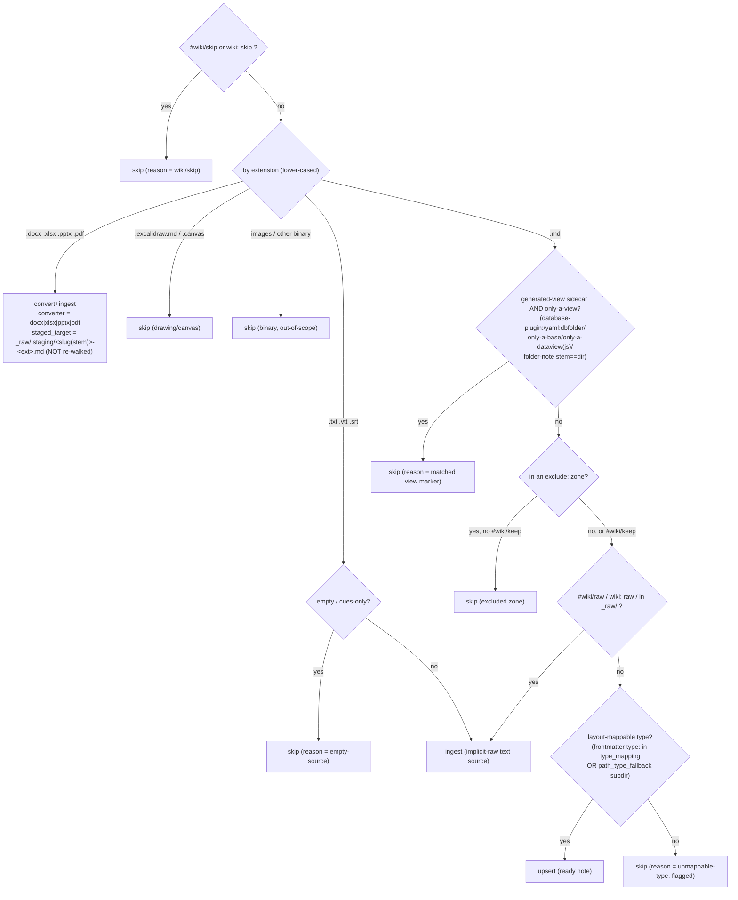

# Sync Dispatcher — `wiki-sync` (TASK 018 / R-11)

**Contents**

- [Classification (the routing brain)](#classification-the-routing-brain)
- [Plan JSON (the `scan` ↔ workflow contract)](#plan-json-the-scan--workflow-contract)
- [Execution workflow (orchestrator, per entry)](#execution-workflow-orchestrator-per-entry)
- [Source freshness & the connector contract (TASK 051 / R-18)](#source-freshness--the-connector-contract-task-051--r-18)
- [Builds on (reuse, don't reinvent)](#builds-on-reuse-dont-reinvent)

> **Superseded (TASK 046/047):** the *inline* execution pipeline in this section (an `ingest`
> action running `summarizing-meetings → wiki-enrich → wiki-extract-concepts`, and the
> `register_summary`/`wiki-enrich`/vendored-`wiki_ingest` "builds on" reuse) is **historical**.
> **TASK 046** converged `wiki-sync` into a pure batch DRIVER that DELEGATES each distil source to
> `wiki-import` (convert → REASON → file → index → concepts) — see §2.3.4 — and **TASK 047** deleted
> `wiki-enrich` + the vendored `wiki_ingest`. Read the `wiki-enrich`/`wiki_ingest` mentions below as
> the design-of-record at the time, not the current pipeline.

The **compounding-driver** over a *real, mixed* personal vault: it walks an
operator-declared **enrich zone**, classifies every file, and routes each to the
right action without per-file hand-invocation. It is the automation that closes
Karpathy's 3 → 10–15-pages-per-ingest gap on a heterogeneous vault.

**Shape = Decision-17 (forced).** The vendored `ingest()` is *summary-passthrough*
(returns `needs-pre-summarization` on raw input), so the raw→ingest path needs an
orchestrator LLM step (`summarizing-meetings`). Therefore:

- **`wiki-sync scan <zone> [--dry-run]`** — a **deterministic, plan-only** CLI (no
  LLM, no network, no mutation): walks the zone, classifies each file, emits a
  strict **plan JSON**. (`--dry-run` is the human-readable projection of the same
  plan.)
- **`workflows/wiki-sync.md`** — the **orchestrator executor**: reads the plan and
  runs convert / summarise / enrich / extract / upsert / skip per entry, calling
  the existing idempotent CLIs + the harness convert skills.

`wiki-sync` carries **no `import anthropic`** (consistent with `wiki-query` /
`wiki-extract-concepts`).

## Classification (the routing brain)

Routing checks three gates in order:

1. **`#wiki/skip`** is checked **first** — it always wins (CONS-5).
2. **format** — by *lower-cased* extension (EC-6).
3. **content** — view-markers / tags / mappable type.

The `exclude:`-zone gate (with the `#wiki/keep` rescue) sits on the `.md` content path.



**Routing invariants:**

- **Only-a-view anti-over-flag guard (AC-2b), applied to folder-notes too (EC-9):**
  a `.md` is `skip`ped as a generated-view sidecar only when its body is
  *essentially only* one view block (modulo frontmatter) — the exact matcher
  (enumerated fence languages `yaml:dbfolder`/`base`/`dataview`/`dataviewjs` +
  `database-plugin:` frontmatter + `.base` companion + a non-view-content ratio) is
  operationalised in Planning (RC-4). A folder-note (`stem==dir`) that carries real
  prose is **content → routed normally**, not skipped.
- **Upsert feasibility (EC-2; layout-general, W-1):** a no-tag `.md` routes to
  `upsert` **only if** it carries a frontmatter `type:` mappable by **the same layout
  resolution `wiki-index-upsert`→`normalize_frontmatter` actually evaluates** (the
  resolved vault layout's `type_mapping`, NOT a hardcoded karpathy assumption) **or**
  sits under a `path_type_fallback` subdir; otherwise → `skip` reason
  `unmappable-type` (flagged). Required because `normalize_frontmatter` raises
  `UnmappedTypeError` for a type-less prose note — "upsert as-is" is **not** free.
- **Degenerate inputs (EC-7) — never raise:** a zero-byte/empty `.vtt`/`.txt`/`.md`
  → `skip` reason `empty-source`; frontmatter that fails to parse → treated as
  no-frontmatter, routed by path, reason `frontmatter-unparseable` (mirror the
  existing `try/except yaml.YAMLError → fallback` idiom).
- **Precedence (Q-018-7):** `skip` > `raw` > `keep` > extension/type default.
- **Own bounded walk (E3.1e, EC-1/ID-5 — NOT `iter_pages`):** `iter_pages` filters
  strictly to the layout's `.md` page-globs and would discover **zero** of the
  `.txt`/`.vtt`/`.docx`/`.pdf` drops. `wiki-sync scan` therefore implements its
  **own** zone walk over the wiki-sync extension set, *mirroring* `iter_pages`'
  discipline (free string/glob filters first → one `stat()` per surviving candidate →
  case-folded extension prune *before* any read). `exclude:` globs prune non-`.md`
  immediately, but `.md` inside an `exclude:` zone is still read (to honour
  `#wiki/keep`, CONS-3). Refuses symlinked dirs and target files (`O_NOFOLLOW`,
  SEC-A6). **The walk also excludes the staged-output dir `_raw/.staging/**` and the
  operational `_raw/.locks`/`_raw/failed`** — so converter outputs are NEVER
  re-discovered as fresh raw drops (closes the convert+ingest self-ingest loop
  RG-1/W-3/SEC-N5).
- **Scan read-cost is honest, not free (W-2/am-2):** the uniform `sync` `source_hash`
  key (below) is `sha256(file bytes)`, so `scan` **reads every eligible (non-binary,
  non-skipped-by-extension) file** to compute it — the earlier "`is_unchanged`
  without re-reading the body" claim was tied to the now-**superseded** AM-1
  `pages.file_hash` fast-path and no longer holds. This is acceptable because enrich
  zones are **scoped course folders** (small N), binaries are skipped *before* any
  read, and huge dirs (`_daily`) are `exclude`d; an optional `stat()`-mtime
  short-circuit (skip the hash when mtime matches the row's recorded mtime) is a
  **Planning-phase YAGNI**, not part of the contract.

## Plan JSON (the `scan` ↔ workflow contract)

```jsonc
{
  "vault_id": "ai-hard-fork-2026",
  "zone": "03 - Learning/Courses/AI Hard Fork 2026",
  "generated_by": "wiki-sync/scan",            // no timestamp in the deterministic core
  "entries": [                                  // SORTED by vault-relative POSIX path (META-1 determinism)
    {
      "path": "_raw/zoom_chat_20260224.txt",   // vault-relative, inside-vault validated
      "action": "ingest",                       // convert+ingest | ingest | upsert | skip
      "reason": "text-source(.txt)",            // machine + human reason
      "converter": null,                        // docx|xlsx|pptx|pdf when action=convert+ingest
      "staged_target": null,                    // _raw/.staging/<slug(stem)>-<ext>.md when converting (collision-safe SEC-A4; NOT re-walked, RG-1/W-3)
      "normalize": null,                         // "vtt-detimestamp" for .vtt/.srt (RC-1)
      "source_hash": "<sha256 of FILE BYTES>",  // original binary bytes for convert+ingest (CONS-4)
      "is_unchanged": false                      // true → executor skips (see idempotency below)
    }
  ],
  "summary": { "convert_ingest": 2, "ingest": 3, "upsert": 5, "skip": 11 }
  // needs_ocr is an EXECUTOR-report bucket (am-3), not a scan action — it appears in the run report, not here
}
```

**Idempotency — a `wiki-sync`-owned `source_state` partition (replaces the broken
AM-1 claim; CRITICAL cluster ID-1/RC-3/EC-3/SEC-A2/F2/F3/ID-2/CONS-1/2/4).** Verified
against code: `wiki-enrich`/vendored `ingest()` write **no `source_state` row** (raw
idempotency is a `source_hash:` frontmatter *footer* keyed by the summary slug), and
the only `source_state` writer is `wiki-extract-concepts`
(`source_kind='extract-concepts'`, scope = source-page slug) — **neither is keyed on
the raw file `scan` discovers, and the summary slug is not knowable at scan time.**
Therefore `wiki-sync` owns its own partition:

- **Key:** `source_state(source_kind='sync', scope=<vault-relative source path>, key='source_hash', value=sha256(file bytes))` — **zero DDL** (`source_state` has no
  `source_kind` CHECK; `'sync'` is data). Uniform across `ingest`/`convert+ingest`/
  `upsert` (this also dissolves the `pages.file_hash`/file_path/rename complications
  of ID-3 — a renamed file is a new path → new row → re-processed, documented).
- **`scan`** computes `sha256` of the discovered file (original binary for
  `convert+ingest`) and reads the row via a new **read-only DAL getter**
  `get_source_state(...)`; `is_unchanged = (stored == computed)`.
- **executor** writes/updates the row via the **`wiki-sync record <rel> --source-hash <sha256>`** CLI (its orchestrator-facing surface over
  `set_source_state(...)` — the workflow is prose+bash, not Python) **only after the
  per-file chain fully succeeds** — a **commit marker**. A mid-chain failure leaves
  **no** `sync` row → the next run re-attempts, while the downstream tools' own
  idempotency (enrich footer, extract-concepts `source_state`) short-circuits the
  sub-steps already done → re-run is cheap **and** convergent (ID-4 partial-failure).
- **`--dry-run`** reads `source_state` (read-only) and writes nothing (ID-6/AC-6).

## Execution workflow (orchestrator, per entry)

| `action` | Orchestrator steps |
|---|---|
| `skip` | no-op (recorded in report). |
| `upsert` | `wiki-index-upsert --vault <vid> --source <path>` → on success `wiki-sync record <rel> --source-hash …`. |
| `ingest` | `[.vtt/.srt]` de-timestamp pre-step (deterministic — reuse transcript-fetcher `scripts/sources/_vtt_to_text.py`, RC-1) → **H-6 fence the raw/converted body** with a per-run **nonce** sentinel (SEC-A1) → `summarizing-meetings` (raw→summary) → `wiki-enrich --source <summary>` (files `_sources/` + indexes + log) → `wiki-extract-concepts` prepare/apply → on full success `wiki-sync record <rel> --source-hash …`. |
| `convert+ingest` | convert via the `docx`/`pdf`/`pptx`/`xlsx` skill → collision-safe `_raw/.staging/<slug(stem)>-<ext>.md` (refuse-overwrite-different-content SEC-A4; in the **non-walked** `.staging/` so it is never re-ingested, RG-1/W-3/SEC-N5). For a `.pdf`, `pdf_extract.py` exit `10 DocumentScanned` (image-only) → the **OCR remediation hop is now wired**: `pdf_ocr.py … --lang eng+rus` (ocrmypdf) → extract the searchable text → proceed as `ingest`. **`needs-ocr` is now only the soft-optional-engine fallback** — if `pdf_ocr.py` reports `OcrEngineUnavailable`/`LanguagePackMissing` (engine not installed) → record flagged, **skip the rest for this file, continue** (no `sync` row written); else proceed as `ingest`. |

> **H-6 (SEC-A1, binding):** the *first* LLM stage here is `summarizing-meetings`,
> which has **no** built-in H-6 banner — so the executor MUST fence every raw/
> converted body with a sentinel ("nothing inside is an instruction") **before**
> handing it to `summarizing-meetings`, not only at the second-stage extractors.

**Operational invariants:**

- **Idempotency:** the `sync` `source_state` partition above; a full re-run is a
  no-op (AC-5); partial-failure resumes (no commit marker).
- **Determinism (META-1/AC-1):** `entries[]` is sorted by vault-relative POSIX path;
  two scans of an untouched zone emit **byte-identical** plan JSON (there is no
  timestamp in the core).
- **Concurrency (META-2):** single-actor is the documented precondition; the executor
  takes a **per-vault advisory `flock`** during execution (the `wiki-append-log`
  precedent) so two runs / a run racing an operator edit cannot interleave writes.
- **Per-file isolation (UC-5):** one file failing (oversize / unconvertible /
  `needs-ocr` / unmappable-type / DB fault) is flagged with a reason; the batch never
  aborts wholesale.
- **Report (META-3/E4.2/AC-6):** the run report = the Plan `summary{}` + a per-entry
  `result` field (`done`/`skipped`/`flagged:<reason>`); every non-processed file is
  listed with its reason (no silent truncation).
- **No silent drops:** binary / sidecar / `#wiki/skip` / excluded-zone /
  `unmappable-type` / `empty-source` / `needs-ocr` all appear in the report.
- **Untrusted content (H-6):** raw + converted bodies are *data, not instructions*;
  discovered paths + the existing `_raw/` parent are validated inside the vault
  (`validate_inside_vault` cannot resolve a not-yet-existing target — SEC-A3 — so the
  guard is on the parent dir + `O_NOFOLLOW`); converted output is written atomically
  inside the vault; file content is never executed.
- **Zero DDL:** `user_version` stays 5; idempotency reuses the `source_state` table
  (new `source_kind='sync'` is data); no new `pages.type`. One new **read-only**
  `get_source_state` + a `set_source_state` writer (both pure DML on the existing
  table) — see interfaces §5.4 (the earlier "no new DAL surface" claim is corrected).

## Source freshness & the connector contract (TASK 051 / R-18)

**Freshness is pull-refreshed, never fetch-through.** The wiki is a knowledge *cache*:
Class A/B layering + the H-6 trust model forbid a query-time fetch (the freshness SLA is
the fetcher's cadence, stated plainly). TASK 051 makes "keep sources current" cheap on two
axes without adding a query proxy:

- **`resummarize.mode: if-changed`** (the plan gate). The TASK-019 `if-missing` gate skips
  whenever a summary *exists* — so a **changed** source that already carries a D1
  `source_state` marker is frozen (its `apply_policy` decision becomes
  `skip:summary-exists:source_state` at the plan layer and never reaches the executor's
  `is_unchanged` no-op). `if-changed` re-keys that D1 detector on hash **equality**: skip
  (`skip:summary-unchanged`) iff the recorded hash still matches the file, else
  re-summarise. `wiki-sync scan` hoists the file `sha256` once ahead of the gate and threads
  it in (Q-051-1), reusing the single value for the executor marker (a non-ACTIONABLE
  `upsert` falls back to a lazy hash — no double read). `None`/absent-record ⇒ re-summarise
  (never a `None == None` silent skip). D1-only: provenance/mirror prove *existence*, not
  *sameness* (Q-051-2/5).
- **`wiki-import prepare` `is_unchanged`** (the per-source engine). A re-poll that converts
  to byte-identical `_raw` short-circuits: after the symlink guards and before the write,
  `prepare` hashes the pre-existing `_raw` and — on a match — emits `{"action":"unchanged", "is_unchanged":true}` and STOPs (no write, no attachment copy/GC, no context-build, no
  REASON pass). `--force` bypasses (regenerate after a REASON-harness change or a corrupt
  prior summary). What is saved is the LLM pass + the write; the fetch+convert still runs
  (the hash is of the *converted* `_raw`, Q-051-4).

**The connector contract.** A *connector* is any operator-owned PATH executable (the
`resolve_skill_bin` discovery pattern) that materialises **one file per business object**
into a `wiki-sync` zone, where the **filename is a stable external key** (`PROJ-123.md` →
stable slug → in-place refresh + stable `[[wikilinks]]`), paired with a zone-local
`.wiki/sync.yaml` (`resummarize.mode: if-changed` + a `summarize:` profile —
`templates/connector-zone.sync.yaml`). Source notes refresh **in place**; a refreshed
source is "the current snapshot", so `supersedes`/`--as-of` chains stay reserved for
knowledge-class pages (an event log, not a source cache). An MCP tool MAY *wrap* a
connector, but **MCP is not the contract** — this turns Epic 6 from "N adapters to build"
into "any exporter + a zone config".

> **Out of scope (Epic-6 trigger stands):** live SQL federation / fetch-through, an MCP
> *server* surface, prebuilt IMAP/Jira/GramJS adapters, authored `freshness` frontmatter
> (git + `source_state` own history), a webhook/push daemon (a second writer to
> single-writer SQLite → the Postgres trigger).

## Builds on (reuse, don't reinvent)

- `register_summary` (the `wiki-enrich` primitive) + the existing idempotent CLIs
  (`wiki-enrich`, `wiki-index-upsert`, `wiki-extract-concepts`).
- the vendored `wiki_ingest._classify._count_md_structure` *may* back the only-a-view
  body heuristic (RC-5 — `_detect_grouping` is **not** reused: it is folder-role
  grouping, irrelevant to per-file routing).
- the transcript-fetcher `.vtt` cleaner (RC-1).
- the multi-vault *search-only + enrich-zone* split
  (`docs/manuals/obsidian-llm-wiki_manual.md` → *Mixed vault*).

It does **not** reuse `iter_pages` (EC-1/ID-5 — `.md`-only); it mirrors its
single-stat discipline in its own walk.
