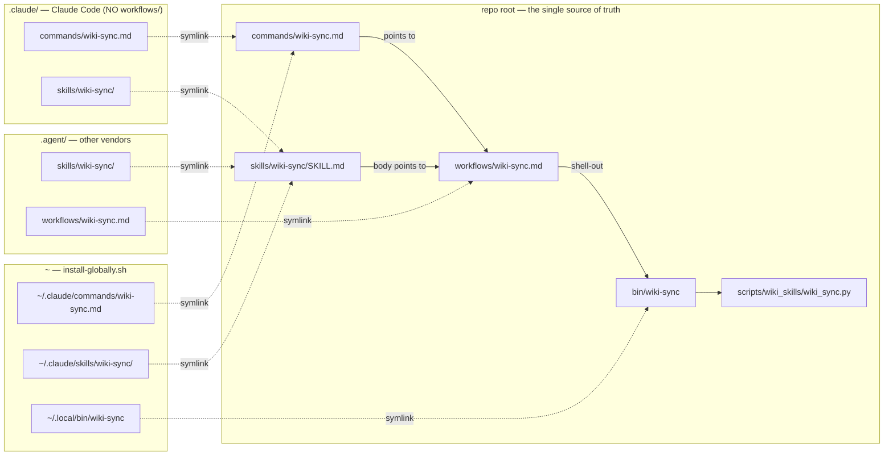
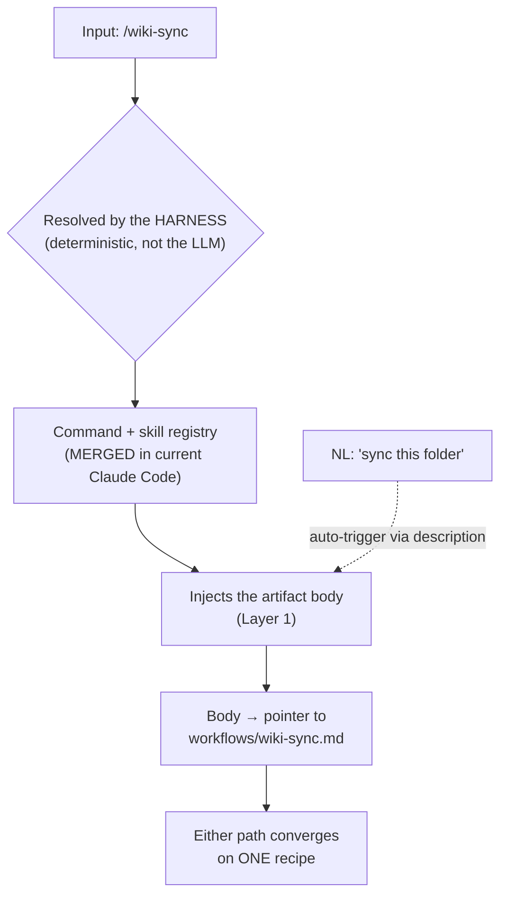
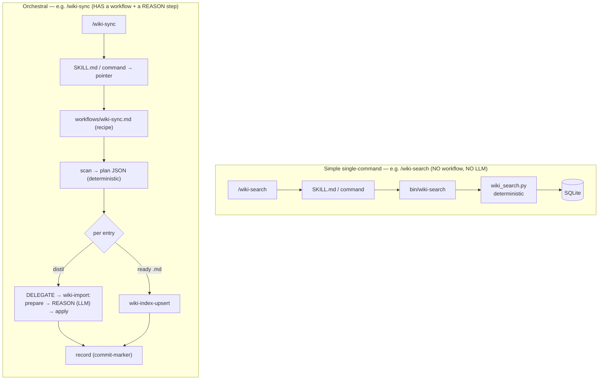
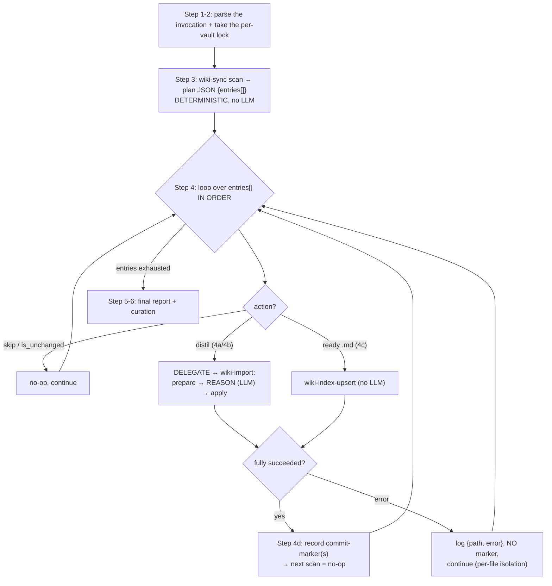

# 1.6. Skill / Command / Workflow Execution Model

> Part of [docs/ARCHITECTURE.md](../ARCHITECTURE.md). Sibling of
> [§1.5 Project Anatomy](./project-anatomy.md) — that chapter maps *where files live*;
> this one explains *what actually runs* when you type `/wiki-sync`.
>
> 🌐 **Русская версия:** [skill-command-workflow-model.md](./skill-command-workflow-model.md)
> (the two are kept in sync; this is the English mirror).

This chapter answers the three questions that come up for anyone looking at the repository
for the first time (and for the same person two months later):

1. **Why does one name** (`wiki-sync`) appear at once as a *skill*, a *slash command*, and
   a *workflow*? Are these duplicates?
2. **Which of them is chosen** when I type `/wiki-sync`? Won't the agent get confused —
   call the skill or the command?
3. **What exactly is taken from the skill vs. from the workflow** when the final
   instructions are assembled? Who loads what, and when?

All diagrams are `mermaid` and self-contained: each one drops cleanly onto its own slide in
a training deck.

---

## In one sentence (TL;DR)

> One name = **up to five same-named surfaces**, each with a distinct role; the harness
> loads them **lazily, in layers** (progressive disclosure), and the "skill vs. command"
> choice is made **deterministically by the CLI itself, not by the model**. Nothing is a
> "duplicate" — it is a deliberate **multi-key binding** of one capability, and every key
> converges on a single recipe.

---

## 1. The cast: five same-named surfaces

The name `wiki-sync` physically appears in the repo up to five times — but these are not
copies, they are different **roles** of one capability:

| Surface | Path (repo root) | Role | Who reads it | When it enters context |
|---|---|---|---|---|
| **Slash command** | `commands/wiki-sync.md` | explicit `/wiki-sync` entry | harness (CLI) | when `/` is typed |
| **Skill manifest** | `skills/wiki-sync/SKILL.md` | `name` / `description` / `tier` + orientation + reference (flags, plan-JSON schema, exit codes) | harness | `description` — **always** (Layer 0); body — **on invocation** (Layer 1) |
| **Workflow recipe** | `workflows/wiki-sync.md` | step-by-step orchestration recipe | **the model, via `Read`** | Layer 2 (following the body's pointer) |
| **Bash wrapper** | `bin/wiki-sync` | activates venv + `exec python -m …` | shell | during step execution |
| **Python CLI** | `scripts/wiki_skills/wiki_sync.py` | deterministic core (plan JSON, commit-markers) | interpreter | during execution |
| *(sub-contracts)* | `skills/<name>/references/*.md` | narrow contracts (e.g. REASON / H-6) | the model, via `Read` | Layer 3 (at the specific step) |

The base "4-file" minimum (`command` + `skill` + `bin` + `python`) exists for **every**
skill (see [§1.5.1](./project-anatomy.md)). **The workflow is a fifth, optional artifact**:
it appears only for *orchestral* skills that have multi-step logic and an LLM reasoning step
(see §5).

---

## 2. Why the names collide on purpose — the multi-key binding

The name collision is a **binding convention**, not a clash. Three keys open one door
because the capability has three distinct ways of being invoked/discovered:

- **command** → the explicit typed `/wiki-sync` entry;
- **skill `description`** → natural-language auto-trigger ("sync this folder", "ingest my
  course zone"), and the skill body doubles as a reference;
- **workflow** → the actual executable recipe that both the command and the skill body
  point at.

The source of truth is the **repo root**. From there the artifacts "fan out" via symlinks
into the vendor trees (`.claude/` for Claude Code, `.agent/` for other CLIs) and into the
global install (`~/.local/bin`, `~/.claude/…` via `bin/install-globally.sh`):



> ⚠️ **Key subtlety in the diagram:** there is **no** `workflows/` directory under
> `.claude/`. Claude Code registers only *commands* and *skills*; the model reaches the
> workflow recipe **via `Read`** by following a path pointer, not via a registration
> mechanism. Under `.agent/workflows/` the recipe is symlinked for NON-Claude vendors
> (there it is part of the framework). In other words, a workflow is "an ordinary repo file
> that things point at," not a harness-registered artifact.

---

## 3. How the harness assembles the final instructions — progressive disclosure

The crux: **the harness does not pre-assemble one big document.** Instructions enter context
**in layers**, and most of them are pulled in by **the model itself via `Read`**, because
the previous layer told it to. This is the progressive-disclosure (lazy-loading) pattern —
it keeps the "always-loaded" context tiny.

```mermaid
sequenceDiagram
    actor U as Operator
    participant H as Harness (CLI)
    participant M as Model (orchestrator)
    participant FS as Repo files

    Note over H: Layer 0 — always in context:<br/>only the description lines of every skill (the "menu")
    U->>H: /wiki-sync &lt;zone&gt; --vault v
    Note over H: Layer 1 — deterministic routing on "/"
    H->>M: injects the artifact BODY<br/>(SKILL.md body / command body)<br/>= orientation + pointer to the workflow
    Note over M: Layer 2 — model follows the pointer
    M->>FS: Read workflows/wiki-sync.md
    FS-->>M: recipe steps (lock → scan → delegate → record)
    Note over M: Layer 3 — deeper, on demand
    M->>FS: Read references/reason-contract.md (at the REASON step)
    FS-->>M: H-6 + REASON sub-contract
    M->>H: shell-out: wiki-sync scan / wiki-import / record
```

| Layer | What enters context | Who loads it | When |
|---|---|---|---|
| **0** | only the `description` lines of every skill | **harness** | always, every session |
| **1** | the **body** of the resolved artifact (SKILL.md / command) — orientation + CLI reference + pointer | **harness** | at the moment `/wiki-sync` is invoked |
| **2** | the **recipe** `workflows/wiki-sync.md` (the steps) | **the model, `Read`** | because Layer 1 said "follow the recipe" |
| **3** | the **sub-contracts** `references/*.md` (REASON, H-6) | **the model, `Read`** | at the specific step that references them |

> **The rule in one line:** the harness owns the **entry** (Layers 0–1); the model owns
> **walking the pointer chain** (Layers 2–3) via `Read`. The final instructions are not a
> pre-assembled text — they are what the model has read, link by link.

**What is taken directly from the skill vs. from the workflow:**

- **from the skill/command** (injected by the harness) — only the **annotation** (Layer 0)
  and the **orientation body** (Layer 1): "what this is, what the CLI flags are, what the
  guarantees are (H-6), and **go read the recipe**". The body contains no executable steps —
  it is a deliberately thin, cheap, always-discoverable shim.
- **from the workflow** — **everything operational** (the step sequence, the lock protocol,
  the delegation, the commit-marker). But it enters context **only because the model ran
  `Read`** following the pointer from Layer 1.

---

## 4. Who chooses skill vs. command? — deterministic dispatch

When you type `/wiki-sync`, the choice is made by the **harness (CLI), not the LLM**. The
`/` prefix is deterministic routing through the registry; the model is not handed a "call
skill or command?" fork. There is physically nothing for the agent to "confuse."



Nuances worth knowing (but harmless here):

- In current Claude Code, **slash commands are merged into skills** in a single namespace:
  both `commands/wiki-sync.md` and `skills/wiki-sync/SKILL.md` create `/wiki-sync` and behave
  the same — this is by design.
- Keeping both same-named artifacts is **technically a collision**, and the exact tiebreak
  (which one "wins" if their contents differ) is **undocumented**.
- **But in this repo it is safe**, because both entries are thin pointers to the **same**
  `workflows/wiki-sync.md`. Whichever entry the harness picks, execution converges on a
  single recipe → there is no divergent behavior.

> Registry hygiene (optional): if one ever wants to be "docs-clean," the canonical move is to
> keep the **skill** (the newer, richer model: it gets both the `/` invocation and the NL
> auto-trigger) and drop the duplicate `commands/*.md` wrapper. This should be done **across
> all commands at once**, otherwise it becomes inconsistent — so it is not touched without an
> explicit decision.

---

## 5. Two shapes of skill: simple single-command vs. orchestral

Not every skill has a workflow. It depends on whether an LLM reasoning step is needed.



- **Simple** (only `command` + `skill` + `bin` + `python`, no workflow): `wiki-search`,
  `wiki-init`, `wiki-lint`, `wiki-reindex`, `wiki-index-upsert`, `wiki-index-render`,
  `wiki-append-log`, `wiki-alias`, `wiki-confirm`, `wiki-merge`, `wiki-graph`,
  `wiki-health`. A single CLI command with no multi-step orchestration — nothing to reason
  about.
- **Orchestral** (have a workflow + an LLM reasoning step): `wiki-import`, `wiki-sync`,
  `wiki-query`, `wiki-extract-concepts`, `wiki-verify-multi`
  (+ `wiki-verify-eval` — an eval harness). For these the Python core stays deterministic
  (**Decision-17, no `import anthropic`**), and the single "think" step is lifted into the
  workflow.

---

## 6. What the workflow actually "executes" — spine + loop + branches

A workflow is **a prose recipe executed by the model (the orchestrator)**, not a program
that an interpreter runs rigidly. The control structure is an outer linear "spine" **+ a
loop over plan items + branches + per-file error isolation**. All deterministic work is
shelled out to the Python CLI (`scan`/`record` — no LLM); the model "thinks" only at the
REASON step.



Three properties that make this robust:

- **Idempotency.** `record` writes a commit-marker only after a file **fully** succeeds. The
  next `scan` sees the marker → `is_unchanged` → no-op. A re-run is safe.
- **Per-file isolation.** A failure of one file is logged and `continue`d — it leaves **no**
  marker (the file is re-planned) and does **not** abort the whole batch.
- **Determinism where it matters.** Ordering and contracts are held by the CLI (plan-JSON,
  exit codes, markers); the LLM part (the loop, the branches, REASON) is the discipline of
  following the recipe.

---

## 7. Vendor-agnosticism: only the loading mechanism changes

The same recipe works under any LLM CLI (Claude Code / Codex / Gemini / pi / hermes). **The
variable part is only Layer 1** (how exactly the artifact body enters context): on vendors
without a `Skill({…})` tool, the REASON contract is brought into context inline/manually.
**Layers 2–3 are identical** everywhere: the same `Read` of the recipe, the same delegation,
the same guarantees (H-6, isolation, commit-marker). This is precisely why the heavy recipe
is split out into a separate workflow rather than baked into SKILL.md — it loads lazily and
identically regardless of the harness (see the `## Fallback` section inside
[`workflows/wiki-sync.md`](../../workflows/wiki-sync.md): *"Only the skill-loading mechanism
differs"*).

---

## 8. How to add a new skill (checklist)

All same-named surfaces must move **in lockstep** — adding a skill = adding files of one
matching name:

1. `commands/wiki-<name>.md` — slash entry (frontmatter `description:`; body = quick-ref +
   pointer to the workflow, if there is one).
2. `skills/wiki-<name>/SKILL.md` — manifest (`name` / `description` / `tier`) + reference.
3. `bin/wiki-<name>` — executable wrapper (venv + `exec python -m scripts.wiki_skills.…`).
4. `scripts/wiki_skills/wiki_<name>.py` — deterministic CLI (argparse + JSON envelope; **no
   `import anthropic`** — Decision-17).
5. *(orchestral skill only)* `workflows/wiki-<name>.md` — the step-by-step recipe; referenced
   by #1 and #2.
6. Run `bin/install-globally.sh` (→ `~/.local/bin` + `~/.claude/{skills,commands}`) **and**
   `bin/install-project-symlinks.sh` (the `.claude`/`.agent` vendor trees). **New entries are
   not auto-propagated** — without this the symlinks won't appear.

> The name `wiki-<name>` uses dashes everywhere except the Python module (`wiki_<name>.py`,
> Python module rules). This is exactly the "binding by name" from §2.

---

## 9. If you forget everything else (cheat sheet)

- One name = up to 5 roles (command / SKILL / workflow / bin / py). Not duplicates — a
  multi-key binding of one capability.
- `/wiki-sync` is resolved by the **harness deterministically**, not the LLM. Every path
  converges on one workflow → the "skill vs. command" choice is harmless.
- Instructions load **in layers**: the harness provides the entry (Layers 0–1), the model
  reads the recipe and sub-contracts via `Read` (Layers 2–3).
- **Determinism lives in the Python CLI** (`scan`/`record`, plan-JSON, exit codes); **LLM
  reasoning is only the REASON step** inside the workflow (Decision-17).
- The source of truth is the **repo root**; `.claude/`/`.agent/`/the global install are
  symlinks. There is **no** `workflows/` under `.claude/` — the recipe is read by path.
