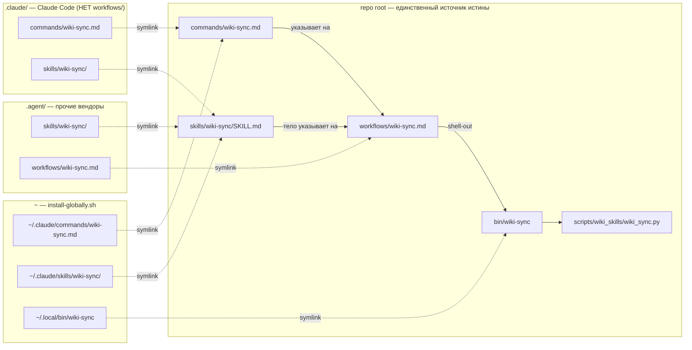
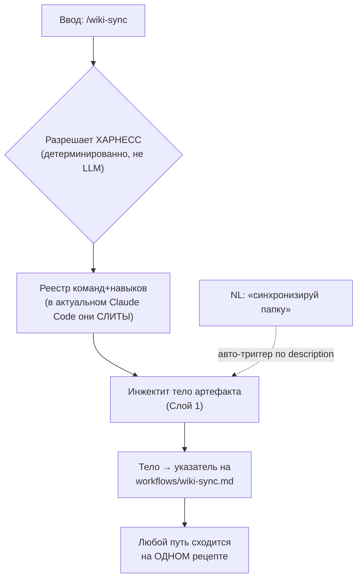
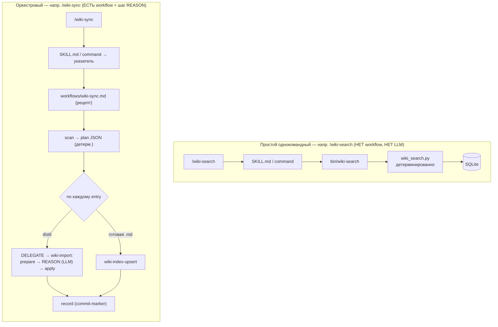
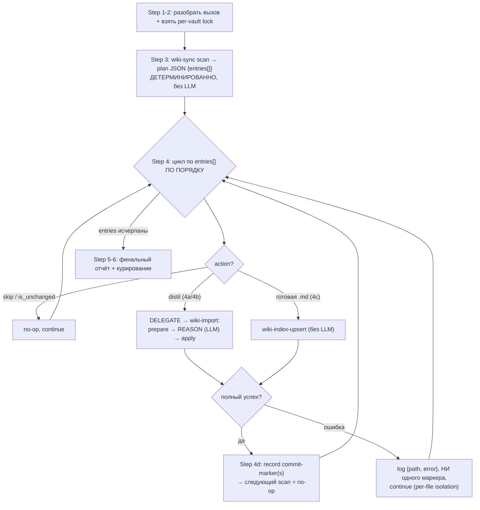

# 1.6. Skill / Command / Workflow Execution Model

> Part of [docs/ARCHITECTURE.md](../ARCHITECTURE.md). Sibling of
> [§1.5 Project Anatomy](./project-anatomy.md) — that chapter maps *where files live*;
> this one explains *what actually runs* when you type `/wiki-sync`.
>
> 🌐 **English version:** [skill-command-workflow-model.en.md](./skill-command-workflow-model.en.md)
> (обе версии держатся синхронными; это русский оригинал).

Эта глава отвечает на три вопроса, которые регулярно всплывают у любого, кто впервые
смотрит на репозиторий (и у того же человека через месяц-два):

1. **Почему одно и то же имя** (`wiki-sync`) встречается сразу как *skill*, как
   *slash-команда* и как *workflow*? Это дубликаты?
2. **Что из них выбирается**, когда я ввожу `/wiki-sync`? Агент не запутается — звать
   skill или команду?
3. **Что конкретно берётся из skill, а что из workflow** при формировании финальных
   инструкций? Кто и когда что подгружает?

Все диаграммы — в `mermaid` и самодостаточны: каждую можно вставить отдельным слайдом в
обучающую презентацию.

---

## Мысль одним предложением (TL;DR)

> Одно имя — это **до пяти одноимённых поверхностей**, каждая со своей ролью; харнесс
> подгружает их **лениво, слоями** (progressive disclosure), а выбор «skill vs команда»
> делает **детерминированно сам CLI, а не модель**. Ничего не «дублируется» — это
> намеренный **многоключевой биндинг** одной возможности, и все ключи сходятся на одном
> рецепте.

---

## 1. Действующие лица: пять одноимённых поверхностей

Имя `wiki-sync` физически встречается в репозитории до пяти раз — но это не копии, а
разные **роли** одной возможности:

| Поверхность | Путь (repo root) | Роль | Кто читает | Когда попадает в контекст |
|---|---|---|---|---|
| **Slash-команда** | `commands/wiki-sync.md` | явный вход по `/wiki-sync` | харнесс (CLI) | при вводе `/` |
| **Манифест навыка** | `skills/wiki-sync/SKILL.md` | `name` / `description` / `tier` + ориентир + справка (флаги, схема plan-JSON, коды выхода) | харнесс | `description` — **всегда** (Слой 0); тело — **при вызове** (Слой 1) |
| **Workflow-рецепт** | `workflows/wiki-sync.md` | пошаговый рецепт оркестрации | **модель, через `Read`** | Слой 2 (по указателю из тела) |
| **Bash-обёртка** | `bin/wiki-sync` | активирует venv + `exec python -m …` | shell | во время исполнения шага |
| **Python-CLI** | `scripts/wiki_skills/wiki_sync.py` | детерминированное ядро (plan JSON, commit-маркеры) | интерпретатор | во время исполнения |
| *(под-контракты)* | `skills/<name>/references/*.md` | узкие контракты (напр. REASON / H-6) | модель, через `Read` | Слой 3 (на конкретном шаге) |

Базовый «4-файловый» минимум (`command` + `skill` + `bin` + `python`) есть у **каждого**
скила (см. [§1.5.1](./project-anatomy.md)). **Workflow — пятый, опциональный артефакт**:
он появляется только у *оркестровых* скилов, где есть многошаговая логика и шаг
рассуждения LLM (см. §5).

---

## 2. Почему имена совпадают намеренно — «многоключевой» биндинг

Совпадение имён — это **конвенция связывания**, а не коллизия. Три ключа открывают одну
дверь, потому что у возможности три разных способа быть вызванной/обнаруженной:

- **команда** → явный набранный вход `/wiki-sync`;
- **`description` навыка** → авто-триггер по естественному языку («синхронизируй эту
  папку», «ingest my course zone»), плюс тело навыка — это справочник;
- **workflow** → собственно исполняемый рецепт, на который указывают и команда, и тело
  навыка.

Источник истины — **корень репозитория**. Оттуда артефакты «разветвляются» симлинками в
вендорные деревья (`.claude/` для Claude Code, `.agent/` для прочих CLI) и в глобальную
установку (`~/.local/bin`, `~/.claude/…` через `bin/install-globally.sh`):



> ⚠️ **Важный нюанс схемы:** в `.claude/` **нет** каталога `workflows/`. Claude Code
> регистрирует только *команды* и *навыки*; до workflow-рецепта модель доходит **через
> `Read`** по пути-указателю, а не через механизм регистрации. Под `.agent/workflows/`
> рецепт симлинкнут для НЕ-Claude вендоров (там это часть фреймворка). То есть workflow —
> это «обычный файл репозитория, на который ссылаются», а не зарегистрированный артефакт
> харнесса.

---

## 3. Как харнесс собирает финальные инструкции — progressive disclosure

Ключевое: **харнесс не склеивает один большой документ заранее.** Инструкции входят в
контекст **слоями**, и бóльшую часть затаскивает **сама модель через `Read`**, потому что
предыдущий слой так велел. Это паттерн ленивой загрузки (progressive disclosure) — он
держит «всегда-загруженный» контекст крошечным.

```mermaid
sequenceDiagram
    actor U as Оператор
    participant H as Харнесс (CLI)
    participant M as Модель (оркестратор)
    participant FS as Файлы репозитория

    Note over H: Слой 0 — всегда в контексте:<br/>только строки description всех скилов («меню»)
    U->>H: /wiki-sync &lt;zone&gt; --vault v
    Note over H: Слой 1 — детерминированная маршрутизация по «/»
    H->>M: инжектит ТЕЛО артефакта<br/>(SKILL.md body / command body)<br/>= ориентир + указатель на workflow
    Note over M: Слой 2 — модель идёт по указателю
    M->>FS: Read workflows/wiki-sync.md
    FS-->>M: шаги рецепта (lock → scan → delegate → record)
    Note over M: Слой 3 — глубже, по месту
    M->>FS: Read references/reason-contract.md (на шаге REASON)
    FS-->>M: под-контракт H-6 + REASON
    M->>H: shell-out: wiki-sync scan / wiki-import / record
```

| Слой | Что входит в контекст | Кто загружает | Когда |
|---|---|---|---|
| **0** | только `description`-строки всех скилов | **харнесс** | всегда, в каждой сессии |
| **1** | **тело** разрешённого артефакта (SKILL.md / команды) — ориентир + CLI-справка + указатель | **харнесс** | в момент вызова `/wiki-sync` |
| **2** | сам **рецепт** `workflows/wiki-sync.md` (шаги) | **модель, `Read`** | потому что Слой 1 сказал «follow the recipe» |
| **3** | **под-контракты** `references/*.md` (REASON, H-6) | **модель, `Read`** | на конкретном шаге, который на них ссылается |

> **Правило в одну строку:** харнесс отвечает за **вход** (Слои 0–1), модель — за
> **разворачивание цепочки указателей** (Слои 2–3) через `Read`. Финальные инструкции —
> это не заранее собранный текст, а то, что модель последовательно дочитала по ссылкам.

**Что берётся напрямую из skill, а что из workflow:**

- **из skill/command** (инжектит харнесс) — только **аннотация** (Слой 0) и
  **тело-ориентир** (Слой 1): «что это, какие флаги у CLI, какие гарантии (H-6), и **иди
  читай рецепт**». Исполняемых шагов тело не содержит — это намеренно тонкая, дешёвая,
  всегда-обнаружимая прокладка.
- **из workflow** — **всё операционное** (последовательность шагов, lock-протокол,
  делегирование, commit-маркер). Но оно попадает в контекст **только потому, что модель
  выполнила `Read`** по указателю из Слоя 1.

---

## 4. Кто выбирает skill или command? — детерминированная диспетчеризация

Когда вы вводите `/wiki-sync`, выбор делает **харнесс (CLI), а не LLM**. Префикс `/` — это
детерминированная маршрутизация через реестр; модель не получает развилку «звать skill или
команду». «Запутаться» на уровне агента физически нечему.



Нюансы, которые стоит знать (но которые здесь безвредны):

- В актуальном Claude Code **слэш-команды слиты со скилами** в единое пространство имён:
  и `commands/wiki-sync.md`, и `skills/wiki-sync/SKILL.md` создают `/wiki-sync` и ведут
  себя одинаково — это by design.
- Держать оба одноимённых артефакта — **технически коллизия**, и точный тай-брейк (кто
  «выигрывает», если содержимое разное) **не документирован**.
- **Но в этом репозитории это безопасно**, потому что оба входа — тонкие указатели на
  **один и тот же** `workflows/wiki-sync.md`. Какую бы запись харнесс ни выбрал,
  исполнение упирается в один рецепт → расходящегося поведения нет.

> Гигиена реестра (необязательно): если когда-нибудь захочется быть «чистым по докам»,
> канонический путь — оставить **skill** (более новая, богатая модель: получает и
> `/`-вызов, и NL-автотриггер) и убрать дублирующую `commands/*.md`-обёртку. Делать это
> стоит **разом по всем командам**, иначе появится непоследовательность — поэтому без
> явного решения это не трогается.

---

## 5. Две формы скилов: простой однокомандный vs оркестровый

Не у всех скилов есть workflow. Это зависит от того, нужен ли шаг рассуждения LLM.



- **Простые** (только `command`+`skill`+`bin`+`python`, без workflow): `wiki-search`,
  `wiki-init`, `wiki-lint`, `wiki-reindex`, `wiki-index-upsert`, `wiki-index-render`,
  `wiki-append-log`, `wiki-alias`, `wiki-confirm`, `wiki-merge`, `wiki-graph`,
  `wiki-health`. Это одна CLI-команда без многошаговой оркестрации — рассуждать нечего.
- **Оркестровые** (есть workflow + шаг рассуждения LLM): `wiki-import`, `wiki-sync`,
  `wiki-query`, `wiki-enrich`, `wiki-extract-concepts`, `wiki-verify-multi`
  (+ `wiki-verify-eval` — eval-харнесс). Именно у них Python-ядро остаётся
  детерминированным (**Decision-17, без `import anthropic`**), а единственный шаг
  «подумать» вынесен в workflow.

---

## 6. Что именно «исполняет» workflow — спайн + цикл + ветвления

Workflow — это **проза-рецепт, который исполняет модель (оркестратор)**, а не программа,
которую интерпретатор гоняет строго. Управляющая структура — внешний линейный «спайн» **+
цикл по элементам плана + ветвления + изоляция ошибок по файлам**. Вся детерминированная
работа вынесена в shell-out в Python-CLI (`scan`/`record` — без LLM); модель «думает»
только на шаге REASON.



Три свойства, которые делают это надёжным:

- **Идемпотентность.** `record` пишет commit-маркер только после **полного** успеха файла.
  Следующий `scan` видит маркер → `is_unchanged` → no-op. Повторный прогон безопасен.
- **Изоляция по файлам.** Ошибка одного файла логируется и `continue` — она **не**
  оставляет маркер (файл будет перепланирован) и **не** рушит весь батч.
- **Detерминизм там, где важно.** Порядок и контракты держит CLI (plan-JSON, коды выхода,
  маркеры); LLM-часть (цикл, ветвления, REASON) — это дисциплина следования рецепту.

---

## 7. Вендор-агностичность: меняется только механизм загрузки

Один и тот же рецепт работает под любым LLM-CLI (Claude Code / Codex / Gemini / pi /
hermes). **Переменная часть — только Слой 1** (как именно тело артефакта попадает в
контекст): на вендорах без `Skill({…})`-инструмента контракт REASON вносится в контекст
инлайном/вручную. **Слои 2–3 идентичны** у всех: тот же `Read` рецепта, та же делегация,
те же гарантии (H-6, изоляция, commit-маркер). Это и есть причина, по которой тяжёлый
рецепт вынесен в отдельный workflow, а не вшит в SKILL.md, — он грузится лениво и
одинаково независимо от харнесса (см. секцию `## Fallback` в самом
[`workflows/wiki-sync.md`](../../workflows/wiki-sync.md): *«Only the skill-loading
mechanism differs»*).

---

## 8. Как добавить новый скил (чеклист)

Все одноимённые поверхности должны идти **в лок-степе** — добавить скил = добавить файлы
одного имени:

1. `commands/wiki-<name>.md` — slash-вход (frontmatter `description:`; тело — quick-ref +
   указатель на workflow, если он есть).
2. `skills/wiki-<name>/SKILL.md` — манифест (`name` / `description` / `tier`) + справка.
3. `bin/wiki-<name>` — исполняемая обёртка (venv + `exec python -m scripts.wiki_skills.…`).
4. `scripts/wiki_skills/wiki_<name>.py` — детерминированный CLI (argparse + JSON-envelope;
   **без `import anthropic`** — Decision-17).
5. *(только для оркестрового скила)* `workflows/wiki-<name>.md` — пошаговый рецепт; на
   него ссылаются п. 1 и п. 2.
6. Прогнать `bin/install-globally.sh` (→ `~/.local/bin` + `~/.claude/{skills,commands}`)
   **и** `bin/install-project-symlinks.sh` (вендорные деревья `.claude`/`.agent`). **Новые
   записи не разворачиваются автоматически** — без этого симлинки не появятся.

> Имя `wiki-<name>` — через дефис везде, кроме Python-модуля (`wiki_<name>.py`, правила
> модулей Python). Это и есть «биндинг по имени» из §2.

---

## 9. Если забыли всё остальное (шпаргалка)

- Одно имя = до 5 ролей (command / SKILL / workflow / bin / py). Не дубликаты —
  многоключевой биндинг одной возможности.
- `/wiki-sync` разрешает **харнесс детерминированно**, не LLM. Все пути сходятся на одном
  workflow → выбор «skill vs команда» безвреден.
- Инструкции грузятся **слоями**: харнесс даёт вход (Слои 0–1), модель дочитывает рецепт и
  под-контракты через `Read` (Слои 2–3).
- **Detерминизм — в Python-CLI** (`scan`/`record`, plan-JSON, коды выхода); **рассуждение
  LLM — только шаг REASON** внутри workflow (Decision-17).
- Источник истины — **корень репозитория**; `.claude/`/`.agent/`/глобальная установка —
  это симлинки. В `.claude/` **нет** `workflows/` — рецепт читается по пути.
