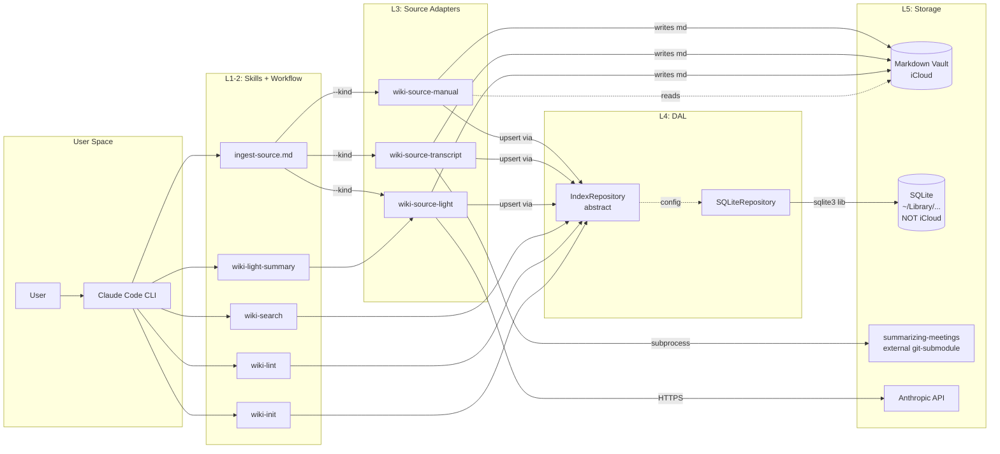

# 3. System Architecture

> Part of [docs/ARCHITECTURE.md](../ARCHITECTURE.md).


### 3.1. Architectural Style

**Layered Architecture** (5 layers):

| Layer | Responsibility | Components |
|---|---|---|
| **L1: Skill Layer** | User-facing entry points. Argument parsing, output formatting, JSON envelopes. | `wiki-init`, `wiki-search`, `wiki-lint`, etc. |
| **L2: Workflow Layer** | Multi-step orchestration, dispatch, error-handling chains. | `ingest-source` workflow |
| **L3: Source Adapter Layer** | Pluggable input normalizers. Common contract. | `wiki-source-manual / -transcript / -light` |
| **L4: Index Layer (DAL)** | Storage abstraction. Repository pattern. Single-place SQL. | `IndexRepository` + `SQLiteRepository` |
| **L5: Storage** | Persistence: filesystem + SQLite. | Markdown vault + SQLite DB |

**Justification**:
- **Simplicity** (skill-architecture-design TIER 0): Layers — простейшая модель для CLI-tool с DB.
- **No microservices**: single-user, single-machine — overkill.
- **No event-driven**: операции синхронные, сложность очередей не оправдана.
- **No frameworks**: stdlib `sqlite3` + `argparse` + `python-frontmatter` — достаточно. Никакого ORM (SQL queries напрямую через repository).
- **Pluggable adapters**: даёт extensibility под будущий email/telegram (Epic 6) без переделки L1/L2/L4.
- **Repository pattern**: позволяет swap SQLite → Postgres через config (R-04). **Test-isolation bonus**: skill unit-tests используют in-memory mock `IndexRepository` (no real SQLite файл, no FS pollution, fast tests).

### 3.2. System Components

#### Component: **wiki-init** (Skill)

- **Type**: Python CLI script + skill markdown wrapper.
- **Purpose**: Bootstrap нового vault'а. Implements UC-01.
- **Implemented Functions**: Configuration resolution, iCloud detection, SQLite creation, vault_metadata seeding, directory mkdir, CLAUDE.md template write.
- **Technologies**: Python 3.11+, `sqlite3` (stdlib), `pathlib`, `hashlib` (sha256), `pyyaml`, `jsonschema`.
- **Interfaces**:
  - **Inbound**: User via `/wiki-init [--root ...] [--language ...] [--non-interactive]`.
  - **Outbound**: filesystem (mkdir, write CLAUDE.md), SQLite (apply DDL, seed vault_metadata).
- **Dependencies**: `python-slugify`, `pyyaml`, `jsonschema`. Internal: Configuration Resolver, Index Layer (для DDL apply).

#### Component: **IndexRepository** (DAL abstract base)

- **Type**: Python abstract class (`abc.ABC`).
- **Purpose**: Generic interface для всех storage operations. Скрывает SQL/SQLite-specific код от skills.
- **Implemented Functions**: 15 methods listed в TASK §3 I-2.1.
- **Technologies**: Python 3.11+ ABC, dataclasses.
- **Interfaces**:
  - **Inbound**: Skills + Source Adapters call via `make_repo(config)` factory.
  - **Outbound**: Concrete implementations (`SQLiteRepository`, future `PostgresRepository`).
- **Dependencies**: None (это сам по себе абстрактный contract).

#### Component: **SQLiteRepository** (DAL concrete)

- **Type**: Python class implementing `IndexRepository`.
- **Purpose**: SQLite-specific implementation. WAL mode, FTS5 queries, JSON-extract для frontmatter, atomic transactions.
- **Implemented Functions**: ALL `IndexRepository` methods.
- **Technologies**: `sqlite3` (stdlib, version ≥ 3.38), `python-slugify`, `python-frontmatter`. Опц. `sqlite-vec` (.dylib/.so) для future vector layer.
- **Interfaces**:
  - **Inbound**: Through `IndexRepository` interface.
  - **Outbound**: SQLite filesystem (`<db_path>.db`).
- **Dependencies**: SQLite library (system или bundled). DDL из `sql/wiki-index.sql` (= `SCHEMA-DRAFT.sql`).

#### Component: **wiki-index-upsert** (Skill — standalone-only entry point)

- **Type**: Python CLI script + skill markdown wrapper.
- **Purpose**: Standalone skill для index upsert одной markdown-страницы которая **уже** на диске. **НЕ** вызывается изнутри Source Adapter chain — adapter сам вызывает `repo.upsert_page(...)` напрямую (см. §3.2 «Adapter <-> repository contract»: single transactional boundary, no subprocess overhead, нет race window). Это избегает дублирования и double-write semantics.
- **Когда вызывается**:
  1. Пользователь вручную: `/wiki-index-upsert --page <path>` для already-on-disk файла, который не нуждается в normalization (manual workflow альтернатива `wiki-source-manual` adapter).
  2. `wiki-lint --fix` для re-индексации orphan'ов (drift fix).
  3. Bulk migration script для tmp2/ (I-5.2 sequential calls).
- **Implemented Functions**: Read file, parse frontmatter, `repo.upsert_page(...)`, `repo.replace_refs(...)`, return JSON envelope.
- **Technologies**: Python 3.11+, `python-frontmatter`.
- **Interfaces**:
  - **Inbound**: `/wiki-index-upsert --page <path>`.
  - **Outbound**: SQLite via Index Layer.
- **Dependencies**: Configuration Resolver, Index Layer.
- **Implements**: R-07.
- **Distinct from `wiki-source-manual` adapter**: adapter does input validation + path-traversal check + (LLM if applicable) + write markdown → then upsert. This skill assumes markdown is already valid and on-disk — only does upsert. Different responsibilities; canonically called for different scenarios.

#### Component: **wiki-index-render** (Skill)

- **Type**: Python CLI script + skill markdown wrapper.
- **Purpose**: Generate `index.md` (read-only projection) from SQLite. Implements UC-05 step 7. Auto-shards если pages > 200 → создаёт `00-Vault-Index/by-{category}.md` shards + `index.md` router.
- **Implemented Functions**: SQL query через `repo.search_pages(...)` (или `repo.list_pages(...)` если добавлен в IndexRepository v2), grouping by `wiki.index_render.group_by`, markdown rendering, atomic write через tempfile.
- **Technologies**: Python 3.11+. Reuses Index Layer.
- **Interfaces**:
  - **Inbound**: `/wiki-index-render [--scope vault|project] [--out <path>]`.
  - **Outbound**: Atomically writes `<vault>/00-Vault-Index/index.md` (overwrite). 
- **Dependencies**: Configuration Resolver, Index Layer.
- **Implements**: R-08.

#### Component: **wiki-search** (Skill)

- **Type**: Python CLI script + skill wrapper.
- **Purpose**: FTS5-backed text search. Implements UC-03.
- **Implemented Functions**: `repo.search_pages(...)` + markdown rendering + co-occurrence collection (для concept-type queries).
- **Technologies**: Python 3.11+. Reuses Index Layer.
- **Interfaces**:
  - **Inbound**: User via `/wiki-search "query" [--type ...] [--project ...] [--limit N]`.
  - **Outbound**: stdout markdown formatted output.
- **Dependencies**: Configuration Resolver, Index Layer.

#### Component: **wiki-lint** (Skill)

- **Type**: Python CLI script + skill wrapper.
- **Purpose**: Health-check корпуса через SQL. Implements UC-04.
- **Implemented Functions**: 9 чеков (orphan, missing-backlinks, stale, frontmatter, taxonomy, drift, log-gaps, duplicate-concepts strict-only, external-only-orphans). Все через SQL.
- **Technologies**: Python 3.11+, `sqlite3`. Markdown rendering для report.
- **Interfaces**:
  - **Inbound**: User via `/wiki-lint [--root ...] [--fix] [--report ...] [--strict]`.
  - **Outbound**: Markdown report file + JSON sidecar. Опц. `--fix` apply mutations.
- **Dependencies**: Configuration Resolver, Index Layer, filesystem walk (для drift).

#### Subsection: **SourceAdapter Interface** (abstract contract — R-06.1)

Все Source Adapters имплементируют этот контракт. Спрятан в `scripts/wiki_source/base.py`.

```python
from abc import ABC, abstractmethod
from dataclasses import dataclass
from typing import Iterator, Optional

@dataclass
class SourceItem:
    """Один атомарный input — manual md-file, light text-chunk, transcript path."""
    source_kind: str            # 'manual' | 'transcript' | 'light' | future 'email'/'telegram'/'web'
    source_id: str              # для manual = file path, для light = sha256(text), для transcript = transcript path
    timestamp: str              # ISO-8601, when item was fetched/seen
    sender: Optional[dict]      # {name, email, telegram_handle} — для cross-source entity resolution (future Epic 6)
    recipients: list[dict]      # same — future use
    subject: Optional[str]      # для emails/light = title; для manual/transcript = file basename
    body: str                   # raw markdown / raw text content
    metadata: dict              # source-specific fields

@dataclass
class SourceOutput:
    """Что adapter возвращает после обработки SourceItem."""
    file_path: str              # relative to vault — куда положили markdown
    interaction_id: Optional[str]  # для future Epic 6 (interactions table); None в MVP
    summary_excerpt: str        # first 200 chars of generated/indexed summary

class SourceAdapter(ABC):
    """Каждый источник имплементирует этот interface. Контракт R-06.1."""

    @property
    @abstractmethod
    def kind(self) -> str:
        """'manual' | 'transcript' | 'light' | future 'email'/'telegram'/'web'."""

    @abstractmethod
    def authenticate(self, config: dict) -> None:
        """First-run setup. manual/light/transcript: no-op. Future email: OAuth flow.
        Idempotent — повторный вызов не делает re-auth если уже OK."""

    @abstractmethod
    def fetch(self, since: Optional[str] = None) -> Iterator[SourceItem]:
        """Pull новых items. Для manual/light — single-shot (yield один SourceItem из argv).
        Для future pull-источников — pagination + dedup через source_state.
        `since` = ISO-8601; если None — adapter решает default (e.g., last 3 days)."""

    @abstractmethod
    def normalize_to_md(self, item: SourceItem, vault_paths: dict, repo: 'IndexRepository') -> SourceOutput:
        """Сгенерировать markdown с frontmatter, записать в vault, вызвать repo.upsert_page().
        Returns SourceOutput. Errors — raise SourceAdapterError(code, message)."""

    @abstractmethod
    def dedup_state_file(self, config: dict) -> Optional[str]:
        """Путь к .state.json для этого adapter'а. None для manual/light/transcript (нет state).
        Для future email/telegram — путь к persistent dedup state."""


class SourceAdapterError(Exception):
    """Унифицированная ошибка из adapter'а. Передаётся в JSON envelope."""
    def __init__(self, code: str, message: str, details: Optional[dict] = None):
        self.code = code           # 'INVALID_FRONTMATTER' | 'PATH_OUTSIDE_VAULT' | 'LLM_RATE_LIMIT' | etc.
        self.message = message
        self.details = details or {}
```

**Error envelope contract** — все adapters при failure возвращают (через workflow JSON output):

```json
{"error": "<code>", "message": "<human-readable>", "details": {<context>}}
```

with non-zero exit code. Common codes (defined в `scripts/wiki_source/base.py`):
- `INVALID_FRONTMATTER` — YAML parse error.
- `MISSING_REQUIRED_FIELD` — config-driven required field missing.
- `PATH_OUTSIDE_VAULT` — path-traversal attempt detected (R-26.2).
- `INPUT_TOO_LARGE` — wiki-source-light > 10K chars (per UC-06 §A1).
- `EMPTY_INPUT` — wiki-source-light empty text.
- `LLM_RATE_LIMIT` — Anthropic API throttling после max retries.
- `LLM_AUTH_FAILED` — invalid API key.
- `WORKFLOW_NOT_FOUND` — `/generate-detailed-meeting-summary` workflow или `claude` CLI отсутствует (TASK I-3.3 step a). Error JSON: `{missing: [...], expected_paths: [...]}`.
- `WORKFLOW_TIMEOUT` — subprocess exceeded `wiki.transcript.timeout_seconds` (default 600s). Partial output moved to `_raw/failed/` (TASK I-3.3 step c.1).
- `WORKFLOW_FAILED` — subprocess non-zero exit (TASK I-3.3 step c.1). Includes `exit_code, stderr_tail`.
- `WORKFLOW_INCOMPLETE` — output validation failed (missing SECTION marker, unrendered `{{N}}` fingerprint placeholders) (TASK I-3.3 step d).
- `UNMAPPED_TYPE` — frontmatter `type` ∉ §6.1 mapping table (TASK UC-07 A3).
- `BodyNormalizationError` — unclosed Mermaid fence detected (TASK R-07.5 anti-tail-eat).
- `CONCURRENT_INGEST_TIMEOUT` — flock contention >60s on `.summary.lock` (TASK UC-07 A8).
- `EXTERNAL_SKILL_FAILED` — generic fallback subprocess exit code != 0 (legacy; prefer `WORKFLOW_FAILED`).
- `STATE_FILE_CORRUPT` — .state.json parse error (future Epic 6).

**Adapter <-> repository contract**: adapter calls `repo.upsert_page(...)` сам (внутри `normalize_to_md`). Workflow `ingest-source` НЕ делает upsert — только dispatch + post-actions (log, lint quick-pass). Это explicit чтобы adapter решал atomicity (например, light-summary должен сначала записать markdown, потом upsert; rollback complicated).

**Transactional boundary** (resolves M-3): `repo.upsert_page` обёрнут в `BEGIN IMMEDIATE` ... `COMMIT`. Если внутри — exception, transaction rolls back, FTS5 trigger автоматически undo'ит свои writes (потому что они в той же tx). Markdown файл остаётся on-disk (already-written) — это OK: rerun ingest = idempotent (file_hash check).

#### Component: **wiki-source-manual** (Source Adapter)

- **Type**: Python class implementing `SourceAdapter`.
- **Purpose**: Index already-existing markdown файлов. Не модифицирует body, не перемещает.
- **Implemented Functions**: Path-traversal validation, frontmatter parse, refs extraction, repo.upsert.
- **Technologies**: Python 3.11+, `python-frontmatter`, `python-slugify`.
- **Interfaces**:
  - **Inbound**: `ingest-source --kind manual --source <path>` (через workflow).
  - **Outbound**: Index Layer upsert + log append.
- **Dependencies**: Index Layer, Configuration Resolver.

#### Component: **wiki-source-transcript** (Source Adapter)

- **Type**: Python class implementing `SourceAdapter` + subprocess wrapper над external workflow.
- **Purpose**: Generate educational-overlay pyramid summary from transcript via `/generate-detailed-meeting-summary` **workflow** (НЕ базовый `summarizing-meetings` skill — workflow extends его educational fields, Mermaid, SECTION-anchors, Agent Metadata).
- **Implemented Functions**: (a) Discovery (workflow file + `claude` CLI presence, escape-hatch `WIKI_GENSUMMARY_CMD` env var); (b) Idempotency short-circuit (TASK UC-07 A4 — `source_state` hash query); (c) Subprocess spawn с `timeout=600s`, `TimeoutExpired` handler с partial-file cleanup в `_raw/failed/`; (d) Output validation — `<!-- SECTION:agent-metadata -->` marker + rendered `Content Fingerprint` (NOT `{{N}}` placeholders); (e) Apply TASK R-07.4 (type-mapping `lesson-summary` → `summary`+tag, concepts slugify через `python-slugify`) and R-07.5 (Mermaid+SECTION strip regex, anti-tail-eat on unclosed fence) перед upsert; (f) Persist `source_state.source_hash`; (g) Set `trust_level='medium'` для refs.
- **Technologies**: Python 3.11+, `subprocess`, `flock` (UC-07 A8 concurrent-ingest lock), `python-slugify`. **External dependencies**: `summarizing-meetings` skill + `/generate-detailed-meeting-summary` workflow (git-submodule в `~/.claude/skills/` + `~/.claude/commands/`).
- **Interfaces**:
  - **Inbound**: `/ingest-source --kind transcript --source <transcript-path> --output <output-dir>`.
  - **Outbound**: New markdown summary in `<output-dir>/summary.md` (file frontmatter retains `type: lesson-summary`); `pages` DB row с `type='summary'` + tags `[lesson-summary, ...slugified-concepts]`; `source_state` row для idempotency.
- **Dependencies**: External workflow, Index Layer, Configuration Resolver, `wiki-source-manual` (delegated final upsert).

#### Component: **wiki-source-light** (Source Adapter — R-24)

- **Type**: Python class implementing `SourceAdapter`.
- **Purpose**: Single-call LLM summary для arbitrary md-куска. Не делает full pyramid.
- **Implemented Functions**: Input validation (≤ 10K chars), LLM call (Claude Haiku/Sonnet via Anthropic API), structured response parsing (`{tldr, tags}`), markdown file generation с frontmatter `type: summary` + tag `summary-light`.
- **Technologies**: Python 3.11+, `anthropic` SDK (или httpx + raw API), `python-frontmatter`. Использует Anthropic API key из env (`ANTHROPIC_API_KEY`).
- **Interfaces**:
  - **Inbound**: `/wiki-light-summary --text "..." | --source <path>`.
  - **Outbound**: New markdown в `Summaries/light/<date>-<slug>.md`.
- **Dependencies**: Anthropic API, Index Layer, Configuration Resolver.

#### Component: **ingest-source** (Workflow markdown)

- **Type**: Markdown workflow file в `.claude/commands/ingest-source.md`.
- **Purpose**: Dispatcher и orchestration chain.
- **Implemented Functions**: Detect kind, dispatch adapter, chain to index-upsert + log + opt lint, failure handling.
- **Technologies**: Markdown с YAML frontmatter (Claude Code workflow format).
- **Interfaces**:
  - **Inbound**: User via `/ingest-source --kind X --source Y`.
  - **Outbound**: Calls Source Adapters, ultimately mutates filesystem + SQLite.
- **Dependencies**: Source Adapters, Index Layer.

### 3.3. Components Diagram



### 3.4. Sequence Diagram: UC-08 Concept Extraction Flow

> The Python skill is deterministic plumbing only. LLM-driven synthesis
> happens in the calling agent's context (Claude Code / Gemini CLI /
> Cursor) between the `prepare` and `apply` subprocess calls; the
> synthesis prompt + JSON candidates contract live in operator-facing
> skill `skills/concept-extraction/SKILL.md`. Auth lives entirely in
> the calling agent.

```
Operator
  │
  ├─ /wiki-extract-concepts --vault V --source-page S
  │
  ▼
Calling Agent (Claude Opus 4.7 / Gemini / etc. — runs in OPERATOR'S LLM context)
  │  reads workflows/wiki-extract-concepts.md
  │
  ├─ STEP 1 — DETERMINISTIC RECONNAISSANCE (no LLM call)
  │   Bash: wiki-extract-concepts prepare --vault V --vault-root P --source-page S
  │   │
  │   └─▶ wiki_extract_concepts.py::prepare(args)
  │          ├─ resolve source-page path; validate_inside_vault (R-26)
  │          ├─ stat().st_size check → _MAX_SOURCE_BODY_BYTES (10 MiB) → SOURCE_TOO_LARGE
  │          ├─ read_text() → sha256(body)
  │          ├─ check_idempotency(repo, V, S, sha256) → source_state table query
  │          ├─ load_known_entities(repo, V) → entities ⨝ entity_aliases
  │          └─ emit JSON: {source_path, source_hash, is_unchanged,
  │                          known_concepts, missing_concept_files}
  │
  ├─ STEP 2 — IDEMPOTENCY GATE
  │   if is_unchanged=true → emit {action:"unchanged", manifest:null} to operator, STOP.
  │
  ├─ STEP 3 — LOAD EXTRACTION CONTRACT (calling agent's context)
  │   Skill({skill: "concept-extraction"})
  │   → loads .agent/skills/concept-extraction/SKILL.md into agent context
  │   → contract: 1≤N≤25 candidates, per-field caps (name 200/def 2000/quote 500),
  │     kebab slug regex, Lstart-Lend span, entity_type whitelist, dedup against
  │     known_concepts list, NO extra keys, source_quote substring of body
  │
  ├─ STEP 4 — READ SOURCE BODY (calling agent's tool)
  │   Read(source_path) → source body in agent's context window
  │   (NOT a double-read: prepare already returned source_path, NOT source_body —
  │    avoids 100KB-payload-via-Bash-output design smell)
  │
  ├─ STEP 5 — SYNTHESIS (calling agent's LLM context, OPERATOR'S subscription/API)
  │   Agent produces candidates JSON array per the loaded contract.
  │   THIS IS THE ONLY LLM-INVOLVED STEP. No Python code touches an LLM API.
  │   No ANTHROPIC_API_KEY. No anthropic SDK. No subagent spawn.
  │
  ├─ STEP 6 — DETERMINISTIC APPLICATION (no LLM call)
  │   Bash: echo '[{...}, {...}]' | wiki-extract-concepts apply \
  │           --vault V --vault-root P --source-page S \
  │           --source-hash <hash-from-prepare> --candidates-stdin \
  │           [--orchestrator-id "claude-opus-4-7"] [--ingest]
  │   │
  │   └─▶ wiki_extract_concepts.py::apply(args)
  │          ├─ recompute source_hash from disk
  │          │     → mismatch with --source-hash → exit 2 SOURCE_CHANGED_DURING_EXTRACTION
  │          ├─ if --candidates-file: validate_inside_vault(path); stat ≤ 1 MiB
  │          ├─ json.loads(stdin or file)
  │          ├─ _validate_candidates_schema (strict mode):
  │          │     count bound, per-field caps, kebab slug, Lstart-Lend,
  │          │     entity_type whitelist, NO extra keys, source_quote ∈ body
  │          │     → on violation → exit 4 + specific sub-envelope (no content echo)
  │          ├─ classify_candidates → (create_list, mention_list)
  │          ├─ for cand in create_list:
  │          │     ├─ write_concept_page (atomic; content-hash skip; refuse symlinks)
  │          │     │       → _concepts/<slug>.md  [Class A]
  │          │     │       → returns (Path, "created"|"updated"|"unchanged")
  │          │     └─ upsert_extracted_entity (canonicalized_by=orchestrator_id)
  │          │           → repo.upsert_entity(is_candidate=1, SQL MIN() downgrade-guard)
  │          ├─ upsert_entity_refs(repo, V, S, project, all_candidates)
  │          │     → repo.replace_refs (atomic; trust_level='medium'; parsed line spans)
  │          ├─ build_manifest → wiki-ingest v1.1-compatible JSON
  │          ├─ (if --ingest) dispatch_to_indexer:
  │          │     ├─ validate_manifest from _manifest_consumer
  │          │     ├─ index_from_manifest from _manifest_consumer (in-process)
  │          │     │     → page upserts + log_event mirror
  │          │     ↳ on failed[] non-empty → exit 5 PARTIAL_INDEX_FAILURE; source_state NOT updated
  │          ├─ update_idempotency_state (gated: success + ingest-failed[] empty)
  │          └─ emit manifest JSON (or {extraction, index} combined if --ingest)
  │
  └─ STEP 7 — operator sees manifest in their chat / shell
```

**Auth boundary**: dotted line between STEP 1 and STEP 6 = subprocess boundary (Python skill); STEP 5 happens entirely in the calling agent's process with its own LLM auth. The Python skill has zero LLM dependency and zero env-var requirements beyond the standard CLI flags.

---

